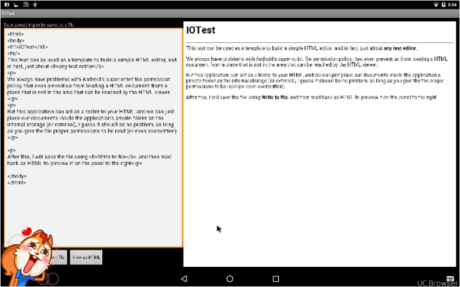

# Minimalist

a minimal set of file needed to create android project

## Purpose

I am tired having to create project in Android Studio, or any other Studios, including Eclipse, they're slow, and eating up my RAM and CPU,
and for just testing or exercise with android, these overgrown, gigantic studios are really unnecessary for me, in fact they're just standing my way.

Because I'll be using Android-x86 to compile and test, and thus learn more about android system, I firmly believe I am better off do most of the task manually.

## Added a branch - IOTest

Started as a test for reading and writing to files, this one ends up with interesting writing HTML and preview it in a WebView.



### Example To Sign APK

My old scripts `build.sh` use `apksigner`, which is only available if you use `termux`,
but I'd like to make this work using simple `jarsigner` command as follow:


```bash

# 1. create new keystore 

keytool -genkey -alias mydomain -keyalg RSA -keystore KeyStore.jks -keysize 2048 

# or

keytool -genkey -v -keystore my-release-key.keystore -alias alias_name -keyalg RSA -keysize 2048 -validity 10000


# Then create cert CSR based on the new keystore
keytool -certreq -alias mydomain -keystore KeyStore.jks -file mydomain.csr

# Then sign the apk
jarsigner -verbose -sigalg SHA1withRSA -digestalg SHA1 -keystore my-release-key.keystore
my_application.apk alias_name

# Finally, sign the APK
jarsigner -verbose -keystore PATH/TO/YOUR_RELEASE_KEY.keystore \
          -storepass YOUR_STORE_PASS \
          -keypass YOUR_KEY_PASS PATH/TO/YOUR_UNSIGNED_PROJECT.apk \
          YOUR_ALIAS_NAME

```

