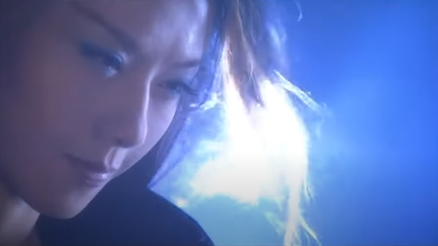
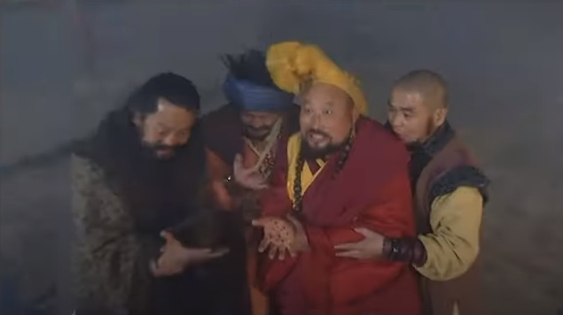

# Pertemuan Para Musuh

    
    

        
<em>
        Dengan bantuan Guo Jing, Mei Chaofeng yang terluka mengamuk.
        </em>

    
 

Wanyan Kang sangat terkejut ketika melihat Yang Tiexin keluar dari dalam lemari itu,
dan kemudian mengenalinya. Ia berteriak, "Ternyata kau!" Ia mengacungkan tombak besi itu
dan segera mengadopsi gerakan Hang Bu Deng Hu (Langkah Harimau Berbaris), diikuti dengan
Chao Tian Yi Zhu Xiang (Dupa Menghadap Ke Langit). Ujung tombak itu berkilau, mengarah
tepat ke tenggorokan Yang Tiexin.

Bao Xiruo berteriak, "Dia ayahmu, kau... Kau tidak percaya?" Ketika ia mengangkat kepalanya,
putranya mendorongnya ke dinding. Ia menjerit. Wanyan Kang terkejut dan buru-buru mundur
selangkah, masih memegang tombak itu. Ia melirik ke bawah melihat ibunya di lantai,
tubuhnya berlumuran darah dan nafasnya tersendat-sendat, jadi ia sulit menebak apakah
ibunya akan bertahan hidup atau tidak. Ia merasa bersalah, menyesal dan tak berdaya.
Yang Tiexin lalu berlutut untuk meletakkan istrinya di dalam tangannya, dan membawanya
keluar melalui pintu. Wanyan Kang berteriak, "Turunkan dia!" Ia lalu menyerang dengan 
tombak itu, meluncur deras ke arah dada Yang Tiexin.

Yang Tiexin mendengar suara serangan dari belakangnya dan segera mengirimkan tangan kirinya
untuk melawan. Ia bisa menghentikan mata tombak itu sekitar lima inci dari sasarannya.
Di medan perang, Tombak Keluarga Yang tak terkalahkan, dan sebuah gerakan unik yang
diberi nama 'Memutar Tombak Di Atas Kuda' (Hui Ma Qiang) adalah keterampilan unik yang
diwariskan dari generasi ke generasi. Ketika Yang Tiexin menggunakan tangan kirinya untuk 
menangkap mata tombak, sebetulnya ia menggunakan sebagian dari teknik itu, tetapi dengan
sedikit improvisasi. Aslinya, ketika ia menangkap senjata musuh, ia hanya perlu mengirimkan
tangan kanannya tepat pada saat tombak itu mendekat, tetapi karena ia sedang menggendong 
Bao Xiruo, ia hanya bisa berpaling dan berteriak marah, "Ilmu Tombak Keluarga Yang hanya
diwariskan ke anak laki-laki, sayangnya gurumu tidak mengajarkan ini."

Meskipun kungfu Qiu Chuji sangat tinggi, ia sebetulnya tidak meneliti ilmu tombak
itu secara mendalam. Tombak keluarga Yang adalah ilmu milik Dinasti Song dan sangat
terkenal di dunia persilatan, tetapi hanya sembilan belas perguruan yang adalah keturunan
langsung dari perguruan ortodox. Ia memahami prinsip-prinsip ilmu ortodox 'Tombak Keluarga Yang'
dan ketika mereka sempat bertarung di Desa Niu malam itu, Yang Tiexin melihat hal itu. 
Mengenai keterampilan unik yang hanya diajarkan secara langsung dari generasi ke generasi,
tentu saja Qiu Chuji tidak memahaminya. Itulah sebabnya Wanyan Kang juga tidak secara lengkap
memahami ilmu tombak tersebut.

Tenaga yang dipakai oleh keduanya menyebabkan tombak besi itu, yang memang sudah tua dan
pegangannya mulai keropos, patah menjadi beberapa bagian. Guo Jing melompat maju dan berteriak
dengan marah, "Kau sudah dengar bahwa dia ayahmu, mengapa kau tidak _kowtow_?"

Wanyan Kang ragu-ragu, tidak bisa mengambil keputusan. Yang Tiexin lalu mengendong istriya dan
berlari keluar. Mu Nianci yang menunggu di luar membantunya, keduanya melompat keluar melalui
dinding dan meninggalkan tempat itu.

Guo Jing tidak berani menunggu, dan juga bergegas keluar dari ruangan. Ia baru saja berniat
menuju dinding pagar untuk melarikan diri, ketika tiba-tiba ia merasakan desiran dalam kegelapan,
dan sesuatu bergerak dengan cepat ke arah lehernya. Ia merasa ada tenaga dari sebuah telapak
tangan menyapu hidungnya dan ia merasakan sakit yang luar biasa di mukanya, seakan-akan 
dikikis dengan pisau. Tenaga dalam orang itu sangat kejam, dan tambahan lagi, nyaris tanpa
suara, hampir-hampir membuatnya kehilangan kewaspadaan. Ia terkejut ketika mendengar orang
itu berteriak marah, "Anak petani, orang tua ini sudah terlalu lama menunggu! Ayo cepat 
ulurkan lehermu, biar orang tua ini bisa minum darahmu!" Itu ternyata Si Dewa Ginseng, Liang Ziwong.

***

Huang Rong mendengar Peng Lianhu mengumumkan bahwa ia adalah murid dari Sepasang Iblis.
Ia tertawa dan berkata, "Kau kalah!" Lalu ia berbalik dan berlari kencang ke arah pintu
keluar.

Peng Lianhu segera bergerak untuk menghalangi jalan keluar dan berteriak, "Karena kau adalah
murid Sepasang Iblis, aku tidak akan mempermalukanmu. Tapi kau harus mengatakan kepadaku,
mengapa gurumu menyuruhmu ke sini?"

Huang Rong lagi-lagi tertawa dan berkata, "Kau bilang kalau dalam sepuluh jurus kau tidak bisa
mengenali perguruanku, maka kau akan membiarkan aku pergi. _Qianbei_, kenapa kau curang?" 

Peng Lianhu marah, "Jurus terakhir tadi, Ling Ao Bu, Sepasang Iblis yang mengajarimu, kan?"

Huang Rong tertawa sekali lagi, "Aku hanya ketemu Sepasang Iblis beberapa kali, dan ilmu
mereka rendah, mana bisa dibandingkan dengan guruku?"

Peng Lianhu berkata, "Kebohonganmu tidak ada gunanya."

Huang Rong menjawab, "Aku sebenarnya mendengar tentang Sepasang Iblis. Aku tahu mereka berdua
kejam, mereka melakukan segala kejahatan dan menipu senior mereka. Di seluruh Wulin (rimba persilatan),
mereka sudah terkenal tidak tahu malu. Kenapa Peng Zhai Zhu (Ketua Peng) membandingkan aku
dengan orang-orang seperti itu?"

Semua orang awalnya berpikir bahwa Huang Rong hanya tidak ingin mengatakan yang sebenarnya,
tetapi ketika mendengarnya menjelek-jelekkan nama Sepasang Iblis, mereka saling berpandangan.
Saat itu mereka mulai percaya bahwa ia tidak mungkin terkait dengan Sepasang Iblis, karena 
tidak ada orang yang berani menghina gurunya sendiri di hadapan begitu banyak orang.

Peng Lianhu menyingkir dari pintu dan berkata, "Nona kecil, kau menang. Lao Peng betul-betul
mengagumimu, dan berharap untuk mengenal namamu."

Huang Rong tersenyum, "Boleh. Aku dipanggil Rong'Er."

Peng Lianhu bertanya, "Dan margamu?"

Huang Rong menjawab, "Sejujurnya saja, margaku bukan Peng atau Sha." Sampai di sini, semua orang
di situ boleh dikatakan sudah dikalahkannya, kecuali biksu Tibet itu, Ling Zhi dan Ouyang Ke.
Ling Zhi sedang terluka dalam dan tidak bisa bertarung. Hanya Ouyang Ke yang sementara itu 
bisa menghentikannya. Semua orang melirik Ouyang Ke.

Ouyang Ke melangkah ke depan, tersenyum santai sambil berkata, "_Zai Xia_ ingin maju dan mencoba
beberapa jurus melawan Xiao Guniang (nona cilik)."

Huang Rong melirik ke arah setelan putih yang dikenakannya dan bertanya, "Kau bersama dengan
para wanita cantik dari Bai Tuoshan (Gunung Onta Putih) itu?"

Ouyang Ke tersenyum dan berkata, "Ah, kau sudah ketemu mereka? Kalau kau satukan mereka semua,
mereka tetap tidak bisa menang setengahnya saja dari kecantikanmu."

Muka Huang Rong memerah ketika mendengar Ouyang Ke memujinya, meskipun ia juga senang.
Ia berkata, "Kalau begitu kau mau membantuku mengatasi orang-orang tua ini yang masih bersikeras
dengan sikap tidak masuk akal mereka?"

Kungfu Ouyang Ke tinggi dan dengan dukungan adik dari gurunya, ia merajalela di wilayah
Barat selama beberapa tahun. Karena sifatnya yang cabul, ia menghabiskan waktu bertahun-tahun
untuk mengoleksi wanita-wanita cantik dari berbagai tempat dan menjadikan mereka selirnya.
Untuk mengisi waktu mereka, selir-selir itu juga belajar kungfu, karenanya mereka juga adalah
murid-murid Ouyang Ke. Ketika Pangeran Zhao mengundangnya ke Yanjing, ia membawa serta 
ke dua puluh empat selir itu bersamanya, mendandani mereka semua dengan jubah putih dan 
masing-masing menunggangi seekor onta putih. Delapan orang dari mereka bertemu dengan 
Enam Orang Aneh dari Jiangnan dalam perjalanan, ketika sedang berbicara dengan Guo Jing. 
Mereka mendengar Zhu Cong bicara tentang kuda Han Xie (kuda yang berkeringat darah) dan 
bermaksud mencurinya, lalu menghadiahkannya kepada Ouyang Ke, tetapi mereka gagal.

Ouyang Ke sangat bangga dengan koleksi selirnya dan tahu bahwa mereka adalah wanita-wanita
tercantik di dunia. Bahkan para wanita di istana Kekaisaran Jin atau Song sekali pun tidak
dapat dibandingkan dengan mereka. Ia tidak menduga akan bertemu dengan kecantikan seperti
yang dimiliki Huang Rong di dalam istana Zhao. Ia melihat matanya sangat terang dan hidup,
pipinya lembut dan halus, dan meskipun masih sangat muda, tubuhnya sangat anggun. Kecantikannya
tidak tersaingi, dan tak satu pun dari semua selirnya bisa menandingi Huang Rong. Ketika ia
memamerkan kungfunya yang indah, hati Ouyang Ke berdebar-debar. Sekarang, ketika ia mendengar
suaranya yang bersahabat, lembut dan tenang, ia merasa hatinya terbakar dan tulang-tulangnya
melunak. Ia tidak mampu bicara.

Huang Rong berkata, "Aku harus pergi. Kalau mereka mau menghalangiku, kau mau membantu, kan?"

Ouyang Ke tersenyum, "Kalau kau ingin aku membantumu, maka kau harus mematuhi aku sebagai
gurumu dan tinggal bersamaku selamanya."

Huang Rong menjawab, "Kepatuhan kepada Shifu bukan berarti harus tinggal bersamanya selamanya!"

Ouyang Ke berkata, "Murid-muridku lain. Mereka semuanya wanita, jadi mereka mengikuti aku
kemana saja aku pergi. Aku hanya perlu memanggil dan mereka akan datang."

Huang Rong menggelengkan kepala dan tertawa sambil berkata, "Aku tidak percaya."

Ouyang Ke bersiul dan seketika itu sekitar dua puluh orang wanita berpakaian putih
muncul di depan pintu. Entah mereka berkulit putih atau gelap, bertubuh langsing atau
sedang, semuanya memakai setelan yang sama. Pembawaan mereka penuh kebanggaan dan senyum
mereka menggoda ketika mereka semuanya menatap lekat-lekat ke arah Ouyang Ke. Di tengah
perjamuan sebelum ini, selir-selir itu berjaga-jaga di luar tembok. Ini pertama kalinya
Peng Lianhu dan semua orang lain melihat mereka, dan di dalam hati mereka iri melihat 
keberuntungan Ouyang Ke.

Ketika Huang Rong menantangnya untuk memanggil semua selirnya, tujuan sebenarnya adalah untuk
membuat gangguan di dalam gedung, dan kemudian mengambil kesempatan untuk melarikan diri.
Tetapi ia tidak menyangka bahwa Ouyang Ke sudah mengantisipasi pikirannya. Ia menatap 
kumpulan para wanita itu dan memberi isyarat dengan kipasnya yang terlipat supaya mereka 
tetap diam di dekat pintu masuk. Kemudian, melirik agak lama ke arah Huang Rong, ia tampak
santai dan puas diri. Para selir itu menatap Huang Rong lekat-lekat. Beberapa orang dari mereka
merasa minder, sementara yang lainnya merasa iri dalam hati. Mereka tahu bahwa perempuan cantik
selalu menarik bagi anak dari majikan mereka. Mereka tidak bisa membiarkan gadis itu menjadi
salah satu dari 'murid' Ouyang Ke, karena ia bisa jadi akan tidak mempedulikan mereka
lagi setelah itu. Selir-selir itu berkumpul mengelilingi Ouyang Ke dengan ketat, membuat Huang Rong
sulit untuk menerjang keluar melalui pintu.

Melihat situasi yang kurang menguntungkan, Huang Rong berkata, "Jadi kau lebih suka bertarung?
Kau ingin aku mematuhimu sebagai guru, yang mana tidak pernah kulakukan sebelumnya, dan aku tidak
mau bikin malu."

Ouyang Ke bertanya, "Apa kau tidak mau mencoba?"

"Boleh," jawab Huang Rong.

Ouyang Ke berkata, "Bagus, jangan takut. Aku tidak akan membalas."

Huang Rong berkata, "Kenapa? Kalau kau tidak membalas, aku akan menang, kan?"

Ouyang Ke berkata sambil tersenyum, "Kalaupun kau memukulku, aku akan tetap menyukaimu. Mana mungkin
aku membalas?" Semua orang mencibir sikapnya yang sembrono, tapi mereka juga bertanya-tanya, "Kungfu
anak kecil ini tidak lemah. Kalaupun kau sepuluh kali lebih kuat, bagaimana caramu akan mengalahkan
dia? Kau mau pakai ilmu sihir macam apa?"

Huang Rong berkata, "Aku tidak percaya kau sungguh-sungguh tidak mau membalas. Aku harus mengikat
kedua tanganmu."

Ouyang Ke lalu melepaskan syal yang melingkar di pinggangnya dan memberikannya kepada gadis itu. Ia melipat
tangannya ke belakang dan berjalan ke arahnya. Huang Rong melihat bahwa orang ini kelihatannya tidak
berbahaya, tetapi otaknya terus bekerja. Meskipun wajahnya tetap tersenyum, di dalam hati sebenarnya ia
merasa makin lama makin cemas sementara ia berjalan maju mundur beberapa saat, sambil berpikir,
"Aku harus berhati-hati melangkah." Setelah itu ia mengambil syalnya dan membentangkan kedua tangannya,
lalu mencoba menarik-narik syal itu untuk menguji kekuatan syal itu. Tetapi syal itu kuat meskipun terbuat dari
sutra, jadi meskipun ia menggunakan tenaga dalam, ia tetap tidak mampu merobeknya. Ia segera mengikat
kedua tangan Ouyang Ke dan tersenyum sambil berkata, "Bagaimana kita tahu siapa pemenangnya?"

Ouyang Ke meregangkan kaki kanannya sambil menahan kaki kirinya, yang mana membuat jarak sekitar 
tiga kaki di antara keduanya. Ia melanjutkan dengan menggerakkan kaki kanannya di atas lantai,
diiringi suara seperti air mengalir, ia membuat lingkaran di atas lantai dengan kaki kanannya,
yang diameternya sekitar enam kaki. Membuat lingkaran seperti itu bukan pekerjaan mudah, yang mana
menunjukkan kekuatan tenaga dalamnya. Sha Tongtian, Peng Lianhu dan yang lain semuanya melihat dengan
pandangan kagum. Ouyang Ke melangkah ke dalam lingkaran dan berkata, "Siapa yang melangkah keluar
lingkaran berarti kalah."

Huang Rong bertanya, "Kalau kita berdua keluar lingkaran?"

Ouyang Ke berkata, "Berarti aku kalah."

Huang Rong berkata, "Kalau kau kalah, kau tidak akan berusaha mengejar atau menghentikan aku?"

Ouyang Ke menjawab, "Sewajarnya begitu. Tapi kalau kau keluar lingkaran, maka hasilnya adalah kau menjadi
_harta kecilku_ (Xiao Baobei 小宝贝). Semua orang di sini menjadi saksi."

Huang Rong menyahut, "Baik!"

Ia melangkah masuk ke dalam lingkaran, tangan kanannya melakukan gerakan Xing He Zai Tian (Galaksi di Langit), 
sementara tangan kirinya melakukan Hui Feng Fu Liu (Putaran Angin Melanda Pohon Willow). Sebelah kiri bersifat
ringan, sementara bagian kanan berat, keduanya menggabungkan unsur tenaga keras dan lembut. Ouyang Ke
mengelak sedikit, dan kedua bahunya terpukul pada saat yang bersamaan. Huang Rong menghadapi tenaga yang 
mengalir dari tubuh Ouyang Ke, dan ia terkejut ketika menyadari bahwa tenaga dalam Ouyang Ke ternyata
benar-benar kuat. Meskipun ia menepati ucapannya sendiri untuk tidak membalas, tetapi sebenarnya Ouyang Ke
meminjam tenaga yang digunakan Huang Rong, jadi sekuat apapun serangan gadis itu, ia akan selalu bisa
melawannya. Tangan Ouyang Ke tetap tidak bergerak, tetapi posisi Huang Rong tidak stabil, dan ia hampir
jatuh keluar lingkaran. Ini sebabnya ia tidak berani menyerang saat itu, dan hanya melaju mengelilingi lingkaran.
Lalu ia berkata, "Kalau aku keluar lingkaran, aku tidak kalah. Kau bilang sendiri bahwa kalau kita berdua
keluar lingkaran, berarti kau kalah."

Ouyang Ke tampak terkejut ketika melihat Huang Rong berlari pelan-pelan keluar dari lingkaran.
Ia takut kalau ditunda terlalu lama, maka akan menimbulkan masalah lain, jadi ia mempercepat
langkahnya. Bersama dengan kilauan gelang emasnya dan lambaian jubahnya yang tertiup angin,
ia bergegas menuju pintu keluar. Ouyang Ke berteriak keras, "Aku tertipu!" Ia hanya bisa
berseru untuk memperingatkan, tapi tidak bisa mengejar. Sha Tongtian, Peng Lianhu dan
yang lain melihat Huang Rong menipu Ouyang Ke dengan cerdik, dan tidak bisa menahan tawa.

    <h4>Catatan</h4>
    

    Peristilahan dalam sebuah jurus yang diperagakan Huang Rong ini terasa agak aneh, dan
    saya tidak dapat menemukan padanan kata yang pas. Terjemahan bahasa Inggris menulisnya
    Hui Feng Fu Liu, dengan keterangan 'Encircling the Wind to Stroke the Willow'. Tiga karakter
    yang terakhir dapat kita pastikan adalah 风拂柳 (Feng Fu Liu), sedangkan karakter pertama,
    saya menemukan 2 variasi yang kelihatannya agak cocok. Karakter 'Wei' (围), atau 'Hui' (会).
    

    

    Karakter Wei (围) bermakna 'sekitar', sedangkan Hui (会) dapat diterjemahkan menjadi 'pertemuan'
    atau 'meeting'. Bunyi kedua karakter tersebut secara signifikan berbeda. Gabungan dua karakter
    terakhir Fu Liu (拂柳) menghasilkan kalimat seperti 'Meniup pohon Willow', sedangkan Feng adalah
    'Angin'.
    

    

    Kesimpulan saya adalah, istilah tersebut ingin mengungkapkan 'Tiupan angin yang melanda pohon Willow',
    karakter pertama berfungsi untuk memberi efek maksimum yang dilebih-lebihkan, semacam 'gulungan angin',
    'angin puyuh', dsb. Dengan demikian intinya adalah <em>tiupan angin yang menerpa pohon willow</em> itu
    sendiri.
    

    

    Cuplikan berikut ini tidak tepat menggambarkan adegan terkait seperti cerita di novel,
    tetapi masih cukup mewakili <em>event</em> pada saat Huang Rong yang memakai sebuah rompi
    berduri dipukul keras oleh Ling Zhi.
    

    

        
        

        
<em>Raut wajahnya berubah saat ia teringat, berteriak, "Rompi Kulit Landak... Rompi Kulit Landak!"</em>

        

    

Huang Rong baru saja hendak mencapai pintu ketika terdengar suara dahsyat dari atas dan
sekonyong-konyong sesosok tubuh besar seolah-olah jatuh menimpanya tanpa diketahui jelas
dari mana datangnya. Ia melangkah ke samping untuk menghindar, menahan rasa takutnya
terhadap 'benda' yang tidak jelas ini. Ia melihat seserang duduk di atas sebuah kursi besar
yang terbuat dari kayu dan bagian belakangnya bundar, itu adalah si biksu Tibet, Ling Zhi.
Ia mengenakan jubah merah, dan meskipun ia sedang duduk, namun tingginya melampaui Huang Rong.
Kemampuannya melompat bersama-sama dengan kursinya adalah sesuatu yang tak terbayangkan sebelumnya
oleh kebanyakan orang. Huang Rong baru saja bermaksud membuka mulut ketika dilihatnya biksu
raksasa itu mengeluarkan sepasang simbal dari balik jubahnya. Lalu ia membenturkan kedua benda
itu, yang menimbulkan suara sangat keras memecahkan keheningan malam. Berikutnya ia membuka
keduanya seperti sekuntum bunga, dan secara serempak mengirimkannya ke arah Huang Rong dalam
posisi paralel, yang satu di atas yang lain, melayang deras ke arah gadis cilik itu. Sepasang
simbal itu berubah menjadi bayangan _blur_ logam yang mengkilap menyilaukan, bergerak begitu
cepat seolah-olah mereka berjumlah lebih dari selusin. Ia mencoba untuk menangkis, tetapi
simbal itu mendadak berubah menjadi tiga. Ia terkejut dan berbalik, tetapi hanya untuk mendapati 
simbal itu semakin mendekat. Ia berlari secepat-cepatnya ke depan, menghindar, sebelum akhirnya
melesat menjauh, lalu berbalik arah sementara mengirimkan pukulan telapak tangan kanannya ke bagian 
atas simbal dan kaki kirinya menjentikkan kedua simbal di bagian bawah. Kedua simbal itu terpisah,
jadi bisa terbang melewatinya. Jurus mautnya tidak biasa tetapi simbal itu mampu menghindarinya, dan
King Zhi kemudian melompat ke depan. Ia melancarkan pukulan mautnya 'Jejak Tangan Raksasa' (Da Shou Yin)
ke arah anak itu. Huang Rong terpukul telak, pukulan itu mengirimnya dengan kasar ke tengah-tengah
kerumunan orang.

Semua orang berteriak ngeri melihat gadis kecil itu terkena telapak tangan raksasa Ling Zhi, yang 
mungkin telah mematahkan beberapa tulang dan menyebabkan luka dalam yang parah. Ouyang Ke berteriak, 
"Tunjukkan belas kasihan!" Tapi terlambat. Ia melihat telapak tangan raksasa Ling Zhi memukul punggungnya, 
tetapi juga melihat bahwa tangan itu segera ditarik, pemiliknya mengutuk dengan keras. Huang Rong 
menggunakan kekuatan telapak tangannya untuk keluar dari aula. Ling Zhi mendengar tawanya yang jernih 
seolah-olah ia tidak terluka sama sekali. Ouyang Ke tahu bahwa telapak tangan Ling Zhi kuat tetapi yang 
tidak diketahuinya adalah bahwa sebelum telapak tangan itu dapat mengenai gadis itu sepenuhnya, telapak 
tangan itu sudah ditarik kembali dengan cepat sehingga kekuatan di balik pukulan itu sangat jauh berkurang.

Kerumunan itu menyaksikan dengan penuh perhatian ketika mereka mendengar Ling Zhi menjerit lagi dan lagi, 
telapak tangan kanannya berlumuran darah. Ia mengangkatnya dan melihat sepuluh tusukan kecil. Raut 
wajahnya berubah saat ia teringat, berteriak, "Rompi Kulit Landak... Rompi Kulit Landak!" Suaranya 
mengungkapkan keterkejutannya yang luar biasa, kemarahannya, dan rasa sakitnya.

Peng Lianhu terkejut dan bertanya, "Anak itu memakai Rompi Kulit Landak? Itu harta pusaka dari Pulau Bunga Persik!"

Sha Tongtian bertanya-tanya, "Bagaimana caranya anak sekecil itu bisa mendapatkan Rompi Kulit Landak?"

Kehilangan Huang Rong, Ouyang Ke lalu berlari keluar melalui pintu, tapi ia tidak melihat apa-apa
di kegelapan. Tidak tahu di mana anak itu berada, ia kemudian bersiul memanggil para selirnya dan
memerintahkan mereka untuk melacak jejak Huang Rong. Dalam hati ia merasa lega, "Bagus juga dia bisa lolos
tanpa cedera. Pendeknya aku harus mendapatkan dia, entah bagaimana caranya."

Hou Tonghai bertanya, "Shi Ge, apa itu Rompi Kulit Landak?"

Peng Lianhu membentak, "Kau pernah melihat landak?"

Hou Tonghai mengangguk, "Tentu saja."

Peng Lianhu menjawab, "Di bawah bajunya, tepat setelah kulit, dia memakai semacam rompi lembut.
Meskipun lembut, tapi rompi ini bisa menahan tusukan tombak atau pedang. Lebih jauh lagi, rompi itu
ditutupi semacam duri seperti duri landak. Cukup menendang atau memukulnya kau akan tertusuk!"

Hou Tonghai menggigit lidahnya dan berpikir, "Bagus juga aku tidak pernah berhasil memukul _Chou Xiao Zi_ itu!"

Sha Tongtian berkata, "Aku akan menangkapnya lagi!"

Hou Tonghai menatapnya dan berkata, "Da Ge, dia — kau tidak bisa menyentuh tubuhnya."

Sha Tongtian berkata, "Siapa yang minta pendapatmu? Aku tetap bisa menjambak rambutnya."

Hou Tonghai menjawab, "Betul, betul, kenapa tidak terpikir ya? Da Ge kau memang jenius."

Lalu kedua saudara seperguruan itu dan Peng Lianhu mengejar Huang Rong.

***

Saat itu, Pangeran Zhao Wanyan Honglie mendengar laporan putranya yang kuatir dan beranggapan bahwa
selirnya telah ditawan orang. Dengan marah ayah dan anak itu bersama dengan para pengawal pribadi
mereka meninggalkan istana dan mengejar para pelakunya. Pada waktu yang sama, Tang Zude memimpin 
kelompok bersenjata lainnya untuk melacak dan menangkap penyusup. Istana itu dalam keadaan siaga.

***

Guo Jing bertemu dengan Lian Ziwong di dekat tembok. Ketika melihat orang itu lagi-lagi 
mengincar lehernya untuk meminum darahnya, ia terkejut, berbalik dan melarikan diri. Ia
tidak tahu mana arah Selatan atau Utara, maka ia memutuskan untuk bersembunyi di salah satu
tempat. Liang Ziwong begitu bernafsu ingin minum darahnya, sehingga tidak memperlambat
larinya sama sekali. Untungnya ilmu meringankan tubuh Guo Jing bagus, kalau tidak, meskipun
malam itu sangat gelap, ia sudah lama tertangkap. Api obor padam dan ia tidak lagi bisa
melihat arah yang sedang ditujunya. Ia hanya bisa merasakan bahwa entah bagaimana ia melangkah
ke ke daerah yang banyak berduri, tanahnya kasar dan berbatu-batu. Duri-duri itu melukai
kakinya, tetapi kalau ia teringat tentang Liang Ziwong menggigit tenggorokannya, ia tidak 
bisa membiarkan duri-duri kecil itu merintangi jalannya. Bahkan gunung atau hutan pedang
sekalipun tidak akan bisa menghentikan dia.

Tiba-tiba ia merasa tanah yang diinjaknya menghilang, ia berteriak nyaring ketika merasa tubuhnya
meluncur turun, jatuh ke dalam lubang sedalam 45 kaki. Ketika tubuhnya berada di tengah udara, ia
menghimpun tenaga dalamnya agar ia tidak kehilangan keseimbangan saat mendarat, supaya ia jangan
terluka. Tapi di luar dugaan, ternyata kakinya mendarat di atas sebuah batu bulat. Ia terpeleset, 
kehilangan keseimbangan dan jatuh terlentang. Tangannya, yang menopangnya, memcengkeram salah satu
batu bulat tersebut. Kengerian melanda dirinya ketika ia meraba-raba batu bulat itu dengan jarinya.
Ternyata batu bulat itu adalah tengkorak manusia. Tampaknya lubang yang sangat dalam ini adalah
tempat pembuangan mayat-mayat orang yang dieksekusi di istana Pangeran Zhao. Ia mendengar Liang Ziwong
berteriak memanggilnya dari atas, "Hei bocah, cepat naik sini!"

Guo Jing thought, “I’m not stupid enough to come up only to die!” With that, he raised
his hand trying to touch the back of the pit, but he felt nothing. He moved forward,
ready to defend himself against Liang Ziwong, who might follow him and try to kill
him.

Setelah memaki-maki, Liang Ziwong berpikir mungkin Guo Jing tidak bisa kembali ke atas dan
ia berteriak marah, "Kalaupun kau lari ke neraka, orang tua ini akan tetap mengejarmu!"
Sambil menarik nafas dalam-dalam, ia melompat turun.

Guo Jing sangat terkejut dan mundur beberapa langkah, dan ternyata di belakangnya adalah tempat kosong.
Ia berpaling dan mengulurkan kedua lengannya berusaha meraba jalan. Sememtara terus berjalan,
ia menemukan bahwa tempat itu ternyata adaah sebuah lorong.

Liang Ziwong juga memperhatikan lorong itu. Keberaniannya timbul karena keterampilannya yang tinggi,
maka meskipun tempat itu sangat gelap sampai-sampai ia tidak bisa melihat kelima jarinya sendiri, 
ia tidak takut Guo Jing memasang perangkap untuk menjebaknya. Ia mengikuti, dan bahkan lebih menyukai
situasi ini. Ia berpikir, "Ini seperti menangkap kura-kura di dalam toples. Bocah ini tidak mungkin
keluar lagi. Mana mungkin aku gagal minum darahnya?"

Guo Jing kuatir. Lorong selalu berujung ke jalan buntu! Liang Ziwong tertawa keras-keras,
kedua tangannya terentang untuk meraba-raba dinding lorong. Ia sabar dan melangkah perlahan-lahan,
langkah demi langkah.

Guo Jing berlari ke depan beberapa kaki ketika menyadari bahwa ia telah tiba di ujung lorong,
yang ternyata adalah sebuah gua bawah tanah. Liang Ziwong juga menyusul sambil tertawa, "Anak
petani itu mau lari kemana?"

Tiba-tiba dari sudut kiri terdengar suara serak yang menyeramkan berkata, "Siapa yang bertingkah
sembarangan di sini?"

Tak satu pun dari mereka berdua menduga bahwa ada seseorang yang tinggal di dalam lubang gelap
ini, tetapi mereka tidak bisa mengabaikan suara itu. Suara itu, meskipun serak, sebenarnya
menggelegar seperti halilintar di telinga. Guo Jing sangat ketakutan dan jantungnya berdetak
kencang. Liang Ziwong juga tidak bisa menahan rasa ngeri yang mendadak timbul. Mereka mendengar
suara bernada muram itu berkata, "Mereka-mereka yang masuk ke guaku biasanya sudah busuk. Kalian
begitu tidak sabar untuk mati?" Suara itu sekarang mulai mirip suara wanita, cemas dan bernafas
berat, seolah-olah ia sedang sakit parah.

Ketika keduanya menyadari bahwa suara itu bukan suara hantu, ketakutan mereka lenyap. Guo Jing
mendengarkan kata-katanya dan buru-buru menjelaskan, "Aku tidak bermaksud datang ke sini,
ada orang yang mengejarku..."

Sebelum ia bisa menyelesaikan kalimatnya, Liang Ziwong sudah bisa menebak tempatnya berdiri.
Ia berlari ke depan dan mengulurkan tangan untuk menangkapnya. Guo Jing mendengar desiran
angin yang disebabkan oleh gerakan tangannya dan buru-buru mengelak. Liang Ziwong mengubah
arah, memaksa Guo Jing untuk menghindar sekali lagi ke kanan. Keadaan saat itu gelap gulita,
maka orang hanya bisa menangkap tanpa sasaran yang jelas, dan hanya bisa menghindar sebisanya.
Tiba-tiba, terdengar suara robekan kain. Liang Ziwong berhasil merenggut lengan kiri jubah 
Guo Jing. Wanita itu berkata dengan marah, "Siapa berani menangkap orang d sini?"

Liang Ziwong memaki, "Kau menyamar jadi hantu, mau menakut-nakuti aku ya!"

Terdengar seperti menderita asma, wanita itu mulai terengah-engah dan berkata, "Bocah itu boleh
sembunyi di sini."

Guo Jing tadinya berpikir bahwa situasinya tidak ada harapan dan sangat kritis, tapi ketika ia
mendengar apa yang diucapkan wanita itu, tanpa ragu lagi ia melompat ke arahnya tepat di saat
ia merasakan kelima jari Liang Ziwong yang sedingin es menyentuh pergelangan tangannya. Mereka
jauh lebih kuat dari dirinya, maka ketika ia ditarik oleh wanita itu, tubuhnya tidak mampu 
melawan tarikan itu dan merasa dirinya mati rasa. Sambil terengah-engah wanita itu bertanya
kepada Liang Ziwong, "Kau mampu menangkapnya dengan baik, berarti kungfumu tidak bisa diremehkan.
Kau berasal dari luar perbatasan ya?"

Liang Ziwong terkejut. Ia berpikir, "Aku bahkan tidak bisa melihatnya sedikit pun, mana mungkin
dia bisa mengenali ilmu silatku? Apa dia bisa melihat di kegelapan? Perempuan ini pasti seorang tua
nyentrik yang sombong dan tegas!" Ia tidak berani bicara sembarangan, dan sebaliknya ia berkata
dengan ramah, "Wanbei hanya tamu di sini, dari Guangdong, bermarga Liang. Anak ini mencuri sesuatu
dari wanbei. Wanbei hanya ingin mengambilnya kembali. Wanbei minta Qianbei jangan ikut campur."

Wanita itu berkata, "Ah, apa Si Dewa Ginseng Liang Ziwong mencoba untuk membenarkan apa yang salah?
Orang yang satunya kelihatannya tidak menyadari ini. Aku tidak berminat mencampuri urusanmu,
tapi setelah dia datang ke guaku, kejahatan itu tidak bisa dikejar lagi. Lao Liang, kau ini 
ahli kungfu, masa kau tidak mengerti aturan Wulin?"

Liang Ziwong lebih kaget lagi, dan bertanya, "Boleh aku tahu nama _Qianbei_?"

Wanita itu berkata, "Aku... aku..." Guo Jing merasa bahwa tangan yang menggenggam pergelangan tangannya
bergetar hebat, jari-jarinya mulai mengendur dan ia mendengar wanita itu mencoba menahan erangan, seolah-olah
sedang sangat kesakitan. Ia bertanya, "Kau sakit?"

Kungfu Liang Ziwong yang tinggi membuatnya mampu mendengar suara erangan wanita itu, dan
menduga bahwa kungfunya telah hilang, bukan karena sakit, tetapi karena cedera hebat
yang melemahkan seluruh tubuhnya. Ia segera menyalurkan tenaga ke lengannya, lalu mengulurkan
kedua tangannya secara bersamaan untuk mencengkeram dada Guo Jing. Ia berhasil menyentuh
pakaiannya, lalu bersiap untuk mencengkeram, ketika mendadak ia merasakan tenaga yang sangat
kuat bertemu dengan pergelangan tangannya. Liang Ziwong terperajat, ia menemukan kenyataan bahwa
ketika ia mengulurkan tangan kirinya, ia bisa meraih tangan wanita itu. Wanita itu
berteriak marah, "Awas!" Sebuah telapak tangan menghantam punggung Liang Ziwong, yang memaksanya
mundur beberapa langkah. Untung baginya, tenaga dalamnya cukup bagus, karenanya ia tidak terluka.

Liag Ziwong memaki, "_Hao Zeibo_! Ayo sini." Kata-kata makian itu berarti 'Ibu mertua maling', dan
yang dimaksud 'maling' di sini adalah Guo Jing. Ketika wanita itu terus terengah-engah dan tetap
diam tak bergerak, Liang Ziwong menyadari bahwa wanita itu tidak dapat menggerakkan tubuh bagian bawahnya.
Rasa takutnya segera berkurang dan ia bergerak mendekat perlahan-lahan. Ia baru bermaksud melompat 
ke depan untuk menyerang ketika merasa ada sesuatu melilit pergelangan kakinya. Benda ini mirip
sebuah cambuk lunak, tanpa suara dan tidak terdeteksi. Merasa sangat terkejut, ia segera melawan,
tetapi cambuk itu mampu mengangkat tubuhnya dalam sekejap. Ia berusaha menendang wanita itu sementara
ubun-ubunnya menghantam dinding tanah.

Ilmu tendangan Liang Ziwong tak tertandingi di luar tembok perbatasan. Ini melambungkan nama besarnya
selama dua puluh tahun. Tetapi ia tidak mengira bahwa sebelum tendangannya mencapai sasaran, ia merasa
titik akupuntur Chong Yang Xue, yang terletak lima inci dari punggung kakinya, tiba-tiba mati rasa.
Kalau titik vital ini sampai tertotok lawan, maka seluruh kakinya akan mati rasa. Untungnya ia berhasil
menarik kembali kakinya dengan cepat. Tapi aksi menendang dan langsung menarik diri itu membuat lututnya
terasa sakit.

Sambil mengelak ia berpikir, "Orang ini tinggal di dalam gua gelap gulita, tapi seolah-olah tinggal
di tempat terang benderang. Dia bisa tahu letak jalan darah vital, kalau bukan setan atau tukang sihir, 
lalu apa?"

Menyadari betapa kritis situasi yang dihadapinya, ia lalu melakukan setengah salto untuk
menghindari serangan, lalu mengirimkan telapak tangannya ke belakang dalam upaya untuk 
mengguncangkan wanita itu. Telapak tangannya sepuluh kali lebih kuat dari sebelumnya, dan
ia mengira bahwa wanita yang terdengar mirip penderita asma itu jelas tidak akan punya
tenaga dalam untuk menahannya. Lalu ia tiba-tiba mendengar teriakan keras sementara merasakan
tangan lawan meluncur deras ke arahnya, jari-jari wanita itu sudah bersentuhan dengan bahunya.
Tangan kiri Liang Ziwong merasakan pergelangan tangan lawan yang sedingin es, seolah bukan terbuat 
dari daging dan tulang. Wanita itu menyerang sekali lagi. Ia segera berguling 
menjauh dan bergegas menggunakan tangan dan kakinya untuk merangkak keluar dari lorong. Sambil
terengah-engah ia berpikir, "Aku sudah hidup selama puluhan tahun, tapi belum pernah mengalami
kejadian seaneh ini! Aku bahkan tidak tahu dia itu manusia atau hantu. Aku harus memberi tahu
Pangeran mengenai masalah ini." Ia buru-buru berlari kembali ke ruang perjamuan. Dalam perjalanan
ia berpikir, "Aku tidak tahu makhluk ini hantu perempuan atau perempuan iblis, tapi sekarang
bocah itu jatuh ke tangannya, pasti dia akan menyedot setiap tetes darahnya." Ia menghela
nafas dan berpikir, "Akibat berbagai peristiwa aku bertemu dengan bocah maling itu. Lalu setelah
merawat ular selama dua puluh tahun dan memurnikan darahnya, aku harus ketemu hantu perempuan itu.
Aku hampir kehilangan nyawa dalam dua pertemuan itu. Apa mungkin pembuatan pil panjang umur ini 
sungguh-sungguh bertentangan dengan Kehendak Surga, dan membuat iri para hantu dan dewa, jadi aku
gagal meskipun sudah di ambang sukses?"

Ketika Guo Jing mendengar suara langkah Liang Ziwong makin lama makin jauh, ia merasa
sangat lega dan segera berlutut, _kowtow_ di hadapan wanita itu, katanya, "_Wanbei_ sangat
berterima kasih untuk pertolongan _Qianbei_. Qianbei menyelamatkan nyawaku."

Wanita itu mampu mengatasi semua gerakan Lian Ziwong sebelumnya, tetapi sekarang ia sangat lelah,
menyebabkan luka dalamnya semakin buruk. Ia batuk-batuk dan mendesah ketika berkata, "Kenapa monster
tua itu ingin membunuhmu?"

Guo Jing berkata, "Wang Dao Zhang terluka dan membutuhkan obat. Wanbei lalu datang ke istana untuk..."
Tiba-tiba ia berpikir, "Orang ini tinggal di dalam lingkungan istana Pangeran Zhao, bagaimana aku tahu
kalau dia bukan komplotan Wanyan Honglie?" Ia segera berhenti bicara.

Wanita itu berkata, "Mmm... jadi kau mencuri obat monster tua itu ya? Kudengar pengetahuannya sangat
luas soal obat-obatan, jadi kau mencuri pil ajaib atau obat istimewa ya?"

Guo Jing berkata, "Aku mengambil obat-obatannya untuk mengobati luka dalam, tapi dia sangat marah
dan ingin membunuhku. Apakah _Qianbei_ terluka? _Wanbei_ punya beberapa obat, ginseng semu, darah naga,
empedu beruang, dan juga mur. Wang Dao Zhang tidak perlu memakai semuanya, kalau _Qianbei_ mau..."

Wanita itu mendengus dan berkata dengan marah, "Aku luka atau tidak, itu bukan urusanmu!"

Saat itu Guo Jing hanya bisa berkata, "Ya, ya." Tapi selang beberapa saat, ia mendengar suara 
wanita itu terengah-engah dan tidak bisa menahan diri untuk berkata, "Kalau _Qianbei_ tidak bisa
berjalan, _wanbei_ bisa menggendong _Lao Qianbei_ keluar dari sini."

Wanita itu mendampratnya, "_Lao_ (tua)? Siapa yang tua? Siapa yang kau bilang tua?"

Guo Jing tidak berani bersuara lagi, ia mengira wanita itu tidak mau pergi. Namun demikian, ia
memang tidak pernah bisa puas mendengar jawaban setengah-setengah. Jadi meskipun ia tahu seharusnya
tidak bicara tapi ia tetap bertanya, "Apa pun yang _Qianbei_ perlukan, aku bisa mengambilkannya."

Wanita itu tertawa dingin dan berkata, "Kau ini lebih cerewet dari perempuan, tapi hatimu baik."
Ia mengulurkan tangannya untuk menarik bahu Guo Jing. Gui Jing merasa bahunya di tangkap dan
diikuti oleh rasa sakit yang tajam, tapi ia mampu menjaga keseimbangan supaya jangan jatuh
menimpa wanita itu. Ia tiba-tiba merasakan hawa sedingin es ketika lengan wanita itu melingkari
lehernya. Lalu didengarnya wanita itu berteriak memberi perintah, "Bawa aku keluar dari sini."

Guo Jing berpikir, "Justru itulah yang aku tawarkan tadi!" Setelah itu ia membungkuk dan pelan-pelan
membawanya keluar dari situ.

Wanita itu berkata, "Aku yang memaksamu menggendongku di punggungmu. Aku tidak akan berhutang budi 
kepada siapa pun." Saat itu Guo Jing baru mengerti bahwa wanita ini sangat arogan, dan tidak mau 
menerima kebaikan hati dari orang yang lebih muda. Sementara berjalan keluar, ia mengangkat kepalanya 
dan melihat bintang-bintang di langit. Ia tidak dapat menahan diri untuk menghela nafas dan berpikir,
"Baru beberapa saat yang lalu aku selamat dari maut waktu jatuh ke lubang yang dalam ini, dan ada
seseorang yang menunggu di sana untuk menolong aku. Kalau kuceritakan kepada Rong'Er, mungkin dia tidak
akan percaya. Ia sudah terbiasa memanjat tebing bersama Ma Yu, dan meskipun lubang itu mirip sumur
yang sangat dalam, ia tetap mampu memanjatnya tanpa kesulitan.

Setelah mereka keluar dari lubang itu, wanita itu bertanya, "Siapa yang mengajarimu ilmu
meringankan tubuh? Ayo cepat katakan!" Lengannya tiba-tiba melingkar lebih erat di leher 
Guo Jing, ia jadi agak sulit bernafas. Ia jadi waspada dan menyalurkan tenaga dalamnya untuk
melawan. Wanita itu sengaja mengujinya dengan cara mempererat pegangannya, tetapi ia kemudian
berhenti, lalu secara berangsur-angsur mengendurkannya.

Ia tertawa sambil berseru, "Kejutan! Anak petani bisa kenal ilmu tenaga dalam dari Perguruan Ortodoks
Agama Tao. Kau bilang Wang Dao Zhang terluka, siapa nama si Dao Zhang ini?"

Guo Jing berpikir, "Kau sudah menyelamatkan aku, jadi apa pun yang kau tanyakan, akan kujawab dengan sejujurnya.
Melakukan yang sebaliknya berarti _barbar_!" Ia segera menyahut, "Wang Dao Zhang adalah Wang Chuyi, tetapi orang 
memanggilnya 'Matahari Pualam'."

Tiba-tiba ia merasa wanita yang berada di punggungnya itu mulai gemetar dan mendengarnya bernafas
terengah-engah, "Kau murid Perguruan Quanzhen? Itu... itu bagus sekali." Segera setelah mengatakan ini,
ia tidak bisa menyembunyikan kegembiraannya. Ia bertanya lebih lanjut, "Wang Chuyi itu siapamu? Kenapa
kau memanggilnya Dao Zhang? Kenapa bukan Shifu (guru), Shi Zi (paman guru yang lebih muda dari guru),
atau Shi Bo (paman guru yang lebih tua dari guru)?"

Guo Jing berkata, "Aku bukan murid Perguruan Quanzhen, tapi 'Matahari Merah' Ma Yu mengajari aku
teknik pernafasan."

Wanita iu berkata, "Mmm, jadi kau belajar teknik tenaga dalam dari Quanzhen. Itu bagus." Setelah 
beberapa saat, ia bertanya, "Lalu siapa gurumu?"

Guo Jing menjawab. "Wanbei punya tujuh orang guru, Tujuh Orang Aneh dari Jiangnan. Guru pertama
dijuluki Fei Tian Bian Fu, marganya Ke."

Wanita itu mulai batuk-batuk berat, suaranya terdengar pahit dan getir ketika berkata, "Itu Ke Zhen'E!"

Guo Jing berkata, "Ya."

Wanita itu berkata lagi, "Dan kau datang dari Mongolia?"

Guo Jing berkata, "Ya." Tapi dalam hati ia bertanya-tanya, "Dari mana dia tahu aku datang dari Mongolia?"

Wanita itu berkata perlahan-lahan, "Namamu Yang Kang ya?" Nada suaranya berubah dari muram menjadi marah.

Guo Jing berkata, "Bukan, nama _wanbei_ Guo."

Wanita itu ragu-ragu sejenak sebelum berkata, "Kau coba duduk di tanah dulu."

Guo Jing melakukan yang disuruh dan duduk. Wanita itu kemudian meraba-raba dadanya untuk
mencari sesuatu, yang kemudian diletakkannya di atas tanah. Benda itu terbungkus sehelai 
kain. Setika ia membukanya, sinar bintang menimpanya, memperlihatkan sebuah gagang belati yang
terlihat sangat mempesona dan mengesankan. Guo Jing merasa seperti mengenal benda itu, dan ia
melihatnya lebih dekat. Belati itu terus berkilau dan di pegangannya tertera tulisan yang
terdiri dari dua karakter 'Yang Kang'. Itu jelas adalah belati yang dipakainya untuk membunuh
Si Mayat Tembaga, Chen Xuanfeng. Pada saat Guo Xiaotian dan Yang Tiexin bertemu dengan
Qiu Chuji, ia menghadiahkan dua belati kepada mereka. Keduanya lalu saling berjanji bahwa
seandainya anak mereka sama-sama laki-laki atau perempuan, maka mereka akan menjadi 
saudara angkat. Dan kalau ternyata keduanya berlainan jenis kelamin, maka mereka akan 
menjadi suami istri. Kedua calon ayah tersebut akhirnya asling bertukar belati sebagai tanda
ikrar mereka. Inilah alasannya mengapa belati yang bertuliskan nama 'Yang Kang' berada
di tangan Guo Jing. Ketika masih kecil, ia tidak tahu apa arti tulisan 'Yang Kang' itu,
tetapi ukuran belati itu cukup baginya untuk mengenali bahwa itu adalah belatinya.
Ia berpikir, "Yang Kang... Yang Kang?" Tapi ia tidak ingat bahwa nama itu baru saja diucapkan
oleh Sang Putri — Selir dari Pangeran Zhao — beberapa menit yang lalu.

Ketika ia sedang ragu-ragu, wanita itu menjepit tangannya untuk mencegahnya mengambil
belati itu sambil berteriak, "Kau mengenali pisau ini ya?" Kalau Guo Jing lebih cerdas
dan mendengar betapa sedih dan betapa nyaringnya suara itu, ia akan terpaksa memalingkan 
muka untuk memandang wajahnya. Sebaliknya, ia hanya memikirkan kebaikan wanita itu yang
sudah menyelamatkan nyawanya, "Orang ini menyelamatkan aku. Sudah pasti dia orang baik."
Karena itu ia tidak curiga sedikit pun ketika menjawab, "Ah ya! Waktu masih kecil, aku 
pernah memakai pisau ini untuk membunuh orang jahat. Orang jahat itu tiba-tiba hilang,
bersama pisau ini."

Sementara bicara, ia merasa tangan yang melingkar di lehernya tiba-tiba lebih membelit
lebih erat, mencekiknya. Merasa dalam bahaya, ia menekuk lengannya dan mendorong ke belakang,
tetapi pergelangan tangannya dicekal oleh tangan kiri wanita itu yang lebih cepat bergerak.
Wanita itu kemudian mengendurkan tangan kanannya, dan menjatuhkan diri dalam posisi duduk
di atas tanah sambil berteriak, "Kau pikir aku ini siapa?"

Guo Jing yang sebelumnya dicekik merasa pandangannya berkunang-kunang, maka ia perlu waktu
sebentar untuk pulih. Setelah itu ia memandang wanita itu sekilas, agak tertutup oleh rambut
panjangnya yang berkibar-kibar, seraut wajah sepucat kertas, sepertinya wajah Si Mayat Besi dari
Sepasang Iblis Angin Hitam, Mei Chaofeng. Guo Jing ketakutan setengah mati, ia mengangkat 
tangan kirinya untuk meronta, tapi jari-jari Mei Chaofeng tertancap kuat di dagingnya. Ia agak
bingung, "Mana mungkin? Kenapa dia menyelamatkan aku? Tidak mungkin! Tapi dia sungguh-sungguh
Mei Chaofeng!"

Mei Chaofeng sat on the ground, her right hand clutching Guo Jing’s neck, her left holding 
his wrist. For more than ten years, she had been searching for the man who killed
her husband and now, suddenly, he was here. “Is it the work of my ‘Bastard’ husband
from below, to have that person die in my hands?” In her heart she was delighted beyond 
measure; but this was quickly overcome by grief as past events from her life, no
matter how much she fought it, came to her in brief flashes.

Mei Chaofeng duduk di atas tanah, tangan kanannya mencengkeram leher Guo Jing, tangan kirinya
mencekal pergelangan tangannya. Lebih dari sepuluh tahun ia mencari-cari orang yang membunuh
suaminya, lalu tiba-tiba sekarang orang itu ada di sini, di hadapannya. "Apa mungkin si bangsat
suamiku itu yang berbuat begini, supaya orang ini mati di tanganku?" Di dalam hati ia merasa 
girang tak terkira, tapi itu semua dengan cepat tertimpa oleh bayangan masa lalu yang suram,
betapapun ia berusaha menyingkirkannya, tetap saja muncul sekilas di benaknya.

***

Ia berpikir, "Aku pernah menjadi seorang anak lugu yang bermain-main dan bercanda sepanjang hari.
Orang tuaku memperlakukan aku seperti harta karun mereka, itu sebabnya mereka sangat dekat. Waktu itu,
aku dipanggil Mei Ruohua. Tapi orang tuaku yang malang satu persatu meninggal, yang memaksa aku
menderita jadi budak orang jahat. Shifu Huang Yaoshi menyelamatkan aku dan membawaku ke Tao Hua Dao
(Pulau Bunga Persik), di mana ia menerima aku masuk ke dalam perguruannya. Namaku berubah menjadi 
Mei Chaofeng, karena semua muridnya punya nama 'Feng' (Angin). Di bawah pepohonan persik aku melihat
anak-anak muda bertampang kasar  di depanku. Salah satunya memetik sebuah persik berwarna merah
untuk aku. Itu kakak seperguruanku, Chen Xuanfeng. Di antara murid-murid Shifu, dia nomor dua,
aku nomor tiga. Kami berlatih kungfu bersama-sama. Ia sering mngajari aku dan memperlakukan
aku dengan baik. Meskipun seringkali ia mengomel karena aku tidak belajar dengan baik, aku tahu
ia berbuat begitu demi kebaikanku. Berangsur-angsur, ketika semuanya menjadi dewasa, aku menyimpannya
di dalam hatiku, dan dia juga menyimpan aku di dalam hatinya. Suatu senja di musim semi, ketika
bunga-bunga persik yang bermekaran itu menjadi merah menyala, ia tiba-tiba memeluk aku di bawah pohon
persik." Wajah Mei Chaofeng memerah dan Guo Jing mendengar nafasnya yang terengah-engah semakin memburu.
Lalu ia menghela nafas dengan lembut dan tenang.

Mei Chaofeng teringat bagaimana dia dan Chen Xuanfeng diam-diam menikah dan betapa
mereka takut dimarahi guru mereka. Ketika mereka melarikan diri dari pulau itu, suaminya
menyuruhnya mencuri buku kedua dari Jiu Yin Zhen Jing (Kitab Sembilan Bulan). Setelah itu
mereka berdiam di tempat asing dan berlatih keras, tetapi setelah berlatih selama setengah
tahun, suaminya mengatakan bahwa ia tidak dapat memahami makna sesungguhnya dari tulisan
itu. Ia ingin membenturkan kepalanya karena frustasi. Di tahun itu juga, suaminya berkata,
"Zei Po Niang, kita hanya mencuri setengah bagian dari Jiu Yin Zhen Jing. Bagian pertama
mengandung prinsip dasar yang diperlukan untuk latihan ilmu rahasia itu. Kungfu itu adalah
milik para penganut agama Tao, dan yang diajarkan Shifu sama sekali lain. Kita
tidak bisa menguasai ini, menurutmu bagaimana?" Aku bilang, "Apa kita punya pilihan lain?"
Ia berkata, "Pulang ke Tao Hua Dao." Mana mungkin aku berani pulang? Kungfu kami berdua
memang sudah sepuluh kali lipat lebih kuat, tapi Shifu hanya perlu dua jari untuk mengalahkan
kami. Suamiku juga takut, tapi karena tahu betapa banyaknya ilmu yang tidak bisa dilatihnya,
ia bersedia mati untuk itu. Ia sudah membulatkan tekad untuk mencuri buku itu dan berkata,
"Kalau mau menjadi pasangan tak terkalahkan di kolong langit, maka _Zei Po Niang_ haris juga
siap menjadi janda." Aku tidak ingin menjadi janda! Kalau yang satu mati, yang lain juga
harus mai di tempat yang sama. Kami berdua lalu memutuskan untuk bertaruh nyawa dengan pulang
ke Pulau Persik. Kami kemudian menemukan fakta bahwa setelah kami melarikan diri, Shifu sangat
marah. Dan di dalam kemarahannya, ia mematahkan kaki semua muridnya dan mengusir mereka semua dari
Pulau Bunga Persik. Itu sebabnya hanya ada dia sendiri, istrinya, dan kami berdua, dan juga para pelayan.
Ketika kami tiba di Pulau Bunga Persik, kami melihat ada dua orang sedang berkelahi. Lawan Shifu
sangat tangguh. Keduanya sedang berdebat mengenai Jiu Yin Zhen Jing, dan ketika mereka sedang
bertengkar, salah seorang membuka serangan dengan jurus yang bisa dikenali. Orang itu jelas
anggota Perguruan Quanzhen. dan meskipun omongannya sangat kacau dan bodoh, kungfunya sangat
tinggi dan mencapai tingkat yang bahkan tidak bisa kubayangkan. Tapi Shifu, kalau dibandingkan
dengan dia, punya peluang lebih besar untuk menang. Menyaksikan pertarungan kungfu itu hanya membuat
kami takut. Aku lalu bilang pelan-pelan, "Zei Han Zi, ayo kita pergi. Kita jelas bukan tandingan
mereka!" Tapi dia tidak mau pergi. Kami menyaksikan Shifu menangkap lawannya dan memaksanya
untuk bersumpah supaya tidak meninggalkan pulau itu. Teringat betapa baiknya istri Shifu kepadaku,
aku memutuskan untuk menengoknya melalui jendela rumah mereka. Siapa sangka yang kutemukan 
ternyata hanya tempat berkabung? Shi Niang ternyata sudah meninggal. Dalam hatiku, aku merasa
sangat sedih. Shi Niang selalu memperlakukan aku dengan sangat baik, tapi sekarang dia sudah meninggal.
Shifu tinggal sendirian. Aku merasa sangat sedih untuk dia, dan aku tidak tahan lagi. Ketika
sedang menangis, aku tiba-tiba melihat seorang anak kecil kira-kira berumur satu tahun,
sedang duduk tegak di sebuah kursi dan tersenyum kepadaku. Anak perempuan itu mirip sekali dengan
Shi Niang, dan rasanya anak itu adalah anak mereka. Apa mungkin Shi Niang meninggal karena melahirkan?
Aku sedang berpikir tentang ini ketika Shifu melihatku. Ia seolah terbang dari ruang berkabung itu
dan melangkah keluar. Aku sangat ketakutan, kakiku lemas dan tidak bisa bergerak. Aku mendengar
anak itu tertawa riang dan memanggil, "Ayah, peluk aku!" Senyumnya seperti bunga mekar sementara
tangannya terpentang lebar ke arah Shifu. Anak itu menyelamatkan nyawaku. Shifu takut ia jatuh,
dan mengulurkan tangan untuk menggendongnya. Suamiku kemudia menarikku menjauh dan kami berdua
melarikan diri dengan mencuri perahu yang digenangi air laut. Jantungku berdebar kencang seolah
ingin keluar lewat tenggorokanku.

_Zei Han Zi_ melihat Shifu bertarung dan segera kehilangan nyalinya. Ia berkata, "Bukan hanya
kita belum menguasai sepuluh persen dari kungfu guru, kita sudah lihat sendiri jagoan Quanzhen
itu, mana mungkin kita bisa menandingi mereka?" Aku bilang, "Kau menyesal datang ke sini? Kalau
Shifu bisa, suatu saat nanti _kita_ juga akan bisa mempelajari kungfunya." Ia berkata, "Kalau kau
_tidak_ menyesal, aku juga tidak." Sejak itu, ia mulai menggunakan kungfu paling kejam yang bisa
ditemukannya dan mengajarkan semuanya kepadaku. Dia bilang meskipun ilmu itu sesat, tapi bisa
meningkatkan kemampuan kami."

Awalnya, kungfu kami meningkat pesat dan saat merajalela di Jianghu kami dijuluki Sepasang Iblis
Angin Hitam, atau hanya Sepasang Iblis. Fei Tian Shen Long, Ke Pixie dengan senjata kapaknya
berusaha mengusir 'Setan', itu sebenarnya aku atau suamiku yang membunuhnya? Ingatanku tidak jelas,
tapi pokoknya sama saja. Suatu hati ketika kami sedang berlatih Cui Xin Zhang — Telapak Penghancur Jantung —
di reruntuhan sebuah kuil, tiba-tiba muncul puluhan orang ahli silat dari berbagai penjuru. Mereka
semua dipimpin oleh kakak seperguruan kami, Lu Chengfeng. Ia membenci kami karena Shifu mematahkan
kakinya dan mengumpulkan sekelompok besar orang untuk membantunya menangkap kami untuk diserahkan
kepada Shifu. Orang itu mengira dia bisa mengalahkan kami. Hmm, Sepasang Iblis tidak semudah itu
ditundukkan. Meskipun kami berhasil membunuh tujuh puluh delapan orang dan melarikan diri, tetapi
kami juga cedera berat. Setelah beberapa bulan, kami menemukan bahwa Tujuh Pendekar dari Quanzhen 
juga secara diam-diam mengikuti kami. Kami tidak ingin melawan mereka semua bersama-sama karena 
jumlahnya terlalu banyak, maka kami meninggalkan wilayah pusat dan bertualang sampai kami tiba di
padang rumput Mongolia. Zei Han Zi kuatir orang akan mencuri kitab milik penganut agama Tao itu, jadi
dia bilang supaya aku tidak mencari kitab itu. Aku tidak tahu di mana dia menyimpan kitab itu. Aku bilang,
"Bagus, Zei Han Zi. aku juga tidak tahu harus cari kemana." Ia bilang, "Zei Po Niang, aku akan bersikap
baik kepadamu. Aku akan menjagamu dan mengajarkan apa saja kecuali tenaga dalam milik agama Tao itu.
Kalau kita paksa, maka kita akan mencelakai tubuh kita sendiri." Aku bilang, "Baiklah! Kau tunggu
apa lagi?" Mulai saat itu kami berlatih Jiu Yin Bai Gu Zhua dan Cui Xin Zhang. Dia bilang kedua
teknik itu sesat dan keji, tapi tidak perlu latihan tenaga dalam. Tiba-tiba suatu malam di lereng
gunung yang terjal itu, Tujuh Orang Aneh dari Jiangnan menyerang aku. "Mataku... mataku!" Sakitnya
luar biasa gara-gara racun. Aku merangkak di tanah, mencakar mataku sendiri. Aku tidak mati, tapi
mataku buta dan suamiku tewas. Itu pembalasan karena waktu itu kami membunuh kakaknya, dan membutakan
matanya (Ke Zhen'E).

***

Ketika Mei Chaofeng memikirkan segala hal yang menyakitkan itu, kedua tangannya tanpa sadar
menegang dan ia membuat suara berisik ketika menggeretak giginya sendiri. Guo Jing merasa
seolah-olah tulang di tangan kirinya akan patah dan diam-diam berpikir, "Ini tidak bagus.
Cara kejam macam apa yang akan dipakainya untuk membunuhku?" Lalu ia berkata, "Hei, aku tidak
tahu apa rencanamu, tapi aku mau tanya sesuatu, kau setuju atau tidak?"

Mei Chaofeng berkata dingin, "Kau mau tanya sesuatu?"

Guo Jing berkata, "Ya. Aku punya obat dan aku mohon kemurahan hatimu. Tolong berikan obat itu
kepada Wang Dao Zhang di Penginapan Keberuntungan, di luar kota."

Ketika Mei Chaofeng tidak menjawab dan terus menatapnya dengan kosong, Guo Jing
berkata, "Kau setuju? Kalau ya, terima kasih banyak!"

Mei Chaofeng berkata, "Terima kasih apanya? Sepanjang hidupku, aku belum pernah berbuat baik!"

***

Ia tidak bisa mengingat seberapa banyak penderitaan yang sudah dialaminya, juga tidak ingat
lagi berapa banyak orang yang sudah dibunuhnya, tetapi malam itu, di gunung tandus itu,
ia ingat dengan jelas. Alam sekitarnya mendadak gelap dan ia bahkan tidak bisa melihat
bintang-bintang. Suaminya berkata, "Aku sudah gagal! Kitab agama Tao itu ada di dadaku..."
Itu adalah kalimat terakhir yang diucapkannya. Tiba-tiba, hujan lebat turun, dan Tujuh Orang
Aneh mulai menyerangnya. Ia terpukul telak di punggungnya oleh sebuah telapak tangan. Tenaga
dalam orang itu kuat sekali. Rasa sakit akibat pukulan itu serasa menusuk tulang. Ia mengangkat
jenazah suaminya dan melarikan diri, menuruni gunung meskipun ia tidak bisa melihat apa-apa.
Anehnya mereka tidak mengejarnya. Hujan semakin deras dan malam itu menjadi semakin gelap,
jadi mereka tidak bisa melihat dia. Ia berlari membabi-buta di tengah hujan lebat. Jenazah
suaminya mula-mula hangat dan akhirnya menjadi semakin dingin. Hatinya juga semakin dingin
dari menit ke menit. Sekujur tubuhnya gemetar, ia merasa sangat kedinginan. "Zei Han Zi,
kau sungguh-sungguh mati?" pikirnya saat itu, masih tak percaya suaminya tewas. "Bahkan
dengan kungfumu yang begitu hebat, entah bagaimana kau bisa mati? Siapa yang membunuhmu?"
Ia mencabut belati dari perut suaminya, menyebabkan darah muncrat dengan deras. Apa sebabnya?
Orang yang terbunuh sudah pasti berdarah, tapi ia tidak tahu berapa orang yang sudah dibunuhnya.
"Aku harus mati bersama Zei Han Zi! Kalau tidak ada orang lain yang memanggilnya 'Zei Han Zi',
pasti ia akan kesepian di akhirat!" pikirnya, sambil meletakkan balai itu di tenggorokannya,
dan bersiap untuk menggorok, ketika mendadak tangannya merasakan ada dua karakter tertera di
pegangan belati itu. Ia meraba dan akhirnya memastikan bahwa tulisan tersebut berbunyi 'Yang Kang'.
"Mmm... pembunuh itu pasti orang yang bernama Yang Kang ini. Kalau aku tidak membunuhnya,
bagaimana aku bisa mati?" Setelah itu ia merogoh saku suaminya, menggeledah seluruh tubuhnya
untuk mencari di mana kitab milik agama Tao itu. Tapi meskipun ia sudah memeriksa dengan teliti,
tidak ada buku atay lembaran apa pun. "Aku harus menemukannya!" tekadnya. Ia mulai lagi dari
rambutnya, tidak ingin melewatkan sejengkal pun, lalu ketika ia meraba-raba dadanya, ia merasakan
sesuatu yang aneh.

Karena ia berpikir seperti ini, ia tidak dapat menahan tawa pahitnya. Ia berkata, 
"Setelah menyelidiki dengan teliti, aku menemukan bahwa 'Jiu Yin Zhen Jing' ditato di dadanya. 
Aku takut seseorang akan mencurinya darimu, jadi kau menatonya di tubuhmu sehingga tidak dapat diambil! 
Ya, seperti kungfu ajaran Shifu, orang juga bisa mencuri kitab Tao dari kita, jadi kau menemukan 
cara yang tidak bisa dicuri. Gagasanmu 'orang lahir, tetapi setelah dia pergi, semuanya 
akan pergi bersamanya'. Aku menggunakan belati untuk memotong dadamu, mmm, aku harus menghitamkan 
kulit ini supaya tidak membusuk. Aku akan menyimpannya bersamaku sepanjang waktu, jadi aku merasa 
seperti kau yang menemaniku selamanya." Aku tidak sedih lagi. "Waktu aku tertawa, orang biasanya 
takut meskipun aku tersenyum. Aku memakai kedua tanganku sendiri untuk menggali lubang di tanah
untuk menguburmu. Kau mengajariku Jiu Yin Bai Gu Zhua. Aku memakai ilmu itu untuk menggali kuburmu.
Aku bersemnunyi di dalam gua, karena aku takut Tujuh Orang Aneh dari Jiangnan akan menemukan
aku. Waktu itu aku bukan lawan mereka, tapi setelah latihan, hmm, aku bisa saja merampas jantung
mereka semua. Apa memang berbahaya kalau aku berlatih tenaga dalam agama Tao itu? Memang bisa
menyebabkan luka dalam, tapi aku tidak takut mati, jadi apa artinya cedera? Aku harus menyempurnakan
kungfuku dalam waktu singkat. Ini pasti campur tangan ilahi, Zei Han Zi menato kitab agama Tao
itu di dadanya sendiri, atau, karena aku buta, apa gunanya semua tulisan itu? Selama bertahun-tahun,
bahkan saat bermain cinta, dia tidak pernah membuka bajunya, sekarang aku jadi tahu kenapa..."
Ketika ia memikirkan soal ini, wajahnya memerah dan ia menghela nafas panjang. Ada apa, Zei Han Zi?
Kau bisa melihatku di alam baka? Kalau kau sampai menikahi hantu perempuan, maka kita tidak bakalan
jadi 'selama-lamanya'...

Dua hari berlalu dan aku merasa sangat lapar, lalu tiba-tiba aku mendengar pasukan besar
berkuda lewat di dekat gua. Dari dialek mereka, aku tahu kalau mereka dari Kekaisaran Jin. Aku
keluar dan minta makanan kepada mereka. Pemimpin mereka kasihan melihatku, dan memutuskan 
untuk memberi aku perlindungan dan membawaku ke istana. Setelah itu, aku menemukan bahwa dia 
sebetulnya adalah anak keenam dari Kaisar Jin, Pangeran Zhao. Aku menyapu di halaman belakang
untuk mereka, tetapi malamnya aku diam-diam tetap latihan. Dengan cara ini aku bisa berlatih
beberapa tahun dan tak seorang pun tahu. Mereka hanya mengira aku seorang buta yang patut
dikasihani.

Suatu hari, si pangeran cilik yang nakal itu pergi mencari telur burung di halaman,
di tengah malam, tanpa memberi tahu siapa pun. Aku tidak melihatnya, tapi ia melihatku 
sedang latihan menggunakan cambuk, dan mulai saat itu terus membujuk aku untuk mengajarinya.
Aku mengajarkan tiga jurus dan dia bisa mencerna semuanya. Dia sungguh cerdas. Karena aku
puas dengan kemajuannya, maka aku juga menurunkan Jiu Yin BaiGu Zhua dan Cui Xin Zhang. Aku
menyuruhnya bersumpah untuk tidak memberi tahu siapa pun, bahkan tidak juga Sang Pangeran
atau Sang Putri. Kalau dia membocorkan ke siapa pun juga, aku bilang dia akan kutangkap, 
akan kupatahkan tulang-tulangnya, dan mengirim nyawanya ke Surga. Pangeran cilik itu berlatih
kungfu, dan dasar-dasarnya tidak lemah. Ia bilang, "Shifu, aku juga punya guru lainnya, seorang
laki-laki. Orang itu tidak baik dan aku tidak suka dia. Aku hanya suka kau sebagai guruku. 
Aku tidak akan mengatakan apa pun juga yang kau ajarkan kepadaku. Dia tidak bisa dibandingkan
dengan kau. Kungfu ajarannya tidak bagus." Hmm, pangeran kecil itu cuma tahu cara menyanjung. 
Gurunya yang laki-laki itu sudah jelas bukan tidak kompeten. Tapi aku hanya meminta supaya ia 
jangan bilang bahwa ia belajar dari aku, dan aku juga tidak akan tanya apa-apa tentang gurunya itu.
Beberapa tahun berlalu dan si pangeran kecil itu bilang bahwa Pangeran Zhao mau pergi ke
Mongolia. Aku mohon kepadanya untuk membawaku ikut, supaya aku bisa menengok makam suamiku.
Kata pangeran kecil itu, ayahnya setuju. Pangeran Zhao sangat menyayanginya, jadi apa pun yang
dimintanya, pasti akan dikabulkan.

Kalau pun aku tidak bisa menemukan tulang belulang suamiku, aku menyimpan kulitnya di
dekat kulitku sendiri setiap hari, siang dan malam. Lagipula, buat apa aku menengok makamnya?
Aku justru ingin ketemu Tujuh Orang Aneh dari Jiangnan untuk membalas dendam. Tapi ternyata
aku tidak berunung, karena, secara tak terduga, Tujuh Pendekar dari Quanzhen juga berada
di Mongolia. Mataku tidak bisa melihat, bagaimana caraku mengenali mereka semua? Si 'Matahari
Merah' itu, Ma Yu, tenaga dalamnya sangat kuat. Meskipun bicara santai, tapi suaranya bisa
terbawa sangat jauh. Tapi perjalananku ke Mongolia tidak sia-sia, karena waktu aku tanya
Ma Yu, dia menjawab, dan memberi tahu rahasia Nei Gong (tenaga dalam). Setelah aku kembali 
ke istana, aku pergi ke lorong untuk berlatih dengan rajin. Tapi latihan ini tidak bisa
selesai tanpa panduan. Dua hari yang lalu, aku sedang berlatih dan aku bergerak dengan penuh
semangat, Qi tiba-tiba muncul di sekitar panggul, dan aku tidak bisa mengembalikannya
ke atas. Akibatnya bagian bawah tubuhku sangat menderita. Kalau pangeran kecil itu tidak
datang mencari aku, bagaimana mungkin ada orang tahu kalau aku mendapat kecelakaan waktu
sedang latihan? Kalau anak bermarga Guo ini tidak ke sini, aku pasti akan mati kelaparan
di lorong itu. Hmm, pasti arwah suamiku yang mengirimnya ke sini untuk menyelamatkan
aku, jadi aku bisa membunuhnya sendiri untuk membalas dendam. Mei Chaofeng tertawa seperti
orang gila. Sekujur tubuhnya bergetar dam tangan kanannya mendadak berusaha menangkap leher
Guo Jing. Guo Jing merasakan bahaya mengancam nyawanya di saat kritis dan berusaha mengalihkan
tangan itu ke arah yang salah dengan jalan mencekal pergelangan tangannya, menggunakan tenaga
ototnya. Karena ajaran ortodoks dari Ma Yu, tenaga dalamnya tidak lemah. Mei Chaofeng tidak bisa
memegangnya, karena tangannya dibalikkan ke atas oleh Guo Jing, memaksanya untuk membuka tangannya.
Ia terkejut setelah tahu bahwa kungfu anak itu ternyata tidak lemah.

Meskipun terkena pukulan tiga kali, tapi Guo Jing mengerahkan seluruh tenaga di tangannya. Mei
Chaofeng berteriak keras dan panjang sementara mengangkat telapak tangannya untuk memukul
Guo Jing. Ia menggunakan ilmu Cui Xin Zhang. Level kungfu Guo Jing dan Mei Chaofeng terlalu
jauh bedanya, dan tangan kirinya dicekal dengan kuat oleh Mei Chaofeng, ia tidak bisa bergerak
untuk membuka serangan. Tapi ia memaksakan diri untuk mengatasi kekuatan Mei Chaofeng dan
mengangkat tangan kanannya untuk menahan serangan itu. Mei Chaofeng mengangkat tangannya untuk
bertemu dengan tangan Guo Jing, tapi ia merasa tangannya bergetar hebat. Ia berubah pikiran 
saat itu. "Aku melatih tenaga dalam tanpa panduan," pikirnya. "dan sebagai hasilnya bagian 
bawah tubuhku tidak bisa digerakkan. Kudengar dia bilang beberapa menit yang lalu bahwa Ma Yu
mengajarinya tenaga dalam. Lebih baik aku memaksanya untuk mengatakan rahasia tenaga dalam itu.
Bagaimana kalau aku membunuhnya setelah itu untuk membalas dendam Zei Han Zi? Untungnya bocah
ini belum mati." Tepat pada saat itu, ia kembali mencekik leher Guo Jing dan berkata, "Kau
membunuh suamiku, kau kira masih bisa hidup? Tapi kalau kau mendengarkan apa kataku, akan kubuat
kau mati secepat mungkin. Kalau kau keras kepala, maka akan kubuat kau sangat menderita. Aku akan
mulai dengan jari-jarimu, akan kugigit dan kukunyah sampai semuanya habis kumakan."

Ia mengalami kecelakaan yang berakibat tubuh sebelah bawahnya lumpuh. Setelah itu, ia kelaparan
selama beberapa hari, jadi pada waktu mengatakan bahwa ia akan memakan jari-jari Guo Jing,
itu bukan hanya gertakan. Guo Jing menggigil ketika melihatnya membuka mulut, memperlihatkan
deretan giginya yang putih. Ia tidak berani bicara.

Mei Chaofeng bertanya, "Ma Yu mengajarimu bermeditasi, bagaimana caranya?"

Guo Jing kemudian mengerti, "Pikirnya aku akan mengajarinya tenaga dalam, lalu dia akan pergi
mencelakai guru-guruku. Biarpun aku harus mati sekarang, masa aku bisa membiarkan perempuan
ini meningkatkan ilmunya dan menganiaya guru-guruku?" Ia menutup mulutnya dan tidak segera
menjawab.

Tangan kiri Mei Chaofeng jadi lebih tegang dan Guo Jing merasa sakit dan dingin, tapi ia sudah
bertekad. Ia berkata, "Kau ingin ilmu tenaga dalam ya? Lupakan saja."

Mei Chaofeng bisa merasa bahwa Guo Jing sangat keras kepala dan tak tergoyahkan, karena itu ia
melepaskan tangannya dan berkata dengan halus, "Aku berjanji akan membawa obat untuk Wang Chuyi
dan menyelamatkan dia."

Guo Jing merasa menggigil sementara berpikir, "Ah, ini perubahan penting. Bagus juga dia lumpuh.
Guru-guruku tidak harus takut." Selanjutnya ia berkata, "Baikm kau bersumpah sulu, maka aku akan
memberi tahu rahasia ilmu itu."

Mei Chaofeng sangat gembira dan berkata, "Marga Guo... Bocah bermarga Guo ini bilang bahwa dia akan
memgajariku ilmu tenaga dalam dari Quanzhen. Kalau aku, Mei Chaofeng, tidak mengantarkan obat untuk
Wang Chuyi, maka seluruh tubuhku akan lumpuh dan selamanya akan menderita."

When Guo Jing heard the voice, he recognized it as the Three-Headed Dragon Hou
Tonghai. Another one said, “Surely, the small girl is nearby. I’m relieved. She can’t run
away.” The same time that the two people were talking, they were also walking away.

Segera setelah ia mengatakan semua itu, di seelah kiri mereka, kurang lebih sepuluh zhang di depan
istana, seseorang memaki, "_Chou Xiao Zi_, cepat keluar dan serahkan nyawamu!"

Keika Guo Jing mendengar suara itu, ia segera mengenalinya sebagai suara Naga Berkepala Tiga, 
Hou Tonghai. Orang lainnya berkata, "Sudah pasti anak itu di dekat sini. Aku lega. Dia tidak bisa
melarikan diri." Sambil bicara, kedua orang itu melangkah pergi.

Guo Jing sangat terkejut, ternyata Rong'Er belum pergi dan malah membiarkan mereka membuntutinya.
Berubah pikiran, ia berpaling kepada Mei Chaofeng dan berkata, "Kau masih perlu melakukan hal lain
untuk aku, kalau tidak, kamu mau memaksaku dengan cara apa pun juga, aku tidak akan memberi tahu
rahasia ilmu itu."

Mei Chaofeng jadi marah, "Melakukan apa lagi? Aku tidak mau!"

Guo Jing berkata, "Aku punya teman baik, seorang anak perempuan. Para ahli kungfu di istana ini sedang
mengejar dia. Kau harus menyelamatkannya dan membebaskan dia dari bahaya."

Mei Chaofeng mendengus dan berkata, "Bagaimana aku tahu dia ada di mana? Kalau kau ingin aku
melakukannya, ayo cepat katakan rahasia ilmu itu!"

Guo Jing merasa lehernya tercekik, membuatnya sangat takut. Namun demikian, ia tetap pada pendiriannya
dan berkata, "Selamatkan... Kau bilang... Jangan katakan..."

Karena tidak punya pilihan lain, akhirnya Mei Chaofeng berkata, "Baiklah, aku tergantung kepadamu,
tapi jangan kira Mei Chaofeng melakukan sesuatu untuk menyenangkan orang lain. Hari ini sebuah
pengecualian, kau ini — _Chou Xiao Zi_! Nona cilik ini pacarmu ya? Kau ini penuh perasaan, tapi tolol.
Kita bikin perjanjian dan aku melakukan bagianku. Aku setuju untuk menyelamatkan pacarmu, tapi aku
belum setuju untuk mengampuni nyawamu!"

Guo Jing mendengarnya setuju dan merasa lega. Lalu ia mengeraskan suaranya dan memanggil,
"Rong'Er, cepat sini! Rong'er..."

Baru memanggil kedua kalinya, sosok Huang Rong mendadak muncul dari balik semak mawar di dekat situ.
Ia berkata, "Aku di sini!"

Guo Jing gembira, "Rong'Er, cepat sini. Dia setuju untuk membantumu. Sekarang mereka tidak bisa
mencelakaimu."

Huang Rong sudah agak lama mendengarkan percakapan Guo Jing dan Mei Chaofeng dari balik
semak mawar. Ia mendengar betapa Guo Jing tidak memikirkan keselamatannya sendiri dan 
tidak pernah melupakan keselamatannya. Merasa sangat terharu, dua tetes air mata mengalir
di pipinya sementara ia berseru, "Mei Ruohua, lepaskan dia!"

Tidak ada orang di Jianghu yang tahu nama asli Mei Chaofeng sebelum gurunya memberikan nama
yang baru. Ia juga sudah puluhan tahun tidak pernah mendengar ada orang yang memanggilnya
dengan nama itu. Tapi hari ini nama itu disebutkan keras-keras oleh anak ini. Saking terkejutnya,
ia bertanya, "Siapa kau?"

Huang Rong berkata dengan jelas, "_Naungan bunga persik meninggalkan pedang dewa, arus laut pualam memberi kehidupan kepada seruling pualam_. Margaku Huang."

Mei Chaofeng lebih terkejut lagi dan hanya bisa tergagap, "Kau... kau... kau..."

Huang Rong berkata, "Kau apa? Laut Timur, Tao Hua Dao, jentikan jari, suara murni dari gua,
hutan bambu hijau, Paviliun _Shi Jian_, kau masih ingat itu semua?"

Mei Chaofeng kenal semua tempat itu dari perguruannya, dan ketika ia mendengar Huang Rong
menyebutkan semua itu, tiba-tiba sebuah pikiran hinggap di benaknya. Ia bertanya, "Tao Hua Dao Huang...
Huang Shifu, dia... dia apamu?"

Huang Rong berkata, "Karena kau belum melupakan ayahku, ia juga belum melupakanmu. Ia datang
mencarimu!"

Mei Chaofeng ingin berbalik dan melarikan diri, tapi ia tidak bisa menggerakkan kakinya
sedikit pun. Merasa ketakutan dan terkejut, ia hanya bisa menggertakkan giginya. Ia tidak
tahu harus berbuat apa.

Huang Rong berkata, "Cepat lepaskan dia."

Mei haofeng tiba-tiba teringat, "Shifu bilang bersumpah tidak akan pernah meninggalkan
Tao Hua Dao, mana mungkin dia ada di sini? Karena inilah aku dan Zei Han Zi mencuri
Kitab Jiu Yin Zhen Jing. Dia bersumpah dan tidak bisa meninggalkan pulau untuk mengejar
kami. Orang ini mau menipuku. Aku tidak mau dibohongi."

Ketika Huang Rong melihatnya ragu-ragu, kaki kirinya menunjuk ke bawah sementara ia melompat
sepuluh kaki dan secara berturut-turut bergerak dua setengah putaran sebelum melesat ke udara
dan menggunakan telapak tangannya untuk mengincar kepala Mei Chaofeng, bermaksud memukulnya.
Itu jurus Luo Ying Shen Jian Zhang, gerakan dasar untuk jurus Jiang Cheng Fei Hua.
Ia berkata, "Ayahku yang mengajarimu jurus ini. Kau sudah lupa?"

Mei Chaofeng mendengan suara gemerisik di sekitarnya tetapi ia tetap diam, kecurigaannya
masih ada, meskipun ia mengangkat tangannya dan memanggil, "Shi Mei (adik seperguruan),
kau sudah bicara dengan Shifu?" Huang Rong membiarkan tubuhnya turun, menggunakan sebelah tangannya
untuk menarik Guo Jing ke sisinya.

***

Huang Rong adalah anak tunggal Majikan Pulau Bunga Persik, Huang Yaoshi. Sebelum melahirkannya,
ibunya sakit, yang menyebabkan ia mengalami kelelahan fisik dan mental, dan hal ini mengakibatkan
kematian setelah mengalami kesulitan melahirkan dia. Huang Yaoshi dalam kesedihannya, mengusir semua
muridnya dari pulau itu, hanya menyisakan dia dan putrinya, bersama para pelayan.

Huang Yaoshi dijuluki Si Sesat Timur (Dong Xie) karena tingkah lakunya yang aneh. Ia sering mengatakan bahwa
sopan santun dan adat istiadat dunia adalah omong kosong. Cintanya kepada putri tunggalnya berlebihan, dan ia tidak 
pernah mencoba untuk mengendalikannya dan membiarkan anak itu menjadi arogan dan keras kepala. Meskipun cerdas,
ia tidak mau memusatkan perhatian untuk belajar kungfu. Ayahnya punya pengetahuan yang mendalam mengenai Yin, Yang,
dan Lima Elemen, berikut metode untuk menghitungnya. Huang Rong mampu mempelajari semua itu saat masih sangat
muda. Tetapi meskipun ayahnya punya ilmu ingkat dewa, ia sendiri tetap tidak bisa melampaui kungfu dasar Tao Hua Dao.
Suatu hari ketika ia sedang bermain di pulau itu, ia menemukan musuh ayahnya yang dikurung di dalam sebuah gua. Karena
ia kesepian, ia mengajaknya bicara selama hampir setengah hari. Kata-kata orang itu menarik hatinya, jadi ia 
sering kembali ke situ untuk bicara dengannya seharian, dan menemukan kelegaan dari rasa kesepiannya. Belakangan,
Huang Yaoshi memergokinya dan mencela dengan kasar. Huang Rong yang tidak pernah dipukul atau dimarahi oleh ayahnya,
berbalik marah dan mengasihani diri sendiri. Perangainya yang licik dan tidak masuk akal tiba-tiba mencuat ke 
permukaan, lalu ia naik perahu untuk melarikan diri dari Tao Hua Dao, mengira sudah tidak ada orang yang peduli 
dengannya di sana. Karena itu ia memutuskan hubungan dengan ayahnya secara sepihak, dan menyamar sebagai anak
laki-laki miskin, seenaknya, dan sengsara. Ia bertualang ke segala tempat, meskipun dalam hatinya ia merindukan ayahnya.
Ia berpikir dengan marah, "Karena kau tidak mencintaiku, aku akan membuat dunia kasihan kepada seorang pengemis kecil."
Tapi ia sama sekali tidak menduga akan bertemu dengan Guo Jing di Kalgan. Awalnya ia sengaja masuk ke restoran untuk
sengaja membuat keributan, lalu berniat untuk menumpahkan segala kebencian terhadap ayahnya kepada Guo Jing. Tapi anehnya
Guo Jing sangat bodoh dan sama sekali tidak curiga, dan berbicara dengannya seolah-olah mereka sudah lama saling
mengenal, dan malah menunjukkan kepedulian dengan memberikan kudanya yang sebetulnya sangat disayanginya. Ia merasa
getir, kesepian, dan juga merasa bersalah karena telah menipunya, tetapi Guo Jing masih selalu memperlakukannya
dengan jujur dan baik. Ia sangat tersentuh. Sejak itu keduanya menjadi teman baik.

***

Huang Rong pernah mendengar ayahnya bicara panjang lebar mengenai Chen Xuanfeng dan 
Mei Chaofeng, dan karena itu ia tahu nama asli Mei Chaofeng. Kutipan di atas diambilnya
dari sebuah sajak berbau sesat yang tergantung di dalam Ruang Shi Jian (Ruang Ujian Pedang),
di Pulau Bunga Persik, dan menyatakan prinsip-prinsip ilmu silat Huang Yaoshi. Semua murid
Pulau Bunga Persik tahu tentang kutipan itu. Karena ia tahu kungfunya tidak bisa menandingi
Mei Chaofeng, ia berbohong dan mengatakan bahwa ayahnya datang. Sebagai hasilnya, Mei Chaofeng
sangat ketakutan dan membebaskan Guo Jing.

Mei Chaofeng berpikir, "Kalau Shifu benar-benar datang, dari mana aku tahu dia tidak akan
membunuhku?" Ia ingat bahwa Huang Yaoshi punya pembawaan yang tak kenal belas kasihan, dan
cara-caranya kejam. Mukanya tiba-tiba pucat dan tubuhnya gemetar, seolah-olah Huang Yaoshi,
dengan mukanya yang suram, sudah berdiri di hadapannya. Sekujur tubuhnya terasa lemas. Seolah-olah
ia telah kehilangan semua kungfunya ketika ia membungkuk ke tanah dan berkata dengan gemetar,
"_Di Zi_ (弟子, murid) sudah berbuat banyak dosa dan pantas mati. Tapi _di zi_ mohon Shifu berbelas kasihan
karena kedua mata _di zi_ buta dan tubuh bagian bawah _di zi_ lumpuh. Tolong beri _di zi_
keringanan, meskipun _di zi_ tidak lebih baik dari anjing atau babi." Lalu ia teringat betapa
Huang Yaoshi sangat menyayanginya. Takut bahwa gurunya sudah berubah, dadanya terasa sesak oleh 
rasa malu, sementara ia berkata, "Tidak, Shifu tidak perlu memberi keringanan. Hukum _di zi_
seberat-beratnya."

Sepanjang waktu Guo Jing bersamanya, ia tampak galak dan sikapnya jahat. Bahkan ketika berhadapan 
dengan musuh besar atau ketika mendaki tebing curam, ia tetap tidak terpengaruh seolah-olah 
tidak ada masalah. Namun ketika Huang Rong menyebut ayahnya, sikapnya tiba-tiba berubah,
yang menurutnya sangat aneh. Huang Rong tertawa di dalam hati saat ia menarik tangan Guo Jing 
dan membawanya ke dinding luar. Tapi sebelum mereka bisa melompat untuk melarikan diri, 
mereka dihentikan oleh suara yang jernih. Terkekeh pelan, seseorang datang memegang 
kipas. Ia tertawa, "_Gu Niang_ (Nona), aku tidak yakin kau bisa memanjat tembok itu."

Huang Rong melihat bahwa itu adalah Ouyang Ke. Ia tahu kehebatan kungfunya dan tahu bahwa 
akan sulit untuk melewatinya. Jadi ia segera menoleh ke Mei Chaofeng dan berkata, 
"Mei Shijie (kakak Mei), ayah selalu mendengarkan aku. Aku bisa memohon ampun untukmu. 
Tapi pertama-tama, kau harus berjasa, supaya ayah bisa memaafkanmu."

Mei Chaofeng, "Apa itu?"

Huang Rong berkata, "Ada orang jahat mau menganiaya aku. Aku akan pura-pura menurut, tapi
kau jangan membiarkan musuh menyerang atau memukulku. Begitu ayah datang dan melihatmu
menolong aku, dia akan senang."

Mei Chaofeng yang mendengar bahwa adik seperguruannya mau memohon ampun baginya di hadapan
ayahnya, merasa semangatnya bangkit lagi. Sementara mereka bicara, empat selir Ouyang Ke
muncul. Huang Rong menyeret Guo Jing ke belakang Mei Chaofeng supaya jangan menghalanginya,
menunggu sampai Mei Chaofeng atau Ouyang Ke membuka serangan dan kemudian mengambil kesempatan
untuk menyelinap pergi. Ouyang Ke melihat Mei Chaofeng duduk di tanah, rambutnya kusut dan
kulitnya berdebu, mencengkeram bagian atas dadanya erat-erat. Ia perlahan-lahan membuka 
kipasnya dan bergerak maju untuk menangkap Huang Rong, tetapi ia tiba-tiba merasa gelombang
tenaga besar melaju ke arah dadanya. Ia melihat ke arah wanita yang sedang duduk di tanah dan
mengulurkan tangan untuk mencekalnya. Ia belum pernah menjumpai tenaga sebesar itu dalam satu 
jurus sebelumnya. Saking terkejut, ia buru-buru menyerang pergelangan tangan wanita itu
menggunakan kipasnya dan secara serempak melompat ke dalam. Ia mendengar suara cemoohan,
suara berisik, dan beberapa jeritan keras berturut-turut. Bagian depan mantel Ouyang Ke robek,
kipasnya patah jadi dua, dan keempat selirnya roboh ke tanah. Ia segera memeriksa, dan menemukan
bahwa keempat wanita itu tewas secara mengerikan. Nyawa mereka melayang segera setelah mereka
terpukul. Bagian depan kepala mereka berlumuran darah dan isi otak mereka berceceran dari lima 
lubang di kepala. Kecepatan dan kekejaman gerakan itu sungguh-sungguh jarang ada. Ouyang Ke
terkejut dan marah ketika melihat perempuan itu masih duduk tak bergerak di tempatnya, seperti
lumpuh. Rasa takutnya berkurang dan ia segera menyerang menggunakan jurus warisan keluarganya,
Shen Tuo Xue Shan Zhang (Telapak Onta dari Gunung Salju). Tubuhnya melayang sementara telapak
tangannya bersiap menyerang. Kesepuluh kuku jari tangan Mei Chaofeng sangat tajam, masing-masing
siap untuk menangkap dan memeras keluar semua udara dari tubuh lawan, sementara wanita itu
mengejeknya. Ouyang Ke tidak berani mendekat.

Saat Huang Rong menarik Guo Jing agar mereka bisa pergi, tiba-tiba mereka mendengar raungan 
gila datang dari belakang mereka. Kedua tinju Hou Tonghai mengarah ke arah mereka. Huang Rong 
bersandar sedikit ke satu sisi. Ketika Hou Tonghai melihat ini, ia mengincar bahu Huang Rong, 
merasa puas dengan dirinya sendiri. Otaknya yang tumpul tidak berfungsi cukup cepat dan ia 
terlambat mengingat bahwa ia mengenakan rompi landak yang lembut. Ia berteriak keras, 
buru-buru menarik kedua tinjunya, dan memukul dahinya sendiri di atas tiga benjolan, 
berteriak kesakitan. Di bagian mana lagi ia bisa menyerang Huang Rong, selain rambutnya? 
Pada saat itu, Sha Tongtian, Liang Ziwong, dan Peng Lianhu tiba. Liang Ziwong melihat 
Ouyang Ke terlibat dalam perkelahian yang kejam, jubah panjangnya robek dan compang-camping, 
dan menyadari bahwa wanita itu adalah orang yang sama yang berpura-pura menjadi hantu di dalam gua. 
Sambil berteriak marah, ia maju menyerang. Sha Tongtian dan yang lainnya mencatat bahwa sikap 
Mei Chaofeng sangat sengit. Mereka terheran-heran dan memutuskan untuk berjaga-jaga, menunggu 
kesempatan pertama untuk menyerang. Mereka berpikir, "Dari mana asalnya kungfu tinggi wanita ini?" 
Peng Lianhu mengawasinya, dan menyadari. Ia berteriak, "Sepasang Iblis!"

Tubuh Huang Rong bergerak cepat, pertama melesat ke timur sebelum berkelebat ke barat.
hou Tonghai tidak bisa menangkap rambutnya. Huang Rong melihat bahwa tangannya selalu
mengincar bagian atas kepalanya dan berhasil menebak maksudnya. Ia melesat ke arah semak
mawar dan bersembunyi di situ. Ia lalu melepas jepit rambutnya yang bercabang dua, lalu 
menjepitkannya ke bawah sanggulnya. Lalu ia menjulurkan kepala dan memanggil, "Hei, aku
di sini!"

Hou Tonghai kegirangan, dan mengulurkan tangan untuk menangkap bagian atas kepalanya sambil berkata, 
"Kali ini kau mau lari ke mana, _Chou Xiao Zi_... Aiyo, aiyo...! Shi Ge, kepala si _Chou Xiao Zi_
ini juga berduri... berduri!" Telapak tangannya tertusuk ujung lancip jepit rambut Huang Rong,
dan ia melompat mundur sambil berteriak kesakitan.

Huang Rong tertawa sambil berkata, "Kepalamu punya tiga tanduk. Ini tidak adil. Aku cuma punya
dua. Ayo kita coba lagi!"

Hou Tonghai menyahut, "Jangan, tidak lagi!"

Sha Tongtian memaki, "Jangan berteriak!" Lalu ia buru-buru mendekat untuk membantu.

Saat itu Mei Chaofeng sedang menghadapi dua ahli yang menyerang bersamaan. Tiba-tiba ia
mengulurkan tangannya untuk menangkap dada Guo Jing sambil berteriak, "Pegang kakiku."
Guo Jing tidak mengerti maksudnya, tapi ia ingin membantunya melawan dua musuh berilmu
tinggi itu. Menuruti kata-katanya, ia membungkuk untuk memegang kaki Mei Chaofeng.

Mei Chaofeng menggunakan tangan kirinya untuk menahan telapak tangan Ouyang Ke sementara
tangan kanannya mendorong ke arah Liang Ziwong. Ia berkata kepada Guo Jing, "Bawa aku ke arah
si tua Liang itu!"

Guo Jing tiba-tiba mengerti, "Dia tidak bisa menggerakkan tubuh bagian bawahnya. Dia ingin
aku membantunya." Mulai saat itu ia menempatkan Mei Chaofeng ke atas bahunya dan buru-buru
mengejar lawan yang melarikan diri. Tubuhnya memiliki dasar-dasar kungfu yang kuat, dan
tubuh Mei Chaofeng tidak berat, jadi meskipun wanita itu bertengger di atas bahunya,
kecepatannya sama sekali tidak berkurang. Ia dengan cepat melompat ke depan dan Mei Chaofeng
tegak bersamanya.

Mei Chaofeng tidak melupakan rahasia ilmu tenaga dalam itu meskipun sedang menghadapi
musuh, ia juga bertanya, "Kalau berlatih tenaga dalam, bagaimana caranya?"

Guo Jing menjawab, "Duduk bersila dengan lima hati menghadap ke Surga."

Mei Chaofeng bertanya, "Apa maksudnya 'lima hati menghadap ke Surga'?"

Guo Jing berkata, "Pusat dua telapak tangan, pusat dua telapak kaki, dan bagian tengah ubun-ubun
– itu semua adalah 'lima hati'." Mei Chaofeng girang dan semangatnya bangkit. Ia meraih bahu Liang Ziwong,
yang jantungnya serasa melompat karena terkejut, dan melarikan diri.

Guo Jing was about to chase after him when suddenly the Dragon King Sha Tongtian
ran in front of him to help his apprentice brother capture Huang Rong. Startled, he
hastily carried Mei Chaofeng towards them, shouting, “First, let’s take care of these
two!”  Mei Chaofeng stretched out her left arm, heading towards Hou Tonghai. Hou
Tonghai anxiously withdrew, trying to dodge. Who would think that Mei Chaofeng’s
arm would be so violent as though it had the strength of an ape? Although Hou
Tonghai’s dodging was quick, her arm was still able to follow his body. Grabbing him,
the fingers of her right hand were already digging into him. Hou Tonghai’s entire body
went numb. He could no longer move.

Guo Jing hendak mengejarnya ketika tiba-tiba Si Raja Naga Sha Tongtian berlari di depannya untuk
membantu adik seperguruannya menangkap Huang Rong. Karena terkejut ia buru-buru membawa Mei Chaofeng 
ke arah itu, sambil berteriak, "Pertama-tama, kita bereskan dua orang ini dulu!" Mei Chaofeng 
mengulurkan tangannya, mengincar Hou Tonghai. Hou Tonghai mundur dengan cemas, berusaha mengelak. 
Di luar dugaannya, tangan Mei Chaofeng ternyata sangat kasar, seperti punya kekuatan kera besar.
Meskipun cara Hou Tonghai mengelak sangat cepat, namun tangan Mei Chaofeng masih bisa mengikutinya.
Ia tertangkap. Jari-jari tangan kanan Mei Chaofeng siap untuk menggali lubang di tubuhnya. Sekujur
tubuh Hou Tonghai mati rasa. Ia tidak lagi bisa bergerak.

Ia berteriak, "Ampuni aku, ampuni aku, aku menyerah!"

