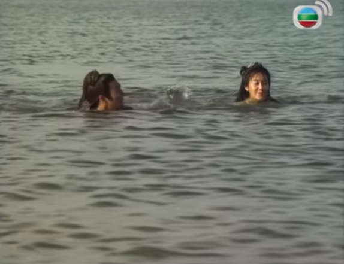

# Qiu Chuji Mengaku Kalah

    
    

        
<em>
        "Ayo masuk ke air, aku ajari," desak Huang Rong.
        </em>

    

***

Melihat adik seperguruannya dalam bahaya besar, Sha Tongtian melompat untuk bergegas 
melepaskan genggaman Mei Chaofeng. Segera setelah kedua tangan mereka bertemu, mereka merasa
tangan mereka mendadak nyeri. Sementara itu dari arah kiri datanglah suara berdesir dari
sejumlah senjata rahasia meluncur di udara. Peng Lianhu melontarkan _biao_ ke arah Mei Chaofeng.
Ia segera mengalihkan tangannya dan melemparkan Hou Tonghai tepat ke arah kumpulan _biao_ itu.
"Aiyo!" teriak Hou Tonghai ketika sejumlah _biao_ mengenai tubuhnya.

Huang Rong bersorak, "Selamat, Naga Bertanduk Tiga! Kau berhasil menangkap _biao_
sebanyak itu!"

Sha Tongtian yang melihat betapa menakjubkannya kekuatan lemparan Mei Chaofeng, dan adik
seperguruannya jatuh terluka parah, melompat ke arah Hou Tonghai dan dengan uluran tangannya
menariknya bangkit. Hou Tonghai terbang seperti burung kertas, tapi ia terlihat seolah-olah akan jatuh
sekali lagi. Tubuhnya serasa tidak punya kekuatan lagi. Sha Tongtian secara tidak sengaja 
memukul tiga benjolan di kepalanya.

Semua kejadian ini berlangsung dalam sekejap mata. Sementara semuanya berlangsung, Ouyang Ke
dan Liang Ziwong menyerang Mei Chaofeng dari depan dan belakang, serempak dengan Sha Tongtian yang
menyerang dari arah kanan.

Mei Chaofeng bisa menilai dari suara _biao_ di udara di mana posisi mereka. Ia mengirimkan
semuanya kembali ke arah mereka dalam empat arah, masing-masing untuk Ouyang Ke, Lian Ziwong,
Sha Tongtian dan Peng Lianhu. Ia bertanya kepada Guo Jing, "Apa artinya 'Kumpulkan Lima Elemen'?"

Guo Jing menjawab, "Hantu Timur adalah kayu, Arwah Barat adalah logam, Semangat Selatan adalah
api, Intisari Utara adalah air, Kemauan Pusat adalah tanah."

Mei Chaofeng memekik kegirangan, "Aiyo! Seharusnya aku bisa menebaknya lebih awal! Apa artinya
'Lakukan Empat Tanda Harmonis'?"

Guo Jing menjawab, "Sembunyikan mata, konsentrasi untuk mendengar, bernafas secara teratur dan
tutup Qi pada lidah."

Mei Chaofeng menghela nafas, "Ah, jadi itu makna aslinya. Bagaimana dengan 'Lima Ruang Utama'?"

Sekali lagi Guo Jing menjawab, "Jangan gunakan matamu untuk melihat, lebih baik temukan jiwamu di dalam hati,
jangan gunakan telinga untuk mendengarkan, tetapi temukan esensi di ginjal, jangan gunakan mulut untuk bersenandung, 
tetapi temukan jiwamu di dalam hati, jangan gunakan hidung untuk mencium, lebih baik temukan jiwamu
di paru-paru, jangan bergerak dengan keempat anggota tubuhmu, tetapi temukan pikiranmu di limpa. 
Ini adalah ‘Lima Ruang Utama’."

Empat Tanda Harmonis dan Lima Ruang Utama adalah teknik kunci yang terdapat di dalam 
Jiu Yin Zhen Jing seperti dipraktekkan oleh para Pendeta Tao. Karena tidak ada orang yang
menjelaskan semua kunci itu kepadanya, Mei Chaofeng bergumul tanpa sukses selama lebih dari
sepuluh tahun untuk memahaminya. Sekarang mendengar penjelasan Guo Jing ia tiba-tiba memahami 
semuanya dan sangat gembira. Lagi-lagi ia mengorek informasi, "Sekarang bagaimana caranya aku
melakukan 'Mengumpulkan Tiga Bunga'?" Teknik itu berperanan kunci untuk menggabungkan semuanya.
Selama ini ia berjuang untuk mendapatkan kunci itu, maka ia mendengarkan baik-baik jawaban Guo Jing.

Guo Jing menjawab, "Esensi diubah menjadi Qi, Qi diubah menjadi semangat..."

Mei Chaofeng yang berkonsentrasi pada ucapan Guo Jing menjadi kurang perhatian pada pertarungan
dan keempat lawannya. Pada saat Guo Jing sedang mengatakan dua kalimat itu, ia terkena serangan
pada bahu kiri dan sisi kanan oleh tinju Ouyang Ke dan Sha Tongtian. Ia merasakan sakit yang tak 
tertahankan.

Rencana Huang Rong semula adalah menyibukkan lawan-lawan mereka melalui Mei Chaofeng, sementara
ia dan Guo Jing mengambil kesempatan untuk menyelinap pergi. Ia tidak mengira bahwa Guo Jing
akan terseret ke dalam pertarungan itu dan menjadi _kendaraan_ bagi Mei Chaofeng. Ini membuat
mereka berdua mustahil untuk melarikan diri. Sekarang ia menjadi kuatir dan marah.

Sementara itu Mei Chaofeng yang terdesak menjadi terjaga dan terpaksa bertahan, sambil berteriak,
"Hei, apa yang kau perbuat sampai menyinggung begini banyak musuh? Mana Shifu?" Saat ini pikiran
Mei Chaofeng saling berkontradisksi. Di satu pihak ia berharap bahwa gurunya akan muncul dan 
dengan matanya sendiri melihatnya sedang bertarung mati-matian untuk menyelamatkan putrinya
dari ancaman bahaya yang ditimbulkan keempat ahli kungfu tingkat tinggi ini, dan kemudian turun
tangan menolongnya. Di pihak lain, kalau ia berpikir tentang betapa liar dan anehnya perangai
gurunya, ia dibayangi teror kalau harus bertemu dengannya lagi.

Huang Rong berseru, "Dia segera datang, tapi buat apa kau menguatirkan soal itu — orang-orang ini
bukan tandinganmu. Kalau pun kau hanya duduk di tanah, tak seorang pun dari mereka akan bisa
menyentuh sehelai pun rambut dari kepalamu." Ia berharap dengan sedikit pujian, Mei Chafeng akan 
merasa cukup bangga dan melepaskan Guo Jing untuk bertarung sendirian. Tetapi Mei Chaofeng sudah
mulai merasa bahwa ia tidak akan sanggup melawan empat orang itu sendirian. Ia mulai terlihat
putus asa dan tidak ada pujian yang akan membuatnya berubah pikiran. Lehih jauh lagi, ia masih punya
beberapa pertanyaan penting untuk Guo Jing mengenai rahasia kitab agama Tao itu, dan tidak bakalan
melepaskannya kalau pun ia bisa menang bertarung sendirian.

Beberapa jurus kemudian, Lian Ziwong melompat ke udara diiringi pekikan mendadak. Mei Chaofeng
tahu bahwa seseorang sedang melancarkan serangan mendadak dan merentangkan tangannya untuk menangkis
dan menyapu untuk mempertahankan diri. Ia merasa rambutnya dijambak ke atas oleh Liang Ziwong.
Huang Rong melihat situasinya sangat kritis dan menerjang keluar dengan tinjunya mengarah ke punggung
Liang Ziwong. Liang Ziwong mengaitkan punggung tangan kanannya ke belakang dan mencekal pergelangan
tangan Huang Rong sambil mempertahankan pegangannya ke rambut Mei Chaofeng. Mei Chaofeng menyerang 
ke atas dan memaksa Liang Ziwong untuk melepaskan pegangannya untuk menghindari terkena pukulan keras.

Peng Lianhu sudah bertarung melawan Mei Chaofeng untuk beberapa saat ketika akhirnya
ia tersadar bahwa wanita itu sebetulnya salah seorang dari Sepasang Iblis Angin Hitam.
Ketika melihat Huang Rong membantunya, ia berteriak, "Bocah brengsek! Sudah jelas kau anggota
Geng Angin Hitam ini, masih menyangkal!"

Huang Rong tertawa cekikikan, "Dia — _dia_ guruku? Latihan seratus tahun lagi pun dia tetap tidak
layak jadi guruku!"

Peng Lianhu melihat dengan jelas bahwa kungfu yang dipakai Huang Rong untuk menyerang sangat mirip
dengan gaya Angin Hitam, tapi anak itu masih terus menyangkal sebagai murid, bahkan berani bertindak
lebih jauh lagi untuk menghina Mei Chaofeng. Ia tidak bisa menebak mengapa anak itu berbuat begitu, dan 
hal itu sangat mencengangkannya.

Sha Tongtian berteriak, "Untuk membunuh orang, bunuh dulu kudanya!" dan melancarkan tendangan
ke arah Guo Jing dengan kaki kanannya. Perubahan taktik ini membuat Mei Chaofeng lengah. Ia berpikir,
"Kungfu bocah ini sangat lemah. Mana mungkin dia mampu melindungi diri melawan mereka. Kalau tidak
bertindak cepat, mereka akan menghabisi aku." Terdengar suara siulan bernada rendah ketika ia membungkuk
dan melesatkan tangannya seolah-olah ingin menangkap kaki Sha Tongtian. Ouyang Ke memanfaatkan peluang
untuk menghantam punggung Mei Chaofeng. Namun Mei Chaofeng hanya mengeluarkan suara "Hm!" dan mengibaskan
tangan kanannya, diikuti oleh luncuran sebuah benda berkilau di bawah sinar bulan. Mendadak muncul 
sebuah cambuk perak, menari-nari dan melambai mengelilinginya dan Guo Jing, membentuk sebuah benteng
yang tak bisa ditembus.

Peng Lianhu berpikir, "Kalau kita tidak membunuhnya sekarang, ketika suaminya — Tong Shi — datang,
kita akan mengalami kesulitan besar!" Berita tentang peristiwa malam itu ketika Chen Xuanfeng tewas
masih belum tersebar di dunia persilatan. Namun demikian, kekejian dari Sepasang Iblis Angin Hitam
sudah tersebar luas dan reputasi mereka sedemikian rupa sehingga para pendekar setingkat dirinya
pun akan merasa ngeri kalau harus berhadapan dengan keduanya sekaligus.

Permainan cambuk perak Mei Chaofeng taramat sangat kuat. Kalau orang mendekat dari segala penjuru,
mereka bisa langsung tewas. Tetapi Sha Tongtian, Peng Lianhu, Liang Ziwong dan Ouyang Ke tidak mau
menyerah begitu saja. Tiba-tiba terdengan suara siulan dan Peng Lianhu mulai merangkak di atas
tanah. Mei Chaofeng siap untuk bertahan melawan langit dan empat penjuru angin, tetapi tidak
terhadap serang dari bawah. Mendengar suara orang menggali ia menjadi waspada dan mengirimkan
serangan telapak tangannya ke bawah.

Melihat Guo Jing dalam bahaya, Huang Rong hendak berlari untuk menolongnya, tetapi Mei Chaofeng
selangkah lebih cepat. Menggunakan cambuk peraknya yang panjang, ia sudah membentuk benteng 
pertahanan di sekeliling dirinya dan Guo Jing, membuat Huang Rong dan semua orang lain mustahil
untuk menembusnya. Namun demikian, Huang Rong tahu bahwa dengan kemampuan Mei Chaofeng sendiri
kelihatannya tidak akan berhasil untuk melawan serangan Peng Lianhu lebih lama lagi. Merasa
bahwa situasi semakin memburuk, ia berteriak, "Tahan dulu semuanya, aku ingin bicara!"
Tapi tentu saja Peng Lianhu tidak mempedulikan ucapannya.

Huang Rong sedang bersiap untuk menaikkan suaranya lagi ketika dari atas dinding terdengar
suara yang berkata, "Tahan semuanya, aku ingin bicara." Huang Rong memalingkan kepalanya dan
melihat enam sosok manusia di atas tembok, beberapa orang tinggi, beberapa orang pendek, tetapi
dalam kegelapan ia tidak dapat melihat wajah mereka dengan jelas. Peng Lianhu dan semuanya tahu
bahwa ada beberapa orang muncul, tetapi mereka tidak tahu mereka kawan atau lawan. Sekarang ini 
pertarungan berlangsung lebih sengit lagi dan tak seorang pun mampu menghentikan diri mereka sendiri.
Dua orang melompat turun dari atas tembok dan langsung menuju ke arah Ouyang Ke. Yang seorang 
melambaikan cambuk, yang satunya mengangkat tongkat.

Pria bertubuh montok yang memegang cambuk itu berseru, "Dasar bandot, kali ini kau tidak bisa
kabur lagi!" Mendengar suara itu Guo Jing berteriak kegirangan, "Shifu! Tolong aku!"
Enam orang yang baru saja tiba itu adalah Enam Orang Aneh dari Jiangnan.

Setelah berpisah dengan Guo Jing di penginapan, mereka membuntuti delapan orang wanita dari
Gunung Onta Putih. Pada saat mereka memergoki Ouyang Ke sedang memimpin para selirnya untuk
menculik gadis-gadis lugu di malam hari, mereka bertarung dengan dia. Mereka tidak mungkin
berpangku tangan melihat orang melakukan kekejaman semacam itu. Meskipun kungfu Ouyang Ke 
tinggi, tetapi Enam Orang Aneh itu sudah menghabiskan waktu lebih dari sepuluh tahun di 
padang rumput Mongolia untuk bekerja keras, dan ilmu mereka meningkat drastis sejak mereka
meninggalkan wilayah pusat. Di kepung oleh Enam Orang Aneh, Ouyang Ke terkena gebukan tongkat
Ke Zhen'E dengan telak, dan kemudian jari kelingking kirinya terkilir berkat ilmu Memindahkan
Tulang dari Zhu Cong. Tak punya pilihan lain, Ouyang Ke terpaksa meninggalkan gadis-gadis yang
diculiknya dan melarikan diri. Namun demikian, dua orang selir yang menemaninya dalam misi tersebut
tewas di tangan Nan Xiren dan Quan Jinfa.

Setelah mengantarkan gadis-gadis belasan tahun itu pulang, Keenam Orang Aneh kembali mengejar
Ouyang Ke. Tapi Ouyang Ke sangat licik, ia mengambil jalan lain dan oleh sebab itu Keenam Orang
Aneh tidak bisa menemukannya. Mereka tahu bahwa kalau bertarung satu lawan satu, tak seorang pun dari
mereka akan menang melawan Ouyang Ke, jadi mereka tidak berani berpencar untuk melacak jejak Ouyang Ke.
Untungnya semua gadis yang menunggang onta itu berpakaian sangat aneh dan menyolok, maka tidak sulit
untuk memperoleh petunjuk dari orang-orang di jalan mengenai mereka. Pelacakan itu akhirnya membawa
Keenam Orang Aneh sampai ke istana Pangeran Zhao.

Jubah putih Ouyang Ke terlihat menyolok di kegelapan, dan Han Baoju bersama dengan Nan Xiren
segera menyerangnya. Mendengar panggilan Guo Jing, Keenam Orang Aneh terkejut dan juga
lega. Zhu Cong dan lainnya mengawasi dengan teliti dan segera menyadari bahwa orang yang
sedang memainkan cambuk perak panjang untuk membentengi dirinya dan Guo Jing itu tak lain
adalah si Tie Shi, Mei Chaofeng! Ia duduk di atas bahu Guo Jing dan sudah jelas bahwa Guo Jing
jatuh ke dalam cemgkeramannya. Dengan muka pucat karena terkejut, Han Xiaoying segera menghunus
pedangnya dan menerjang ke depan untuk menelamatkan Guo Jing. Peng Lianhu dan lainnya berpikir
bahwa kemunculan mendadak keenam orang ini sangat aneh. Sekarang mereka berenam ternyata menyerang
baik Ouyang Ke dan Mei Chaofeng, membuatnya jadi lebih mustahil untuk mengatakan mereka sebenarnya
berdiri di pihak mana.

Peng Lianhu menahan serangannya, dan sambil masih menggunakan Telapak Bumi, keluar dari
jangkauan cambuk Mei Chaofeng. "Semuanya berhenti, aku ingin bicara," serunya. Seperti
bunyi lonceng besar yang memekakkan telinga semua orang. Lian Ziwong dan Sha Tongtian
adalah yang pertama berhenti menyerang.

Ke Zhen'E bisa mengenali dari suara teriakannya bahwa kemampuan orang itu patut diperhitungkan,
dan berseru, "San Di, Qi Mei, jangan kasar!"

Mendengar perintah kakak seperguruan mereka, Han Baoju dan yang lain segera mundur. Mei Chaofeng
juga menarik kembali cambuknya sambil terengah-engah. Huang Rong melangkah maju dan berkata kepadanya,
"Kau sudah berjasa besar kali ini. Ayahku akan sangat senang." Menggunakan kedua tangannya, 
ia menarik Guo Jing, membrinya isyarat untuk melemparkan Mei Chaofeng jauh-jauh.

Guo Jing mengerti maksudnya, dan tahu bahwa ia bicara dengan Mei Chaofeng untuk mengalihkan
perhatian. Ia berkata, "Tiga Kuntum Bunga Berkumpul Di Atas adalah Esensi yang diubah menjadi
Qi. Qi diubah menjadi Semangat, Semangat diubah menjadi Kekosongan. Ingat semua itu!"

Mei Chafeng berpikir keras, lalu bertanya, "Bagaimana mengubahnya?" Tiba-tiba ia merasa tubuhnya
melayang di udara. Ketika ia sedang merenungkan kedalaman makna dari ilmu tenaga dalam itu,
Guo jing menggunakan kesempatan untuk melemparkannya lebih dari sepuluh kaki dari situ. Pada
saat bersamaan ia menghimpun tenaga dalam dan melompat mundur, tetapi sebelum ia mendarat
cambuk perak Mei Chaofeng sudah melayang ke arahnya, kaitnya berkilau terang.

Han Baoju berseru, "Celaka!" Ia melepas cambuknya sendiri dan kedua cambuk bertemu di udara.
Setelah menerima getaran dari kontak langsung jarak dekat tersebut, cambuk Han Baoju berhasil
direbut oleh cambuk perak. Baru saja Mei Chaofeng akan mendarat di atas tanah, tangannya yang
terulur tiba lebih dahulu, dan ia mendarat dusuk dengan ringan di atas tanah. Setelah mendengar
suara Ke Zhen'E dan bertarung sebentar dengan Han Xiaoying, ia tahu bahwa Tujuh Orang Aneh 
dari Jiangnan pasti sudah tiba di situ. Hatinya dipenuhi kebencian bercampur sedikit rasa takut.
Ia berpikir, "Aku mencari mereka ke mana-mana dengan sia-sia, sekarang mereka semua ada di depanku.
Kalau saja lain kali, maka aku akan sangat berterima kasih kepada Surga, tapi malam ini aku
dikepung oleh banyak musuh kuat dan mereka semua sangat sulit di atasi. Ditambah dengan Tujuh Orang
Aneh ini, aku tidak mungkin berharap untuk tetap hidup melewati malam ini." Ia menggeretakkan gigi
dan memutuskan, "Aku tidak punya dendam kepada Liang Ziwong dan lainnya. Kalau soal Tujuh Orang Aneh, 
aku akan bertempur sampai mati, dan memastikan kalau aku mati, mereka akan ikut bersamaku. Satu Orang Aneh
mati berarti musuhku berkurang satu, akan kubawa sebanyak yang aku bisa." Sambil memegang cambuk peraknya,
ia mendengarkan dengan teliti pergerakan Tujuh Orang Aneh dan bertanya-tanya, "Dari mereka bertujuh, 
hanya enam yang muncul. Ke mana yang satunya?" Ia belum tahu bahwa Si Budha Tersenyum, Zhang Ahsheng,
sudah tewas di tangan suaminya malam itu, di padang rumput Mongolia.

Keenam Orang Aneh, Sha Tongtian dan lainnya tahu betapa kuatnya cambuk perak di tangan Mei Chaofeng,
dan mereka berdiri jauh-jauh, menjaga jarak sekitar empat puluh sampai lima puluh kaki dari
sekeliling wanita itu. Selama sesaat semuanya diam. Zhu Cong berbisik ke telinga Guo Jing,
"Kenapa mereka berkelahi? Mengapa kau membantu bangsat itu?"

Guo Jing menjawab, "Mereka ingin membunuhku, tapi dia menyelamatkan aku." Tapi Zhu Cong dan
Orang Aneh lainnya masih bingung.

Peng Lianhu berseru, "Ada urusan apa kalian menyelinap ke istana di tengah malam? Sebutkan nama
kalian!"

Ke Zhen'E menjawab dengan dingin, "Margaku Ke. Kami tujuh bersaudara, orang menyebut kami
Tujuh Orang Aneh dari Jiangnan."

Peng Lianhu berkata, "Ah, rupanya ini Tujuh Pendekar dari Jiangnan. Aku sudah lama mengagumi kalian."

Sha Tongtian berkata dengan suara aneh, "Luar biasa, Tujuh Orang Aneh datang mengetuk pintuku! Aku
sudah lama menunggu untuk bertanding dengan kalian dan melihat sebagus apa kungfu kalian."

Setelah mendengar nama 'Tujuh Orang Aneh dari Jiangnan', ia segera teringat peristiwa memalukan
yang menimpa keempat orang muridnya. Dalam satu gerakan cepat ia melangkah maju. Menilai penampilan
Ketujuh Orang Aneh itu, ia melihat Ke Zhen'E buta, Han Xiaoying seorang wanita, Quan Jinfa seperti
tulang pembungkus kulit, Han Baoju pendek dan gendut, dan Zhu Zong punya pembawaan seorang sastrawan
tapi sama sekali tidak punya potongan seorang pendekar. Hanya Nan Xiren yang tampak gagah berani,
seperti layaknya seorang pendekar yang meyakinkan. Karena tidak mau membuang waktu dengan lainnya,
ia segera melancarkan serangan langsung ke arah kepala Nan Xiren. Nan Xiren menghempaskan tongkat pikulannya
ke atas tanah dan menyambut telapak tangan Sha Tongtian dengan telapak tangannya sendiri. Setelah beberapa
jurus, terbukti nyata bahwa Nan Xiren bukan tandingannya. Han Xiaoying dan Quan Jinfa bersiap dengan
senjata mereka, pedang dan timbangan, dan menerjang maju untuk membantu saudaranya.

Diiringi sebuah teriakan, Peng Lianhu melompat ke arah Quan Jinfa dan bermaksud merampas senjatanya.
Membaca maksud Peng Lianhu, Quan Jinfa segera menarik senjatanya dan mengirimkan kedua ujungnya —
bandul dan kait — melesat ke arah Peng Lianhu. Di sepanjang pengalaman Peng Lianhu menjelajah
rimba persilatan, belum pernah ditemuinya senjata seaneh milik Quan Jinfa itu. Dengan sebuah gerakan
yang mirip ular python membalikkan badan, ia menghindari sambaran senjata Quan Jinfa dan berseru,
"Apa ini? Kau memakai timbangan untuk jualan sebagai senjata!"

Quan Jinfa membalas, "Timbanganku ini adalah untuk menimbangmu, babi kurus!"

Dalam kemarahannya, Peng Lianhu bergegas maju, mengamuk dengan kedua telapak tangannya.
Tentu saja Quan Jinfa tidak sanggup mengalahkan serangannya. Melihat adik keenamnya dalam
bahaya, Han Baoju segera menolong. Meskipunsudah kehilangan cambuknya, dasar kungfu tangan
kosongnya masih cukup kuat. Tetapi meskipun dua lawan satu, Peng Lianhu tetap sulit diatasi.
Ke Zhen'E menggerakkan tongkatnya, Zhu Cong mengacungkan kipasnya, mereka berdua terjun ke dalam
pertarungan itu. Ke Zhen'E dan Zhu Cong jauh lebih kuat dibandingkan yang lain, karena itu setalah
mereka melibatkan diri, Orang-orang Aneh berbalik di atas angin. Di tempat lain, pertarungan antara
Hou Tonghai dan Huang Rong berkembang menjadi sengit. Kungfu Hou Tonghai sudah jelas di atas gadis
itu, tetapi karena berpikir bahwa gadis itu mengenakan rompi kulit landak, dan juga 'duri' yang ada
di kepalanya, Hou Tonghai tidak berani mendaratkan kepalan maupun telapak tangannya di tubuhnya,
apalagi kepalanya. Ketika membaca ketakutan dan keragu-raguannya, Huang Rong memanfaatkan kesempatan
itu dengan sebaik-baiknya, dan menyerang dengan gencar, berkali-kali memaksanya mundur.

Hou Tonghai berteriak, "Ini tidak adil. Lepaskan dulu Rompi Kulit Landakmu sebelum kita lanjutkan."

Huang Rong menjawab, "Boleh, tapi kau juga harus memotong dulu tiga benjolan di kepalamu itu, kalau
tidak, maka tetap tidak adil, kan?"

Hou Tonghai membalas, "Benjolanku tidak menyakiti orang lain!"

Huang Rong balik menjawab, "Aku merasa jijik melihatnya, itu kan menguntungkanmu! Pada hitungan ketiga,
kau potong benjolanmu, aku melepas rompiku."

Hou Tonghai menjawab dengan marah, "Aku tidak mau!"

Huang Rong berkata, "Ini pertukaran yang bagus, kurasa kau harus."

Hou Tonghai berseru, "Aku tidak mau masuk perangkapmu. Pokoknya aku tidak mau, apa pun juga yang
kau katakan!"

Ouyang Ke melihat pertarungan itu tidak berjalan dengan baik dan berpikir, "Akan kubunuh
dulu enam keparat itu. Iblis itu tidak bisa lolos, jadi kita bisa membunuhnya nanti."
Ingin memamerkan kungfunya, ia berdiri di ujung jari kakinya dan menunjukkan kungfu
keluarganya 'Seribu Mil Dalam Sekejap', ilmu meringankan tubuh tingkat tinggi, dan 
mendadak hinggap di sebelah Ke Zhen'E.

Ia berseru, "Bangsat buta, kalau mau sok sibuk, rasakan ini!"

Ouyang Ke bergerak maju menyerang dengan telapak tangan kanannya. Ke Zhen'E mengangkat mengangkat
tongkatnya untuk menyambut pukulan itu, tapi menangkap angin, hanya suara angin melewati telinga
kanannya. Sebaliknya, serangan yang sesungguhnya datang dari arah kiri melalui punggung tangan kiri
Ouyang Ke yang melesat ke arahnya. Ke Zhen'E menundukkan kepalanya untuk menghindari pukulan itu lalu
menggunakan ilmu tongkat 'Penjaga Berlian' untuk menyerang dengan kejam, tapi kali ini Ouyang Ke 
menghadapi Nan Xiren. Dengan keterampilan tingakat tinggi, Ouyang Ke melancarkan serangan fatal
ke arah semua Orang Aneh itu dalam tempo singkat.

Sejak semula mata Liang Ziweng tidak pernah lepas dari Guo Jing. Melihat bahwa kekalahan
Enam Orang Aneh itu sudah dapat dipastikan, ia segera berusaha menangkap Guo Jing menggunakan
kedua tangannya. Guo Jing segera melawan, tapi tentu saja ia bukan tandingan Lian Ziweng.
Setelah beberapa jurus, Liang Ziweng berhasil merenggut dadanya, dan tangan kanannya memegang
perut Guo Jing. Guo Jing menyusutkan perutnya dalam kecemasan dan bajunya robek diiringi suara
yang cukup nyaring, dan bungkusan obat-obatan berhasil dirampas. Liang Ziweng tahu bahwa bungkusan 
itu berisi obat, ia sudah mengengusnya sejak lama, dan dengan senang mengantonginya. Ia melanjutkan
dengan serangan kedua ke arah Guo Jing. Guo Jing berhasil bergumul keluar dari cengkeramannya
pada dadanya dan berlari cepat ke arah Mei Chaofeng, sambil berteriak, "Hei, cepat selamatkan aku!"

    <h3>Catatan</h3>
    

    Dalam terjemahan bahasa Inggris, saya menemukan penulisan nama Liang Ziwong berubah menjadi
    <strong>Liang Ziweng</strong> dalam bab-bab selanjutnya. Karena nama Liang itu terasa lebih masuk akal
    ditulis sebagai Liang Ziweng, maka sebaiknya kita menggunakan nama ini di sepanjang novel. Setelah selesai
    menerjemahkan keseluruhan novel, kesalahan tersebut baru akan saya perbaiki untuk bab-bab sebelumnya.
    

    

    Inkonsistensi ini berasal dari terjemahan bahasa Inggris.
    

Mei Chaofeng berpikir, "Masih banyak hal yang belum kupahami tentang pelajaran tenaga dalam
misterius itu." Masih terengah-engah, ia berkata dengan suara keras, "Sini, cepat angkat kakiku, 
jangan takut sama kelelawar tua itu!"

Guo Jing tahu bahwa mengangkat kakinya sangat mudah, tapi setelah itu ia akan sulit untuk 
meloloskan diri. Jadi ia tidak berani mendekat dan malah berlari cepat mengitari Mei Chaofeng.
Meskipun Guo Jing sudah memasuki jangkauan cambuk peraknya, Liang Ziweng masih juga mengikutinya,
tanpa kuatir sedikit pun akan serangan mendadak. Mei Chaofeng menangkap posisi Guo Jing melalui
pendengarannya dan melepaskan lecutan cambuk peraknya ke atas tanah ke arah kaki Guo Jing.

Meskipun Huang Rong sedang berduel melawan Hou Tonghai, ia berada di atas angin karena
Rompi Kulit Landaknya dan ia selalu mengawasi Guo Jing. Mula-mula ia tertangkap oleh Liang Ziweng,
tetapi posisinya terlalu jauh untuk membantu dan merasa sangat cemas. Lalu Guo Jing berlari cepat 
ke arah jangkauan Mei Chaofeng. Cambuknya melecut ke arahnya dan ia tidak bisa menghindar. Dalam
kecemasan, Huang Rong terbang ke arah mereka dan menempatkan diri di depan cambuk itu. Cambuk
Mei Chaofeng ditarik setelah mencapai sasarannya dan melingkar balik, melilitkan diri di sekeliling
pinggang Huang Rong. Huang Rong terlempar ke udara dan berteriak, "Mei Ruohua, kau berani
melukai aku!"

Mendengar suara Huang Rong membuat Mei Chaofeng terperanjat. Ia perpikir, "Cambukku dipasangi
kait terbalik. Sekarang aku melukai dia, Shifu jadi punya lebih banyak alasan untuk
tidak mengampuni aku. Tapi aku sudah terlanjur sampai di sini, bagaimana pun juga aku _memang_
sudah mengkhianati perguruanku. Aku akan membunuhnya dulu." Sambil mengangkat cambuk peraknya,
ia berpikir bahwa semua kait itu pasti sudah merobek daging bocah itu dalam-dalam. Ia tidak 
menyangka bahwa kait itu hanya merobek pakaian Huang Rong, dan tubuhnya sama sekali tidak
terluka. Huang Rong berkata sambil tertawa, "Kau merobek bajuku, aku ingin ganti rugi!"

Mei Chaofeng terkejut mendengar tidak ada tanda-tanda kesakitan dalam suaranya, lalu ia berpikir,
"Ah, Shifu sudah memberinya Rompi Kulit Landak." Merasa lega, ia berkata keras-keras, "Itu semua
salahku. Aku akan membelikan yang baru untukmu."

Huang Rong memberi isyarat kepada Guo Jing untuk datang dan ia mengerti. Sekarang keduanya berdiri
sekitar sepuluh kaki dari Mei Chaofeng, dan Liang Ziweng tidak berani mendekat.

Dalam pertarungan lainnya, Keenam Orang Aneh dari Jiangnan membentuk lingkaran ketat dengan
saling berhadapan punggung dan berusaha sekuat tenaga untuk melawan Sha Tongtian, Peng Lianhu,
Ouyang Ke dan Hou Tonghai. Ini formasi yang mereka kuasai di padang rumput Mongolia. Ketika
sedang menghadapi lawan tangguh, formasi ini membuat mereka tidak perlu menjaga punggung mereka,
dan otomatis membuat kekuatan mereka meningkat dua kali lipat. Namun Sha Tongtian, Peng Lianhu
dan Ouyang Ke memang terlalu kuat, dan bahaya datang dari segala penjuru, Keenam Orang Aneh itu
sama sekali bukan tandingan mereka. Tak terlalu lama kemudian, lengan Han Baoju terluka. Han Baoju
tahu bahwa jika ia meninggalkan formasi, maka akan ada celah bagi lawan untuk masuk dan nyawa mereka,
dan juga Guo Jing, dalam bahaya besar. Ia hanya bisa menggertakkan giginya dan bertahan dengan sekuat
tenaga.

Dari semua lawan, Peng Lianhu adalah yang paling gencar menyerang dan berkali-kali mengincar
Han Baoju. Guo Jing melihat bahwa situasinya sangat mendesak, lalu menerjang dengan secepat
kilat. Menggunakan teknik telapak berganda 'Memisahkan Awan dan Bulan', ia mengincar punggung
Peng Lianhu. Peng Lianhu tertawa dingin dan dengan kibasan tangannya mementahkan serangan Guo Jing.
Hanya dalam tiga jurus Guo Jing sudah terjebak dalam bahaya.

Huang Rong melihat bahwa dia tidak dapat meloloskan diri, dan dalam kekuatirannya tiba-tiba
ia teringat sebuah pepatah, 'Orang yang sederhana tidak berdosa, tetapi orang yang mengenakan sebuah
batu pualam akan berhadapan dengan dosa'. Maka ia berteriak, "Mei Chaofeng, kau mencuri kitab 
Jiu Yin Zhen Jing, kembalikan sekarang, supaya bisa kukembalikan kepada ayahku!"

Mei Chaofeng berubah dingin dan tidak menanggapi. Sha Tongtian, Peng Lianhu, Ouyang Ke,
dan juga Liang Ziweng dengan segera mengalihkan perhatian mereka kepada Mei Chaofeng dan
menyerangnya. Keempat orang itu berpikir sama, "Jiu Yin Zhen Jing adalah kitab ilmu silat
nomor satu di dunia dan selama ini berada di tangan Sepasang Iblis Angin Hitam..." Kini keempat
orang itu tidak peduli tentang segala hal lain dan memusatkan segala perhatian mereka untuk
membunuh Mei Chaofeng untuk merebut kitab itu.

Mei Chaofeng mulai mengacungkan cambuk peraknya dan untuk saat itu tak seorang pun dari
mereka berani melangkah ke dalam jangkauannya. Melihat mereka berhasil dihalau oleh
isu mengenai 'Jiu Yin Zhen Jing', Huang Rong berbisik ke telinga Guo Jing dengan mendesak,
"Ayo kita pergi!"

Saat itu, sesosok tubuh menghambur ke arah mereka sambil berseru, "Saudara-saudara! Ayah memerlukan
pertolongan kalian untuk mengatasi urusan mendesak." Orang itu memakai topi emas dan suaranya penuh 
kekuatiran. Orang itu adalah Wanyan Kang. Peng Lianhu dan lainnya berpikir, "Pangeran Zhao sudah
begitu murah hati untuk mendapatkan pelayanan kita. Sekarang ada urusan mendesak, mana mungkin
kita tidak menolongnya?" Dengan pikiran itu mereka denagn ogah-ogahan berbalik, masih belum rela
melepaskan 'Jiu Yin Zhen Jing'. Mata mereka masih menatap Mei Chaofeng.

Wanyan Kang berkata dengan halus, "Ibu... Ibu sudah diculik penjahat. Ayah minta bantuan kalian
untuk menyelamatkan ibu, mohon segera dilaksanakan."

Awalnya Wanyan Honglie memimpin pasukannya keluar istana untuk mengejar Bao Xiruo, tetapi mereka
kehilangan jejaknya. Teringat akan para ahli silat yang berpengetahuan luas di dalam istananya,
ia buru-buru mengirim putranya untuk memanggil mereka. Wanyan Kang segera melaksanakan perintah
tersebut dengan cemas dan karena malam itu sangat gelap, ia tidak memperhatikan kehadiran Mei Chaofeng
yang sedang duduk di atas tanah.

Peng Lianhu dan yang lain berpikir, "Ya ampun, Wang fei diculik orang! Kalau kita tidak segera
menyelamatkannya, bat apa kita hadir di sini?" Mereka berpikir lebih lanjut, "Ini pasti ulah
Tujuh Orang Aneh. Yang enam ada di sini untuk mengalihkan perhatian, supaya yang satunya bisa
menculik Wang Fei. Kitab itu bisa menunggu. Lagipula, dengan begitu banyak ahlikungfu begini,
_aku_ tidak bisa berharap untuk memilikinya sendiri. Au harus membuat rencana yang lebih baik
lain kali." Dengan pikiran seperti itu, mereka buru-buru mengikuti Wanyan Kang. Liang Ziweng
mengikuti dari belakang, masih memikirkan darah Guo Jing. Ia sebetulnya tidak peduli soal
menyelamatkan Wang Fei, tapi hanya ia sendiri yang ingin tinggal, jadi  tidak punya pilihan
lain kecuali mengikuti mereka dengan tidak rela.

Guo Jing memanggilnya, "Hei, kembalikan obatku!" Dengan emosi Liang Ziweng berpaling dan mengirimkan
senjata rahasia penembus tulang ke arah kepalanya. Seperangkat senjata itu melesat menembus angin malam
dengan kekuatan luar biasa.

Zhu Cong bergerak ke depan dan menangkis serangan itu menggunakan pegangan kipasnya. Ketika semua
senjata itu jatuh, ia menangkapnya dengan tangan kirinya dan mendekatkannya ke hidungnya untuk
mengendus baunya. "Ah, menutup tenggorokan waktu menyentuh darah. Ini 'Jarum Akupuntur Penembus Tulang'."

Mendengar nama senjata rahasianya disebutkan sangat mengejutkan Liang Ziweng. Ia menoleh dan
berteriak, "Apa?"

Zhu Cong mendekatinya dan memegang tangannya, jarum-jarum akupuntur itu diletakkannya d situ.
Ia berkata dengan ringan, "Akan kukembalikan kepadamu, Lao Qianbei!"

Liang Ziweng menerimanya dengan tenang. Ia tahu dengan kungfu Zhu Cong, ia tidak bisa
mencelakainya. Zhu Cong melihat bahwa lengan baju Liang Ziweng dipenuhi lumpur dan rumput,
lalu ia menggunakan lengan jubahnya sendiri untuk membersihkan kotoran itu. Liang Ziweng
berkata dengan marah, "Kau tidak usah menjilat!" Ia berpaling dan melangkah pergi. 

Guo Jing dalam posisi sulit. Kalau ia kembali tanpa membawa obat, semua jerih payahnya sepanjang
malam akan sia-sia, tapi kalau ia berusaha memaksa merebut kembali obat itu, ak diragukan lagi ia
pasti kalah dari Liang Ziweng. Ia masih berdiri ragu-ragu ketika Ke Zhen'E berkata, "Ayo pergi!"
Ke Zhen'E melompat ke atas tembok istana dan Kelima Orang Aneh lainnya mengikuti.

Sambil menunjuk Mei Chaofeng, Han Xiaoying berkata, "Da Ge, bagaimana dengan dia?"

Ke Zhen'E menjawab, "Kita sudah berjanji kepada Pendeta Ma untuk melepaskan dia."

Huang Rong tidak menyapa Keenam Orang Aneh itu dan melompat ke ujung lain dari tembok
sambil mendengus.

Mei Chaofeng berteriak nyaring, "Shi Mei, mana Shifu?"

Huang Rong cekikikan dan berkata, "Ayahku tentunya di Tao Hua Dao, kenapa kau tanya? Kau
mau mengunjungi dia?"

Mei Chaofeng cemberut, nafasnya makin berat dan terengah-engah. Setelah beberapa saat ia berkata,
"Bukankah tadi kau bilang Shifu akan datang?"

Huang Rong menjawab sambil tetap tertawa, "Dia tidak tahu kau ada di sini, tapi yakinlah
aku akan memberi tahu dia. Aku tahu pasti dia akan segera datang. Jangan kuatir, aku tidak
menggertakmu." Mei Chaofeng sangat marah, lalu memeluk diri sendiri dengan kedua tangannya
dan mendadak bangkit. Dengan langkah lebar ia menerang ke arah Huang Rong.

Kaki Mei Chaofeng lumpuh akibat latihan tenaga dalam dengan keras tanpa pengetahuan yang benar.
Aliran Qi mengalir ke daerah 'Dan Tian' (perut bagian bawah) dan ia tidak dapat mendorongnya
kembali ke atas, membuat tubuh bagian bawahnya lumpuh. Ia dengan keras kepala memcoba untuk
mendorong Qi itu kembali ke atas, tetapi semakin keras ia berusaha, semakin kuat perlawanan
yang didapatnya.

Pada saat itu, semua inderanya terganggu oleh amarah, sedemikian rupa sehingga ia melupakan
lumpuhnya. Ia berada dalam keadaan di mana ia terpisah dari tubuhnya dan hanya menyadari
sifat keras dari amarah menerobos ke dalam hatinya. Mendadak kakinya kembali menjadi bagian
dari tubuhnya dan ia menerjang ke arah Huang Rong. Terkejut melihat Mei Chaofeng kembali
bisa berjalan, Huang Rong melompat turun ke sisi lain dan melarikan diri di kegelapan malam.

Mendadak menyadari kakinya pulih, Mei Chaofeng berpikir, "Eh, kenapa aku jadi bisa
berjalan sekarang?" Dengan pikiran ini, mendadak sekujur kakinya mati rasa dan ia jatuh,
kehilangan kesadaran.

Kalau Keenam Orang Aneh ingin membunuhnya saat itu, sudah jelas mudah sekali, tetapi mereka
sudah berjanji kepada Ma Yu untuk mengampuninya. Jadi mereka melompat melewati tembok dan 
meninggalkan istana bersama Guo Jing.

Han Xiaoying adalah orang yang paling cemas di antara mereka dan buru-buru bertanya, "Jing'Er,
bagaimana kau bisa sampai ke sini?"

Guo Jing menceritakan secara garis besar semua peristiwa yang membawanya sampai ke situ... Wang Chuyi
menolongnya, terkena racun di tengah perjamuan Wanyan Kang, mencuri obat, bertemu dengan Mei Chaofeng
di lorong, dan seterusnya. Tetapi untuk saat itu, ia tidak menceritakan masalah keluarga Yang.

Zhu Cong berkata, "Ayo cepat kita tengok bagaimana keadaan Wang Dao Zhang."

***

Setelah mengalami dipersatukan kembali dengan istrinya, Yang Tiexin merasakan kebahagiaan
bercampur kesedihan yang tak terlukiskan. Sambil memondong tubuh istrinya, ia melompat keluar 
dari istana. Putri angkatnya Mu Nianci menunggu di luar istana dengan cemas. Ketika melihat
ayahnya membawa seorang wanita di tangannya, ia merasa terkejut dan penasaran. Ia bertanya,
Ayah, itu siapa?"

Yang Tiexin menjawab, "Ibumu. Ayo kita pergi."

Mu Nianci berkata, bingung, "Ibuku?"

Yang Tiexin berkata, "Hus, nanti kita bicara," dan berlari kencang terburu-buru.

Selang beberapa waktu, Bao Xiruo sadar kembali. Saat itu fajar sudah menjelang dan di bawah
cahaya remang-remang, ia melihat bahwa orang yang sedang menggendongnya adalah suaminya yang
dipikirkannya siang dan malam selama delapan belas tahun. Ia tidak tahu ini semua kenyataan
ataukah hanya ilusi. Ia merasa seperti sedang bermimpi dan mengulurkan tangan untuk mengelus 
wajahnya. Suaranya gemetar ketika bertanya, "Tie Ge, apa aku juga sudah mati?"

Sambil menangis bahagia, ia menjawab dengan suara lembut, "Kita berdua masih hidup dan sehat..."
Kalimatnya terputus oleh suara teriakan dari belakang. Cahaya obor menerangi sekeliling tempat itu
ketika para prajurit dengan cepat berbaris maju. Sambil mengangkat pedang dan tombak mereka berteriak,
"Jangan biarkan penculik Wang Fei lolos!"

Yang Tiexin segera mengamati keadaan sekelilingnya, tetapi tidak ada tempat bagi mereka untuk
bersembunyi. Ia berpikir, "Surga sudah mengasihani kita suami istri dan mengijinkan kita bersatu
kembali secara ajaib. Biarpun aku harus mati sekarang, aku sudah tidak mengharapkan apa-apa lagi."

Kejadian di Lin'an, Desa Niu, delapan belas tahun yang lalu tiba-tiba muncul lagi di benak
Bao Xiruo. Ia bersama suaminya melarikan diri, teriakan para prajurit d tengah malam,
dan kemudian diikuti oleh perpisahan selama delapan belas tahun, berikut segala penderitaannya.
Merasa bahwa tragedi itu akan muncul kembali, ia dengan keras kepala memeluk suaminya, tidak mau
lagi melepaskannya. Para prajurit semakin dekat dan Yang Tiexin berpikir lebih baik berjuang
sampai mati daripada ditangkap dan dipermalukan. Dengan pikiran itu ia melepaskan jari-jemari
istrinya yang sedang memeluknya dan menyerahkan dia kepada Mu Nianci. Ia menoleh ke sekelilingnya 
dan menerjang ke arah para prajurit, lalu dengan tinjunya ia menjatuhkan seorang prajurit 
yang tidak berkuda untuk merebut tombaknya. Dengan tombak di tangan Yang Tiexin menjadi lebih
mematikan. Komandan pasukan itu, Tang Zude, tertikan tombak tepat di kakinya dan langsung
jatuh dari kudanya. Dengan jatuhnya sang komandan, semua prajuritnya porak poranda ke segala arah.
Melihat tidak ada ahli silat di antara mereka, Yang Tiexin merasa agak lega meskipun sayangnya
ia tidak sempat merebut kuda. Mereka bertiga segera melanjutkan pelarian.

Saat itu pagi telah tiba. Bao Xiruo melihat bercak darah di baju suaminya dan berkata dengan
ketakutan, "Kau terluka?"

Mendengar itu, Yang Tiexin mendadak menyadari rasa sakit yang menusuk di lengannya. Karena ia
mengerahkan terlalu banyak tenaga ketika bertempur tadi, luka akibat cakaran Wanyan Kang
terbuka lagi dan sekarang darah mengucur dengan deras. Sebelumnya segala perhatiannya terpusat
pada pelariannya dan tidak menyadari rasa sakit itu. Tapi sekarang kedua tangannya terasa
kaku dan lemah, ia tidak bisa mengangkatnya. Bao Xiruo hendak membalut luka itu ketika suara
keras memanggil dari arah belakang, diikuti oleh kepulan debu tebal dari para prajurit yang
mengejar mereka muncul. Dengan senyum pahit, Yang Tiexin berkata, "Tidak usah dibalut." 
Ia berpaling dan berkata kepada Mu Nianci, "Nak, cepat lari! Ibumu dan aku akan tetap di sini..."

Mu Nianci berhasil menahan air matanya dan mengangkat kepalanya dengan bangga, sambil berkata,
"Kita bertiga akan mati bersama!"

Bao Xiruo bingung dan bertanya, "Bagaimana... bagaimana mungkin dia jadi anak kita?"

Yang Tiexin baru bermaksud menjawab ketika mendengar para prajurit mendekat. Ia memandang
ke atas dan melihat dua orang pendeta Tao mendatangi mereka, yang seorang berjanggut dan
beralis putih, dan terlihat baik hati. Yang lain berewokan hitam tebal, sebuah pedang panjang
tergantung di punggungnya, ia terlihat gagah dan penuh percaya diri. Kegirangan menggantikan
rasa kagetnya, dan Yang Tiexin segera memanggil, "Pendeta Qiu, kita ketemu lagi!"

Kedua pendeta itu memang adalah Ma Yu dan Qiu Chuji. keduanya, bersama dengan Wang Chuyi,
membuat janji pertemuan di Zhongdu untuk mendiskusikan duel yang akan datang dengan Tujuh
Orang Aneh dari Jiangnan. Keduanya datang terburu-buru dan berpapasan dengan keluarga Yang di situ.
Qui Chuji sudah mencapai tingkat tenaga dalam yang tinggi, sehingga penampilannya nyaris tidak berubah
selama delapan belas tahun ini. Hanya rambut di pelipisnya mulai bercampur dengan warna putih.
Mendengar sapaan itu, ia melihat lebih dekat, tapi ia tidak mengenali orang yang menyapanya.

Yang Tiexin berkata, "delapan belas tahun yang lalu di Desa Niu, di Lin'an, kita pernah
minum dan membunuh musuh bersama-sama, Dao Zhang masih ingat?"

Qiu Chuji berkata, "Kau..."

Yang Tiexin mengumumkan dirinya, "Aku Yang Tiexin, apa kabar, Dao Zhang?" Ia mendekat
dan membungkukkan badan.

Qiu Chuji buru-buru membalas sikap formal itu, tetapi masih diliputi keraguan. Delapan belas
tahun menjalani kehidupan keras dan penderitaan telah menggerogoti penampilannya, dan Yang Tiexin
terlihat sama sekali berbeda. Yang Tiexin melihat keraguannya, tetapi para prajurit sudah dekat
dan itu bukan saat yang tepat untuk menjelaskan segala hal secara secara lengkap. Sambil mengangkat
tombaknya, ia memperagakan 'Phoenix Memukul Kepala'. Rumbai-rumbai merah di ujung tombak itu
bergetar ketika ombak itu terarah ke dada Qiu Chuji, dan ia berkata, "Pendeta Qiu, kau bisa saja melupakan aku,
tapi kau tidak mungkin melupakan Tombak Keluarga Yang!"

Tombak itu berhenti beberapa inci dari Qiu Chuji. Qiu Chuji melihat bahwa gerakan itu
memang adalah Ilmu Tombak Keluarga Yang yang sejati, dan segera teringat pertarungan malam itu
di tengah salju. Ini ternyata memang adalah Yang Tiexin yang dikenalnya delapan belas tahun yang lalu.
Seketika ia merasa dipenuhi rasa pahit bercampur manis. Ia berkata keras-keras, "Ah! Yang Xiongdi,
kau masih hidup! Syukur kepada Surga!"

Yang Tiexin menarik tombaknya dan berkata, "Pendeta Qiu, tolong aku!" Qiu Chuji melirik ke arah
datangnya para prajurit dan berkata, "Da Ge, aku akan mulai membunuh lagi hari ini, harap jangan marah!"

Ma Yu menjawab, "Kurangi membunuh, mungkin hanya perlu menggertak mereka!"

Qiu Chuji tertawa keras dan melangkah lebar-lebar ke depan. Dengan sebuah dorongan menggunakan kedua 
tangannya, ia menjungkalkan dua prajurit dari kuda mereka dan melemparkan mereka ke arah dua orang prajurit
lain di belakangnya. Keempat prajurit itu saling bertabrakan dan jatuh. Tangan Qiu Chuji bergerak
secepat kilat, dan seperti anak panah, ia kembali melemparkan delapan prajurit ke arah delapan lainnya.

Diterpa kengerian, para prajurit lainnya memutar kuda mereka dan melarikan diri. Tiba-tiba
sosok seorang pemimpin dengan kepala botak dan berkilau muncul dari arah belakang para prajurit
yang melarikan diri itu. Ia berkata, "Dari mana datangnya para pengacau ini?" Dengan sedikit
ayunan tubuh, ia sudah berdiri di dekat Qiu Chuji dan menyerang dengan telapak tangannya.
Qiu Chuji melihat bahwa orang ini sangat gesit. Ia mengangkat telapak tangannya untuk menyambut
serangan itu, telapak tangan mereka bertemu dan keduanya segera mundur tiga langkah. Qiu Chuji terkejut
dan berpikir, "Siapa orang yang punya kungfu setinggi ini?"

Ia tidak tahu bahwa Si Raja Naga, Sha Tongtian merasa tangannya sakit dan merasa lebih terkejut
dari dirinya. Dengan amarah meluap Sha Tongtian mengayunkan tinjunya ke depan. Qiu Chuji tidak 
berani terlambat bergerak, dengan sepenuh tenaga dan konsentrasi ia mengirimkan kedua telapak
tangannya ke arah Sha Tongtian. Setelah kurang lebih dari sepuluh jurus, Qiu Chuji berhasil
memasukkan telapak tangannya, meninggalkan bekas merah di kepala botak Sha Tongtian. Meskipun
Sha Tongtian tidak bisa melihat kepalanya sendiri, tetapi ia bisa merasakan sakit yang menyengat
di bagian atas kepalanya. Setelah tahu bahwa ia tidak mungkin bisa mengalahkan pendeta itu dengan
bertangan kosong, ia segera menarik sebatag tongkat besi dari belakangnya. Meskipun senjatanya berat,
tetapi tenaganya sangat besar, dan dengan sebuah 'Kebangkitan Qin Di Belakang Pedang', tongkat itu
melesat ke arah bahu Qiu Chuji. Qiu Chuji menyambut serangan itu dengan teknik untuk merebut
senjata dengan tangan kosong. Namun Sha Tongtian sudah menggunakan senjata itu selama lebih
dari sepuluh tahun dan ia mampu menggunakannya secara luar biasa, jadi upaya Qiu Chuji gagal.

Dalam hati Qiu Chuji memuji gerakan itu, dan ia baru bermaksud menanyakan namanya ketika seseorang
dari arah kiri berseru, "Siapa pendeta dari Quanzhen ini?" Suaranya sangat bertenaga. Qiu Chuji 
melompat ke sebelah kanannya dan melihat empat orang lainnya: Peng Lianhu, Ouyang Ke, Liang Ziweng
dan Hou Tonghai.

Qiu Chuji merangkapkan kedua tangannya dan berkata, "Margaku Qiu, boleh aku tahu nama kalian?"
Nama besar Qiu Chuji sudah sangat dikenal dan ditakuti baik di wilayah Utara maupun Selatan.

Sha Tongtian dan yang lain berpikir, "Tidak heran namanya begitu terkenal, dia benar-benar kuat."

Peng Lianhu berpikir, "Kita semua sudah melukai Wang Chuyi dan menanam bibit permusuhan dengan
Perguruan Quanzhen. Kalau kita menggabungkan kekuatan dan membunuh Qiu Chuji hari ini, nama kita
akan berkibar jauh ke segala penjuru!" Ia berseru, "Semuanya, serang!" Sebelum ia menyelesaikan
kata terakhir, Peng Lianhu sudah meluncurkan jurusnya 'Penghakiman Kuas Kembar' dan maju ke arah 
Qiu Chuji. Ia tahu bahwa musuh ini sangat tangguh, jadi ia dengan kejam menyerang titik darah 'Yun Men'
di sebelah atas dan titik darah 'Tai He' di bagian bawah. Kedua pukulan itu datang dengan kekuatan penuh
dan tanpa belas kasihan.

Qiu Chuji berpikir, "Si Pendek ini sangat kejam! Sejujurnya, kungfunya juga di atas rata-rata." Ia 
menghunus pedangnya dan menebas tangan kanan Peng Lianhu, mencungkil pinggang Sha Tingtian,
dan menarik balik pedangnya, mengirimkan gagangnya ke arah titik darah kristis di sisi rusuk
Hou Tonghai. Dengan satu gerakan ia menyerang tiga orang, memamerkan keterampilan yang mengagumkan
dengan pedangnya. Hou Tonghai luput secara tipis dari sebuah totokan dan berhasil menarik diri
dengan segera, tapi apa daya, sebuah tendangan mendarat di pantat mengirimkan tubuhnya melayang
di udara dan terhempas dengan keras di atas tanah. Sebut saja kebetulan, tapi ia mendarat tepat di atas
ketiga benjolan di kepalanya. Liang Ziweng yang dalam hati tergetar memaksa diri untuk maju menyerang
seperti monyet.

Ouyang Ke melihat bahwa Qiu Chuji sedang sibuk dengan Sha Tongtian dan Peng Lianhu, dan
sekarang Liang Ziweng ikut melibatkan diri. Ini seperti sebuah peluang yang memohon untuk
diambil, kalau bukan sekarang, kapan lagi? Melancarkan tipuan dengan tangan kirinya, tangan
kanannya bergerak untuk menotok jalan darah 'Tao Dao', 'hun Men', dan 'Zhong Shu' di tubuh
Qiu Chuji dengan menggunakan kipas besinya. Kelihatannya seakan-akan Qiu Chuji tak punya 
jalan keluar ketika sesosok tubuh bergerak mendekat ke sisinya dalam sekejap. Tapi sebuah tangan
tiba-tiba terulur dan menahan pergerakan kipas itu. Ternyata Ma Yu yang sedang mengamati
dalam diam dari samping, merasa gusar melihat sekelompok pendekar tangguh mengeroyok adik
seperguruannya. Hanya dengan tiga jari ia memerangkap kipas besi itu. Ouyang Ke segera merasakan
nyeri akibat aliran tenaga dalam yang keluar dari pegangan kipas itu, dan secepatnya melompat 
mundur dengan terkejut.

Ma Yu tidak mengejarnya, tapi berkata, "Saudara-saudara, boleh aku tahu siapa kalian?
Kita tidak pernah bertemu. Seandainya ada kesalahpahaman kita bisa membicarakannya,
mengapa harus diselesaikan secara kasar?" Meskipun nadanya halus, tetapi suaranya mengandung
sejumlah besar Qi. Setiap kata terdengar sejernih kristal dan dibawa langsung ke gendang
telinga mereka. Sha Tongtian dan lainnya larut dalam pertarungan ketika kalimat yang diucapkan
Ma Yu membuat mereka semua diam terpaku. Mereka berhenti bertarung dan mundur sambil mengukur 
kekuatan Ma Yu.

Ouyang Ke berkata, "Dao Zhang, siapa namamu?"

Ma Yu menjawab, "Margaku Ma."

Peng Lianhu berkata, "Ah, jadi rupanya Si 'Matahari Merah', Pendeta Besar Ma. Kami sudah berbuat kasar."

Ma Yu menjawab, "Dengan pengetahuanku yang rendah, mana berani aku menerima julukan itu?"

Meskipun Peng Lianhu membungkus kata-katanya dengan sopan-santun, dalam hati ia berpikir, 
"Karena kita terlanjur membuat masalah dengan Perguruan Quanzhen, tidak mungkin ada niat baik
untuk memaafkan dan melupakan. Kedua tokoh ini adalah pilar utama Perguruan Quanzhen, dan 
kita beruntung bisa melawan _hanya_ mereka berdua begini. Kalau kita bersatu untuk menghabisi mereka, 
maka nantinya kita akan punya lebih sedikit kekuatiran. Tapi aku ingin tahu apa masih ada jagoan Quanzhen
lainnya di dekat sini." Melihat sekilas, hanya ada tiga anggota keluarga Yang — tidak ada seorang pun
pendeta lain di sekitar sini.

Peng Lianhu berkata, "Aku sudah lama mengagumi nama besar Tujuh Pendekar Quanzhen. Mana
lima orang yang lainnya? Bagaimana kalau kita undang mereka supaya kami boleh bertemu?"

Ma Yu menjawab, "Bukannya berkonsentrasi dengan pengembangan diri yang benar, adik-adik
seperguruanku seringkali terlibat dalam urusan duniawi dan mendapat julukan kosong. Aku
kuatir mereka sedang menipu diri sendiri. Kami bertujuh tinggal di kuil yang berbeda dan
jarang bertemu. Aku dalam perjalanan ke Zhongdu bersama adik seperguruanku Qiu untuk mencari
adik seperguruanku Wang, dan secara kebetulan bertemu kalian semua. Semua ilmu silat di dunia
ini berasal dari satu sumber. Teratai merah atau akar putih, kita semua berasal dari keluarga
yang sama. Karena kita punya kesamaan, bagaimana kalau kita berteman?" Sebagai orang yang 
secara alamiah jujur, Ma Yu tidak pernah menduga bahwa Peng Lianhu hanya sekedar berbasa-basi.

Mendengar bahwa sungguh tidak ada jagoan kungfu Quanzhen lainnya di dekat situ, Peng Lianhu
berpikir bahwa mereka menang jumlah. Tidak hanya itu, kedua pendeta itu belum bertemu dengan
Wang Chuyi, dan Ma Yu mudah percaya serta tidak waspada. Yang perlu dilakukan oleh Peng Lianhu
hanyalah mempertahankan sikap bersahabat dan mereka akan bisa melancarkan serangan mendadak.
Ia berkata dengan riang, "Kami merasa terhormat bahwa Pendeta Qiu dan Ma tidak meremehkan kami,
dan bisa berteman tentu akan sangat baik. Margaku San, nama lengkapku adalah San Heimao (Tiga
Kucing Hitam)."

Pada saat itu, Ma Yu dan Qiu Chuji sama-sama terkejut, dan berpikir, "Kungfu orang ini sangat
mengesankan, jadi namanya psti terkenal. Tapi nama ini — San Hei Mao — sangat aneh, aku tidak pernah
mendengarnya."

Peng Lianhu menyelipkan kembali kedua senjatanya yang berbentuk kuas itu ke pinggangnya,
dan mendekati Ma Yu. Ia berkata sambil tersenyum, "Senang bertemu denganmu, Ma Dao Zhang."

Ia mengulurkan tangannya untuk berjabat tangan. Tanpa curiga, Ma Yu menjabat tangannya, tetapi
ketika tangan mereka bertemu ia mendadak merasa pegangan Peng Lianhu mengeras.

Ma Yu berpikir, "Hmm, mau menguji kungfuku." Ia hanya tersenyum dan mengerahkan tenaga dalamnya
untuk menanggapi, memeras tangan Peng Lianhu. Tiba-tiba, rasa nyeri menusuk kelima jarinya dan
rasanya seperti ditusuk oleh sejumlah jarum besi. Ia buru-buru menarik tangannya karena terkejut.
Peng Lianhu tertawa terbahak-bahak dan mundur beberapa langkah. Ma Yu mengangkat telapak tangannya
dan melihat kelima jarinya telah tertusuk dalam sampai menembus daging, dan lingkaran lubangnya 
berwarna hitam.

Ternyata ketika Peng Lianhu menggantungkan senjatanya, ia secara diam-diam menyelipkan Jarum Gelang Beracun
di tangan kanannya. Terbuat dari baja halus, gelang itu setipis benang, dan di atasnya terdapat lima
jarum tipis yang dilengkapi dengan racun mematikan. Kalau jarum tersebut menembus daging dan berdarah,
korban akan tewas dalam sepuluh jam. Peng Lianhu biasanya memakai gelang ini untuk menambah potensi
telapak tangannya ketika harus mengadu pukulan, dengan begitu memastikan bahwa lawannya tidak akan bertahan
hidup dalam setengah hari. Ia juga secara sengaja memperkenalkan diri sebagai 'San Heimao', supaya
sementara Qiu Chuji dan Ma Yu sibuk berteka-teki, ia bisa mengambil kesempatan untuk melancarkan serangan
mendadak itu.

Para tokoh di dunia persilatan umumnya tidak saling mengagumi ketika pertama kali bertemu,
tetapi saling menyerang di depan umum sangat tidak layak. Mereka seringkali mengulurkan
tangan untuk saling berjabat tangan dengan tujuan untuk saling menguji kekuatan, tetapi
dengan dalih persahabatan. Bukan sesuatu yang luar biasa kalau seorang pendekar yang lebih
lemah akan mengalami patah tulang atau tangannya bengkak, atau harus memohon ampun ketika
rasa sakit yang dialaminya sangat parah. Ma Yu hanya berpikir bahwa Peng Lianhu mempraktekkan
kebiasaan lama dan bersikap bersahabat sekedar untuk berbasa-basi, padahal sebenarnya ingin
menguji kungfunya. Ia sama sekali tidak menyangka bahwa Peng Lianhu menggunakan akal bulus lain
yang disembunyikan di balik lengan jubahnya. Maka mereka saling mengukur kekuatan, kelima jarum
beracun itu tak hanya menusuk jari-jarinya, tapi bahkan menembus langsung sampai ke tulang. 
Pada saat Ma Yu menyadari apa yang sesungguhnya terjadi dan mengirimkan pukulan dengan telapak
tangannya, Pang Lianhu sudah melompat menjauh.

Qiu Chuji hanya tahu bahwa kakak seperguruannya berjabat tangan dengan seseorang ketika ekspresi mukanya
mendadak berubah dan ia menyerang. Qiu Chuji buru-buru bertanya, "Ada apa?"

Ma Yu menjawab dengan marah, "Brengsek licik itu, dia meracuni aku." Setelah mengatakan itu, ia maju
ke arah Peng Lianhu.

Sepengetahuan Qiu Chuji, kakak seperguruannya sangat toleran, dan ia tidak pernah melihatnya
menyerang orang lain selama sepuluh tahun belakangan ini. Tapi pada saat itu ia membuka serangan
dengan jurus maut dari Quanzhen, teknik telapak tangan 'Tiga Bunga Teratas'. Qiu Chuji tahu kalau
Ma Yu sampai semarah itu, maka ia pasti merasa telah dikelabuhi dengan sangat licik, maka dengan
jentikan pedangnya ia menerjang kiri dan kanan untuk mencapai Peng Lianhu. Saat itu Peng Lianhu
sudah mengambil Kuas Bergandanya dan berhasil mementahkan kedua serangan Qiu Chuji sambil menyiapkan
serangan dengan kuas satunya. Tapi Peng Lianhu tidak menyangka bahwa ilmu tangan kosong Qiu Chuji
ternyata sekuat ilmu pedangnya. Tepat pada saat ia hendak menarik kuasnya, Qiu Chuji mengangkap
ujungnya, Ia berteriak, "Lepaskan!" Dengan kombinasi tenaga luar dan tenaga dalam, Qiu Chuji berusaha
mematahkan kuas itu. Meskipun harus menggunakan seluruh tenaganya, Peng Lianhu, sebagai seorang
lawan tangguh, tidak mau kuasnya sampai terpental. Qiu Chuji meneruskan mendorong pedangnya langsung
ke depan dan Peng Lianhu tidak punya pilihan selain melepaskan kuasnya dan mengelak. Dengan pedang
di tangan kanannya dan teknik telapak tangan di sebelah kiri, Qiu Chuji mneruskan serangannya tanpa
bisa diredam. Peng Lianhu sudah kehilangan satu kuas, sementara tangan kanannya juga terasa kaku dan
lemah. Kehilangan semua andalannya, ia berkali-kali mundur.

Pada saat itu Sha Tongtian dan Liang Ziweng sedang sibuk dengan Ma Yu. Ouyang Ke dan
Hou Tonghai datang untuk membantu Peng Lianhu, satu di kiri dan lainnya di kanan. Berhadapan
dengan lawan-lawan kuat, Qiu Chuji merasa lebih bergairah lagi. Dengan elapak tangan yang kuat 
dan pedang seperti kilat, makin lama bertarung, serangannya menjadi semakin cepat. Qiu Chuji
bertarung melawan tiga orang sendirian dan sama sekali tidak di bawah angin. Di pertarungan lainnya,
Ma Yu mengalami kesulitan mempertahankan situasi. Telapak tangan kanannya sudah bengkak dan mulai
kesemutan, dan terasa gatal ketika racunnya secara berangsur-angsur mulai bereaksi. Meskipun tahu
bahwa jarum-jarum itu beracun , tapi ia tidak menyangka racunnya akan bereaksi sedrastis itu.
Ia mengerti bahwa semakin banyak ia menguras tenaga, maka sirkulasi darahnya akan mempercepat
racun menyerang jantungnya. Ia segera duduk dan menghimpun tenaga dalamnya untuk memperlambat
menjalarnya racun, sambil tetap memegang pedang di tangan kiri untuk berjaga-jaga. Senjata
Liang Ziweng adalah sebuah sekop, yang mirip dengan yang biasa dipakai untuk menggali kubur. 
Antara memotong secara vertikal, menyendok secara horizontal, kadang-kadang menyapu miring atau
menyerang lurus ke depan, variasi serangannya sangat kaya. Tongkat besi Sha Tongtian sangat berat
dan lebih berbahaya lagi. Setelah sekitar sepuluh jurus, frekuensi pernafasan Ma Yu meningkat,
dan pertahanannya menurun drastis. Di sebelah dalam ia melawan racun, di sebelah luar ia bertahan
melawan dua orang musuh, ia dengan segera merasa terkuras habis meskipun memiliki tenaga dalam kuat.

Qiu Chuji sangat terkejut melihat kakak seperguruannya duduk di atas tanah, dengan uap
mengepul dari atas kepalanya seolah-olah sedang dikukus. Ia ingin segera menghabisi ketiga
musuhnya secepat mungkin dan segera menolongnya, tetapi ketiga orang itu menempel ketat 
dan ia tidak bisa mengendurkan serangannya sedetik pun untuk meloloskan diri. Sudah terbukti
bahwa Peng Lianhu adalah lawan yang lebih lemah, tetapi Ouyang Ke sangat tangguh, baik dalam hal
tenaga dalam maupun luar. Serangannya sangat keji dan tidak umum. Dinilai dari sisi teknik,
kemampuannya sangat jauh di atas Peng Lianhu. Dari situ Qiu Chuji bisa melihat bahwa kungfu
Ouyang Ke mirip dengan milik Si Racun Barat, orang yang paling ditakuti Perguruan Quanzhen.
Ini mengejutkannya, dan ia berpikir, "Siapa orang ini? Apa mungkin dia murid Racun Barat?
Apakah Racun Barat sudah tiba di wilayah pusat? Aku jadi penasaran apakah dia sungguh-sungguh
sedang di Zhongdu." Sambil mengikuti pikiran berkepanjangan ini ia sekali-kali kehilangan
konsentrasiya dan berulang kali nyaris terkena serangan berbahaya.

Yang Tiexin tahu di dalam hatinya bahwa kungfu kedua pendeta itu jauh di atas dirinya,
tapi melihat keduanya dalam bahaya ia segera mengangkat tombaknya dan menusuk ke arah
punggung Ouyang Ke. Qiu Chuji berseru, "Yang Xiongdi, jangan buang nyawamu dengan sia-sia!"
Ketika ia selesai bicara, Ouyang Ke sudah mematahkan tombak Yang Tiexin dengan kaki 
kiri, dan ia menendang Yang Tiexin ke tanah dengan kaki kanannya. Tepat pada saat itu mereka
mendengar suara derap kaki kuda ketika sejumlah besar prajurit berkuda muncul dengan cepat
ke arah mereka. Yang memimpin di depan adalah ayah dan anak, Wanyan Honglie dan Wanyan Kang.

Wanyan Honglie menangkap bayangan istrinya sedang duduk di atas tanah dari kejauhan. Dengan
gembira ia cepat-cepat mendekat ke arahnya, tetapi sebuah belati mendadak menyayat menembus
udara dan terarah tepat ke arahnya. Sementara memiringkan tubuhnya untuk mengelak, ia melihat
bahwa orang yang menyerang dengan belati itu adalah seorang nona muda berbaju merah. Sampai 
di sini, para prajuritnya datang mendekat dan mulai mengepung Mu Nianci.

Di bagian lain, Wanyan Kang sangat terkejut melihat gurunya dan berseru,
"Kita semua ada di pihak yang sama, semuanya berhenti berkelahi!"

Setelah mengulangi seruannya berkali-kali, barulah Peng Lianhu dan semua orang lain akhirnya
mundur. Para prajurit dan Mu Nianci juga berhenti. Wanyan Kang mendekati Qiu Chuji dan membungkuk.
"Shifu, ijinkan _di zi_ memperkenalkan semuanya," katanya. "Ini semua adalah para pendekar yang dikumpulkan
oleh ayah _di zi_."

Qiu Chuji mengangguk dan pergi memeriksa keadaan kakak seperguruannya. Telapak tangan kanan
Ma Yu sudah menghitam, dan ketika mengangkat lengan jubahnya, dilihatnya warna hitam itu sudah
menyebar ke bagian atas lengannya. Ia tercengang dan berkata, "Bagaimana racu bisa sampai seperti
itu?" Ia berpaling ke sekelilingnya, lalu berkata kepada Peng Lianhu, "Berikan penawarnya!"

Peng Lianhu ragu-ragu sambil berpikir, "Hanya sedikit waktu lagi dan orang ini akan mati, tapi pasti
tidak pantas menyinggung perasaan Pangeran Muda. Aku harus menolongnya atau tidak?"

Karena sekarang Ma Yu tidak lagi menghadapi serangan lawan, ia memusatkan seluruh tenaga dalamnya
untuk melawan racun, dan secara meyakinkan racun itu tertahan di tangannya, tidak bisa menjalar 
lebih lanjut ke atas. Sebaliknya, warna kehitaman itu secara berangsur-angsur mulai bergerak ke bawah.

Wanyan Kang bergegas mendekati ibunya dan berseru, "_Niang_, aku akhirnya menemukanmu!"

Bao Xiruo sangat ketakutan dan menjawab, "Jangan memintaku kembali ke istana. Aku tidak mau."

Terperanjat, Wanyan Honglie dan Wanyan Kang serempak berkata, "Apa?"

Bao Xiruo menunjuk ke arah Yang Tiexin. "Suamiku masih hidup dan aku akan mengikutinya sampai
ke ujung dunia."

ini sebuah pukulan yang luar biasa bagi Wanyan Honglie, dan ia diam-diam bergumam kepada
Liang Ziweng. Liang Ziweng mengerti maksud Sang Pangeran dan menjentikkan tangan kanannya, 
mengirimkan Jarum Akupuntur Penembus Tulang ke arah persendian vital Yang Tiexin. Qiu Chuji
melihat terbangnya jarum-jarum itu, tetapi terlambat baginya untuk melakukan sesuatu, dan Yang
Tiexin pasti tidak akan mampu menghindarinya. Karena tidak punya senjata rahasia, dalam keadaan 
terdesak ia lalu menangkap salah seorang prajurit Jin dan melemparkannya ke antara jarum-jarum 
itu dan Yang Tiexin. Diiringi suara 'Ah!' yang nyaring, ketiga jarum itu mengenai si prajurit.

Liang Ziweng menganggap Jarum Akupuntur Penembus Tulang adalah keahlian terbaiknya.
Setelah mengirimkan tiga jarum beruntun, sangat tidak masuk akal untuk berpikir ia akan
luput mengenai sasaran. Melihat Qiu Chuji mementahkan serangannya dengan cara yang begitu
aneh, ia mengamuk dan menyerang. Peng Lianhu melihat hal itu dan memutuskan untuk tidak 
memberikan obat penawar, karena tahu bahwa prioritas Pangeran Muda adalah menyelamatkan
ibunya. Ia melompat maju dengan kasar untuk mencekal tangan Bao Xiruo. Mendengar dua suara
berkelebat, Qiu Chuji mengirimkan pedangnya untuk menusuk ke arah Liang Ziweng dan Peng Lianhu
sekaligus. Keduanya melihat ancaman maut dari pedang itu dan terpaksa kundur. Qiu Chuji
berkata dengan suara menggelegar kepada Wanyan Kang, "Anak goblok! Kau memanggil musuhmu 
'ayah' dan membiarkan delapan belas tahun hidupmu dalam kebohongan. Sekarang ayahmu yang
sejati ada di sini, kau masih tidak mau mengakui dia?"

Mendengar hal itu dari ubunya, Wanyan Kang sudah delapan puluh persen percaya. Sekarang
ketika mendengar gurunya mengatakan hal yang sama, ia terpaksa lebih percaya lagi. Ia lalu
melirik Yang Tiexin. Wanyan Kang melihat bajunya sudah kuno dan kotor, dan mukanya dipenuhi
debu. Ia berpaling dan melihat 'ayahnya' memakai jubah bersulam halus dan perhiasan mewah,
terlihat sangat tampan dan halus. Perbedaan keduanya seperti langit dan bumi. Wanyan Kang 
merenung dalam hati, "Akankah aku meninggalkan semua kemewahan dan kekayaan ini dan menjelajah
jalanan bersama dengan orang miskin itu? Tidak, aku tidak mau!" Tekadnya sudah bulat.

"Shifu, jangan dengarkan orang ini bicara sembarangan," kata Wanyan kang. "Kumohon tolong
ibuku!"

"Kau masih ngotot tidak mau mendengar, kau lebih buruk dari binatang!" sahut Qiu Chuji
marah.

Melihat bahwa guru dan murid itu sudah saling tidak cocok, Peng Lianhu dan lainnya mulai
menyerang dengan lebih hebat lagi. Wanyan Kang tahu Qiu Chuji dalam bahaya, tapi ia tidak melakukan
apapun untuk menghentikan pertarungan lagi. Qiu Chuji sangat murka dan berteriak, "Bangsat cilik!
Kau sungguh-sungguh tidak punya kesadaran!"

Wanyan Kang selalu takut kepada gurunya, dan diam-diam berharap Peng Lianhu dan kawan-kawan
akan membunuhnya untuk menghindari kesulitan di kemudian hari. Tak lama setelah pertarungan 
berlangsung, Qiu Chuji terkena gebukan sekop Lian Ziweng, dan meskipun tidak serius, tapi
darah membasahi jubahnya. Dari sudut matanya ia menangkap ekspresi senang di muka Wanyan Kang,
yang membuatnya semakin marah dan menyumpah-nyumpah tanpa henti. Ma Yu mengambil kembang api
dari balik jubahnya dan melepaskannya ke udara, menimbulkan cahaya biru terang tegak lurus 
di angkasa. Peng Lianhu menduga bahwa ini pastilah alat komunikasi dari para anggota Perguruan
Quanzhen, ia memberi tahu kawan-kawannya, "Pendeta tua itu mengirim tanda darurat untuk minta
bantuan."

Setelah bergebrak beberapa jurus lagi, cahaya biru lainnya muncul dari arah Barat Laut
tidak jauh dari situ. "Wang Shi Di ada di dekat sini," kata Qiu Chuji senang. Memindahkan
pedang ke tangan kiri, ia lalu menyerang dari atas menggunakan pedangnya, dan dari bawah 
menggunakan telapak tangan kanannya, melancarkan tujuh atau delapan jurus mematikan secara
beruntun, memaksa semua lawannya mundur.

Ma Yu menunjuk ke arah cahaya biru memudar di sebelah Barat Laut dan berkata, "Pergi ke
arah itu."

Dengan senjata di tangan, Yang Tiexin dan Mu Nianci bergegas ke arah itu sambil menjaga
Bao Xiruo. Ma Yu mengikuti mereka secara ketat di belakang. Qiu Chuji menghentikan pedangnya
setengah jalan, dan berikutnya ia juga berpaling untuk pergi. Sha Tongtian berkali-kali
menggunakan ilmunya 'Ganti Gaya Tukar Tempat', berharap untuk melewati Qiu Chuji dan merampas
Bao Xiruo, tetapi pedang Qiu Chuji terlalu cepat dan ia tidak berhasil. Tak lama kemudian
mereka tiba di penginapan kecil di mana Wang Chuyi menginap. Qiu Chuji bertanya-tanya, "Kenapa
Wang Shi Di tidak muncul memberi salam?"

Tepat setelah ia berpikir begitu, Wang Chuyi muncul dengan langkah agak terhuyung-huyung ke arah
mereka, ditopang oleh sebuak tongkat kayu. Melihat keadaan mereka, ketiga saudara seperguruan itu
terkejut bahwa tiga pendekar teratas Quanzhen semuanya terluka.

Qiu Chuji berseri, "Mundur ke penginapan."

"Serahkan Wang Fei dalam keadaan selamat, dan kalian akan kubiarkan hidup," bentak Wanyan Honglie.

"Siapa yang butuh belas kasihanmu, kau anjing Jin keparat!" balas Qiu Chuji. Ia mengangkat pedangnya dan
mulai bertarung.

Meskipun kelelahan, Qiu Chuji masih tidak mau kalah dan gerakan pedangnya tetap seganas sebelumnya.
Melihat ini, Peng Lianhu dan yang lain diam-diam sangat terkesan. Yang Tiexin merenung, "Karena semuanya
sudah sejauh ini, tidak akan mudah meloloskan diri. Kita tidak boleh mempertaruhkan nyawa Pendeta Qiu."
Ia menggenggam tangan Bao Xiruo dan melangkah maju.

"Hentikan semuanya," serunya. "Istriku dan aku akan mengakhiri hidup kami di sini dan biarlah itu 
menjadi akhir dari masalah ini." Ia mengangkat tombaknya dan menusukkannya ke arah jantungnya.
Darah muncrat ke segala arah dan ia jatuh terjengkang.

Bao Xiruo sama sekali tidak merasa sedih. Dengan senyum pahit, ia menarik tombak dari tubuh suaminya,
dan menegakkannya di tanah sambil berkata kepada Wanyan Kang, "Kang'Er, kau masih juga tidak
percaya kalau dia ayahmu?" Ia membungkuk ke depan dan menusukkan diri ke atas mata tombak.

Dalam kengerian, semua warna lenyap dari muka Wanyan Kang. "_Niang_!" jeritnya sambil bergegas ke depan ingin
menyelamatkan ibunya. Melihat perkembangan mengejutkan ini, Qiu Chuji dan semua orang lain berhenti
bertarung. Tiba di sisi ibunya, Wanyan Kang melihat betapa tubuh ibunya tertembus tombak melalui dadanya,
dan ia mulai terisak-isak tak terkendali. Qiu Chuji mendekat untuk memeriksa luka pasangan itu dan 
melihat bahwa tombak telah menembus titik paling fatal di tubuh keduanya. Tidak ada lagi harapan untuk
hidup. Wanyan Kang memeluk ibunya dan Mu Nianci memeluk Yang Tiexin. Keduanya meratap dalam duka.

Qiu Chuji berkata kepada Yang Tiexin, "Yang Xiongdi, katakan saja kalau kau punya permintaan.
Aku pasti akan melaksanakannya, Aku... akhirnya ternyata aku tidak sanggup menolongmu, aku..." Ia
merasa hatinya sangat sakit, duka yang dalam menyumbat tenggorokannya.

Tepat pada saat itu juga, terdengar suara langkah kaki mendekat. Semua orang berpaling dan
melihat Enam Orang Aneh dari Jiangnan buru-buru datang bersama Guo Jing. Setelah melihat
Sha Tongtian dan teman-temannya, Keenam Orang Aneh segera mencabut senjata mereka. Semakin 
mendekat, ternyata mereka melihat seorang pria dan seorang wanita tergeletak di atas tanah,
dan rasa terkejut terlihat di wajah mereka. Mereka berpaling dan melihat Ma Yu dan Qiu Chuji, 
dan lebih terkejut lagi.

Guo Jing melihat Yang Tiexin terbaring lemah di atas tanah berlumuran darah, ia buru-buru mendekat 
ke sisinya. "Paman Yang, kau kenapa?" tanyanya.

Yang Tiexin nyaris tidak bisa dikatakan hidup lagi, tetapi senyumnya mengembang ketika melihat
Guo Jing. "Ayahmu dan aku berikrar, kalau kami punya anak laki-laki dan perempuan, maka mereka
akan menikah," katanya. "Aku tidak punya anak perempuan, tapi anak angkatku ini sudah seperti
anakku sendiri..." Ia mengalihkan pandangannya kepada Qiu Chuji. "Pendeta Qiu, tolong pastikan
pernikahan ini, dan aku... aku akan pergi dalam damai..."

"Itu mudah. Jangan kuatir," kata Qiu Chuji meyakinkan dia.

Bao Xiruo berbaring di sisi suaminya dan mencengkeram lengannya dengan tangan kiri, takut bahwa
suaminya akan meninggalkannya lagi. Samar-samar ia mendengar suaminya menyebutkan tentang ikrar
pertunangan itu bertahun-tahun yang lalu. Ia mencari-cari sebuah belati di dalam jubahnya dan berkata,
"Ini... ini tanda perjanjian saat itu..." Lalu ia berkata, "Tie Ge, akhirnya kita mati bersama,
aku... aku sangat bahagia..." Dengan kalimat itu, ia tersenyum kecil dan meninggal dalam damai,
terlihat sehangat dan seanggun biasanya. Qiu Chuji menerima belati dan melihat bahwa benda itu 
memang adalah pemberiannya kepada mereka di Desa Niu di Lin'an. Dua karakter 'Guo Jing' tertera
di pegangannya.

Yang Tiexin berkata kepada Guo Jing, "Untuk menghormati... menghormati ayahmu, kuharap kau
memperlakukan anakku baik-baik..."

"Aku... aku tidak bisa..." Guo Jing tergagap.

Qiu Chuji berkata, "Akan kupastikan semuanya, pergilah... pergilah dalam damai!"

Yang Tiexin sudah putus asa tentang segala hal, kecuali untuk menemukan keturunan Guo Xiaotian,
jadi ia mengatur 'Lomba Mencari Jodoh' untuk Mu Nianci. Hari ini ia tidak hanya bersatu lagi
dengan istrinya, tetapi juga menemukan putra mendiang kakak angkatnya. Anak perempuannya akan
punya suami yang bisa diandalkan. Dengan semuanya itu ia tidak punya penyesalan lebih lanjut,
dan ia menutup mata untuk terakhir kalinya.

Guo Jing merasa sedih dan juga bimbang. Ia berpikir, "Rong'Er punya perasaan yang sangat
dalam kepadaku, bagaimana aku bisa menikah dengan orang lain?" Memikirkan hal ini, tiba-tiba
pikirannya beralih ke soal lain, dan ia lebih bimbang lagi. "Kenapa aku sampai melupakan 
Hua Zheng? Khan sudah memberikan dia kepadaku, ini... ini... bagaimana bisa jadi begini?"

Selama ini ia selalu mengingat saudara angkatnya Tolui di benaknya, tetapi ia jarang memikirkan
Hua Zheng. Meskipun Keenam Orang Aneh melihat masalah perjodohan yang sekarang ini sulit
diwujudkan, tetapi mereka tidak tega mengatakannya di depan Yang Tiexin, orang yang di ambang
maut.

Wanyan Honglie sudah menyusun rencana yang sangat panjang dan canggih untuk menikahi Bao Xiruo,
namun ternyata akhirnya wanita itu tidak dapat melupakan suaminya. Selama lebih dari sepuluh
tahun Sang Pangeran itu bekerja keras dan mencintainya, tetapi di akhir cerita, segala-sgalanya
masih tetap tidak berubah. Meskipun ia sudah meninggal, Wanyan Honglie melihat kebahagiaan
dan kepuasan sejati terbayang di wajahnya. Selama delapan belas tahun bersamanya, kapan Bao Xiruo
pernah memandangnya seperti ini? Mungkin saja ia seorang Pangeran, tetapi di dalam hatinya
ia kalah, kalah jauh sekali dari si petani desa ini. Merasa sangat kecewa dan patah hati, ia
berpaling dan meninggalkan tempat itu.

Meskipun ketiga pendeta Quanzhen itu terluka, dengan kedatangan Keenam Orang Aneh itu berarti
bahwa Sha Tongtian dan kawan-kawan belum pasti menang. Karena Sang Pangeran telah pergi, maka mereka
pun mengikutinya.

"San Heimao," teriak Qiu Chuji. "tinggalkan obat penawarnya!"

Peng Lianhu tertawa. "Ketuamu ini bermarga Peng. Semua orang di Jianghu memanggilku Si Jagal Bertangan Seribu.
Pendeta Qiu, matamu sudah hilang ya?"

Qiu Chuji jadi dingin. Ia berpikir, "Tidak heran sangat kuat, ternyata dia." Racun itu sudah menyebar
ke dalam tubuh kakak seperguruannya dan hanya obat penawar yang unik dari Peng Lianhu bisa menyelamatkan
dia. Ia berkata keras-keras, "Siapa yang peduli kau punya seribu atau sepuluh ribu tangan? Kalau obat penawarnya
tidak kau tinggalkan, jangan berharap untuk pergi dari sini." Ia menggerakkan pedangnya dengan indah, kilatan
cahaya terang menerjang ke arah Peng Lianhu. Meskipun hanya tersisa satu kuas di tangannya, Peng Lianhu
tidak takut. Ia mengacungkannya, mereka kembali bertarung.

Zho Cong melihat Ma Yu duduk di tanah, sedang mengerahkan tenaga dalamnya. Sebelah tangannya
sepenuhnya hitam. "Ma Dao Zhang... bagaimana kau bisa terluka?"

Ma Yu menghela nafas, "Aku berjabat tangan dengan Sobat Peng itu, dan dia menyembunyikan jarum
beracun di balik telapak tangannya."

"Ah, dia tidak sebagus itu." Berpaling ke Ke Zhen'E, ia berkata, "Da Ge, tolong minta kacang." Tanpa mengerti
apa maksudnya, Ke Zhen'E mengambil sebutir kacang _chestnut_ beracun dari dalam tasnya, dan memberikannya
kepada Zhu Cong. Ia berpaling untuk mengamati pertarungan antara Qiu Chuji dan Peng Lianhu. Pertarungan itu
sangat sengit, tidak mungkin memisahkan mereka dengan tingkat tenaga dalamnya sendirian.

"Da Ge, ayo kita pisahkan mereka. Aku punya rencana untuk menyelamatkan Pendeta Ma," katanya.
Ke Zhen'E mengangguk.

"Rupanya ini Si Jagal Bertangan Seribu, Ketua Peng!" seru Zhu Cong. "Kita semua ada di pihak yang
sama, jangan berkelahi. Aku mau bicara." Sambil menarik Ke Zhen'E, mereka berdua maju dan memisahkan
keduanya. Zhu Cong dengan kipasnya, Ke Zhen'E dengan tongkatnya.

Baik Qiu Chuji dan Peng Lianhu merasa terkejut mendengar komentar Zhu Cong dan berpikir,
"Bagaimana mungkin kita bisa di pihak yang sama?" Melihat dua Orang Aneh datang mendekat,
mereka berhenti bertarung dan menunggu penjelasan bagaimana mereka _bisa_ ada di pihak yang sama.

Sambil tertawa riang, Zhu Cong berkata kepada Peng Lianhu, "Delapan belas tahun yang lalu,
Tujuh Orang Aneh dari Jiangnan dan Pendeta Qiu punya masalah kecil, yang berakhir dengan lima
saudara kami terluka. Di pihak lain, Pendeta Qiu yang terkenal juga terluka parah dan bahkan
nyaris tewas. Masalah ini masih belum diselesaikan..." Zhu Cong berpaling kepada Qiu Chuji.
"Betul begitu kan, Pendeta Qiu?"

Qiu Chuji marah sekali. Ia perpikir, "Luar biasa, sekarang kau mau mengambil kesempatan dalam
kesempitan." Ia menjawab keras-keras, "Betul, lalu?"

Zhu Cong melanjutkan, "Tapi kami juga punya masalah kecil dengan Raja Naga Sha. Murid kami saat itu
sendirian mengalahkan empat orang murid terbaik Raja Naga Sha. Kami juga mendengar bahwa Raja Naga Sha 
dan Ketua Peng adalah teman dekat. Karena kami menyinggung Raja Naga Sha, berarti kami juga menyinggung
Ketua Peng."

"Eh... eh, mana aku berani begitu?" kata Peng Lianhu.

Zu Cong tertawa. "Karena Ketua Peng dan Pendeta Qiu sama-sama punya masalah dengan Tujuh
Orang Aneh dari Jiangnan, apa bukan berarti kalian ada di pihak yang sama terhadap musuh yang
sama? Haha... untuk apa kalian masih berkelahi? Bukankah Ketua Peng dan aku juga ada di pihak
yang sama? Ayolah, kita coba saling mengenal dulu." Zhu Cong mengulurkan tangannya untuk
berjabat tangan.

Setelah mendengar segudang omong kosongnya, Peng Lianhu berpikir, "Perguruan Quanzhen menyelamatkan
murid Tujuh Orang Aneh, jadi mereka pastilah bersekutu. Aku tidak akan termakan tipuanmu! Kau mau
mengakali obat penawar? Tidak semudah itu." Melihat tangan Zhu Cong yang terulur. Peg Lianhu tertawa
dan berkata, "Bagus sekali!" Ia menyelipkan kuasnya kembali ke pinggang dan menyelipkan jarum
beracunnya.

Terkejut, Qiu Chuji berkata, "Zhu Xiong, hati-hati." Zhu Cong mengabaikan hal itu dan mengulurkan
tangannya. Dengan gerakan kecil kelingkingnya, ia berhasil mengait 'Cincin Jarum Beracun' dari
jari Peng Lianhu. Peng Lianhu tidak menyadari hal itu dan meneruskan berjabat tangan, keduanya
saling mengerahkan tenaga.

Tiba-tiba, rasa nyeri menembus telapak tangan Peng Lianhu dan ia meronta untuk melepaskan diri.
Ia mengangkat tangannya dan melihat tiga lubang di telapak tangannya, yang lebih besar dari
lubang buatan jarum beracunnya, dengan titik darah berwarna hitam menetes dari situ. Bukannya
sakit, luka itu terasa kesemutan dan gatal, sensasi yang ditimbulkannya malah agak nyaman. Ia tahu
bahwa makin efektif suatu racun, makin sedikit rasa sakit yang ditimbulkannya, karena kekebalan
yang timbul sebagai efeknya akan menutupi rasa sakit itu. Marah bercampur takut, ia sama sekali
tidak mengerti bagaimana ia bisa masuk ke perangkap itu.

Ia melihat Zhu Cong menyembunyikan diri di belakang Qiu Chuji, masing-masing tangannya
memegang sebuah benda. Di antara kedua jari tangan kirinya adalah 'Cincin Jarum Beracun'
milik Peng Lianhu. Sedangkan di tangan kanannya adalah sebuah benda yang bentuknya mirip
dengan sebutir kacang dengan ekor yang runcing, yang berlumuran darah.

Dijuluki 'Tangan Ajaib', keterampilan Zhu Cong dengan tangannya memang mirip seorang pesulap
dan nyaris mustahil terdeteksi orang lain. Untuk pertama-tama mencuri cincin Peng Lianhu, lalu
menusuk telapak tangannya, semua itu seperti mainan anak-anak baginya. Peng Lianhu sangat marah
dan menyerangnya.

Qiu Chuji mengangkat pedangnya dan mementahkan serangan itu, sambil berseru, "Kau mau apa?"

Zhu Cong terkekeh. "Ketua Peng, kacang beracun milik kakakku adalah senjata istimewa. Sekali
tertusuk, tak peduli namamu adalah macan (karakter 'hu' dalam nama Peng Lianhu berarti 'harimau'),
singa, macan tutul, babi, anjing atau binatang buas lainnya di muka bumi ini. Kau tetap saja
tidak bakalan bertahan hidup lebih dari empat jam."

"Peng Da Ge, dia menghinamu." kata Hou Tonghai.

"Kau terlalu banyak omong," omel Sha Tongtian. "Kau kira Peng Da Ge tidak tahu?"

Zhu Cong tertawa ringan dan melengkapi kalimatnya, "Masih bagus Ketua Peng punya 'Tangan Seribu'.
Kuberi sedikit nasihat, anggaplah nasuhat dari teman baik — kenapa tidak dipotong saja _satu_ tangan
yang kena racun itu? Kan kau masih punya sembilan ratus sembilan puluh sembilan. Tapi kau juga
harus mengubah sedikit julukanmu, menjadi Jagal Bertangan Sembilan Ratus Sembilan Puluh Sembilan."

Saat itu, rasa kesemutan mulai menjalar ke pergelangan tangan Peng Lianhu. Merasa panik, ia
tidak terganggu dengan lelucon Zhu Cong. Titik-titik keringat dingin muncul di dahinya.

"Kau punya jarum beracun, aku punya kacang beracun. Yang dua ini punya racun yang sangat 
jauh berbeda, membutuhkan obat penawar yang juga jauh berbeda. Kalau kau masih ingin memakai
nama 'Jagal Bertangan Seribu', bagaimana kalau kita bertukar obat?" usul Zhu Cong. "Lagipula,
kita kan ada di pihak yang sama."

Sebelum Peng Lianhu bisa menjawab, Sha Tongtian cepat-cepat berkata, "Setuju. Berikan penawarnya."

Zhu Cong berkata, "Da Ge, beri dia obat penawar." Ke Zhen'E mengambil dua bungkus kecil obat dari
balik jubahnya dan memberikannya kepada Zhu Cong.

"Zhu Xiong, jangan sampai terjebak." kata Qiu Chuji memperingatkan. "Biar dia berikan obat penawarnya
lebih dulu."

Zhu Cong berkata dengan riang, "Kita semua orang-orang terhormat. Aku tidak takut."

Peng Lianhu meraba-raba saku jubahnya dan ekspresi mukanya langsung berubah. Ia berkata
dengan nada rendah, "Wah, obat penawarnya hilang."

Qiu Chuji naik darah. "Hm! Mau akal-akalan lagi ya! Zhu Xiong, jangan berikan obatnya."

Zhu Cong tertawa. "Ambil!" katanya. "Kami sudah bilang akan memberikannya. Perguruan Quanzhen
dan Tujuh Orang Aneh dari Jiangnan adalah orang-orang terhormat."

Sha Tongtian tahu bahwa Zhu Cong sangat keterampilan tangan Zhu Cong luar biasa. Karena tidak ingin
dipermainkan, ia mengulurkan tongkat besinya. Zhu Cong menaruh obat penawar itu di atas tongkat
dan Sha Tongtian menerimanya. Orang-orang yang menyaksikannya sangat heran, kenapa Zhu Cing memberikan
obat penawar itu begitu saja tanpa memaksa Peng Lianhu memberikan obat penawar miliknya. Karena curiga
obat penawar itu palsu, Sha Tongtian berkata, "Tujuh Orang Aneh dari Jiangnan punya nama besar di
dunia persilatan. Sudah pasti kau tidak akan memberikan obat palsu untuk mencelakai orang lain, kan?"

Zhu Cong tertawa sambil berkata, "tentu, tentu." Ia lalu mengembalikan kacang beracun
kepada Ke Zhen'E dan mulai dengan santai mengeluarkan beberapa benda dari dalam jubahnya.
Di situ ada selembar saputangan, beberapa catatan, beberapa potong perak dan sebuah botol putih.

Peng Lianhu diam terpaku. "Barang-barang itu milikku! Bagaimana bisa ada di jubahnya?"

Yang sebenarnya terjadi adalah, ketika menggunakan tangan kanannya untuk berjabat tangan,
ia menggunakan ilmu 'Tangan Kosong Ajaib' dengan tangan kiri. Sebagai hasilnya, semua benda
yang sebelumnya ada di balik jubah Peng Lianhu itu berpindah tempat.

Zhu Cong memeriksa botol putih itu. Botol itu terbagi menjadi dua, bagian pertama berisi
bubuk merah, yang kedua berisi bubuk abu-abu. "Bagaimana cara pakai obat ini?" tanyanya.

Meskipun secara alamiah sangat licik dan agresif, tetapi nyawa Peng Lianhu sedang berada di ujung
tanduk, ia tidak berani main-main lagi. "Yang merah untuk diminum, yang abu-abu untuk ditaburkan."

Zhu Cong berkata kepada Guo Jing, "Cepat ambil air dan dua mangkuk."

Guo Jing bergegas masuk ke penginapan dan mengambil dua mangkuk berisi air. Ia memberikan
mangkuk yang pertama kepada Ma Yu dan membantunya minum obat. Lalu ia menaburkan bubuk abu-abu
ke telapak tangan Ma Yu. Ketika ia hendak memberikan mangkuk lainnya kepada Peng Lianhu,
Zhu Cong berkata, "Tahan! Berikan mangkuk itu kepada Pendeta Wang."

Meskipun bingung, tetapi Guo Jing menuruti perintah Zhu Cong dan memberikan air kepada
Wang Chuyi, Wang Chuyi juga tidak mengerti, tetapi ia menerima mangkuk berisi air itu.

Sha Tongtian berkata, "Hei, bagaimana cara pakai obat ini?"

Zhu Cong menjawab, "Jangan cemas, tidak ada orang yang akan mati secepat itu." Ia merogoh
saku jubahnya dan mengeluarkan sepuluh bungkusan berisi obat-obatan herbal.

Guo Jing gembira. "Ya, ya, itu obat untuk Wang Dao Zhang!" Ia membuka semua bungkusan obat itu
dan meletakkannya di depan Wang Chuyi. "Wang Dao Zhang, coba kau pilih sendiri obat mana saja
yang kau perlukan."

Wang Chuyi mengenali semua bahan herbal itu dan memilih 'Tian Xi', 'Xue Xie' dan dua macam
obat lainnya. Ia mengunyah dan menelannya bersama air.

Liang Ziweng sangat marah, tetapi juga terkesan. Ia berpikir, "Ilmu mencopet sastrawan lusuh 
itu sungguh luar biasa. Yang dilakukannya hanya mengebas-ngebas lengan jubahku, tapi dia
mampu mencuri semua bungkusan dari dalam kantongku." Sambil berpaling dan mengacungkan
sekopnya, ia berteriak, "Ayo, ayo kita lihat siapa yang bakal menang kalau bertarung pakai
senjata!"

Zhu Cong tertawa. "Kalau itu sih, aku jelas bukan tandinganmu."

Qiu Chuji berkata, "Jadi ini Ketua Peng Lianhu, lalu yang lainnya? Aku masih belum kenal
nama-nama kalian semua." Sha Tongtian mengumumkan namanya dengan suara kasar. Qiu Chuji 
berkata, "Hebat, kalian semua punya reputasi besar! Belum jelas siapa pemenang di antara kita
hari ini, dan sayangnya kedua pihak saat ini sama-sama terluka. Kelihatannya kita harus
membuat janji pertemuan di lain hari."

"Sebaiknya begitu," kata Peng Lianhu. "Kalau kami belum bertemu Tujuh Pendekar Quanzhen,
akan menjadi penyesalan terbesar di sepanjang hidup kami. Pendeta Qiu, silakan menentukan tanggal
dan tempat."

Qiu Chuji memperhitungkan, "Kakak Ma dan adik Wang terkena racun yang cukup parah, dan memerlukan
waktu beberapa bulan untuk pulih. Adik-adik seperguruanku Tan, Liu dan lainnya tersebar di beberapa
tempat lain dan kita perlu waktu untuk mengumpulkan semuanya." Ia berkata dengan suara nyaring, 
"Enam bulan dari sekarang, bulan enam di Festival Pertengahan Musim Gugur, kita akan bersama-sama 
mengagumi bulan dan mendiskusikan wugong (武功, ilmu silat). Ketua Peng, bagaimana pendapatmu?"

Peng Lianhu berpikir, "Dengan kehadiran Tujuh Pendekar Quanzhen, ditambah dengan Tujuh
Orang Aneh dari Jiangnan, kita akan kalah jumlah. Kita harus menngumpulkan lebih banyak
sekutu. Enam bulan seharusnya cukup. Pangeran Zhao menyuruh kita pergi ke Jiangnan untuk
mencuri kitab Yue Fei, jadi kita bisa sekalian bertemu di sana." Jadi ia berkata, "Rencana Pendeta
Qiu untuk bertemu di Festival pertengahan Musim Gugur benar-benar matang. Tapi kami juga punya
tempat yang bagus — mari kita bertemu di kampung halaman Tujuh Orang Aneh dari Jiangnan."

Qiu Chuji menjawab, "Bagus sekali. Kita akan bertemu di Propinsi Jiaxing di tepi Danau Selatan,
di Paviliun Dewa Mabuk. Semua orang dipersilakan mengundang lebih banyak teman."

"Setuju."

Zhu Cong berkata, "Kelihatannya kami Tujuh Orang Aneh dari Jiangnan tidak punya pilihan
selain menjadi tuan rumah acara ini dan membiayai semuanya! Dari semua tempat yang ada,
kau malah memilih Jiaxing supaya bisa berpesta dengan biaya dari kami, betul-betul licik. 
Tapi karena sangat jarang ada kesempatan seperti ini, kalian semua begitu mengagungkan 
Jiaxing, kami pasti sanggup membiayai semuanya. Ketua Peng, tentang obat itu — yang putih
untuk diminum dan yang kuning untuk pemakaian luar."

Pada saat itu setengah dari lengan Peng Lianhu sudah mati rasa. Ia berusaha mati-matian 
menahan diri sambil tetap bicara dengan Qiu Chuji. Dan kemudian ia masih harus menahan diri
terhadap lelucon Zhu Cong dan semua omong kosongnya. Amarah meluap-luap di dalam dadanya,
tetapi ia tidak berani bersikap tidak sopan sementara nyawanya masih berada di dalam tangan mereka.
Ketika mendengar kalimat terakhir Zhu Cong, ia buru-buru menelan obat penawar putih.

"Ketua Peng, untuk empat puluh sembilan hari ke depan, kau tidak boleh mendekati perempuan
dan arak," kata Ke Zhen'E dengan dingin. "Sungguh memalukan kalau kami tidak melihatmu dalam 
pertemuan di Jiaxing."

Peng Lianhu menjawab dengan marah, "Terima kasih untuk segala perhatianmu." Sha Tongtian
menaburkan obat ke telapak tangannya, dan sambil memapahnya, ia meninggalkan tempat itu.

Wanyan Kang berlutut di atas tanah dan _kowtow_ empat kali di hadapan jenazah ibunya.
Kemudian ia berpaling dan _kowtow_ beberapa kali kepada Qiu Chuji, Ia mengangkat kepalanya
dan tidak mengatakan sepatah kata pun, ia juga meninggalkan tempat itu.

Qiu Chuji berkata dengan nada tajam, "Kang'Er, apa artinya semua ini?"

Tapi Wanyan Kang tidak menjawab. Ia tidak bergabung dengan Peng Lianhu dan semua orang lain,
tetapi belok sekali lagi dan pergi ke arah lain sendirian. Qiu Chuji terpana beberapa saat,
lalu berpaling dan membungkuk ke arah Ke Zhen'E dan Zhu Cong.

Kalau bukan karena pertolongan kalian Enam Pendekar, kakak dan adik seperguruanku, dan juga
aku sendiri mungkin sudah kehilangan nyawa. Dan lagi, muridku yang kurang ajar itu ternyata
punya karakter jahat. Dia bahkan tidak layak untuk membawakan lilin bagi murid kalian yang baik.
Untuk kita para pendekar kungfu, karakter dan integritas adalah hal paling utama, kungfu adalah
nomor dua. Aku sungguh malu punya murid seperti dia. Duel di Paviliun Dewa Mabuk sudah ada
kesimpulannya — aku mengaku kalah. Mulai saat ini berita harus disebarkan di Jianghu, bahwa 
Qiu Chuji sudah dikalahkan secara mutlak oleh Tujuh Orang Aneh dari Jiangnan, dan aku dengan
tulus dan senang hati mengakui kekalahanku."

Keenam Orang Aneh merasa tenggorokan mereka tersumbat oleh kebanggaan sementara ia berbicara — 
jerih payah dan pengorbanan mereka selama delapan belas tahun di padang rumput Mongolia akhirnya
terbayar lunas. Ke Zhen'E menggumamkan beberapa patah kata untuk merendahkan diri. Tetapi Keenam
Orang Aneh itu lalu teringat tentang saudara kelima mereka, Zhang Ahsheng, yang tewas di padang
rumput dan kesedihan meliputi hati mereka. Sungguh sayang Zhang Ahsheng tidak lagi hidup untuk
mendengar pengakuan kalah Qiu Chuji.

Setelah membantu Ma Yu dan Wang Chuyi kembali ke penginapan, Quan Jinfa pergi membeli
peti mati untuk mempersiapkan upacara pemakaman pasangan suami istri Yang. Qiu Chuji
melihat Mu Nianci sedang berkabung dengan penuh kesedihan, dan ia juga ikut merasakan
duka yang teramat dalam. Ia berkata, "Nona Mu, bagaimana cara ayahmu menjalani kehidupan
selama bertahun-tahun ini?"

Sambil menghapus air matanya, Mu Nianci menjawab, "Ayahku dan aku bertualang selama sepuluh
tahun, tidak pernah menetap di suatu tempat lebih dari sebulan. Kata ayahku ia ingin mencari
seorang... seorang kakak yang bernama Guo..." Suaranya menghilang dan ia perlahan-lahan menundukkan
kepalanya.

Qiu Chuji melirik Guo Jing, lalu ia berkata kepada Mu Nianci, "Bagaimana ayahmu sampai mengangkatmu
menjadi anaknya?"

"Aku datang dari Desa Kolam Teratai di Lin'an," jawabnya. "Sekitar sepuluh tahun yang lalu, ayah
mengungsi di rumahku untuk memulihkan diri dari cederanya. Tidak lama kemudian, wabah penyakit
menyerang seluruh desa, kedua orang tuaku dan semua saudara-saudaraku meninggal. Lalu ayah mengangkat
aku menjadi anaknya dan mengajari aku ilmu silat. Untuk menemukan Kakak Guo, kami menjelajahi semua
tempat dan mulai... mulai memasang pengumuman 'Lomba Mencari Jodoh'."

"Ah! Marga ayahmu sebenarnya Yang, bukan Mu, jadi kau sebaiknya mengganti namamu supaya sesuai."

"Tidak, aku tidak mau memakai nama keluarga Yang. Aku akan tetap memakai nama Mu."

Qiu Chuji berkata, "Mengapa? Kau tidak percaya keteranganku?"

Mu Nianci menjawab dengan halus, "Mana mungkin aku berani meragukan kata-kata Dao Zhang? Tapi aku lebih
suka memakai marga Mu."

Qiu Chuji melihat ia keras kepala, dan tidak lagi mengejar masalah itu, beranggapan bahwa
ia pasti terlalu sedih mendadak ditinggal mati oleh ayahnya, karena itu ia gagal memahami.
Ia tidak menyangka bahwa justru dia sendirilah yang gagal memahami. Mu Nianci sebetulnya
sedang memikirkan soal lain — ia sudah berketetapan hati untuk memilih Wanyan Kang. Karena
pemuda itu sebetulnya adalah putra ayahnya, maka tentu saja ia harus menyandang marga Yang.
Kalau dia sendiri juga menyandang marga yang sama, maka mereka sudah jelas tidak bisa menikah.

Wang Chuyi secara berangsur-angsur mulai pulih setelah minum obat penawar, dan sekarang ia
berbaring di tempat tidur mendengarkan pembicaraan mereka. Ada satu hal yang gagal dipahaminya,
karena itu ia bertanya, "Mengapa kungfumu jauh lebih baik dari ayahmu?"

Mu Nianci menjawab, "Waktu aku berusia tiga belas tahun, aku bertemu seorang pria aneh, dan dia
mengajariku kungfu selama tiga hari, Sayangnya aku kurang cerdas, jadi aku tidak terlalu banyak
belajar dari dia."

Wang Chuyi berkata, "Dia mengajarimu kungfu _hanya_ tiga hari, dan kau sudah bisa mengalahkan
ilmu ayahmu? Siapa nama pendekar besar ini?"

"Dao Zhang, aku tidak berani menyembunyikan apa pun, tapi dia menyuruhku bersumpah untuk tidak
menceritakan namanya."

Wang Chuyi mengangguk dan tidak bertanya lagi. Sebaliknya, ia teringat gaya dan gerakan Mu Nianci
selama pertarungannya dengan Wanyan Kang dan berusaha menebak, tapi tetap gagal mengenali dari
perguruan mana asalnya kungfu gadis itu. Makin dipikir, ia semakin penasaran. Ia bertanya, "Qiu
Shi Ge, kau mengajar Wanyan Kang selama delapan atau sembilan tahun kan?"

"Tepatnya sembilan setengah tahun," jawab Qiu Chuji, menghela nafas. "Aku sama sekali tidak
menyangka dia bisa jadi sebusuk itu."

Wang Chuyi berkata, "Itu aneh sekali!"

"Kenapa?"

Tapi Wang Chuyi tidak menjawab. Ke Zhen'E bertanya, "Qiu Dao Zhang, bagaimana kau bisa
menemukan keturunan Saudara Yang?"

Qiu Chuji menjawab, "Itu sungguh kebetulan. setelah kita bertaruh, aku berkeliling ke segala tempat
mencari berita tentang keluarga Guo dan Yang. Beberapa tahun berlalu dan aku tetap tidak menemukan
apa-apa, tapi aku tidak menyerah. Pada saat aku kembali lagi ke Desa Niu untuk mencari beberapa
petunjuk yang mungkin penting untuk menemukan keberadaan mereka, aku melihat beberapa orang pejabat
pemerintah menyingkirkan benda-benda ang ada di dalam rumah Saudara Yang. Aku membuntuti mereka
dan menguping pembicaraan mereka. Para pejabat itu ternyata sebenarnya adalah para pengawal Pangeran
Zhao dari Kekaisaran jin. Mereka mendapat perintah untuk menyingkirkan semua benda yang ada di dalam
rumah itu, tidak peduli apakah itu kursi rusak atau tombak besi, pokoknya tidak boleh ada yang tersisa.
Aku curiga bahwa ada suatu hal yang jauh lebih menarik, jadi aku membuntuti mereka di sepanjang jalan
sampai ke Zhongdu."

Guo Jing sempat melihat gubuk tempat tinggal Bao Xiruo di dalam istana, dan sekarang ia
sepenuhnya mengerti.

Qiu Chuji melanjutkan, "Untuk menyelidiki kenapa Pangeran Zhao memindahkan semua barang-barang
tua dan rusak itu dari Desa Niu, aku menyelinap ke dalam istananya di tengah malam. Yang kutemukan
sungguh membuatku marah dan sangat kecewa — istri adik Yang _ternyata_ sudah menjadi Selir! Dalam
kemarahanku, tadinya aku berniat untuk segera membunuhnya, tapi kemudian aku melihat ia tinggal
di dalam sebuah gubuk tua, mengelus-elus tombak adik Yang dan menangis sepanjang malam. Aku merasa
dia ternyata bukan tidak punya hati, dan sama sekali tidak melupakan mantan suaminya yang sudah meninggal,
jadi aku mengampuni nyawanya. Di kemudian hari, aku menemukan fakta bahwa si pangeran kecil itu ternyata
adalah darah daging adik Yang. Setelah ia cukup umur untuk mulai belajar kungfu, aku mulai mengajarinya."

Ke Zhen'E berkata, "Jadi selama ini dia sama sekali tidak tahu asal-usulnya?"

"Aku beberapa kali mencoba menceritakan hal ini, tapi aku menemukan fakta bahwa ia sangat menikmati
kekayaan," kata Qiu Chuji. "Dia bukan orang yang penuh integritas, jadi aku tidak pernah mengungkapkan 
seluruh kebenaran kepadanya. Setiap kali aku berusaha mengajarinya sebuah pelajaran moral yang penting,
dia selalu bersikap apatis dan menjawab dengan seenak perutnya. Kalau bukan karena taruhan kita, kenapa
aku harus membuang waktuku untuk dia? Tadinya aku berharap kedua belah pihak bisa berdamai apa pun
hasil dari duel itu, dan kemudian aku akan menceritakan semua yang kuketahui tentang kelahirannya.
Lalu kita akan menyelamatkan ibunya keluar dari istana dan mencari tempat tinggal yang aman di suatu
tempat yang tenang. Bagaimana aku bisa tahu bahwa ternyata adik Yang masih hidup? Kakak Ma dan aku
sendiri terluka oleh keparat-keparat itu dan gagal menyelamatkan mereka, suami-istri... aih!" Mendengar
ini, Mu Nianci menyembunyikan mukanya dan mulai meratap perlahan lagi.

Guo Jing kemudian menjelaskan bagaimana ia bertemu dengan Yang Tiexin dan bagaimana ia melihat
Bao Xiruo di malam hari. Semua orang setuju bahwa meskipun Bao Xiruo sempat kehilangan kesetiaannya
di istana Zhao, tetapi bagaimana pun juga ia saat itu menyangka bahwa suaminya telah meninggal. Di akhir
peristiwa ia ternyata mengikuti suaminya dalam kematian dan tak seorang pun dari mereka bisa menyangkal
kesetiaannya. Mereka bahkan mulai mengagumi kesetiaan wanita itu dan menghela nafas teringat tragedi itu.

Pembicaraan lalu beralih ke janji duel di Perayaan Pertengahan Musim Gugur. Zhu Cong berkata,
"Tujuh Pendekar Quanzhen semuanya akan berkumpul di situ. Apa yang kita kuatirkan?"

"Hanya saja, para pengacau itu bisa jadi akan membawa serta sejumlah pendekar lain untuk melebihi
jumlah kita," kata Ma Yu.

Qiu Chuji berkata, "Pendekar lain dari mana lagi yang bisa mereka bawa? Apa jumlah pendekar tangguh
di dunia ini memang sebanyak itu?"

Ma Yu menghela nafas. "Qiu Shi Di, kungfumu sudah maju begitu pesat dalam beberapa tahun belakangan
ini, dan melambungkan nama besar perguruan kita. Tapi kau masih saja tidak bisa mengurangi kesombongan
seperti anak muda begitu. Kau ini..."

Qiu Chuji tertawa dan meneruskan kalimat itu, "Aku harus tahu bahwa pastilah ada orang lain yang 
lebih tinggi, seperti juga pasti ada _surga_ lain yang lebih tinggi."

Ma Yu tersenyum. "Bukannya _memang_ begitu? Orang-orang yang kita hadapi hari ini sungguh-sungguh
memiliki kungfu yang _tidak_ lebih rendah dari kita. Kalau mereka mengundang lebih banyak orang
lagi yang setangguh mereka ke Paviliun Dewa Mabuk, maka jadi sulit ditebak siapa yang akan menang."

Qiu Chuji mengangkat kepalanya dengan bangga dan berkata, "Da Ge, kau terlalu banyak kuatir. Apa memang
ada kemungkinan Perguruan Quanzhen akan kalah dari sekumpulan bajingan pasar seperti itu?"

Ma Yu menjawab, "Tidak ada hal yang pasti di dunia ini. Kalau bukan karena Saudara Ke dan Saudara Zhu,
nama besar Quanzhen yang sudah puluhan tahun berkibar itu pasti akan rusak gara-gara kita bertiga hari ini."

Ke Zhen'E dan Zhu Cong menolak dengan rendah hati. "Itu hanya karena lawan memakai cara kotor.
Mana bisa dihitung."

Ma Yu kembali menghela nafas. "Zhou Shi Shu (Paman Guru Zhou) diajar langsung oleh pendiri perguruan kita dan
kungfunya sepuluh kali lipat lebih kuat dari kita. Sayangnya, karena sifatnya yang keras kepala
dan suka bersaing, dia menghilang lebih dari sepuluh tahun. Kita harus menarik pelajaran dari sini,
dan selalu tetap waspada."

Karena sekarang Ma Yu meletakkan duduk perkaranya seperti itu, Qiu Chuji tidak berani membantah lagi.
Keenam Orang Aneh tidak tahu bahwa Tujuh Pendekar Quanzhen punya seorang paman guru. Dari ucapan Ma Yu,
mereka menduga bahwa masalah itu adalah sesuatu yang tidak dapat dibanggakan oleh murid-murid Perguruan
Quanzhen. Sangat tidak sopan kalau mereka mengomentari hal itu, jadi mereka diam saja. Kendati pun 
demikian, mereka jadi penasaran. Wang Chuyi mendengarkan pembicaraan itu tetapi juga tetap diam,
menggumamkan sesuatu yang tidak jelas.

Qiu Chuji melirik Guo Jing dan Mu Nianci. "Saudara Ke, kalian membesarkan seorang murid yang
gagah berani dan sangat baik. Punya menantu seperti ini, adikku Yang Tiexin pasi akan bisa
beristirahat dalam damai."

Muka Mu Nianci merah padam dan ia bangkit berdiri. Menundukkan kepalanya, ia berjalan meninggalkan
ruangan. Melihatnya bangkit dan berjalan keluar, sebuah gagasan hinggap di benak Wang Chuyi.
Ia bangkit dari tempat tidurnya, mengirimkan pukulan telapak tangannya ke arah bahu Mu Nianci. 
Gerakan itu sangat cepat dan ketika Mu Nianci menyadarinya, telapak tangan itu sudah mencapai
bahu kanannya. Wang Chuyi berhenti beberapa saat, menunggunya mengumpulkan tenaga dalam untuk
melawan. Tepat pada saat tenaga itu hendak melawan, Wang Chuyi menempel bahu kanannya. Begitu
uniknya karakter Si Dewa Berkaki Besi itu, Matahari Pualam, Wang Chuyi, meskipun ia belum sembuh
dari cedera berat dan lengannya tidak mengandung tenaga dalam, ia masih bisa menentukan kekosongan
Qi dari Mu Nianci. Bersama dengan dorongan dan tarikan ini, Mu Nianci berayun dan seketika itu
jatuh ke depan. Wang Chuyi mengulurkan tangan kanannya untuk menopang bahu kanan gadis itu, dan ia
segera bangkit berdiri. Itu semua sama sekali di luar jangkauannya, dan matanya yang indah melebar
dipenuhi dengan rasa terkejut bercampur bingung.

Wang Chuyi tertawa dan berkata, "Jangan takut, Nona Mu. Tadi aku hanya ingin menguji
kungfumu. Si _Lao Qianbei_ yang mengajarimu kungfu selama tiga hari itu — apa dia berpakaian
mirip pengemis dan hanya punya sembilan jari?"

Mu Nianci terkejut dan berkata, "Hah? Ya, betul. Wang Dao Zhang, bagaimana bisa tahu?"

Wang Chuyi tersenyum. "Si 'Dewa Pengemis Sembilan Jari' ini, Hong _Lao Qianbei_, tindak tanduknya
selalu misterius. Ini sama seperti melihat kepala seekor naga, tapi tidak pernah bisa melihat
ekornya. Pernah diajar secara langsung oleh dia betul-betul adalah rejekimu yang sangat luar biasa,
dan sungguh patut dirayakan."

"Sayangnya dia sangat sibuk, jadi hanya bisa mengajar aku selama tiga hari."

Wang Chuyi menghela nafas. "Kau harus bersyukur. Yang bisa kau peroleh dalam tempo tiga hari itu
adalah _jauh_ melampaui apa pun yang bisa diajarkan oleh semua orang lain selama sepuluh atau dua puluh tahun."

Mu Nianci berkata, "Dao Zhang benar sekali." Setelah diam sejenak, ia melanjutkan, "Wang Dao Zhang,
kau juga mengenal Hong Lao Qianbei?"

Sambil tertawa Wang Chuyi menjawab, "Sekarang kau membuatku sedih. Aku terakhir melihatnya di
Hua Shan lebih dari sua puluh tahun yang lalu dan sama sekali tidak mendengar kabarnya setelah itu."
Dengan kecewa, Mu Nianci berjalan perlahan keluar dari ruangan.

Han Xiaoying bertanya, "Wang Dao Zhang, siapa itu Hong Lao Qianbei?"

Wang Chuyi tersenyum, lalu duduk di tempat tidur. Qiu Chuji berkata, "Han Nuxia (Pendekar Wanita Han),
kau pernah mendengar tentang Si Sesat Timur, Si Racun Barat, Kaisar Selatan, Pengemis Utara,
dan Dewa dari Pusat?"

Han Xiaoying menjawab, "Aku dengar orang bilang bahwa mereka adalah lima pendekar terbesar di dunia,
tapi aku tidak tahu apa semuanya itu memang benar."

Qiu Chuji berkata, "Memang benar."

Ke Zhen'E berkata, "Jadi Hong Lao Qianbei adalah Si Pengemis Utara?"

Wang Chuyi menanggapi, "Tepat sekali! Yang dimaksud Dewa dari Pusat itu adalah almarhum pendiri
perguruan kami, Pendeta Besar Wang."

Setelah mendengar bahwa Hong Lao Qianbei disejajarkan dengan guru besar dari Tujuh Pendekar Quanzhen, 
mereka semua dengan segera dipenuhi kekaguman. Qiu Chuji berpaling dan tersenyum kepada Guo Jing. "Calon
istrimu itu adalah murid dari pendekar besar Si Dewa Pengemis Sembilan Jari. Siapa yang akan berani
mempermainkanmu nantinya?" Guo Jing merasa pipinya panas terbakar dan ingin membantah hal ini, tetapi
ia hanya tergagap dan tidak bisa mengatakan apa-apa.

Han Xiaoying bertanya, "Pendeta Wang, bagaimana kau bisa tahu bahwa dia adalah murid Dewa Pengemis
Sembilan Jari hanya dengan mendorong bahunya?"

Qiu Chuji memberi isyarat supaya Guo Jing datang mendekat, dan Guo Jing maju ke sisinya
seperti yang diperintahkan. Qiu Chuji mendorong bahu Guo Jing dengan telapak tangannya,
melancarkan tekanan berisi tenaga dalam. Tetapi Guo Jing sudah memiliki tenaga dalam yang 
kuat sebagai hasil latihan dengan bimbingan Ma Yu dan juga ditempa oleh latihan fisik yang
keras selama lebih dari sepuluh tahun dalam didikan Enam Orang Aneh dari Jiangnan. Sebagai 
hasilnya, ia punya tenaga luar dan dalam yang cukup besar. Dengan dorongan seperti itu,
Qiu Chuji tidak dapat menjatuhkannya. Sambil tertawa, ia berkata, "Anak hebat!" dan tekanan
itu pun mengendur.

Guo Jing mengerahkan tenaga dalamnya untuk melawan dorongan itu, dan sekarang ia segera
mengendurkan pertahanan itu baik luar dan dalam. Secepat kilat Qiu Chuji memanfaatkan kesempatan
itu. Tenaga Guo Jing yang sebelumnya kuat sekarang sedang mengendur, dan gelombang tenaga baru
belum sempat terkumpul, ini menciptakan sebuah ruang kosong. Dengan sebuah tarikan pelan, 
Guo Jing jatuh terjengkang. Qiu Chuji mengulurkan tangan, menggunakan jarinya untuk menarik
Guo Jing bangkit kembali.

Semua orang tertawa terbahak-bahak. Zhu Cong berkata, "Jing'Er, ingat baik-baik pelajaran
berharga dari Pendeta Qiu ini." Guo Jing menganggukkan kepalanya dengan patuh.

Qiu Chuji berkata, "Han Nuxia, kalau ditarik pada bahunya, semua orang yang belajar kungfu
pasti akan jatuh ke arah belakang jika gagal bertahan. Tapi dengan keunikan kungfu Dewa Pengemis
Sembilan Jari, orang malah akan jatuh ke depan. Ini karena kungfunya berakar pada kekerasan
yang ekstrim. Ketika berhadapan dengan kekuatan, orang akan menanggapi dengan kekuatan yang
lebih besar. Meskipun Nona Mu hanya belajar selama tiga hari dari dia, sudah jelas ia menangkap
dengan tepat makna terdalam dari prinsip dasar kungfu Hong Lao Qianbei. Meskipun ia tidak bisa
menahan tarikan dari adik Wang, tapi ia tidak mau menyerah pada situasi itu. Jadi biarpun harus
jatuh, maka ia akan jatuh ke arah kebalikan dari tenaga lawan."

Keenam Oranga Aneh berpikir bahwa penjelasannya sangat masuk akal, dan mengagumi pengetahuan
luas Perguruan Quanzhen. Zhu Cong berkata, "Wang Dao Zhang pernah melihat Dewa Pengemis Sembilan Jari
memamerkan kungfunya?"

Wang Chuyi berkata, "Lebih dari dua puluh tahun yang lalu, almarhum guruku bertanding dalam 
kompetisi di Hua Shan dengan Dewa Pengemis Sembilan Jari, Huang Yaoushi dan semua pendekar besar
lainnya. Kungfu Hong Lao Qianbei sungguh luar biasa, tapi ia juga sangat doyan makan, dan makanan
Hua Shan kurang menarik baginya. Karena merasa sangat bosan, ia menganggap pedang sebagai arak dan
tinju sebagai makanan, lalu mulai mengoceh panjang lebar tentang teori pedang dan pukulan dengan
guruku dan Huang Lao Qianbei. Saat itu aku sedang melayani guruku dan sungguh sangat beruntung
bisa mendengar semua teori luar biasa itu. Sebetulnya aku sangat banyak belajar dari situ."

Ke Zhen'E berkata, "Oh, jadi dalam kelompok 'Si Sesat Timur' dan 'Racun Barat', Huang Yaoshi pastilah
Si Sesat Timur?"

Qiu Chuji menanggapi, "Betul." Ia lalu berpaling kepada Guo Jing dan berkata dengan nada bercanda,
"Meskipun Ma Shi Ge mengajarimu ilmu tenaga dalam, untungnya kau tidak secara resmi menjadi muridnya.
Kalau membandingkan senioritas, kau bakalan setingkat lebih rendah dibandingkan calon istrimu! Kau tidak
akan bisa mengangkat kepalamu nantinya."

Muka Guo Jing memerah. "Aku tidak akan menikah dengan dia." katanya.

Qiu Chuji terkejut. "Apa?"

"Aku tidak mau menikah dengan dia!" ulang Guo Jing.

Muka Qiu Chuji muram. Ia bangkit berdiri. "Kenapa?"

Selalu memperhatikan murid tercintanya, Han Xiaoying melihat Guo Jing terdesak dan buru-buru
menjelaskan untuk mewakili pemuda itu, "Kami menerima pesan bahwa anak dari Yang Daxia adalah 
anak laki-laki. Karena mengira janji perjodohan itu ternyata tidak dapat dilaksanakan, Guo Jing
akhirnya bertunangan di Mongolia. Khan Mongolia, Genghis Khan, mengangkatnya menjadi menantu."

Muka Qiu Chuji tiba-tiba mengeras dan ia menatap Guo Jing. Ia berkata sambil tertawa dingin,
"Pintar sekali, gadis itu adalah seorang Putri dan keturunan keluarga ningrat, jadi rakyat
jelata jelaslah bukan tandingannya. Apakah kau akan mengabaikan harapan orang yang sudah meninggal
begitu saja? Kau haus akan kekayaan dan mengkhianati asal-usulmu, lalu apa bedanya dengan si brengsek
Wanyan Kang itu? Dan apa permintaan terakhir ayahmu?"

Panicking, Guo Jing kowtowed. “I never met my father and my mother has never mentioned anything 
about his wishes. Priest, please enlighten me.”

Dalam kepanikan, Guo Jing _kowtow_. "Aku tidak pernah bertemu dengan ayahku, dan ibuku juga tidak
pernah menceritakan apa pun mengenai pesan terakhirnya. Dao Zhang, mohon penerangan."

Melihat hal itu, Qiu Chuji kehilangan senyum dinginnya dan mukanya dengan segera menjadi lembut. 
"Jadi kau sebetulnya tidak bisa disalahkan. Aku terlalu cepat menarik kesimpulan." Ia lalu menjelaskan
semuanya dari awal sampai akhir — pertemuannya dengan kedua saudara angkat, Guo dan Yang delapan belas
tahun yang lalu di Desa Niu, pembantaian yang dilakukan para prajurit malam itu, upayanya melacak jejak
kedua janda keluarga Guo dan Yang, kesalahpahamannya dengan Tujuh Orang Aneh dari Jiangnan, taruhan
di antara mereka, dan seterusnya.

Sekarang, setelah mengetahui semua tentang kelahirannya dan bagaimana semuanya itu berawal,
Guo Jing bercucuran air mata. Ayahnya tewas secara mengenaskan dan masih belum dibalas. Ia
lalu memikirkan kebaikan hati ketujuh orang gurunya — bagaimana mungkin ia bisa membalas jasa
mereka semua di sepanjang kehidupannya?

Han Xiaoying berkata dengan lembut, "Sudah lumrah seorang pria memiliki lebih dari seorang istri.
Cukuplah kau memberi tahu Khan, lalu menikah dengan keduanya sekaligus. Dengan begitu, semua masalah
akan selesai. Aku tahu Khan sendiri punya lebih dari seratus orang istri."

Sambil menghapus air matanya, ia menjawab, "Aku juga tidak bisa menikah dengan Putri Hua Zheng."

Han Xiaoying terkejut. "Kenapa?"

"Aku tidak akan menginginkan dia sebagai istriku."

"Tapi bukankah kau selalu baik kepadanya?"

"Aku selalu menganggap dia sebagai adikku dan juga temanku, tapi aku pasti tidak mau menganggapnya
istriku."

Qiu Chuji berkata dengan gembira, "Anak baik, kau betul-betul tulang punggung! Khan atau bukan, Putri 
atau bukan, siapa peduli? Pokoknya patuhi harapan ayahmu dan Paman Yang, dan nikahi Nona Mu."

"Aku juga tidak akan menikahi Nona Mu."

Semua orang yang hadir di situ menjadi bingung, tidak mengerti apa yang ada di benaknya.
Tapi Han Xiaoying sebagai seorang wanita lebih banyak memperhatikan hal-hal kecil. "Kau 
menyukai orang lain?" tanyanya dengan lembut. Guo Jing tersipu, dan setelah satu dua detik,
ia menganggukkan kepalanya.

Secara serempak Han Baoju dan Qiu Chuji bertanya dengan nada tajam, "Siapa dia?"

Guo Jing membuka mulut untuk menjawab, tetapi ia gagal bersuara. Di tengah pertarungan dengan
Mei Chaofeng dan lainnya di istana Pangeran Zhao pada malam sebelumnya, Huang Rong sudah
menarik perhatian Han Xiaoying. Ia diam-diam mengamati baik-baik si nona cilik yang memiliki
gerakan anggun dan wajah secantik apa yang biasa dilihat orang dalam lukisan. Kalau dipikir ulang,
Huang Rong memang kelihatan jelas penuh perasaan terhadap Guo Jing, dan secara khusus memperhatikan
keselamatannya. Han Xiaoying bertanya, "Pasti nona kecil yang berbaju putih itu, kan?" Muka Guo Jing
merah padam ketika ia mengangguk.

Qiu Chuji berkata dengan tidak sabar, "Gadis kecil atau besar berbaju putih atau hitam yang mana?"

Han Xiaoying bergumam sendiri, "Kudengar Mei Chaofeng memanggilnya Shi Mei dan memanggil ayahnya Shifu..."

Qiu Chuji dan Ke Zhen'E langsung bangkit berdiri dan sama-sama berkata, terperanjat, "Dia anak
Huang Yaoshi?"

Sambil memeluk tangan Guo Jing, Han Xiaoying bertanya, "Jing'Er, marganya Huang?"

Guo Jing menjawab, "Ya."

Jawaban ini membuat Han Xiaoying terdiam.

Ke Zhen'E bergumam, "Kau mau menikah dengan adik seperguruan Mei Chaofeng?"

Zhu Cong bertanya, "Ayahnya sudah memberikan dia kepadamu?"

Guo Jing menjawab, "Aku tidak pernah bertemu dengan ayahnya, juga tidak tahu siapa ayahnya."

Zhu Cong bertanya lagi, "Jadi kau bertunangan secara tidak resmi?"

Tanpa mengetahui apa makna 'bertunangan secara tidak resmi', Guo Jing membelalakkan matanya dan tidak
menjawab. Zhu Cong melanjutkan, "Kau mengatakan kepadanya bahwa kau _pasti_ akan menikahi dia, dan
dia _juga_ mengatakan bahwa dia _pasti_ akan menikahimu, betulkah?"

Guo Jing menjawab, "Aku tidak pernah bilang begitu." Setelah diam sejenak, ia melanjutkan, "Kami tidak perlu
mengatakannya. Aku tidak bisa berpisah dengannya, dan dia juga tidak bisa berpisah dengan aku. Kami sudah
tahu ini dalam hati."

Tak punya pengalaman tentang cinta, Han Baoju sangat tidak senang mendengar jawaban seperti itu,
dan berkata dengan nada tidak sabar, "Omong kosong macam apa ini?"

Namun demikian, pikiran Han Xiaoying kembali kepada Zhang Ahsheng sementara ia berpikir, "Di antara
kita bertujuh, perangai Wu Ge adalah yang paling mirip dengan Jing'Er. Dia mencintai aku secara
diam-diam — selalu merasa dia tidak cukup layak untuk aku — jadi dia juga tidak pernah menyatakan
perasaannya. Apakah ini seperti Jing'Er dan gadis cilik itu? Sepertinya itulah artinya 'kita berdua tahu
dalam hati. Aku tidak bisa berpisah dengannya dan dia tak bisa berpisah dengan aku'. Seandainya saja
aku memberi tahu dia beberapa bulan sebelum ia tewas, bahwa aku sebetulnya juga tidak bisa berpisah
dengannya, maka ia setidaknya akan punya beberapa bulan penuh kebahagiaan dalam kehidupannya."

Zhu Cong berkata dengan tenang, "Ayahnya adalah seorang monster yang tidak punya belas kasihan,
yang membunuh orang tanpa mengedipkan mata sedikit pun, kau tahu itu? Kalau dia sampai tahu kau
mendekati putrinya secara diam-diam, bagaimana kau masih bisa berharap untuk hidup? Mei Chaofeng
bahkan belum belajar sepersepuluh dari ilmu gurunya, dan dia sudah begitu hebat. Kalau majikan
Pulau Bunga Persik itu ingin membunuhmu... siapa yang bisa menyelamatkanmu?"

Guo Jing berkata dengan halus, "Rong'Er sangat baik, aku ragu... masa ayahnya sejahat itu."

"Omong kosong!" kata Han Baoju berang. "Huang Yaoshi sangat kejam, bagaimana mungkin dia tidak
sejahat itu? Ayo cepat bersumpah, kau tidak akan pernah menemui Xiao Yaonu (iblis perempuan cilik)
itu lagi."

Karena Sepasang Iblis dari Angin Hitam sudah membunuh Si Budha Tersenyum, Zhang Ahsheng,
Keenam Orang Aneh itu menyimpan dendam sedalam lautan kepada mereka, dan mereka juga membenci
guru kedua orang itu sedalam-dalamnya. Mereka semua berpikir bahwa kungfu yang digunakan oleh Sepasang Iblis
untuk membunuh Zhang Ahsheng adalah hasil ajaran Huang Yaoshi, dan kalau di dunia ini tidak ada
Huang Yaoshi, maka Zhang Ahsheng juga tidak akan tewas.

Guo Jing berada dalam posisi sangat sulit, dan merasa serba salah. Di satu sisi ia merasa sangat
berterima kasih kepada semua gurunya dan di sisi lain adalah cintanya kepada Huang Rong yang 
tulus dan memang benar. Kalau ia sampai tidak bisa bertemu dengan Huang Rong lagi, bagaimana ia
harus hidup? Mata semua gurunya menatapnya lekat-lekat dengan tatapan tajam. Kepedihan melanda hatinya,
dan ia menjatuhkan diri berlutut di hadapan mereka dengan air mata berlinang. Han Baoju melangkah
maju dan berkata dengan kasar, "Cepat katakan! Katakan bahwa kau tidak akan menemui setan perempuan 
kecil itu lagi."

Tiba-tiba suara perempuan yang jernih berseru dari luar jendela, "Kenapa kalian menganiaya dia seperti itu?
Tidak tahu malu!" Semua orang terkejut. Gadis itu memanggil, "Jing Gege, ayo cepat keluar."

Terkejut dan gembira mendengar suara Huang Rong, Guo Jing bergegas keluar dan melihatnya
berdiri di halaman bersama dengan 'Kuda Berkeringat Darah'. Kuda merah itu melihat Guo Jing
dan meringkik panjang, mengangkat kedua kaki depannya.

Han Baoju, Quan Jinfa, Zhu Cong dan Qiu Chuji mengikutinya keluar ruangan. Guo Jing
berkata kepada Han Baoju, "San Shifu, itu dia, dia Rong'Er. Rong'Er bukan setan perempuan!"

"Kau Si Gendut Pendek Jelek, kenapa kau panggil aku Xiao Yaonu?" omel Huang Rong. Ia lalu
menudingkan jarinya ke arah Zhu Cong dan berkata, "Dan kau, Sastrawan Malas dan Licik! Kenapa
kau bilang ayahku monster yang membunuh tanpa berkedip?"

Karena tidak mau mengambil hati ocehan seorang anak perempuan kecil, Zhu Cong hanya tersenyum.
Melihat Huang Rong, ia berpikir bahwa kecantikannya memang sungguh tak terkalahkan dan semua
perempuan yang pernah ditemuinya seumur hidup tidak ada yang bisa menyamai anak itu. Tidak mengherankan kalau
Jing'Er sampai tergila-gila. Han Baoju, di pihak lain, sangat marah, sedemikian rupa sehingga
kumis di atas bibirnya naik. Ia berteriak, "Pergi, pergi dari sini!"

Huang Rong mulai bertepuk tangan dan menyanyi, "Pendek-bulat, bola memantul, sekali tendang,
tiga kali berputar; dua kali tendang..."

Guo Jing memperingatkan, "Rong'er, jangan tidak sopan! Ini semua guru-guruku."

Huang Rong menjulurkan lidahnya untuk mengejek. Sambil melangkah maju, Han Baoju mengulurkan
tangan untuk memukulnya. Huang Rong menyanyi lagi, "Pendek-bulat, bola memantul..."
Mendadak ia meraih jubah Guo Jing di bagian pinggangnya. Dengan satu hentakan, keduanya
naik ke atas kuda. Sekali sentak, kuda merah itu pun melesat ke depan seperti anak panah.
Secepat apa pun Han Baoju, ia tidak mungkin mengejar kuda merah itu. Ketika Guo Jing berhasil
menenangkan diri, ia berpaling dan melihat wajah Han Baoju dan semua orang lain telah berubah
menjadi bayangan samar-samar. Berikutnya mereka mengecil menjadi titik-titik hitam. Mukanya
sendiri seolah terbungkus di dalam hembusan angin kencang dan pendengarannya tertutup oleh
suara angin itu. Kuda merah kecil itu terus menerjang ke depan dengan kecepatan yang mengagumkan.

Huang Rong memegang tali kekang dengan tangan kanan dan memegang tangan Guo Jing dengan tangan kiri.
Meskipun mereka berpisah hanya kurang dari setengah hari, mereka telah menjalani sebuah pengalaman
pahit. Meskipun yang seorang berada di dalam ruangan dan yang lain di luar jendela, keduanya punya
kecemasan yang sama. Sekarang rasanya seperti mereka bersatu kembali setelah mengalami bencana.
Hati Guo Jing diliputi kebimbangan — melarikan diri dari guru-gurunya seperti itu jelas adalah
sebuah kesalahan besar. Namun demikian, ketika berpikir bahwa ia tidak akan pernah bisa menemui 
Huang Rong lagi, ia lebih memilih menggorok lehernya sendiri dan mati kehabisan darah.

Hanya setelah kuda merah itu berpacu lebih dari sepuluh li keluar dari ibukota Jin, Huang Rong
menarik tali kekang dan berhenti, lalu melompat turun. Guo Jing mengikutinya. Kuda merah itu terus
mengusapkan kepalanya ke pinggang Guo Jing, mengungkapkan perasaannya. Guo Jing dan Huang Rong
saling bergandengan tangan dan berpandangan dalam diam. Masing-masing ingin mengatakan sesuatu 
tapi tak tahu harus mulai dari mana. Tetapi bahkan tanpa bersuara, hati mereka saling terkait
dan mereka menyadari apa yang sedang dipikirkan oleh pasangannya. Lama setelah itu, Huang Rong 
dengan dengan lembut melepaskan tangannya dan ia mengambil sebuah handuk dari kantong kulit yang 
tergantung di sisi kuda. Ia membasahi handuk itu dengan air dari pancuran kecil dan memberikannya
kepada Guo Jing untuk membasuh mukanya. Guo Jing saat itu sedang tenggelam dalam lamunan dan tidak
mengambil handuk itu, tetapi tiba-tiba berkata, "Rong'Er, kita harus melakukannya!"

Melompat karena terkejut, Huang Rong berkata, "Melakukan apa?"

"Kita harus segera kembali dan menemui guru-guruku."

"Kembali? Kita berdua?" katanya, tercengang.

"Ya. Aku ingin memegang tanganmu dan mengatakan kepada guru-guruku, Pendeta Ma dan mereka semuanya,
'Rong'Er bukan seorang setan perempuan'..." Sambil menggenggam tangan Huang Rong yang kecil dan mengangkat
kepalanya, ia berkata dengan mantap, seolah-olah Ke Zhen'E, Ma Yu dan semua orang lainnya sedang berdiri
di hadapannya, "Shifu, kalian semua sudah begitu baik kepadaku, dan aku tidak akan bisa membalas semua
kebaikan itu bahkan dengan nyawaku sekali pun. Tapi, tapi, Rong'Er bukan seorang setan perempuan, dia
seorang gadis yang sangat, sangat baik..." Dalam hatinya ia punya sangat banyak kata-kata dan kutipan
untuk membela Huang Rong, tetapi ketika semuanya itu tiba di mulutnya, yang bisa diucapkannya hanyalah
'sangat, sangat baik'.

Mula-mula Huang Rong merasa semua itu lucu, tetapi sementara Guo Jing terus bicara, ia merasa
sangat tergerak. Dengan lembut ia berkata, "Jing Gege, semua gurumu membenciku begitu dalam. Apa pun juga
yang kau katakan tidak akan membawa perubahan. Kita tidak usah kembali! Aku akan mengikutimu ke
gunung terpencil, ke sebuah pulau di seberang laut, ke sebuah tempat yang tidak bisa mereka temukan,
dan kita akan tinggal di situ selamanya."

Hati Guo Jing agak goyah, namun ia berkata dengan serius, "Rong'Er, kita harus kembali."

"Tapi mereka sudah pasti akan memisahkan kita," rengeknya. "Lalu kita tidak akan pernah bisa bertemu lagi."

"Kalau begitu kita tidak akan berpisah lagi, sampai maut yang memisahkan kita."

Kata-kata itu menghapus bersih semua kesedihan Huang Rong sebelumnya. Ucapan yang bernilai
lebih dari ribuan sumpah dan jutaan janji. Mendadak ia dipenuhi rasa percaya diri, sebuah perasaan
bahwa hati mereka berdua sudah sejak lama saling terikat menjadi satu, begitu kuatnya sampai tak seorang pun
atau tak satu kekuatan pun di dunia ini mampu memisahkan mereka. Ia berpikir, "Ya, itu dia!
Yang terburuk, kita hanya akan mati. Sudah pasti tak ada yang lebih buruk dari kematian!"

Ia berkata keras-keras, "Jing Gege, aku akan mengikutimu selamanya. Pokoknya kita tidak akan
berpisah sampai maut yang akan memisahkan kita."

Guo Jing berkata dengan gembira, "Aku selalu bilang kau ini sangat, sangat baik."

Sambil tersenyum manis, Huang Rong mengambil sepotong besar daging mentah dari dalam kantong, dan membungkusnya
dengan tanah lembab. Mengumpulkan ranting dan dedaunan, mereka kemudian menyalakan api. Ia berkata,
"Biarkan kuda merah itu istirahat sebentar. Kita berangkat setelah makan."

After they had finished the beef and the little red horse had had its fill of grass, the two
of them mounted the horse and went back the way they came. Not long after passing a
sign they arrived at the inn. Guo Jing held Huang Rong’s hand and together, they
stepped inside. The shopkeeper had once been recipient of Guo Jing’s silver and looked
joyous at seeing his return. Hurrying forward, he welcomed Guo Jing, saying, “Good
day to you, sir! All the other guests have left the city. What would you like to eat?”

Setelah mereka selesai dengan daging bakar dan kuda merah itu juga sudah kenyang terisi rumput,
keduanya naik ke atas kuda dan berpacu kembali ke tempat mereka semula. Tidak lama setelah melewati
sebuah tanda, mereka tiba kembali di penginapan itu. Guo Jing menggandeng tangan Huang Rong dan 
mereka melangkah masuk. Si pemilik penginapan yang pernah menerima uang perak dari Guo Jing
terlihat gembira melihat kedatangannya kembali. Ia bergegas maju untuk menyambutnya sambil berkata,
"Selamat sore, Gong Zi! Semua tamu sudah meninggalkan kota. Gong Zi ingin makan apa?"

Guo Jing terkejut dan berkata, "Mereka sudah pergi? Apa mereka meninggalkan pesan?"

"Tidak. Mereka menuju ke Selatan dan mereka pergi tidak sampai empat jam yang lalu."

Sambil berpaling ke Huang Rong, Guo Jing berkata, "Coba kita kejar mereka." Mereka meninggalkan
penginapan itu, naik kuda dan berpacu ke Selatan, tetapi mereka tidak menemukan jejak ketiga
pendeta maupun Keenam Orang Aneh. Maka mereka berbalik arah sekali lagi. Kuda merah itu 
tetap bersemangat seperti sebelumnya meskipun harus melakukan dua kali perjalanan, tetap
tidak menampakkan tanda-tanda kelelahan dan terus berpacu dengan gembira. Di sepanjang jalan
mereka bertanya kepada para orang-orang yang mereka temui mengenai ketiga pendeta dan 
Enam Orang Aneh, tetapi tak seorang pun melihat ada orang yang mirip mereka semua. Guo Jing
merasa sangat kecewa.

Huang Rong berkata, "Mereka semua akan berkumpul di Paviliun Dewa Mabuk pada Perayaan Pertengahan
Musim Gugur nanti, jadi kau pasti akan bisa ketemu guru-gurumu saat itu. Tetap masih belum terlambat
untuk bilang bahwa aku 'sangat, sangat baik'."

"Pertengahan Musim Gugur kan masih enam bulan lagi," jawabnya.

Tersenyum riang, Huang Rong berkata, "Kalau begitu selama enam bulan ini kita akan bersenang-senang
dulu, bagus kan?"

Di samping secara alamiah suka bertualang, seperti anak-anak muda lainnya, Guo Jing juga suka
bermain-main. Lagipula, ia ditemani oleh seorang gadis yang dicintainya, jadi ia tidak mengharapkan
apa-apa lagi. Pasangan itu bergegas ke kota terdekat untuk menginap. Keesokan harinya mereka membeli
seekor kuda putih. Guo Jing memaksa untuk menungganginya, dan membiarkan Huang Rong naik kuda merah.
Dengan tali kekang di tangan mereka jalan-jalan berkeliling dengan santai dan bersenang-senang di sepanjang
jalan. Kadang-kadang mereka tidur bersebelahan di tengah hutan, di lain kesempatan mereka tidur sekamar
di penginapan. Terlepas dari kenyataan bahwa mereka saling mencintai, mereka masih muda dan lugu,
dan tidak melanggar kesusilaan. Huang Rong tidak merasa bahwa situasi seperti ini istimewa. Tetapi
Guo Jing merasa bahwa ini adalah sesuatu yang memang sudah ditentukan bagi mereka berdua.

Suatu hari mereka tiba di Propinsi Xiqing, yang terletak di sebelah Timur Jalan Jingdong, dan dikuasai
oleh pasukan militer Taining. Menjelang tengah hari, cuaca menjadi semakin lembab. Setelah berkuda hampir
setengah harian, keringat membasahi dahi dan punggung mereka akibat sinar matahari terik yang menerpa langsung
ke arah mereka. Pasir dan debu dari jalanan bertebaran di sekeliling mereka saat sedang berpacu, butiran-butiran
itu menempel di wajah mereka yang berkeringat. Sangat tidak nyaman dan tak tertahankan.

"Tidak usah terlalu cepat. Kita cari tempat yang sejuk dan berangin untuk istirahat," usul Huang Rong.

Guo Jing menjawab, "Pasti. Ayo kita minum teh di kota berikutnya sebelum melakukan apa-apa lagi."

Saat mereka bicara, kuda mereka melihat sebuah tandu yang dipandu oleh keledai kurus.
Penunggang keledai itu adalah seorang pria besar dan gemuk, yang mengenakan jubah [yam-colored],
terus-terusan mengipasi dirinya dengan sebuah kipas besar berwarna putih. Keledai itu terhuyung-huyung
di bawah badannya yang seberat 113 kg, setiap langkah terlihat penuh perjuangan. Sedangkan
tandu itu, penutupnya sengaja diangkat untuk menyejukkan udara, dan di dalamnya duduk seorang
wanita gendut setengah baya dalam jubah berwarna merah muda. Secara kebetulan, kedua orang yang 
mengangkat tandu itu juga kurus dan rapuh, dan keduanya bernafas terengah-engah. Di sisi tandu itu
ada seorang pelayan perempuan yang memegang kipas bunga matahari, dan tak henti-hentinya mengipasi 
si wanita gendut itu. Huang Rong memacu kudanya dan menyalip sekelompok orang itu sampai ia melampaui
mereka sekitar tujuh atau delapan puluh kaki. Ia lalu menghentikan kudanya dan berputar menghadap
mereka.

Dengan penasaran Guo Jing bertanya, "Kau mau apa?"

"Aku ingin melihat seperti apa rupa Nyonya Besar itu," jawabnya. Mengintip ke dalam tandu,
ia melihat bahwa wanita gendut itu sekitar empat puluh tahun. Ia memakai tusuk konde emas
di rambutnya, dan di pelipisnya terselip sekuntum besar — bunga merah jingga. Ia bermulut lebar,
matanya kecil dan bundar, sepasang telinganya terbentang lebar, hidungnya begitu pesek hingga
hampir tak terlihat. Mukanya sebundar piring, dilapisi oleh lumuran bedak tebal. Namun begitu,
aliran keringat dari dahinya telah menghapus sebagian bedak itu, menciptakan beberapa selokan
di wajahnya. Mendengar ucapan Huang Rong, ia menaikkan sepasang alisnya yang tebal dan melotot
kejam ke arahnya.

"Ada apa lihat-lihat?" kata wanita gendut itu dengan kasar.

Huang Rong memang berniat untuk cari masalah, ketika melihat wanita gendut itu mulai lebih dahulu,
ia sangat senang. Ia menahan laju kuda merah itu dan menghalangi jalan, lalu ia terkekeh dan berkata,
"Aku sedang mengagumi kelangsinganmu, kelihatannya bagus sekali!" Mendadak ia berseru sambil menarik
tali kekang, dan kuda merah itu menerjang lurus ke arah tandu. Saking terkejut, kedua orang yang
mengusung tandu seketika menjatuhkan usungannya dan menghindar ke samping. Tandu itu terguling dan
wanita gendut itu bergulir keluar diiringi suara berisik, mendarat dengan keras di tengah jalan.
Kedua tangannya menggapai-gapai dengan putus asa dan ia tak mampu bangkit berdiri. Tetapi Huang Rong
sudah menghentikan kudanya dan sekarang sedang bertepuk tangan sambil tertawa terbahak-bahak. Ia berniat
untuk pergi setelah membuat kekacauan ini, tetapi si gendut di atas keledai ternyata mengacung-acungkan
cambuk keledainya dan melecutnya dengan kejam ke arahnya.

Ia mengutuk, "Dari mana asalnya _Xiao Yaonu_ ini?"

Berbaring terlentang menghalangi jalan, segudang omelan yang lebih buruk keluar dari mulut wanita
gendut itu.

Huang Rong menangkap cambuk itu dengan tangan kirinya dan memberinya sentakan kecil yang menyebabkan
pria gendut itu terjerembab dari punggung keledainya. Ia mengangkat cambuk dan mengayunkannya ke arah
pria itu. Si wanita gendut menjerit keras-keras, "Rampok perempuan! Pembunuh! Dia menghalangi jalan
dan merampok kami!" Tak mau kalah gertak, Huang Rong menarik keluar pisau E'Mei-nya dan membungkuk.
Terdengar suara "Chttt!" dan darah menghias muka wanita itu. Ia kejang-kejang seperti seekor babi yang
disembelih. Telinga kirinya tersayat pisau.

Hal ini membuat nyali si pria gendut menciut sampai sekecil-kecilnya, dan ia segera berlutut sambil memohon,
"Ampun, Nu Wang (Raja Perempuan)! Aku... aku punya perak!"

Huang Rong mengejek, "Siapa yang minta uangmu? Siapa perempuan ini?"

"Dia... dia istriku! Kami... kami dalam perjalanan untuk mengunjungi ibunya."

"Kalian berdua kan sehat dan gemuk, kenapa tidak bisa jalan kaki? Aku bisa mengampuni, tapi
kalian harus menuruti perintahku."

"Ya, ya," katanya tergagap. "Kami akan menuruti perintah Nu Wang."

Huang Rong tertawa terbahak-bahak ketika mendengar pria itu memanggilnya 'Nu Wang', ia merasa
julukan itu sangat menarik. Ia berkata, "Mana kedua pengusung tandu itu? Cepat masuk ke dalam tandu
— semuanya, pelayan juga."

Tidak berani membantah perintahnya, ketiga pelayan itu menegakkan kembali tandu yang terbalik,
lalu masuk ke dalamnya. Untungnya mereka bertiga kurus kecil, jadi tidak perlu saling berdesakan.
Sebetulnya, berat badan mereka bertiga masih lebih ringan dibandingkan berat wanita gendut itu
sendirian. Enam pasang mata — ketiga pelayan, Guo Jing, dan pasangan suami istri gendut itu — melekat
pada Huang Rong, bertanya-tanya gagasan aneh apa yang ada di benaknya.

Huang Rong berkata, "Kalian, suami-istri, hidup mewah dan berkuasa, menindas orang miskin
hanya karena kalian punya sedikit uang. Sekarang kalian bertemu dengan Nu Wang, masih ingin tetap
hidup atau pilih mati?"

Pada saat itu si wanita gendut sudah berhenti merengek. Sambil menekan tangan kirinya untuk 
menutupi luka di telinga, ia berkata serempak dengan suaminya, "Kami ingin hidup, kami ingin hidup!
Mohon ampun, Nu Wang!"

"Baiklah," kata Huang Rong. "Hari ini giliran kalian yang jadi pengusung tandu. Cepat angkat!"

Wanita gendut itu menjerit, "Aku... aku hanya tahu cara duduk di dalamnya. Aku tidak tahu
bagaimana cara mengangkatnya."

Sebuah pisau terbang melintas, mengincar ujung hidungnya. Huang Rong berteriak, "Kalau kau
tidak mengangkat tandu, aku akan mengiris hidungmu."

Mengira hidungnya sudah diiris, wanita gendut itu terisak-isak, "Aiya, sakitnya ampun-ampunan!"
Huang Rong berteriak lagi, "Kau mau mengangkat tandu atau tidak?"

Si pria gendut cepat-cepat mengangkat salah satu ujungnya, "Kami angkat, kami angkat!"

Tak punya pilihan lain, si wanita gendut membungkukkan tubuhnya dan menempatkan ujung lain dari
usungan tandu itu ke atas bahunya. lalu ia berdiri. Kedua suami-istri itu sungguh sehat dan kuat,
sudah banyak minum obat penambah tenaga. Mereka melangkah tegap sambil mengusung tandu, terlihat
seperti para pengusung tandu berpengalaman.

Huang Rong dan Guo Jing bersorak serempak, "Bagus!" Mereka membuntuti dari belakang sampai beberapa kaki
sebelum Huang Rong memacu kudanya.

"Jing Gege, ayo kita pergi!"

Bersama-sama mereka berpacu kencang dan setelah agak jauh mereka berpaling untuk mengamati. Mereka
tak dapat menahan tawa melihat pemandangan itu. Kedua suami-istri itu masih tetap berjalan sambil 
mengusung tandu, tidak berani meletakkannya.

"Wanita gendut itu kejam dan licik, sebetulnya pilihan tepat. Tadinya aku bermaksud menangkapnya
dan memberikannya kepada Qiu Chuji untuk menjadi istrinya. Sayangnya aku tidak mampu mengalahkan
Si Hidung Kerbau itu."

"Mengapa kau ingin memberikannya kepada Pendeta Qiu?" tanya Gui Jing agak bingung. "Dia kan tidak perlu istri?"

"Tentu saja dia tidak perlu. Tapi kenapa dia tidak memahamimu? Kau sudah bilang tidak mau menikahi
Nona Mu, tapi dia masih saja memaksamu. Hm! Suatu hari nanti kalau aku sudah bisa mengalahkan Pendeta
Hidung Kerbau itu, aku akan memaksanya menikah dengan seorang perempuan jelek dan jahat, biar dia
tahu bagaimana rasanya dipaksa untuk menikah!"

Mendengar itu, Guo Jing tersenyum samar dan diam sejenak. Lalu ia berkata, "Rong'Er, Nona Mu sama sekali
tidak jelek atau jahat. Tapi aku hanya mau menikah denganmu."

Sambil tersenyum manis, Huang Rong berkata, "Meskipun kau tidak bilang, aku juga sudah tahu."

Mereka melanjutkan perjalanan sampai terdengan suara gemericik air di balik pepohonan. Huang Rong
segera menuju ke sebuah pohon besar dan berteriak gembira. Guo Jing segera mengikutinya begitu
melihat air jernih. Begitu jernih hingga dasarnya yang terdiri dari warna dedaunan hijau, putih, 
merah, jingga terlihat jelas. Pohon-pohon willow bergelantungan dengan anggun menghias kedua tepian
sungai dan ranting-rantingnya menyapu permukaan air dengan lembut. Di bawah permukaan air itu terlihat
ikan-ikan berenang kian kemari dengan bebasnya. Huang Rong segera melepas jubah luarnya dan terjun
ke dalam air. Karena terkejut, Guo Jing berjalan mendekat di tepi sungai, hanya untuk melihat
gadis itu mengangkat tangannya tinggi-tinggi, memegang seeokor ikan berwarna hijau yang kira-kira
sepanjang 30 cm. Ikan itu meronta-ronta dengan putus asa, berusaha meloloskan diri. Huang Rong
berseru, "Tangkap!"

Ia melemparkan ikan itu ke arah Guo Jing. Memamerkan caranya menangkap dan mengendalikan, Guo Jing
mengangkap ikan itu. Tetapi ikan itu ternyata sangat licin dan segera terlepas dari tangannya, lalu
menggelepar liar di atas tanah.

Huang Rong bertepuk tangan dan tertawa sambil berser, "Jing Gege, ayo kita berenang." Tapi Guo Jing
yang dibesarkan di padang rumput tidak bisa berenang dan menggelengkan kepalanya sambil tersenyum.

"Ayo masuk ke air, aku ajari," desak Huang Rong.

Kelihatannya Huang Rong sangat menikmati bermain-main di dalam air, maka ia melepaskan
jubahnya dan bermaksud pelan-pelan mencelupkan diri. Huang Rong menjegal kakinya dan ia 
kehilangan keseimbangan, terjatuh ke dalam air dan minum beberapa teguk dengan panik. Huang Rong
tertawa sambil membantunya, lalu mulai mengajarkan teknik untuk berenang. Intisari teknik itu
adalah bernafas secara teratur. Karena Guo Jing sudah mengenal teknik tenaga dalam dan cukup
akrab dengan cara mengatur pernafasan, maka ia hanya membutuhkan waktu setengah hari untuk berlatih
untuk bisa mengambang di permukaan air dengan baik. Malam itu mereka tidur di dekat tepian sungai,, 
dan keesokan paginya, pagi-pagi sekali mereka mengulangi lagi proses belajar-mengajar. Dibesarkan
di sebuah pulau di tepi laut, Huang Rong sangat mahir dalam segala hal yang berhubungan dengan
keteranpilan di air sejak masih sangat kecil. Mengenai literatur atau ilmu silat, tak satu hal pun
yang tidak dikuasai oleh Huang Yaoshi dengan baik, tetapi keterampilannya di dalam air sangat jauh 
tertinggal oleh putrinya. Di bawah panduan instruktur brilian itu, Guo Jing menghabiskan waktu
antara delapan sampai sepuluh jam setiap hari. Tujuh atau delapan hari kemudian, ia sudah mampu
berenang ke sana kemari sesuka hati, terapung atau menyelam sesukanya.

Pada hari itu mereka telah berenang berjam-jam dan keduanya masih belum puas. Mereka menentang arus
dan berenang ke arah atas, ketika mendengar ada suara air terjun. Setelah berputar, mata mereka disapa
oleh pemandangan yang mirip dengan mutiara terbang dan batu pualam — ternyata memang air terjun yang
berasal dari ketinggian beberapa ratus kaki, dengan air yang tumpah ruah tak henti-hentinya keluar dari
puncak tebing. 

"Jing Gege, ayo kita coba mendaki tebing itu dari bawah air terjun," kata Huang Rong.

"Boleh, kita coba. Tapi sebaiknya kau pakai rompi kulit landak itu."

"Tidak perlu."

Dengan pekikan meyakinkan, pasangan itu meluncur ke arah air terjun. Arus air sungguh sangat deras,
mereka bahkan tidak bisa berdiri dengan baik, dan terpeleset sedikit saja, maka tubuh mereka terdorong
oleh arus kembali ke bawah. Setelah beberapa kali gagal, akhirnya mereka kelelahan dan menyerah.
Merasa sangat tidak puas, Guo Jing berkata dengan marah, "Rong'Er, kita istirahat dulu malam ini, 
dan kembali lagi besok."

Huang Rong berkata sambil tertawa, "Baik! Tapi kau tidak usah marah kepada air terjun."

Menyadari kebodohannya, Guo Jing ikut tertawa. Keesokan harinya mereka kembali mencoba,
dan kali ini mereka berhasil mendaki lebih dari sepuluh kaki. Untungnya keduanya memiliki
ilmu meringankan tubuh yang sangat tangguh dan setiap kali mereka terdorong arus air,
mereka hanya jatuh ke dalam kolam air terjun yang dalam, dan tidak sampai cedera. Pada hari
ke delapan, Guo Jing akhirnya berhasil mencapai puncak. Ia mengulurkan tangan untuk menarik
Huang Rong ke atas, lalu mereka melompat-lompat kegirangan, merayakan kemenangan mereka.
Setelah itu sambil bergandengan tangan mereka turun kembali.

Setelah menghabiskan waktu sekitar sepuluh hari di situ, keterampilan Guo Jing di dalam air
tidak lagi lemah, semua berkat tenaga dalamnya yang kuat. Meskipun ia masih jauh tertinggal dari
Huang Rong, gadis itu mengatakan bahwa ia telah melampaui ayahnya. Hanya setelah air terjun itu
tidak lagi menarik minat mereka, barulah keduanya melanjutkan perjalanan ke arah Selatan.

Pada hari itu matahari telah naik tinggi dan sangat cerah, tetapi awan ketika pasangan itu
tiba di tepian Sungai Changjiang. Guo Jing memangdang ke arah Timur, di mana arus sungai besar
itu pecah dengan mantap dan tak terbendung. Di sekelilingnya terlihat pemandangan alam yang
luar biasa besar, seolah-olah tanpa batas. Aliran air tak henti-hentinya dari hulu sungai dengan
arus yang sangat kuat dan seolah-olah sedang berlomba menuju kekekalan. Pemandangan alam yang 
mempesona di depan matanya itu membangkitkan perasaan heroik dan semangat juang yang tinggi
bercampur aduk di dalam dadanya. Ia merasa tubuhnya meenjadi satu dengan arus sungai. Guo Jing
masih terus mengagumi pemandangan itu sampai lama sekali, ketika akhirnya Huang Rong memecahkan
keheningan dengan berkata, "Kalau kau ingin terjun, ayo!"

Guo Jing berkata, "Baik!"

Setelah menghabiskan waktu bersama-sama selama berhari-hari, mereka tidak lahi perlu terlalu 
banyak bicara sebelum mengetahui apa yang sedang dipikirkan pasangannya. Huang Rong bisa melihat
dari tatapan matanya bahwa Guo Jing ingin berenang menyeberangi sungai. Guo Jing melepas tali 
kekang kuda putihnya dan berkata, "Kau tidak diperlukan sekarang, pergilah sesukamu."

Dengan sebuah tepukan di punggung kuda merahnya, mereka melompat ke dalam sungai bersama-sama.
Kuda merah kecil itu meringkik panjang dan berenang mendahului di depan, sementara Guo Jing
dan Huang Rong berenang bersebelahan di belakangnya. Ketika mereka tiba di tengah sungai, 
kuda merah itu telah jauh meninggalkan mereka. Di atas mereka terlihat jutaan bintang berkelip-kelip
di langit, dan selain deru ombak tidak ada suara lain di situ. Seakan-akan mereka berdua sungguh
hidup sendirian d bawah kolong langit. 

Setelah berenang beberapa lama lagi, awan gelap mulai terkumpul menutupi langit, dan di sungai itu
semuanya menjadi gelap. Kilat dan petir menyambar-nyambar, dan setiap kali rasanya seperti menyambar
ke arah kepala mereka.

"Rong'Er," panggil Guo Jing. "Kau takut?"

Sambil tersenyum, Huang Rong berkata, "Aku bersamamu, jadi aku tidak takut."

Hujan akhirnya turun tanpa belas kasihan, dan akhirnya berhenti mendadak seperti ketika
mulai turun. Ketika akhirnya mereka mencapai seberang sungai, badai telah reda dan bulan mulai
digantikan oleh matahari. Guo Jing mengumpulkan kayu bakar dan menyalakan api. Dari tasnya,
Huang Rong mengambil pakaian kering untuk mereka berdua, dan mereka menggantungkan pakaian
mereka yang basah di atas api unggun.

Setelah tidur sebentar, cahaya mulai muncul di cakrawala. Di sebuah gubuk petani di tepi sungai,
terdengar suara ayam jantan berkokok dengan suara sangat panjang. Huang Rong menguap dan berkata, 
"Aku lapar!" Ia berlari cepat ke arah gubuk itu dan kembali seperempat jam kemudian membawa
seekor ayam yang besar dan gemuk. Ia tertawa geli, "Ayo keta menjauh sedikit supaya jangan ketahuan
pemiliknya."

Keduanya berjalan ke arah Timur beberapa li dan kuda merah itu mengikuti dari belakang dengan
patuh. Huang Rong menggunakan pisau E'Mei-nya untuk memotong perut ayam dan mengeluarkan semua
isinya, tetapi ia tidak mencabut bulu-bulunya. Ia lalu membasahi sedikit tanah dengan air, dan
membungkus ayam itu dengan lumpur, lalu membakarnya di atas api. Beberapa saat kemudian, aroma
harum mulai keluar dari dalam lumpur itu. Ketika lumpur itu kering sama sekali, Huang Rong
menyingkirkannya, dan kulit ayam berikut bulu-bulunya ikut tersingkir bersama lumpur kering,
memperlihatkan daging putihnya yang lembut dan aromanya yang kaya. Aroma itu sungguh menggoda 
penciuman mereka.
