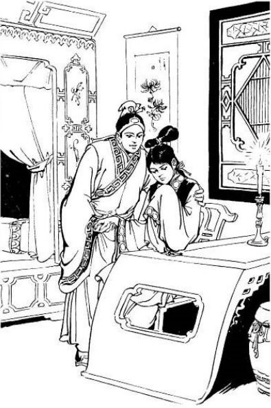
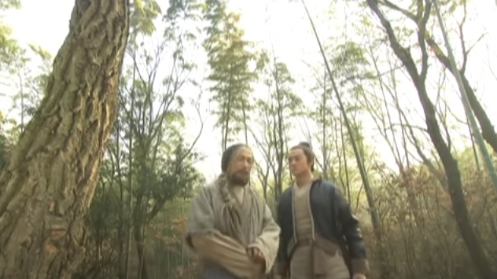
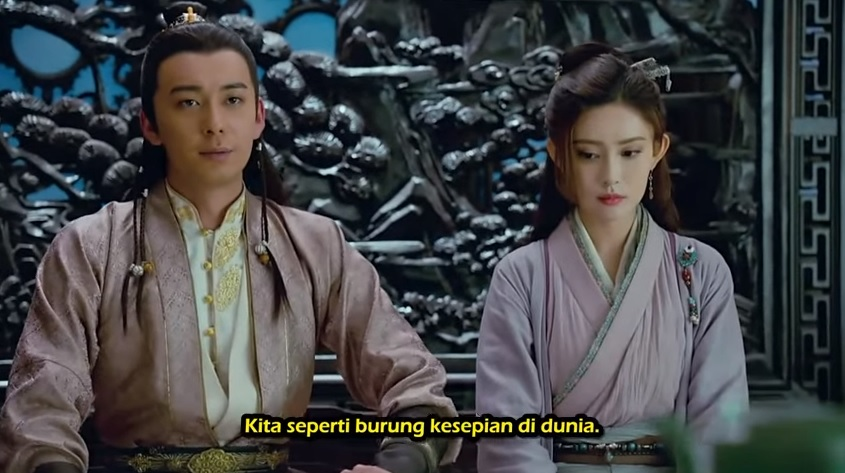

# Bab 12
## Kebanggaan Sang Naga

Huang Rong siap untuk memotong ayam itu ketika mereka mendengar suara dari arah belakang,
"Porsi ketiga. Aku mau pantatnya!"

Kedua anak muda itu melompat. Mana mungkin ada orang bisa mendekati mereka tanpa ketahuan?
Mereka berpaling dan melihat seorang pengemis, sudah tua tapi penuh tenaga. Orang itu berwajah
kotak, berjenggot dan gesit, tetapi agak gemuk. Pakaiannya penuh tambalan, tetapi sangat bersih.
Ia memegang sebatang tongkat hijau dengan sebelah tangannya, yang terbuat dari batu pualam bening
yang terlihat seperti bambu, dan ia juga memegang kantong arak merah yang besar. Ia kelihatan sangat
kepingin dan tidak sabaran, sehingga orang yang melihatnya akan punya kesan bahwa jika bagiannya
tidak diberikan, ia akan merebut dengan paksa! Sebelum kedua anak muda itu sempat menjawab, 
tanpa diundang ia duduk tepat di hadapan mereka. Ia mengambil kantong araknya, lalu membukanya, dan
aroma arak yang harum dengan segera memenuhi udara di sekitar mereka. Ia meneguk beberapa kali
seolah sangat haus, lalu menutup kantong itu. Ia berkata kepada Guo Jing, "Mau minum ya, anak muda?"

Guo Jing merasa bahwa orang itu agak kurang sopan, tapi ia bisa melihat bahwa dia bukan orang
sembarangan, jadi ia tidak berani kurang ajar. "Tidak, terima kasih," katanya sopan.
"Saat ini aku tidak ingin minum, tapi kalau kau mau minum, silakan saja."

"Dan kau, nona cilik?" tanya pengemis itu kepada Huang Rong. "Kau mau minum?"

Huang Rong menggelengkan kepalanya. Tiba-tiba ia melihat bahwa tangan yang memegang kantong
arak itu hanya memiliki empat jari, jari telunjuknya putus di ruas pertama. Ia terkejut dan teringat
akan pembicaraan antara para pendeta Tao dan Orang-orang Aneh yang didengarnya dari luar jendela
di penginapan pada hari itu. Saat itu mereka menyinggung sesuatu tentang Dewa Pengemis Sembilan Jari.
"Mungkinkah ini sebuah keberuntungan?" ia bertanya-tanya dalam hati. "Apa betul kita kebetulan
ketemu _Lao Qianbei_ itu? Coba kita selidiki dulu..." Mata si pengemis itu menatap lekat-lekat ke arah
ayam di tangannya, dan air liurnya seolah-olah menetes penuh harap. Huang Rong hampir tidak sanggup
menahan rasa gelinya. Ia lalu memotong ayam itu menjadi dua bagian, dan bagian ekornya diberikannya
kepada pengemis itu. Pancingannya mengena, pengemis itu merebutnya dan langsung menggigitnya bulat-bulat.
Sambil melahap pantat ayam, ia tak henti-hentinya memuji, "Wuah, enak! Enak! Bahkan aku, kepala semua pengemis,
tidak bisa bikin 'Ayam Pengemis' yang lebih enak dari ini!" Huang Rong tersenyum dan menawarkan sepotong lagi
untuknya.

"Wah, jangan," protesnya. "Kalian kan belum makan!" Tapi upaya sopan-santun itu sia-sia, kelihatannya juga hanya
basa-basi. Nyatanya ia segera merebut ayam yang disodorkan itu, dan dalam waktu singkat ayam itu hanya 
tinggal tulang.

Lalu ia menepuk-nepuk perutnya dan berseru, "Haduh, perut! Perut! Bukankah sudah lama kau tidak diisi ayam yang
seenak itu?"

Huang Rong tertawa terbahak-bahak, "Aku dengan sangat kebetulan memasak 'Ayam Pengemis', dan sekarang jadi
penghuni perut mulia Si Raja Pengemis! Betul-betul sebuah kehormatan!"

Pengemis itu juga tertawa terbahak-bahak, "Nona cilik, kau ini lumayan berani juga!" Ia mengeluarkan sebuah benda
yang kelihatannya seperti senjata rahasia terbuat dari emas dari sakunya. "Kemarin," jelasnya. "aku lihat ada orang-orang
yang bertengkar gara-gara sesuatu yang tidak jelas. Salah satunya melemparkan senjata rahasia yang berkilau seperti emas.
Aku yang beruntung, jadi kuambil beberapa batang. Sebetulnya bagian dalamnya cuma logam biasa, hanya supaya kelihatan
bagus bagian luarnya dilapisi emas. Nih, anak muda, ambil saja! Kalau perlu bisa dijual."

Guo Jing menggelengkan kepalanya, "Kami menganggap _Lao Qianbei_ sebagai teman. Kalau orang mengundang teman untuk
makan, ya tidak terima bayaran." Dengan berkata begitu, ia mengagungkan aturan sopan-santun bangsa Mongol.

Merasa ditolak, si pengemis itu menggaruk-garuk kepalanya. "Kalau seperti itu, aku jadi malu! Aku sama sekali 
tidak sulit mengemis sisa makanan dari orang. Tapi hari ini kalian memberiku ayam yang seenak itu. Keuntungan
seperti itu, aku tidak bisa membalas, ini..."

"Buat apa ngomong soal keuntungan dan membalas hanya untuk sepotong kecil ayam itu," kata Guo Jing. "Terus terang
saja, kami mencuri ayam itu..."

"Kami _mengambil_ ayam itu sambil lewat," tegas Huang Rong. "Dan kau juga _mengambil_ ayam itu sambil lewat.
Jadi impas."

Pengemis itu tertawa terbahak-bahak. "Kalian berdua," katanya. "lucu juga. Aku suka kalian berdua. Bagus,
bagus, kalau kalian punya keinginan, katakan saja." Guo Jing tahu bahwa ia sedang menawarkan untuk membantu
mereka, dan lagi-lagi itu melanggar aturan sopan-santun yang dikenalnya, jadi ia menggelengkan kepala.

Tapi Huang Rong ikut campur, "Sebetulnya, 'Ayam Pengemis' ini bukan sesuatu yang istimewa! Aku punya beberapa
macam masakan lagi yang siap untuk kau cicipi. Bagaimana kalau ikut kami saja?"

"Bagus sekali!" seru si pengemis, terpesona. "Bagus sekali!"

"Siapa nama _Qianbei_?" tanya Guo Jing.

"Margaku Hong," jawab pengemis itu. "Dan aku anak ke tujuh di keluargaku. Kalian anak-anak muda ini
boleh panggil aku Qigong[^qigong]."

"Ternyata _memang_ dia," pikir Huang Rong. "Dewa Pengemis Sembilan Jari! Tapi dia kelihatannya
lebih muda dari Pendeta Qiu, masa dia satu generasi dengan guru Tujuh Pendekar Quanzhen? Hm!
Sebetulnya ayahku juga tidak terlalu tua, biarpun begitu dia ternyata setingkat dengan Qigong!
Berarti Tujuh Pendekar Tao itu memang tidak becus, mereka hanya buang-buang waktu!" Ia memang selalu
tidak suka kepada Qiu Chuji karena memaksa Guo Jing untuk menikahi Mu Nianci.

Mereka pergi ke arah Selatan dan tiba di sebuah kota kecil, dan mereka memesan kamar di sebuah
penginapan. "Aku ke pasar dulu," kata Huang Rong. "Kalian berdua laki-laki, istirahat dulu sebentar."

"Dia... dia istri mudamu ya?" tanya Qigong kepada Guo Jing sambil tersenyum kecil sementara mengamati
gadis itu pergi. Muka pemuda itu memerah, ia tidak berani membantah atau mengiyakan. Qigong tertawa
terbahak-bahak, dan kemudian mulai tiduran di sebuah kursi. Lebih dari satu setengah jam kemudian, Huang Rong
akhirnya kembali dan sibuk di dapur. Guo Jing ingin membantunya tetapi gadis itu tertawa dan menutup
pintu. Satu setengah jam lewat lagi.

Qigong menguap, menggeliat, lalu menarik nafas dalam-dalam. "Baunya enak sekali," katanya. "Tapi makanan
apa ini? Ini agak aneh..." Ia menjulurkan lehernya mencoba mengintip melalui pintu dapur. Melihatnya
tidak sabaran dan begitu kepingin, Guo Jing diam-diam tertawa. Aroma lembut masakan tercium dari dapur,
tetapi Huang Rong masih belum kelihatan.

Qigong tak tahan lagi. Ia menggaruk-garuk kepalanya, menggosok-gosok pipinya, bangun dan duduk lagi, 
dan lagi, rasanya seakan-akan sedang berada di atas bara api. "Aku memang begini," katanya, mengaku kepada
Guo Jing. "Aku punya sifat rakus yang tidak menyenangkan. Kalau sudah kepingin makan, aku langsung
melupakan segala-galanya!" Ia membuka telapak tangannya untuk menunjukkan keempat jarinya. "Kata orang kuno,
telunjuk goyang-goyang[^shizhi]. Alangkah benarnya ucapan itu! Setiap kali aku melihat atau mencium bau
makanan yang _asli_ atau istimewa, telunjukku yang sebelah kanan gemetaran terus. Gara-gara itu, aku pernah 
mengacaukan satu urusan penting. Lalu aku jadi sangat marah, maka kuambil pisau, terus kupotong jari itu!"
Guo Jing terperanjat, sementara Qigong melanjutkan, "Tapi sayangnya sia-sia saja jariku hilang, karena
aku masih tetap rakus."

Saat itu Huang Rong muncul, tersenyum sambil membawa sebuah baki kayu besar yang diletakkannya
di atas meja. Di situ terdapat tiga mangkuk nasi, sebuah cawan arak, dan dua mangkuk besar berisi
hidangan utama. Guo Jing mencium aroma lezat yang sangat mengundang selera. Di salah satu mangkuk
terdapat sekumpulan sate daging berukuran besar. Terlepas dari aromanya, tidak tampak ada keistimewaan 
lainnya. Mangkuk lainnya berisi sup bening yang berwarna hijau seperti batu pualam, di atasnya 
terapung banyak buah ceri dan sepuluh kelopak bunga berwarna merah muda. Di bawahnya ada rebung 
muda yang masih segar. Perpaduan ketiga warna merah-putih-hijau itu sungguh enak dipandang. Indera 
penciuman jadi ikut serta karena sup itu mengeluarkan aroma bunga teratai yang lembut.

Hong Qigong tidak perlu diberi tahu dua kali! Tanpa perlu minum araknya, ia mengacung-acungkan
sumpitnya dan mengambil dua tusuk sate yang dimakannya dengan rakus. Kelezatan segera memenuhi
rongga mulutnya. Ini lebih dari sekedar daging sapi! Saat dikunyah, sensasi rasa yang berbeda-beda
menyerangnya. Kadang berminyak dan berair, di lain saat terasa segar. Aneka macam rasa saling mendahului
dalam rangkaian variasi kompleks dan tak terduga, mirip serangan dari seorang jago kungfu. Terkejut dan
girang, ia mengamati tusuk-tusuk sate itu dari jarak dekat, dan melihat masing-masing terdiri dari empat
macam bahan yang saling terkait dengan cara tertentu. Ia memejamkan matanya, mencoba
untuk menikmati semua rasa itu dengan lebih baik. "Hmm," katanya. "Ini ada daging paha kambing, lainnya
ada kuping babi yang dicelup susu, yang ketiga seperti ginjal anak sapi, yang satunya... yang satunya..."

"Kalau kau bisa menebak," kata Huang Rong menyeringai. "berarti kau memang luar biasa..."

Ia belum menyelesaikan kalimatnya ketika Qigong berseru, "Ini paha rusa dicampur daging kelinci!"

"Hebat!" sorak gadis itu. "Tepat sekali!"

Guo Jing betul-betul tercengang. "Membuat sate itu bukan pekerjaan mudah!" katanya kepada diri sendiri.
"Anehnya Qigong bisa membedakan lima rasa daging yang dicampur-campur itu!"

"Hanya ada lima jenis daging," lanjut Qigong. "tapi campuran daging babi dan kambing ini punya rasa
tertentu, daging rusa dan sapi lain lagi... di situ ada berapa banyak variasi, itu yang aku tidak tahu."

"Kalau urutan variasinya tidak dihitung," kata Huang Rong sambil tersenyum. "ada dua puluh lima variasi,
yang berhubungan dengan lima kali lima kelopak [bunga prem](#meihua). Sama seperti sate itu melambangkan
sebuah seruling, masakan ini juga punya nama — kita sebut saja 'Bunga Prem Jatuh Ke Alunan Seruling Giok'.
Variasi yang kau tanyakan tadi berarti ada semacam urutan penempatan untuk hasil ujian. Qigong, kau lulus
ujian, kau memang seorang ahli makanan!"

"Hebat!" kata pengemis itu kepada diri sendiri. Tak seorang pun tahu ia sebetulnya sedang memuji nama
makanan itu ataukah keahliannya sendiri dalam mengenali rasa. Lalu ia meletakkan dua buah ceri di
dalam sendok dan berkata sambil tertawa, "Sup daun teratai ini, dengan rebung dan ceri, sungguh sangat
cantik, orang jadi tidak tega memakannya!" Ia menelannya dan menjerit, "Ah!" Lalu ia bergumam kepada diri sendiri,
sambil terpana, "Eh?" Ia mengambil dua lagi, dan menjerit lagi, "Ah! Kesegaran daun teratai, rasa rebung,
manisnya ceri, semuanya melompat ke lidah kita, tapi masih ada lagi, buah ceri itu setelah dilubangi, pasti
diisi bahan lain..." Ia memejamkan matanya, berusaha merasakan lebih teliti.

"Ceri ini berisi," katanya ragu-ragu. "Apa isinya?" Ia memejamkan mata sekali lagi. "Ini daging burung!" gumamnya.
"Bukan... kalau bukan ayam hutan, maka ini daging burung perkutut! Ya ini _pasti_ daging burung perkutut!"

Ia membuka mata. Ketika melihat Huang Rong mengacungkan jempol, ia tak dapat menyembunyikan rasa bangganya
akan diri sendiri. "Jadi apa nama sup ini, yang berisi daun teratai, rebung, ceri dan burung perkutut?" tanyanya.

"Hong _Lao Qianbei_," kata Huang Rong. "kau belum menyebutkan nama satu bahan lagi."

"Ya?" ia terkejut, lalu memperhatikan sup itu lebih cermat. "Betul, masih ada kelopak bunga ini..."

"Tepat sekali!" tegas Huang Rong. "Kau bisa menebak apa kira-kira namanya dari kelima bahan ini?"

"Kalau ini sebuah teka-teki, aku mengaku kalah," katanya. "Cepat sebutkan apa namanya?"

"Kuberi petunjuk," kata Huang Rong. "Kau hanya perlu memikirkan [Kitab Kidung Pujian](#shijing)."

"Wah, tidak!" protes Qigong. "Aku tidak tahu apa-apa soal isi buku-buku semacam itu."

"Sekuntum bunga melambangkan kecantikan," jelas Huang Rong. "Dan buah ceri melambangkan mulut kecilnya,
betul tidak?"

"Ah, kalau begitu ini sup kecantikan!"

"Bukan," kata Huang Rong sambil menggelengkan kepalanya. "Bambu itu melambangkan kerendahan hati. Maka ini melambangkan
seorang pria sejati, seperti juga teratai adalah jenis bunga yang paling terkenal. Jadi bambu dan bunga itu berhubungan
sangat erat dengan seorang pria sejati."

"Oh," kata Qigong. "Berarti ini adalah 'Pria sejati dan Kecantikan'?"

"Nah, bagaimana dengan burung perkutut?" kata Huang Rong. "Sebenarnya, semuanya itu kembali lagi ke syair pertama
dalam Kitab Kidung Pujian, yang berakhir dengan 'Pria sejati itu sedang mencari teman baik'. Jadi sup ini bernama
Sup Mencari Kebaikan[^haoqiutang]."

Qigong tertawa terbahak-bahak. "Karena ada sup yang begini kompleks dan aneh, maka bagus juga kalau namanya
juga kompleks dan aneh. Bagus, bagus sekali! Kau sendiri juga seorang anak yang kompleks dan aneh, aku jadi
ingin tahu siapa itu orang yang kompleks dan aneh yang jadi ayahmu... Apa pun juga, pokoknya sup ini sungguh enak,
rasanya jauh lebih enak dari sup ceri yang pernah kumakan, kira-kira sepuluh tahun yang lalu, di istana."

"Kau menyelinap ke dapur istana?" tanya Huang Rong. "Coba ceritakan tentang semua makanannya, aku akan
mencoba memasak sesuatu yang akan kau sukai."

Qigong sedang menikmati sup dan tidak punya waktu untuk menjawab. Ia baru berhenti ketika mangkuk
itu kering. "Di dapur istana," jelasnya. "jelas banyak makanan enak, tapi kurasa tidak ada yang bisa
dibandingkan dengan dua macam masakanmu ini... Ah, kalau memang ada, ya itu 'Lima Cita Rasa Bebek Mandarin'.
Itu memang enak, tapi aku tidak tahu bagaimana membuatnya."

"Dan Kaisar yang mengundangmu?" tanya Guo Jing.

"Sudah pasti," kata Qigong sambil tertawa. "Kaisar yang mentraktir aku, tapi dia sendiri tidak tahu!
Aku bersembunyi di balik balok besar di dapur istana selama tiga bulan dan mencicipi semua makanan
yang dibuat untuk Kaisar. Kalau kupikir enak, ya kusimpan untuk diriku sendiri, kalau tidak ya kuberikan
kepada Kaisar! Semua koki percaya bahwa di situ banyak hantunya!"

"Orang ini betul-betul keterlaluan rakusnya," pikir Guo Jing dan Huang Rong. "Tapi dia juga sangat berani!"

"Anak muda," kata Qigong sambil tertawa. "pacar cilikmu ini sungguh juru masak terbaik di dunia. 
Kebahagiaanmu terjamin! Astaga! Kenapa aku tidak ketemu wanita seperti ini ketika aku masih muda?" 
Ia tampak sangat menyesal. Huang Rong dengan sedikit senyuman menyiapkan sisa makanan untuk 
Guo Jing dan dirinya sendiri. Satu mangkuk nasi sudah lebih dari cukup untuknya, sedangkan 
pemuda itu menyisihkan empat mangkuk besar. Cara menata makanan yang indah untuk dia kelihatannya
tidak banyak berpengaruh.

Qigong menggelengkan kepalanya sambil menghela nafas. "Seperti banteng sedang mengunyah peoni. Sayang,
sayang sekali!" Huang Rong menutup mulutnya dengan tangan untuk menahan tawa.

"Banteng — masa mereka suka peoni?" tanya Guo Jing kepada diri sendiri. "Banyak banteng di Mongolia,
tapi di situ tidak ada peoni. Sebetulnya aku tidak pernah melihat ada banteng makan peoni. Tapi kenapa
dia terus-terusan bilang 'Sayang'?"

Qigong menepuk-nepuk perutnya sendiri dan berkata, "Bagus. Kalian berdua pasti bisa kungfu, soal itu aku
bisa melihatnya. Si Cilik ini rela menyibukkan diri memasak makanan enak untuk aku, sudah pasti dia ingin
sesuatu, dan kelihatannya, ingin belajar kungfu dari aku. Betul kan? Bagus, aku tahu setelah makan enak
rasanya tidak masuk akal kalau aku pergi begitu saja tanpa memberi imbalan. Ayo, ayo sini!" Ia mengambil
kantung arak dan tongkat bambunya, lalu keluar.

Guo Jing dan Huang Rong mengikutinya sampai mereka tiba di luar kota. "Nah, apa yang ingin kau
pelajari?" Qigong mendesak Guo Jing.

"Ilmu silat kan banyak macamnya," pikir Guo Jing. "Kalau aku ingin belajar sesuatu, apa dia yakin
bisa mengajariku?"

Sementara Guo Jing termenung, Huang Rong mulai bicara, "Qigong, kungfunya kalah dari aku, karena itu dia 
seringkali marah setiap kali berusaha mengungguli aku."

"Kapan aku marah?" protes Guo Jing. Huang Rong memberi isyarat supaya ia diam.

"Yang kulihat adalah," kata Hong Qigong sambil tertawa. "Semua gerakannya itu mantap dan meyakinkan, artinya
dia punya dasar _neigong_ yang kuat. Mana mungkin dia kalah darimu? Bagaimana kalau kalian coba adu kekuatan?"

Huang Rong minggir beberapa langkah dan berseru, "Jing Gege, ayo mulai!" Guo Jing ragu-ragu.

"Kalau kau tidak mau menunjukkan kemampuanmu," kata Huang Rong. "bagaimana _Lao Qianbei_ akan 
memperbaiki kesalahanmu? Siap!" Ia melompat ke arah Guo Jing dan menyerang dengan telapak tangan.
Guo Jing menangkis, tetapi ia sudah mengubah taktik dan menendang.

"Bagus, _Xiao Yatou_ (nona cilik)!" kata Qigong. "Itu langkah cantik!"

"Kau harus serius," kata Huang Rong dengan suara rendah.

Guo Jing berkonsentrasi dan dengan cermat melakukan jurus Pegunungan Selatan yang diajarkan
oleh  Nan Xiren. Huang Rong bertahan dengan gesit, melompat lurus ke atas dan ke belakang.
Lalu tiba-tiba ia mengubah tekmik dan melakukan jurus Dewa Pedang Pulau Bunga Persik ciptaan
ayahnya. Jurus tangan kosong ini seperti namanya 'Dewa Pedang', diambil dari ilmu pedang.
Ia menggerakkan tangannya ke semua arah, lawannya dikelilingi oleh bayangan tangan, tidak dapat
memastikan mana yang tipuan dan mana yang asli. Seolah-olah ada hembusan angin kuat di hutan itu yang
merontokkan ribuan bunga. Keindahan gerakan itu terletak pada keringanan dan aura keanggunannya,
sedemikian rupa sehingga Huang Rong tampak seperti kupu-kupu yang sedang terbang. Karena tenaga
dalamnya kurang kuat, serangannya tidak sekuat dan sekejam seharusnya. Hal ini menjadi tidak terlalu
berarti, karena Guo Jing yang terpana akan banyaknya bayangan di depan matanya telah kehilangan 
akal bagaimana seharusnya mempertahankan diri. Dalam hitungan detik, ia menerima pukulan di kedua bahunya,
dada dan punggung. Ia tidak terluka karena Huang Rong tidak menyerang dengan sepenuh tenaga. Huang Rong
melangkah mundur sambil tersenyum.

"Bagus, Rong'Er!" seru Guo Jing dengan kagum. "Pertunjukan kungfu tangan kosongmu sungguh indah!"

"Ayahmu hebat," kata Hong Qigong dengan nada dingin. "Untuk apa kau menyuruhku mengajar anak bodoh ini?"

Huang Rong terkejut. "Menurut ayahku," pikirnya. "Sejak ia menciptakan kungfu Dewa Pedang Pulau Bunga Persik
ini, ia sendiri pun tidak pernah menggunakannya, bagaimana mungkin Hong _Lao Qianbei_ mengenalinya?" Ia mendesak,
"Qigong, kau kenal ayahku?"

"Sudah pasti, dia Si Sesat Timur, aku Pengemis Utara. Masa kami tidak pernah mengadu ilmu silat?"

"Ia bertarung dengan ayahku," pikir Huang Rong. "Dan masih bisa selamat. Itu sungguh mencengangkan.
Sekarang aku mengerti bagaimana Pengemis Utara bisa disetarakan dengan Si Sesat Timur!"

"Dan bagaimana kau mengenali aku?" desaknya lagi.

"Cobalah berkaca!" jawab Hong Qigong. "Hidung dan matamu, mirip tidak dengan ayahmu? Pertama-tama aku
tidak memikirkannya, kupikir mukamu hanya agak _familiar_, tapi pameranmu barusan membongkar semuanya!
Kau kira aku tidak kenal kungfu Pulau Persik? Meskipun aku tidak pernah melihat jurus ini, tapi aku
berani jamin, orang sepintar ayahmu pasti bisa menciptakannya. Hei, hei... dan lagi, nama dua masakanmu
itu apa? 'Bunga Prem Jatuh Dalam Alunan Seruling Giok', dan 'Sup Teman Baik', tak diragukan lagi, itu
hasil karya ayahmu."

"Kau sungguh bisa membaca pikiran," kata Huang Rong sambil tertawa. "Lalu, menurutmu, ayahku sangat kuat ya?"

"Tentu saja dia kuat," kata Qigong dengan dingin. "Tapi dia bukan yang terkuat di dunia!"

"Lalu, sudah pasti _kau_ yang terkuat di dunia?" seru Huang Rong memuji.

"Tidak juga," kata Qigong. "Dua puluh tahun yang lalu, kami berlima, Si Sesat Timur, Racun Barat, Pengemis Utara,
Kaisar Selatan dan Dewa Pusat, bertemu di Puncak Hua Shan untuk mengadu ilmu. Pertandingan itu berlangsung tujuh
hari tujuh malam. Akhirnya, Dewa Pusat membuktikan diri sebagai yang terkuat, dan kami semua senang melihatnya."

"Lalu siapa si 'Dewa Pusat' ini?" tanya Huang Rong.

"Ayahmu tidak pernah memberitahumu?"

"Tidak, kata ayah di dunia persilatan ada lebih banyak kejahatan daripada kebaikan. Jadi tidak ada gunanya 
seorang perempuan dari keluarga baik-baik mendengarkan semua itu. Dia memarahi aku dengan sangat kasar, dia
tidak lagi menyayangi aku, makanya aku melarikan diri. Dia tidak mau berurusan denganku lagi..." Dengan muka
sedih ia menundukkan kepalanya.

"Monster tua itu," maki Qigong. "Apa..."

"Jangan menghina ayahku!" seru Huang Rong.

"Sayangnya aku selalu miskin!" seru Qigong sambil tertawa. "Jadi tidak ada orang mau menikah denganku. Kalau tidak,
maka aku akan punya anak yang sebaik kau, dan tidak akan pernah kutinggalkan!"

"Sudah pasti," kata Huang Rong, tertawa. "Kalau aku pergi, siapa yang akan memasak untukmu!"

"Cukup adil," kata Qigong sambil menghela nafas. "Yah, untuk menjawab pertanyaanmu, Dewa Pusat adalah pendiri
Perguruan Quanzhen, Wang Chongyang. Tapi sejak kematiannya, sangat sulit untuk menentukan siapa yang terbaik
di dunia persilatan!"

"Perguruan Quanzhen?" kata Huang Rong. "Di situ ada pendeta yang benama Qiu, lainnya bernama Wang,
lalu yang lain lagi Ma. Mereka semuanya Pendeta Tao hidung kerbau[^niubi]. Kurasa kungfu mereka
agak payah! Kalau mereka bertarung, kalau bukan keracunan ya pasti cedera dalam dua atau tiga jurus."

"Oh ya? Mereka tak diragukan lagi adalah murid-murid Wang Chongyang. Kelihatannya di antara semua muridnya,
Qiu Chuji adalah yang paling kuat... Tapi, sudah pasti mereka tidak akan bisa menandingi paman guru mereka,
Zhou Botong." Ketika mendengar nama ini, Huang Rong terkejut. Ia bermaksud mengatakan sesuatu, lalu berhenti
sendiri.

Guo Jing yang cukup puas mendengarkan pembicaraan mereka tiba-tiba menyela, "Itu benar, Ma Dao Zhang
bilang mereka punya seorang paman guru, tapi dia tidak menyinggung siapa nama pendeta Tao ini."

"Zhou Botong _bukan_ penganut Tao," sahut Hong Qigong. "Ia orang awam, yang diajar langsung oleh kakak
seperguruannya, Wang Chongyang — eh, anak bodoh, kau kelihatannya agak canggung! Apa ayah mertuamu, yang 
begitu baik dan pintar itu, sungguh menghargaimu?" Guo Jing, yang tidak merasa punya ayah mertua, tergagap,
ia tidak tahu bagaimana harus menanggapi.

"Ayahku belum ketemu dia," kata Huang Rong sambil tersenyum. "Kalau kau baik hati dan sudi memberikan
petunjuk, maka ayahku akan sedikit menghargai dia."

"Bajingan cilik," gerutu Qigong. "bahkan sepersepuluh kungfu ayahnya pun belum becus, tapi sudah mewarisi
segala akal bulus dan kepintarannya! Tidak usah menjilat, aku tidak suka pujianmu! Lagipula, aku tidak 
pernah punya murid! Siapa mau murid goblok begitu? Kau suruh aku mengajari suami cilikmu! Bah, pengemis
tua ini tidak mau ditipu!"

Huang Rong menundukkan kepala, mukanya merah. Ia tidak pernah berniat belajar kungfu. Ayahnya sendiri
sangat tangguh, tapi ia tak pernah serius belajar dari ayahnya, mengapa ia harus belajar dari Qigong?
Tapi kungfu Guo Jing tidak cukup bagus, dan keenam gurunya menganggapnya _Xiao Yaonu_ (Penyihir Perempuan Cilik),
jadi ia senang bisa bertemu dengan seorang ahli seperti Qigong. Ia berharap orang tua itu akan mewariskan
sedikit ilmunya kepada kekasihnya, jadi Guo Jing tidak perlu takut di hadapan guru-gurunya dan juga 
Qiu Chuji dengan semua jajaran pendeta Tao itu, seperti tikus bertemu kucing. Qigong sangat rakus dan
suka bercanda, tetapi ia tidak bodoh. Ternyata selama ini Qigong sudah mengendus maksudnya.

Sambil bergumam sendiri, pengemis tua itu pergi tanpa menoleh sedikit pun ke belakang. Kedua anak muda
itu berdiri diam lama sekali.

"Rong'Er," kata Guo Jing, akhirnya. "_Lao Qianbei_ itu punya sifat yang sangat unik!" Huang Rong mendengar 
suara berdesir di antara dedaunan, di atas mereka, dan menyadari bahwa Qigong telah mengambil jalan melingkar
untuk kembali ke situ secara diam-diam, ke atas pohon.

"Dia orang baik," katanya kemudian. "Dan kungfunya jauh lebih kuat dari ayahku."

"Dia belum menunjukkan ilmunya," kata Guo Jing dengan suara keras, ia bertanya-tanya. "Kau tahu dari mana?"

"Ayahku yang bilang."

"Tepatnya dia bilang apa?"

"Dia bilang, di dunia sekarang ini, hanya ada satu orang yang bisa mengalahkannya, dan itu adalah
Si Dewa Pengemis Sembilan Jari, Hong Qigong. Untungnya, karena _Lao Qianbei_ itu selalu bertualang,
maka mereka jarang ketemu untuk duel."

Kenyataannya, setelah ia pergi, Qigong menggunakan ilmu meringankan tubuhnya yang luar biasa itu
dan kembali ke atas pohon, jauh di atas kepala kedua anak muda itu. Ia ingin mendengarkan pembicaraan
mereka dan meyakinkan diri bahwa mereka bukan dikirim oleh Huang Yaoshi untuk mencuri ilmunya. Ocehan
Huang Rong membuatnya bangga. "Jadi Huang Yaoshi tidak pernah mau mengakui keunggulanku," pikirnya.
"Tapi dalam hati bagaimana pun juga dia tetap mengagumi aku!" Padahal semuanya itu hanya karangan 
Huang Rong.

"Aku tidak belajar apa pun yang hebat dari ayahku," lanjut Huang Rong. "Tapi itu semuanya salahku.
Aku terlalu suka bersenang-senang dan tidak pernah berminat belajar. Beruntung bisa ketemu Hong Lao Qianbei
dan kalau dia mau mengajariku, pasti akan jauh lebih baik daripada belajar dari ayahku. Sayangnya aku
menyinggung perasaannya, meskipun aku tidak bermaksud begitu." Lalu ia mulai terisak. Mula-mula ia hanya
berpura-pura, dan Guo Jing berusaha menghiburnya. Lalu ia memikirkan kematian ibunya, kekerasan ayahnya,
dan mulai sungguh-sungguh menangis. Qigong yang di atas pohon hampir yakin.

"Kudengar ayahku bilang," lanjut Huang Rong sambil terisak-isak. "bahwa Hong Lao Qianbei punya ilmu 
luar biasa yang belum ada tandingannya, bahkan Wang Chongyang juga segan. Disebut... disebut... apa ya?
Aku lupa... Lagipula sudah di ujung mulut selama ini, aku sebetulnya ingin mohon supaya dia mau mengajarimu,
itu disebut..." Sebetulnya ia sama sekali tak tahu ilmu apa itu, jadi hanya mengoceh bertele-tele.

Mendengarnya ragu-ragu, seperti berusaha menemukan nama yang tidak juga ketemu, Qigong tidak tahan
lagi dan berteriak sambil melompat turun dari atas pohon itu. "Itu disebut 
Delapan Belas Jurus Penakluk Naga![^xiang-long-shiba-zhang]"

Guo Jing dan Huang Rong melompat kaget, yang satu sungguh-sungguh kaget, lainnya hanya pura-pura.

"Ah, Hong Lao Qianbei," seru Huang Rong. "Bagaimana kau bisa di atas pohon? Terbang ya? Ya betul, itu
Delapan Belas Jurus Penakluk Naga! Tepat sekali! Bagaimana aku bisa lupa? Ayahku bilang kungfu yang paling
dikaguminya di dunia ini adalah Delapan Belas Jurus Penakluk Naga!"

Qigong sangat senang. "Kalau begitu ayahmu mengerti kebenaran! Aku percaya setelah Wang Chongyang meninggal,
dia menganggap dirinya yang paling kuat di dunia ini!" Ia berbalik ke arah Guo Jing. "Sebetulnya kungfumu
tidak kalah dengan pacar kecilmu ini. Masalahnya hanya jurus tangan kosongmu itu sama sekali tidak tepat
sasaran." Ia berpaling lagi kepada Huang Rong dan memerintah, "Yatou[^yatou], kau kembali ke penginapan!"

Huang Rong menyadari bahwa ia akan memberi pelajaran kepada Guo Jing, maka ia pun pergi dengan puas.
Qigong berkata dengan serius kepada Guo Jing, "Kau berlutut dan berjanji, bahwa tanpa seijinku kau tidak 
akan meneruskan kungfuku kepada siapa pun juga, termasuk perempuan kecilmu itu!"

Guo Jing sangat malu. "Kalau Rong'Er memaksa, lalu bagaimana aku harus menolak?" pikirnya. Ia berkata, "Qianbei,
aku tidak mau belajar darimu. Memangnya kenapa kalau kungfunya lebih bagus dari aku?"

"Dan kenapa tidak mau?" tanya Hong Qigong.

"Kalau dia menyuruhku mengajarinya, aku tidak bisa menolak tanpa menyinggung perasaannya, dan aku tidak bisa
menerima tanpa menyinggung perasaanmu."

"Meskipun pikiranmu sangat sederhana," kata Hong Qigong sambil tertawa. "Kau punya hati yang baik, dan kau
bicara langsung. Itu bagus. Baiklah, aku akan mengajarimu satu pukulan yang disebut Naga Angkuh Punya Penyelasan[^kanglongyouhui].
Aku membayangkan bahwa meskipun Huang Youshi sangat ingin meniru ilmuku, tapi dia terlalu bangga akan dirinya sendiri,
jadi dia tidak akan melakukannya. Dalam banyak hal ilmu kami berbeda sama sekali. Aku tidak bisa belajar ilmunya,
dan dia juga tidak bisa belajar ilmuku..." Sambil berkata begitu ia menekuk lutut kirinya, berputar dan meluruskan
lengannya, membuat lingkaran dengan tangan yang di atas dan mendorong keluar dengan sebelah tangan lainnya. Telapak
tangannya menyentuh pohon pinus besar, dan 'Kreekkk', pohon itu patah! Guo Jing berdiri terpaku, ia terkejut melihat
kekuatan pukulan itu.

"Pohon ini tidak bisa bergerak," kata Qigong. "Kalau ini manusia, jelas dia akan mencoba menghindar, kesulitan
dari teknik ini adalah menyerang dengan tepat sehingga lawan bagaimana pun juga tidak bisa menghindarinya, dan
juga harus kuat, maka begitu pukulanmu mendarat, 'krekkk', lawan langsung roboh seperti pinus ini!" Ia mengulangi
peragaan itu dua kali, lalu menjelaskan secara rinci bagaimana memusatkan dan mengerahkan tenaga dalam. Itu
hanya satu pukulan, tetapi [pelajaran pertama](#pelajaran-pertama) itu memakan waktu lebih dari satu jam. 

Guo Jing tidak pintar, akan tetapi ia punya dasar tenaga dalam yang bagus. Mempelajari  kungfu semacam ini, yang
terdiri dari rangkaian gerakan sederhana, tetapi membutuhkan tenaga yang kuat, sangat cocok baginya. Ia berlatih
dengan cermat, dan dua jam kemudian ia sudah menguasai sebagian besar teknik ini.

"Gerakan Si Cilik itu," kata Hong Qigong. "lebih banyak tipuan daripada serangan yang sesungguhnya. Kalau kau
mencoba mengikutinya, ia akan berputar-putar di sekelilingmu seolah-olah kau seekor keledai dungu, dan kau akan
selalu kalah. Kau tidak akan pernah bisa secepat dia. Kalau kau pikir setelah sekian banyak serangan tipuan, maka
selanjutnya pasti yang sebenarnya, tapi ternyata tidak, selanjutnya tetap akan _palsu_. Nah setelah itu kau mengira
serangan berikutnya palsu lagi, tapi ternyata dia akan mengirimkan pukulan yang serius, dan kau langsung dalam bahaya!"
Guo Jing mengangguk setuju.

"Karena itu, untuk mengatasi dia cara yang paling cerdik adalah, kita tidak mau tahu apakah serangan itu
tipuan atau bukan. Begitu dia menyerang, kau dengan segera mengirimkan Kang Long You Hui yang kau pelajari ini.
Berhadapan dengan kekuatan seranganmu, ia akan terpaksa mundur dan bertahan, dengan begitu segala tipuannya
akan seperti jatuh ke dalam air."

"Dan selanjutnya?" tanya Guo Jing.

"Apa maksudmu 'selanjutnya'?" sahut Hong Qigong. "Dasar goblok! Kau kira dia mampu bertahan terhadap pukulan
yang kuajarkan barusan?"

"Tapi kalau dia tidak mampu bertahan," kata Guo Jing, kuatir. "bukankah dia bisa terluka?"

Qigong menggelengkan kepalanya dan menghela nafas. "Jika orang hanya mengirimkan pukulan sepenuh tenaga dan 
tidak bisa menyerang secara terukur. Jika orang tidak dapat mengendalikan berat-ringan kekuatannya, kekerasan
atau kelembutannya, bagaimana orang dapat menganggap dirinya _menguasai_ Delapan Belas Jurus Penakluk Naga?"

Guo Jing sungguh ingin menyetujui hal itu, tetapi ia lalu mengambil keputusan berdasarkan dalam hati, "Karena
aku belum bisa mengendalikan tenaga pukulanku dengan sempurna, maka aku tidak akan bertarung dengan Rong'Er!"

"Kau tidak percaya?" kata Hong Qigong. "Nah, kalau begitu cobalah sendiri!"

Guo Jing mengambil posisi, menirukan gaya Hong Qigong. Ia memilih sebatang pohon pinus yang agak ramping, lalu
memukulnya dengan keras. Pohon itu bergetar, tetapi sama sekali tidak patah, apalagi roboh.

"Dasar tolol," kata Qigong. "Buat apa kau mengguncangkan pohon ini? Mau menangkap tupai atau menjatuhkan biji
pinus?" Muka Guo Jing memerah karena malu, ia tertawa dengan lagak menyangkal, tak tahu bagaimana harus menjawab.

"Tadi sudah kuberi contoh," kata Hong Qigong lagi. "Kita perlu menempatkan lawan sedemikian rupa, supaya dia tidak
bisa mundur atau melarikan diri. Pukulanmu barusan sebenarnya sudah cukup kuat, tapi pohon pinus ini hanya perlu
goyang-goyang sedikit, dan dia jadi tidak kena sepenuh tenaga. Yang penting di sini adalah, kau harus belajar
pendekatan yang benar, dan memukul sedemikian rupa sehingga si pohon tidak bisa bergerak, supaya kau bisa langsung
mematahkannya."

Penjelasan ini mencerahkan Guo Jing, "Kalau begitu," katanya dengan gembira. "serangan itu harus sangat cepat,
dan dikirim sedemikian rupa, sehingga lawan tidak sempat bertahan."

Qigong menatapnya dengan muram, "Itu sudah pasti. Kau sudah sangat lama berusaha sampai berdarah-darah, hanya
untuk memahami prinsip _ini_? Wah, orang betul-betul bisa bilang kau ini _tidak pintar_. Karena pukulan ini
dikenal sebagai 'Naga Angkuh Punya Penyesalan' — intinya bukan pada kata 'Angkuh', tapi justru pada kata 
'Penyesalan' itu. Kalau orang berkonsentrasi pada kekerasan murni — tenaga kasar — maka sedikit otot sudah
cukup. Kalau itu benar, bagaimana jurus ini bisa dikagumi Huang Yaoshi? Ini seperti ungkapan kuno, 'Naga
yang angkuh itu sendiri menyesal, kelebihannya tidak akan bertahan lama'. Itu alasannya kalau ada pengiriman, 
harus selalu ada yang dipertahankan. Kalau kau mengirim sepuluh tenaga, penting untuk mempertahankan dua puluh
tenaga di dalam dirimu. Pada hari ketika kau sungguh _tahu_ bagaimana menghargai konsep tentang 'Penyesalan',
maka kau akan bisa bilang bahwa kau sudah memahami tiga puluh persen dari jurus ini. Seperti arak tua yang bagus,
perlu waktu untuk matang. Mula-mula rasanya memang tidak terlalu kuat, tetapi setelah matang, akan sungguh-sungguh
menyuguhkan rasa yang memabukkan. Itu menjelaskan arti kata 'Penyesalan'."

Guo Jing tidak mengerti apa-apa tentang masalah ini, tetapi ia mencoba menghafalnya untuk merenungkannya nanti. 
Untuk belajar kungfu, ia selalu memakai metode yang sama, 'Kalau orang lain bisa mencernanya di pagi hari, 
aku sepuluh hari!' Kemudian ia berkonsentrasi mempelajari pukulan itu. Awalnya, pohon pinus itu menyerap setiap 
pukulan yang diterimanya. Menjelang akhir, pukulan ini menjadi semakin kuat, tetapi pohon itu semakin tidak berguncang. 
Ia menyadari bahwa ia telah maju dan agak senang. Telapak tangannya menjadi merah dan bengkak, tetapi ia 
tidak mengobatinya dan terus berlatih dengan tekad bulat, tidak pernah santai.

Hong Qigong yang awalnya tertawa melihat kegigihannya, sudah berbaring di tanah dan mendengkur pulas. Guo Jing
merasa jauh lebih nyaman setelah ia berhasil menguasai tenaganya — untuk mengirim serangan dan mempertahankannya.
Ia memusatkan tenaga ke arah titik 'Dan Tian', ia mendorong telapak tangannya ke depan dengan keras, lalu dengan
segera menariknya, begitu bagus sehingga pohon itu tidak bergerak sama sekali. Dengan senang pemuda itu mengulangi
cara yang sama, sambil mengumpulkan tenaga di ujung telapak tangannya. Ia mendengar suara 'kreekk!', dan pohon
pinus kecil itu patah.

"Bagus!" jerit Huang Rong yng melihat dari kejauhan. Ia pelan-pelan mendekat sambil membawa keranjang belanjaan yang
berat.

Bahkan sebelum membuka mata, Hong Qigong sudah mencium aroma lezat dari makanan yang dibawanya. "Baunya enak! 
Baunya sangat enak!” teriaknya, melompat berdiri. Ia merebut keranjang dari tangan gadis itu dan membuka tutupnya. 
Ia melihat sepiring paha kodok panggang, bebek yang sangat gemuk cocok untuk Delapan Harta Karun[^babao], dan 
semangkuk besar mie. Dengan girang ia menerkam makanan itu, terus memuji sambil melahapnya. Tapi karena mulutnya 
penuh, orang tidak mengerti apapun yang dikatakannya. Dalam sekejap mangkuk berisi paha kodok dan bebek itu 
licin bersih. Menyadari bahwa Guo Jing belum makan, pengemis tua itu merasa agak malu. "Ayo, makanlah," katanya.
"mie ini lumayan..." Dan karena merasa sangat tidak enak, ia menambahkan, "Mie ini bahkan lebih enak daripada bebek!"

Huang Rong tertawa dan berkata, "Hong Lao Qianbei masih belum mencicipi masakanku yang terbaik."

Saking terkejut dan girangnya, pengemis tua itu langsung bertanya, "Masakan apa? Masakan apa lagi?"

"Kau tidak mungkin menyebutkan semuanya," kata Huang Rong. "Misalnya, tumis kol, tahu kukus, telur rebus,
irisan daging..."

Sebagai _ahli makan_ yang berpengetahuan luas, Hong Qigong tahu persis bahwa seorang juru masak sejati baru akan
menunjukkan bakatnya dalam menghidangkan masakan yang paling sederhana. Seperti juga dalam seni bela diri, 
cara yang sangat menakjubkan dalam melakukan gerakan paling sederhana menunjukkan ciri khas seorang pendekar
kelas atas. Kata-kata Huang Rong tadi membuatnya begitu senang, sehingga ekspresi mukanya hampir-hampir memohon.
"Bagus, bagus," katanya. "Aku selalu bilang kau ini si cilik yang berani. Jadi kau mau supaya aku yang beli kol 
dan tahu ya?"

"Buang-buang waktumu," kata Huang Rong sambil tertawa. "Apa yang kau beli juga belum tentu cocok."

"Cukup adil," kata Hong Qigong. "Hanya kau sendiri yang bisa memilih semua bahanmu."

"Barusan," kata Huang Rong. "Kulihat dia mematahkan pohon pinus. Dia sudah lebih kuat dari aku."

"Wah, sama sekali tidak," protes Qigong. "Bocah ini jauh dari sasaran. Batang pohon itu seharusnya terpotong rapi.
Coba kau lihat, semuanya bengkok-bengkok seperti mata gergaji, kasar sekali. Kungfunya sungguh payah! Selain itu,
pohon ini sangat kurus, mirip tongkat — bukan, malah mirip tusuk gigi! Anak ini jauh sekali dari sasaran!"

"Tapi kalau dia menyerangku dengan jurus ini, aku tidak akan bisa membela diri," bantah Huang Rong. "Ini semuanya
salahmu! Lain kali kalau dia menggangguku, bagaimana aku bisa melawan?"

Hong Qigong yang ingin supaya dia kembali bersikap normal, tidak ingin mengganggunya lebih jauh, ia bisa melihat
kelicikan bocah kecil itu. "Jadi menurutmu aku harus bagaimana?"

"Ajari aku sesuatu yang bisa mengalahkannya. Setelah itu aku akan memasak untukmu."

"Baiklah, kita sepakat," kata Qigong. “Dia hanya belajar satu jurus, mudah untuk mengalahkannya. Aku akan mengajarimu
teknik _melarikan diri_ yang disebut Xiao Yao You[^xiao-yao-you] untuk mengatasi ini." Tidak lama setelah selesai berbicara, 
ia bangkit untuk memperagakannya. Ia melompat ke kanan dan ke kiri, dengan anggun dan gesit, sementara lengan 
bajunya yang besar berkibar.

Huang Rong cepat belajar, diam-diam mengingat setiap gerakan. Ketika orang tua itu menyelesaikan rangkaiannya, ia sudah 
setengah mempelajarinya. Setelah ia memberikan semua instruksi tambahan, tidak butuh lebih dari dua jam bagi gadis itu 
untuk melakukan dengan sempurna tiga puluh enam gerakan _Xiao You You_ itu. Akhirnya ia melakukan gerakan itu 
bersama-sama Hong Qigong. Mereka bergerak bersama dan melompat bersamaan, yang satu ke kanan, yang lain ke kiri, 
berputar-putar seperti burung layang-layang giok dan meluncur seperti elang besar di langit. Pada akhir dari 
tiga puluh enam gerakan, mereka mendarat dengan kaki mereka pada waktu yang bersamaan. Sambil saling memandang, 
mereka tertawa terbahak-bahak dan Guo Jing bertepuk tangan dengan penuh semangat.

"Si kecil ini seratus kali lebih pintar dari kau," kata Hong Qigong kepada Guo Jing.

"Gerakan dan variasinya begitu banyak," kata Guo Jing kagum sambil menggaruk kepalanya. "Bagaimana dia bisa belajar secepat 
itu? Dan bagaimana dia bisa tidak lupa? Aku, waktu belajar gerakan kedua, aku sudah lupa yang pertama!"

Qigong tertawa terbahak-bahak, "Memang kau benar-benar tidak bisa mempelajari Xiao Yao You ini! Bahkan jika kau hafal 
langkah-langkahnya, dalam prakteknya kau tidak punya semangat untuk melangkah seperti itu! Kau akan melakukannya dengan 
susah payah dan kikuk, belajar teknik ini akan menjadi beban berat bagimu!”

"Kau benar!" Guo Jing dengan tertawa mengakui.

"Xiao Yao You ini," kata Hong Qigong, "kupelajari waktu aku masih muda. Aku ajarkan kepada si kecil ini karena jurus itu 
pasti akan memperkuat gaya kungfu dia. Sebetulnya ini tidak cocok dengan gaya kungfuku saat ini, makanya aku tidak lagi
menggunakannya selama sepuluh tahun terakhir." Yang ingin dikatakannya adalah bahwa Xiao Yao You sebetulnya jauh lebih
lemah ketimbang Delapan Belas Jurus Penakluk Naga.

Huang Rong sangat senang. "Hong Lao Qianbei, kalau kalah lagi, pasti dia tidak senang. Tolong ajari dia beberapa jurus lain." 
Ia sendiri tidak punya niat untuk belajar, dan itu hanya dalih untuk mendorong pengemis tua itu untuk memberi lebih banyak 
pelajaran pada kekasihnya. Jika benar-benar ingin belajar kungfu, ia memiliki seorang guru besar hebat dalam diri ayahnya, 
yang keterampilannya tidak akan pernah bisa ia pelajari sepenuhnya.

"Bocah bodoh ini," kata Hong Qigong. "Dia bahkan belum sepenuhnya mencerna satu pukulan yang kuajarkan. Dia menggigit lebih 
dari yang bisa dia kunyah! Selama kau menyiapkan banyak makanan untukku, aku akan mengabulkan semua keinginanmu!"

"Ya sudah," kata Huang Rong sambil tersenyum. "Aku ke pasar dulu." Hong Qigong tertawa terbahak-bahak dan kembali ke
penginapan, meninggalkan Guo Jing sendirian di hutan pinus, di mana ia kembali berlatih dengan tekun dan gigih sampai
jauh malam.

Malam itu, Huang Rong memang menyiapkan sepiring kol dan sepiring penuh tahu untuk Qigong. Ia dengan hati-hati memilih 
kol yang paling empuk, lalu menggorengnya dengan minyak ayam dan suwiran kaki bebek. Tapi sepiring penuh tahu itu 
benar-benar luar biasa – ia memotong ham menjadi dua dan kemudian membuat dua puluh empat rongga bulat kecil di mana 
ia meletakkan bola-bola tahu, sebelum menutup ham dan mulai mengukusnya. Di akhir proses memasak, rasa ham sudah meresap
ke dalam tahu, sedangkan hamnya sendiri tidak ada. Setelah mencicipi hidangan ini, Hong Qigong tentu saja kegirangan. 
Tahu kukus ini punya nama yang terinspirasi oleh puisi Tang dan disebut [Malam Bulan Purnama di Dua Puluh Empat Jembatan]. 

[Malam Bulan Purnama di Dua Puluh Empat Jembatan]: #libai-dufu "Ini mengacu pada puisi yang dibuat selama dinasti Tang (618-907 M). Penyair paling terkenal di zaman itu adalah Li Bai (kadang-kadang dikenal sebagai Li Po) dan Du Fu."

Jika gadis itu tidak punya ilmu keluarga yang disebut Menyaring Inti Bunga Anggrek, sepuluh jarinya yang gesit dan halus 
akan tidak mampu memotong tahu yang rapuh menjadi dua puluh empat bola kecil . Untuk melakukannya dibutuhkan kehalusan 
yang sama besarnya dengan mengukir karakter di atas sebutir beras atau mengukir gambar kapal di atas kulit kacang. Memotong 
tahu menjadi kotak-kotak memang mudah, tetapi mana ada bulan purnama berbentuk persegi?

Setelah makan malam, masing-masing pergi tidur. Hong Qigong heran melihat Guo Jing dan Huang Rong pergi ke kamar yang 
terpisah. "Hah? Bukankah kalian suami istri? Kenapa kau tidak tidur di kamar yang sama?"

Huang Rong, yang bercanda dengannya tanpa ragu, merasa malu. Pipinya memerah dan terlihat kesal ia berkata, "Qianbei, 
kalau kau terus omong kosong, aku tidak mau masak besok!"

"Apa?" Hong heran. "Kapan aku omong kosong?" Setelah merenung sejenak, ia menyadari, "Aku memang sudah tua dan pikun," 
katanya sambil tertawa. "Kau jelas berpakaian seperti seorang gadis dan bukan seorang istri. Karena itu kalian bertunangan
secara diam-diam, tanpa persetujuan orang tua, atau mak comblang, atau upacara perkawinan. Jangan kuatir, aku akan 
menjadi perantaramu. Jika ayahmu tidak menerima, aku akan menantangnya untuk berduel dan kita akan bertarung — astaga — 
selama tujuh hari tujuh malam jika perlu, sampai dia menyerah!"

Huang Rong justru kuatir akan masalah ini, dan dia takut ayahnya tidak akan menyukai Guo Jing. Kata-kata pengemis tua 
itu membuatnya gembira dan ia kembali ke kamarnya, wajahnya berseri-seri.

Keesokan harinya, Guo Jing kembali ke hutan pinus saat fajar. Ia berlatih sekitar dua puluh putaran dengan banyak 
keringat dan bersukacita atas kemajuan yang dicapainya. Tiba-tiba ia mendengar suara berbicara di antara pepohonan.

"Shifu," sebuah suara berkata, "kita pasti sudah jalan lebih dari tiga puluh li kali ini, kan?"

"Memang," jawab suara lain, "kemajuanmu dalam ketahanan sudah lumayan..."

Suara ini terasa sangat akrab bagi Guo Jing, yang kemudian melihat empat orang muncul, yang pertama berambut putih dan 
kulit kemerahan. Itu tidak lain adalah musuh nomor satunya, Liang Ziweng, Si Dewa Ginseng! Ia diam-diam menggigil 
dan melangkah pergi. Tapi Liang Ziweng sudah mengenalinya. "Kau pikir mau kemana?" serunya sambil melompat ke depan 
untuk mengejar. Tiga pria lainnya adalah muridnya. Melihat guru mereka mengejar musuh, mereka berpencar untuk 
mengepung pemuda itu.

"Amannya, aku harus keluar dari hutan pinus dan kembali ke penginapan," kata Guo Jing pada dirinya sendiri, sambil 
berlari lebih cepat lagi. Tapi murid pertama Liang Ziweng menghalangi jalannya dan berteriak, sambil menyilangkan 
kedua telapak tangannya, "Bajingan kecil, berlutut!"

Ia menyerang dengan teknik _qinna_ (tangkap dan kendalikan) yang diajarkan oleh gurunya dan berusaha untuk mencengkeram 
dada Guo Jing. Pemuda itu menekuk kaki kirinya sedikit, dengan tangan terentang ke dalam dia membuat lingkaran dengan 
telapak tangan kanannya dan menyerang dengan kuat. Pukulan yang baru saja dia pelajari, Naga Angkuh Punya Penyesalan. 
Lawannya merasakan tenaga yang tiba-tiba menerpa dan berusaha untuk menghindarinya, tetapi tenaga itu sangat kuat 
sehingga mematahkan lengannya dan melemparkannya sejauh 1 zhang (sekitar 3,3m) atau lebih, membuatnya kehilangan 
kesadaran. Guo Jing tidak pernah percaya bahwa pukulannya akan sekuat itu, tetapi tidak bisa menunggu lebih lama,
dan melanjutkan pelariannya.

Terkejut dan kesal, Liang Ziweng melompat ke hadapannya. Guo Jing baru saja meninggalkan pohon pinus ketika ia menemukan
Si Dewa Ginseng di depannya. Sangat ketakutan, ia mengambil posisi dan meluncurkan sekali lagi jurus Naga Angkuh Punya
Penyesalan yang baru dipelajarinya. Liang Ziweng tidak mengenal jurus ini, tetapi setelah merasakan kekuatannya, ia 
tahu bahwa ia tidak dapat menanganinya. Ia harus berguling ke tanah untuk menghindarinya. Guo Jing mengambil 
kesempatan untuk melarikan diri lagi.

Saat Liang Ziwong pulih, pemuda itu sudah sampai di depan penginapan. Guo Jing berteriak, "Rong'Er, celaka! Itu 
si jahat yang mau minum darahku!"

Huang Rong menjulurkan kepalanya ke luar jendela. "Bagaimana tua bangka itu bisa ada di sini?" ia bertanya pada 
dirinya sendiri. "Tidak apa-apa. Aku akan mencoba _Xiao Yao You_ baru ini." Ia berseru, "Jing ge ge, jangan takut 
dengan tua bangka itu. Hadapi saja. Aku akan datang untuk membantumu, dan kita akan memberinya pelajaran yang bagus!"

"Rong'er tidak tahu kekuatan monster tua ini," kata Guo Jing pada dirinya sendiri. "itu sebabnya ia berbicara  
seenaknya." Tapi Liang Ziweng sudah melompatinya. Dalam menghadapi kekerasan serangan itu, pemuda itu tidak punya 
pilihan lain selain meluncurkan sekali lagi Naga Angkuh Punya Penyesalan. Liang Ziweng berputar dan mengelak beberapa 
kaki ke samping, tetapi lengannya yang terulur hampir tersentuh oleh kekuatan telapak tangan dan meninggalkan rasa 
terbakar dan menyakitkan. Dewa Ginseng itu diam-diam ketakutan, kagum bahwa anak ini dalam waktu beberapa bulan 
telah berkembang pesat. "Ini pasti," pikirnya, "karena darah ular yang mahal itu." Pikiran ini menguasainya, dan 
ia melompat lagi untuk menyerang. Guo Jing membela diri lagi dengan pukulan yang sama. Sadar bahwa ia tidak mampu 
melawan, Liang Ziweng mundur. Memperhatikan bahwa anak muda itu tampaknya tidak punya pukulan menakutkan lainnya 
untuk mengunggulinya, ketakutan Liang berkurang. "[Shazi]," teriaknya. "Kau _cuma_ bisa satu pukulan itu ya?"

[Shazi]: #shazi "Anak bodoh"

Guo Jing masuk tepat ke dalam perangkapnya, "Bahkan dengan satu pukulan ini," jawabnya. "Kau tetap tidak akan bisa 
menghindarinya!" Ia maju, dan meluncurkan sekali lagi Kang Long You Hui. Liang Ziweng mengelak dan melompat ke 
belakang Guo Jing untuk menyerangnya. Ia berbalik dan berusaha menyerang lagi dengan cara yang sama, tetapi 
lawannya sekali lagi menyelinap di belakangnya. Pemuda itu, yang hanya tahu bagaimana melakukan serangan frontal, 
benar-benar terganggu dan tidak bisa menghadapinya.

Melihatnya di ambang kekalahan, Huang Rong berseru, "Jing ge ge, biar yang aku melawannya!" Ia melompat ke depan 
dan menempatkan diri di antara kedua orang itu, menyerang Liang Ziweng dengan telapak tangan dan tendangannya. 
Lian Ziweng membalas serangan itu. Guo Jing mundur dua langkah untuk mengawasi mereka. Huang Rong telah mempelajari 
dengan baik teknik Xiao Yao You yang luar biasa itu, tetapi selain fakta bahwa ia sudah mempelajarinya, terlalu dini 
untuk sungguh-sungguh menguasainya. Liang Ziweng sebenarnya jauh lebih kuat dari dia. Oleh karena itu, tanpa 
perlindungan yang diberikan oleh rompi kulitnya, ia pasti sudah terkena beberapa pukulan dan pasti sudah lama terluka. 
Bahkan sebelum mengerahkan tiga puluh enam gerakan penuh dari Xiao Yao You, ia sudah kehilangan akal. Murid-murid 
Liang Ziweng, sambil mendukung kakak seperguruan mereka yang terluka, mengamati pertarungan tersebut dan melihat 
guru mereka menang, terus bersorak untuk memberikan semangat kepadanya.

***

**Last**.

Guo Jing bersiap untuk membantu Huang Rong ketika tiba-tiba Hong Qigong terdengar berteriak dari balik jendela, "Pukulan berikutnya disebut 'Anjing Jahat Menghalangi Jalan'!"

Sangat terkejut, Huang Rong mengamati bahwa Liang Ziwong, kaki terbentang dengan kuat dalam 'Sikap Kuda' dan tinjunya direntangkan secara horizontal, memang mengambil sikap 'Si Harimau Jahat Menghalangi Jalan'. Dia tidak bisa menahan diri untuk tidak tertawa di dalam. "Hong mengubah nama pukulan ini, tapi bagaimana dia bisa menebak bahwa itu akan menjadi yang itu?"

***

  <h3>Daftar Istilah</h3>
  <dl>
    <dt id="meihua">Mei Hua</dt>
    <dd>
        Bunga <em>prem</em>, atau Mei Hua (梅花) berasal dari sebelah selatan Sungai Yangtze. Kalau sudah matang,
        daging buahnya akan berwarna kuning, kulit buahnya yang hijau juga akan semakin menguning seiring dengan tingkat kematangannya. Terkadang ada yang bersemu merah. Tanaman ini memang dibudidayakan untuk diambil bunga dan buahnya. Di jaman modern ini kita biasa menikmatinya sebagai <em>manisan</em>, yang umumnya disertakan dalam sebuah <em>parcel</em> untuk menyambut Tahun Baru Imlek.
    </dd>
    <dt id="shijing">Shi Jing</dt>
    <dd>Shi Jing (诗經) adalah buku yang berisi kumpulan sajak, syair atau puisi, yang adalah bagian dari Si Shu Wu Jing 
    (四書五經, Empat Kitab dan Lima Pelajaran Klasik — Four Books and Five Classics. Ini semua adalah mata pelajaran 
    <em>wajib</em> bagi semua pelajar di jaman itu. Empat Pelajaran Klasik lainnya adalah:
      <ol>
        <li>Yi Jing (易經, Kitab Perubahan), yang juga sering ditulis I Ching menurut sistem <em>romanisasi</em> lain. Ini sering disebutkan dalam semua cerita silat.</li>
        <li>Shu Jing (書經, <em>Books of Documents</em> atau Kitab Sejarah)</li>
        <li>Li Ji (禮記, Kitab Ritual)</li>
        <li>Chun Qiu (春秋, Kitab Sejarah Musim Semi dan Musim Gugur). Ini menceritakan tentang Dinasti Zhou yang mulai
        terpecah dalam era di mana Konfusius hidup dan berkarya.</li>
      </ol>
    Dan Empat 'Buku' yang dimaksud adalah:
    <ol>
      <li>Da Xue (Tradisional: 大學, Disederhanakan: 大学, secara literal bermakna 'Pelajaran Besar' atau *Great Learning*).
      Pelajaran ini diambil dari sebuah bagian dalam Li Ji (Kitab Ritual), yang adalah salah satu dari Lima Pelajaran Klasik.</li>
      <li>Zhong Yong (中庸, Doctrine of Mean, atau Pengajaran Tentang Makna). Pelajaran ini adalah <em>pusat dari doktrin Konfusianisme</em>, atau Ajaran Konfusius.</li>
      <li>Lun Yu (论语, Analects of Confusius atau disingkat Analects, atau Pemikiran Konfusius). Pelajaran ini berisi
      kutipan kata-kata yang pernah diucapkan oleh Konfusius semasa hidupnya.</li>
      <li>Meng Zi (孟子, atau Mencius), berisi pokok-pokok ajaran Mensius, yang sudah dianggap sebagai penerus ajaran Konfusius, dan bahkan mengembangkannya ke arah yang berbeda. Sangat berbeda dengan Lun Yu yang cukup singkat dan padat, ajaran Mensius dipenuhi dialog dan prosa yang panjang.</li>
    </ol>
    </dd>
  <dt id="niubi">Niu Bi</dt>
    <dd>Niu Bi (牛鼻), makna literalnya adalah 'Hidung Kerbau'. Sebenarnya ini adalah salah satu kata-kata kasar yang
    dipakai untuk memaki seseorang — kira-kira setara dengan 'brengsek', 'kurang ajar', 'bajingan', dsb.
    </dd>
  </dl>

***

  

    
  

  

    

      
<em>
      "Meskipun pikiranmu sangat sederhana," kata Hong Qigong sambil tertawa. "Kau punya hati yang baik, dan kau
      bicara langsung. Itu bagus. Baiklah, aku akan mengajarimu satu pukulan yang disebut Naga Angkuh Punya Penyesalan."
      </em>

    

  

***

  

    
  

  

    
<em>
      Wajah Mu Nianci memerah, ia meronta sedikit, tetapi tidak melepaskan tangannya,
      membiarkan Wanyan Kang memegang tangannya. Kepalanya makin tertunduk
    </em>

  

  <a href="https://youtube.com/clip/UgkxOdvTKvPbGCzbi2fD0hOUW4JNa7r6yiCL" target="_blank">
    Ilustrasi video dari versi 2003</a> ini agak lebih akurat, meskipun dari sisi gambar tentu saja 
    kalah dibandingkan versi 2017 di atas.

[^qigong]: Karakter Qī (七) artinya adalah 'tujuh', sedangkan Gong (公) bermakna 'pria'. Nama Hong Qigong itu sendiri artinya secara literal adalah 'Anak ketujuh dari keluarga Hong, yang adalah seorang laki-laki'. Perhatikan bahwa ini tidak sama dengan 'Anak laki-laki ketujuh keluarga Hong'.

[^shizhi]: Istilah bahasa mandarin untuk jari telunjuk adalah Shi Zhi (食指), di mana karakter Shi adalah 'makanan' sedangkan Zhi adalah 'jari'. Dengan demikian bisa diterjemahkan secara literal menjadi 'Jari Makanan'.

[^haoqiutang]: Hao Qiu Tang (好求汤, Sup Mencari Kebaikan, Good Seeking Soup).

[^kanglongyouhui]: Empat karakter Kang Long You Hui (康龙有悔), punya arti literal masing-masing: 'Kang' yang paling umum dipakai untuk melengkapi istilah 'Sehat', seperti dalam Jian Kang (健康), tetapi juga bisa berarti 'Damai' atau 'Peaceful', makna inilah yang dipakai dalam konteks tersebut. Seekor Naga yang merasa dirinya tinggi akan bersikap sombong, tetapi karena menyesalinya maka ia akan merasa damai. Berikutnya 'Long' berarti 'Naga', 'You' bisa diartikan 'ada', atau 'punya'. 'Hui' di sini diambil dari Houhui 后悔 (menyesal). Demi mempertahankan estetika, saya menerjemahkan semuanya menjadi '**Naga Angkuh Punya Penyesalan**'.

[^yatou]: Ya Tou (丫头) adalah istilah yang dipakai untuk memanggil anak perempuan, selain itu juga biasa dipakai untuk pembantu perempuan.

[^xiang-long-shiba-zhang]: Xiang Long Shiba Zhang (降龙十八掌, **18 Jurus Penakluk Naga**). Ilmu ini adalah ciri khas dari Hong Qigong, dan sejauh ini hanya dia sendiri yang menguasainya.

[^babao]: **Delapan Harta Karun** (八宝, atau Ba Bao), adalah delapan simbol yang seringkali dilukiskan dalam karya-karya seni Tiongkok kuno, termasuk dalam uang logam. Penjelasannya bisa dibaca pada [daftar berikut](#delapan-harta-karun "Daftar Delapan Harta Karun").

##### Delapan Harta Karun
1. Bao Zhu (宝珠), mutiara yang menyala. Melambangkan terkabulnya sebuah harapan.
2. Fang Sheng (方胜), melambangkan kebahagiaan perkawinan dan menangkal pengaruh jahat. Simbol ini biasanya terlihat 
dalam upacara perkawinan, sebagai 'Double Happiness' (双喜, Shuangxi). Karakter kedua (喜) biasanya akan dicetak dua kali,
maka menjadi (囍). Istilah bahasa Inggris lainnya yang sering dipakai adalah 'Double Lozenges'.
3. Qing (磬), atau 'Musical Stone', melambangkan kehidupan yang adil dan benar.
4. Sepasang Cula Badak, atau Xijiao (犀角). Melambangkan kebahagiaan.
5. Sepasang koin, atau Shuang Qian (双钱), melambangkan kemakmuran.
6. Batangan emas atau perak, Ding (锭).
7. Shanhu (珊瑚), atau batu karang (Coral).
8. Ruyi (如意), semacam tongkat kerajaan yang melambangkan harapan.

[^xiao-yao-you]: **Xiao Yao You** (逍遥游). Karakter pertama dan kedua jika digabungkan akan bermakna _carefree_, atau 'bebas'. Tetapi bisa juga diartikan 'riang'. Sedangkan karakter ketiga 'You' (游) punya makna literal '_traveling_', atau bisa kita terjemahkan secara bebas menjadi berjalan-jalan. Istilah ini kurang lebih bermakna 'Berjalan-jalan Dengan Bebas dan Riang Gembira'. Karena terlalu panjang dan dari segi estetika tidak enak dibaca maupun diucapkan, maka saya membiarkannya seperti itu. (Terjemahan bahasa Inggris dari fans menerjemahkannya menjadi 'Wandering Strides', yang saya kira agak kurang sesuai).

