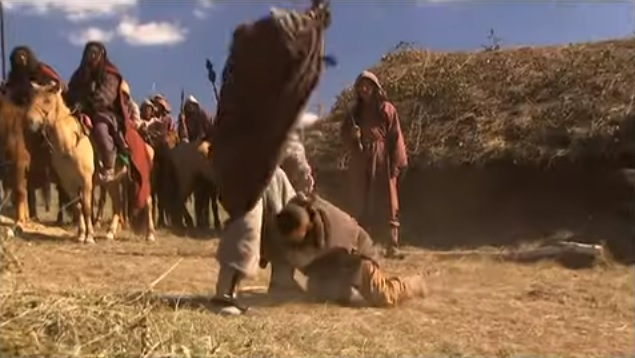
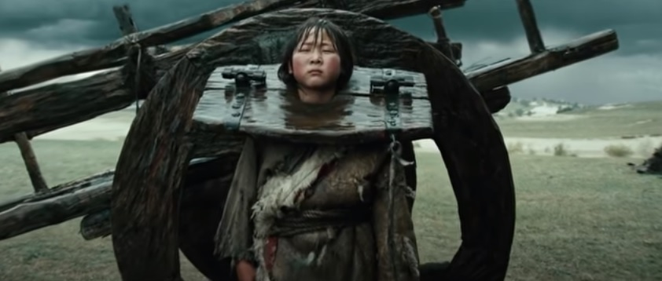
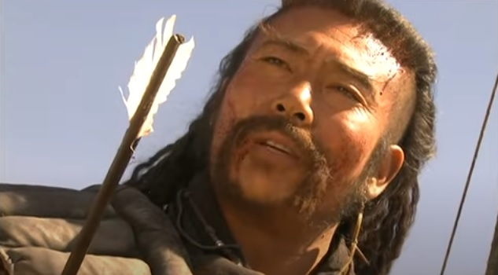
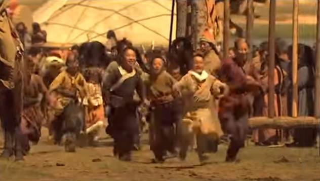

# Kehidupan Padang Rumput

  
  

    
Ilustrasi Video Bab 3

  

Para biksu menangisi kematian Biksu Jiaomu, tetapi beberapa orang dari mereka 
masih sempat merawat orang-orang yang terluka dengan membalut luka mereka dan membawa mereka 
ke kamar tamu. Tiba-tiba terdengar suara gedoran yang tak henti-hentinya dari tong di bawah 
lonceng besar itu. Tidak tahu monster macam apa yang hadir, para biarawan saling 
memandang dengan wajah kosong. Tidak tahu apa yang harus dilakukan mulai melantunkan 
'Sutra Raja Agung' (Gao Wang Jing). Tapi gedoran berlanjut mengikuti semua nyanyian 
'Bantu Para Penderita' dan 'Amitoufo'. Akhirnya, sekitar selusin biksu yang lebih 
berani menarik lonceng besar itu kembali dengan tali besar yang tebal. Segera setelah 
mereka mengangkat tong, segumpal besar daging keluar dari bawahnya. Takut melampaui 
kata-kata, para biarawan berpencar. Bakso daging raksasa itu tiba-tiba berdiri, 
ternyata adalah Han Baoju. Dikurung selama paruh terakhir pertarungan, ia tidak tahu 
apa yang telah terjadi. Melihat sekeliling, ia melihat Biksu Jiaomu meninggal dan 
semua saudara angkatnya terluka parah dan panik. Ia berjalan ke arah Qiu Chuji dan 
hendak memukul kepalanya dengan 'Cambuk Naga Emas'.

"San Ge, jangan!" teriak Quan Jinfa.

"Kenapa?" tanya Han Baoju, heran.

"Pokoknya jangan," kata Quan Jinfa, hanya itu yang bisa keluar dari multunya, karena
perutnya sakit.

Meski kedua kakinya terluka, pikiran Ke Zhen'E masih bekerja dengan baik. Ia mengeluarkan 
penawar racunnya dan menginstruksikan para biksu untuk memberikan dosis yang tepat 
untuk Qiu Chuji dan Han Xiaoying, sambil menjelaskan apa yang terjadi kepada Han Baoju. 
Marah, Han Baoju hendak mengejar Duan Tiande, tapi Ke Zhen'E berteriak, "Kita akan 
menemukan bajingan itu cepat atau lambat. Pertama-tama bantu saudara-saudaramu yang 
menderita luka dalam."

Baik Zhu Cong dan Nan Xiren menderita luka dalam yang parah dan tendangan ke perut 
Quan Jinfa itu juga pukulan yang cukup keras. Tulang leher Zhang Ahsheng patah dan 
dadanya juga dipukul, membuatnya pingsan untuk sementara. Begitu bangun, ternyata 
ia tidak dalam bahaya besar. Ia segera mulai membantu orang lain di kuil.

Para biksu dari Biara Fahua mengirim beberapa utusan untuk melaporkan kejadian 
tersebut kepada Kepala Biara Kumu di Biara Yunlou dan juga mulai mengatur pemakaman 
untuk Biksu Jiaomu.

Setelah beberapa hari, racun di tubuh Qiu Chuji dan Han Xiaoying ternetralisir. 
Sebagai ahli pengobatan, Qiu Chuji segera mencampur beberapa jenis herbal dan merawat 
Zhu Cong dan lainnya serta memijat dan memperbaiki letak tulang dan sendir kembali ke 
tempatnya. Untungnya, dasar kungfu mereka semua cukup kuat sehingga luka dalam maupun 
luar tidak terlalu serius. Setelah beberapa hari lagi, semua orang bisa duduk lagi.
Suatu hari, mereka semua berkumpul di salah satu kamar biksu dan merenungkan bagaimana
mereka diadu domba, mengakibatkan kematian Biksu Jiaomu dan melukai semua pihak. 
Semuanya terdiam, tidak tahu harus bilang apa.

Setelah beberapa saat, akhirnya Han Xiaoying memecahkan keheningan, "Semua orang tahu 
tentang kecerdasan dan kecerdasan Qiu Dao Zhang (Pendeta Qiu), dan kami bertujuh juga 
bukan baru kemarin mengenal dunia. Tapi ternyata kita semua dimanipulasi oleh seorang
bajingan kecil. Kalau cerita ini sampai didengar orang luar, semua orang di dunia 
persilatan akan menertawakan kita. Dao Zhang, punya ide bagaimana cara membereskan 
kekacauan ini?"

Qiu Chuji menyalahkan dirinya sendiri selama beberapa hari terakhir, berpikir bahwa 
jika saja ia duduk dan berbicara dengan tenang dengan Biksu Jiaomu maka semua ini 
dapat dihindari. Jadi, dengan rasa hormat, ia menoleh ke Ke Zhen'E, "Ke Xiong, 
bagaimana menurutmu?"

Temperamen Ke Zhen'E dari awal memang buruk. Setelah matanya dibutakan, jadi lebih 
buruk. Fakta bahwa Qiu Chuji sendirian menjatuhkan gabungan dari bereka bertujuh, 
pada kenyataannya adalah sesuatu yang dianggapnya sebagai salah satu hal yang paling 
memalukan dalam hidupnya. Ditambah dengan fakta bahwa rasa sakit di kakinya akibat 
luka pedang masih berdenyut, ia hampir tidak bisa menahan amarahnya. Ia mencibir 
dan menjawab, "Qiu Dao Zhang menggunakan ilmu pedangnya untuk menjatuhkan siapa pun 
yang menghalangi jalannya dan tidak pernah menghormati siapa pun. Kenapa konsultasi
dengan kami tentang masalah ini?”

Qiu Chuji terkejut sesaat, tetapi segera menyadari bahwa ia masih marah tentang 
masalah itu. Ia berdiri, merangkapkan kedua tangannya, dan membungkuk pada Tujuh Orang Aneh.
"Aku salah. Aku terlalu kasar dan keras kepala. Seluruh masalah ini sepenuhnya salahku 
dan aku minta maaf kepada kalian semua."

Zhu Cong dan lainnya membalas sikap itu. Ke Zhen'E pura-pura tidak memperhatikan 
dan dengan dingin menjawab, "Aku katakan kami bertujuh telah kehilangan semua hak 
kami untuk ikut campur dalam urusan dunia persilatan. Kita harus menetap di sini, 
memancing, memotong kayu, atau apapun. Selama Qiu Dao Zhang tidak datang lagi, 
setidaknya kita bisa menghabiskan sisa hidup kita dengan damai."

Qiu Chuji agak tersipu mendengan kalimat tajam itu. Setelah diam sejenak, ia tiba-tiba 
berdiri dan berkata, "Karena aku salah kali ini, aku tidak akan pernah berani 
melangkah ke daerah ini lagi. Soal membalas kematian Biksu Jiaomu, semuanya akan 
jatuh di pundakku dan aku akan membunuh bajingan itu dengan tanganku sendiri dan 
membalaskan dendamnya. Setelah mengatakan semua yang perlu kukatakan, sekarang 
saatnya aku pergi." Ia membungkuk ke arah semua orang lagi dan berjalan keluar.

"Tunggu." kata Ke Zhen'E.

Qiu Chuji berbalik dan berkata, "Ke Da Ge masih ingin bicara?"

"Kau sudah melukai kami semua," kata Ke Zhen'E. "dan sekarang kau berharap bisa cuci tangan
hanya dengan beberapa patah kata?"

"Lalu Ke Da Ge maunya bagaimana, selama masih dalam batas yang bisa kukerjakan,
aku pasti akan berusaha melakukannya."

"Pokoknya ini tidak bisa dibiarkan begitu saja," kata Ke Zhen'E lagi. "alangkah baiknya
kalau Dao Zhang bisa memberikan yang lebih baik."

Meskipun Tujuh Orang Aneh semuanya adalah individu yang sangat saleh dan bermoral,
tapi mereka juga sangat bangga dan bertingkah sangat eksentrik, membuat mereka 
layak mendapatkan gelar "Tujuh Orang Aneh". Masing-masing adalah ahli kungfu dan 
mereka selalu bekerja sama, jadi mereka tidak pernah kalah dalam pergulatan dengan 
orang lain di dunia persilatan. Beberapa tahun yang lalu mereka bertengkar dengan 
Kelompok Huaiyang. Tujuh dari mereka membunuh lebih dari seratus atau lebih anggota
Kelompok Huaiyang di tepi Sungai Yangtze. Saat itu Han Xiaoying masih anak-anak, 
tapi dia masih berhasil membunuh dua musuh. Nama 'Tujuh Orang Aneh Dari Selatan' 
menjadi terkenal di seluruh dunia persilatan. Kekalahan di tangan Qiu Chuji tidak 
berakibat baik bagi satu pun dari mereka. Tambahkan fakta bahwa Biksu Jiaomu, teman 
baik Orang Aneh, meninggal, orang bisa berdebat bahwa itu terjadi akibat kecerobohan Qiu Chuji. 
Tapi masih ada fakta bahwa seorang wanita _memang_ disembunyikan di dalam kuil dan 
dia _adalah_ janda Guo Xiaotian, seperti yang diklaim oleh Qiu Chuji. Hal ini membuat 
sebagian Orang Aneh merasa bersalah. Kendatipun begitu, pada saat ini, para Orang Aneh 
telah melupakannya.

"Aku terluka oleh senjatamu." kata Qiu Chuji. "Dan kalau bukan karena pemunah racun
dari Ke Da Ge, maka aku pasti sudah lama mati. Jadi dalam pertarungan ini, dengan setulus
hati aku mengaku kalah."

"Kalau begitu," kata Ke Zhen'E. "tinggalkan pedangmu, dan kau boleh pergi." Dia tahu
jelas bahwa jika kedua belah pihak bertarung lagi saat ini hanya Han bersaudara 
yang bisa melawan, dan kemenangan bagi pihaknya tidak mungkin terjadi. Tapi semua 
Orang Aneh lebih baik mati daripada membiarkan masalah ini berlalu begitu saja.

Ini membuat Qiu Chuji sangat marah. "Aku sudah sangat memberi muka kepada kalian,
dan seharusnya sudah cukup. Aku juga sudah mengaku kalah, kalian mau apa lagi?
Pedang ini untuk melindungi diri," ia melanjutkan, "seperti tongkat yang selalu
dibawa Ke Da Ge kemana-mana."

"Kau menertawakan aku buta ya?" Ke Zhen'E balas berseru, gusar.

"Bu gan (不敢, tidak berani)!"

"Saat ini kami semua terluka," lanjut Ke Zhen'E. "sangat berat kalau mau bertarung.
Jadi aku mengundang Qiu Dao Zhang untuk duel satu tahun dari saat ini, di
Paviliun Dewa Mabuk."

Qiu Chuji mengerutkan keningnya mendengar ucapan itu. Dia berpikir, "Karena Tujuh 
Orang Aneh bukan orang jahat, tidak ada gunanya menyimpan dendam ini di antara kita. 
Sehari setelah Biksu Jiaomu meninggal, Han Baoju bisa saja membunuhku dengan mudah 
begitu dia keluar dari kurungan lonceng itu. Selain itu, semua masalah ini kurang 
lebih disebabkan oleh kecerobohanku sendiri. Pria sejati tahu apa yang benar dan 
salah. Jika dia salah maka dia harus mengakuinya. Menyelesaikan semua ini dengan 
Orang-orang Aneh rasanya tidak akan mudah." Setelah berpikir sejenak dalam hati, 
tiba-tiba sebuah ide muncul di benaknya, "Kalau kau benar-benar ingin menentukan 
siapa yang lebih baik di antara kita, maka kita bisa melakukannya," katanya. "Tapi 
hanya menurut aturan yang aku tentukan. Kalau tidak, aku sudah kalah dari 
Zhu Daxia di Paviliun Dewa Mabuk, dan aku kalah lagi bertarung di sini di kuil. 
Aku sudah kalah dua kali dan pasti akan kalah untuk ketiga kalinya juga, tidak ada 
gunanya melangkah lebih jauh."

Han Baoju, Han Xiaoying, dan Zhang Ahsheng segera berdiri, empat lainnya tidak 
dapat berdiri tetapi semuanya sebisa mungkin duduk. Mereka menjawab serempak, 
"Kalau Tujuh Orang Aneh dari Jiangnan (江南, Selatan Sungai Yangtze) berduel, kami selalu membiarkan lawan yang 
memilih waktu, tempat, dan metode."

Melihat betapa kompetitifnya mereka semua, Qiu Chuji tersenyum, "Berartim bagaimanapun
juga, aku yang menentukan metodenya, gitu kan?"

Mengira bahwa tipuan licik macam apapun yang ada di benak Qiu Chuji, bukan berarti
mereka pasti akan kalah, Zhu Cong dan Quan Jinfa menjawab serempak, "Betul!"

"Omongan seorang pria..." jawab Qiu Chuji.

"... tidak bisa ditarik kembali oleh kuda liar!" lanjut Han Xiaoying, tapi Ke Zhen'E
diam saja.

  

  Kata-kata Qiu Chuji yang disambung oleh Han Xiaoying di atas adalah sebuah peribahasa
  dalam masyarakat Tionghoa, yang artinya kurang lebih adalah 'Janji tidak boleh dibatalkan',
  kalau seseorang mengucapkan kalimat ini, artinya adalah ia akan memenuhi janjinya.
  

"Kalau kalian merasa caraku tidak adil," lanjut Qiu Chuji, "maka aku akan mengaku kalah
sekarang juga." Ia jelas sedang menarik keuntungan dengan sedikit mengalah di depan,
karena ia tahu bahwa Ketujuh Orang Aneh itu tidak akan membiarkannya mengaku kalah
begitu saja, mereka punya semangat bersaing yang sangat tinggi.

"Kau tidak perlu main kata-kata seperti ini di depan kami," kata Ke Zhen'E, seperti
sudah diduga. "katakan saja apa usulmu."

Qiu Chuji duduk dan mulai menjelaskan, "Metode yang ada di kepalaku mungkin agak bertele-tele,
dan rentan terhadap kecelakaan tertentu atau kondisi. Tapi sebenarnya yang mau diukur 
adalah kemauan dan keterampilan. Semua orang yang tahu seni bela diri pasti bisa bertarung
memakai tinju atau pisau. Kita semua punya nama di Jiang Hu, tentunya kita tidak mau
turun ke tingkat rendahan."

"Gimana mau berkelahi kalau bukan pakai tinju atau pisau, apa mau lomba minum lagi?"
Tujuh Orang Aneh heran mendengar komentar itu.

"Pertandingan besar di antara kita ini," lanjut Qiu Chuji. "bukan hanya mengukur kemampuan
kunfu kita, tetapi juga kemauan keras, tekad, dan kecerdasan kita. Dengan pertandingan
ini akan kita lihat, siapa yang terbaik di antara kita, sekali dan untuk selamanya."

Seluruh percakapan ini membuat Ketujuh Orang Aneh gemetar dalam antisipasi dan 
kegembiraan. "Kangan mengulur-ulur waktu, cepat katakan!" Han Xiaoying menuntut. 
"Makin sulit makin baik!"

"Kalau mau lomba meditasi, bikin obat, meramal, atau mengusir setan, ya kami semua
pasti bukan tandingan Qiu Dao Zhang." kata Zhu Cong sambil tersenyum.

"Dan aku juga tidak mau berlomba mencuri ayam atau kambing dengan Zhu Xiong." kata
Qiu Chuji, juga sambil tersenyum.

Ini membuat Han Xiaoying tertawa, tapi ia segera kembali mendesak Qiu Chuji, "Ayo,
cepat katakan!"

"Pada dasarnya semua kesalahpahaman kita ini disebabkan oleh usaha untuk menyelamatkan
dari dua orang baik. Jalan terbaik adalah mengembalikannya ke situ." Qiu Chuji melanjutkan
dengan cerita tentang bagaimana ia berkenalan dengan Guo Xiaotian dan Yang Tiexin,
lalu bagaimana ia mengejar Duan Tiande sampai ke kuil ini. Sambil mendengarkan seluruh
penjelasannya, Ketujuh Orang Aneh itu tak henti-hentinya mengutuk bangsa Jin dan pemerintahan
Song atas korupsi yang mereka lakukan.

Setelah menyelesaikan ceritanya, Qiu Chuji menambahkan, "Wanita yang dibawa lari oleh
Duan Tiande itu adalah janda dari Guo Xiaotian. Kecuali Ke Da Ge dan Han bersaudara,
aku yakin kalian berempat yang lain pasti melihat mereka."

"Aku ingat suaranya," sela Ke Zhen'E. "aku tidak akan pernah melupakan suaranya."

"Bagus sekali!" lanjut Qiu Chuji. "Mengenai janda Yang Tiexin, Bao Fu Ren, tidak ada
petunjuk sekarang dia ada di mana. Aku pernah melihatnya, tapi kalian belum. Jadi aku
mengusulkan supaya kita..."

"... kita bertujuh menyelamatkan Li Fu Ren, dan kau sendiri menyelamatkan Bao Fu Ren,
siapa yang sukses, itulah pemenangnya. Begitukah?" Han Xiaoying menyela dengan penuh
semangat.

Tapi Qiu Chuji tersenyum dan menjawab, "Menyelamatkan orang, meskipun jelas tidak 
mudah, tidak dapat digunakan untuk menentukan siapa pendekar dan siapa yang bukan. 
Yang ada si pikiranku jauh lebih sulit dan lebih berat dilakukan."

"Jadi usulmu bagaimana?" Ke Zhen'E mendesak.

"Kedua wanita itu sedang hamil," Qiu Chuji menjelaskan. "Setelah kita menyelamatkan 
mereka, kita harus memastikan mereka menetap dengan baik dan biarkan mereka melahirkan. 
Setelah itu aku akan mengajar anak keluarga Yang, sedangkan kalian bertujuh mengajar 
anak keluarga Guo..."

Ketujuh Orang Aneh semakin kagum mendengar setiap kata yang diucapkannya. Mereka 
praktis terpesona ketika Han Baoju memotong, "Lalu apa?"

"Setelah delapan belas tahun, ketika anak-anak itu berusia delapan belas tahun, 
kita semua, dan teman-teman yang diundang dari seluruh Jiang Hu, akan berkumpul 
di Paviliun Dewa Mabuk sekali lagi untuk pesta besar. Kemudian, ketika kita semua 
cukup kenyang dan gembira, biarkan kedua anak itu berduel untuk melihat apakah muridku 
yang lebih baik atau murid dari Tujuh Pendekar benar-benar yang terbaik." Tujuh 
Orang Aneh saling menatap, sama sekali tidak mampu bicara apa-apa.

Qiu Chuji melanjutkan, "Jika Tujuh Pendekar melawanku sekali lagi dan mengalahkan aku, 
maka itu bisa jadi karena jumlahmu lebih banyak, apanya yang istimewa. Tetapi jika 
aku memberikan semua kungfuku kepada satu orang dan kalian semua memberikan semua 
kungfu kepada satu orang, maka siapa pun yang menang harus berarti guru mereka lebih baik."

Dengan penuh kebanggaan, Ke Zhen'E menghantam lantai dengan tongkat besinya, "Bagus!
Itulah yang akan kita kerjakan!"

"Gimana kalau si bangsat Duan Tiande itu sudah terlanjur membunuh Li Fu Ren? Terus
gimana?" tanya Quan Jinfa.

"Wah, itu berarti keberuntungan," jawab Qiu Chuji. "Berarti Surga maunya aku menang,
mau bilang apa lagi."

"Baik!" Han Baoju mengajukan pendapatnya. "Menyelamatkan janda dan anak yatim adalah 
berbuat baik dan benar. Kalaupun bukan sedang berlomba, kami juga tetap akan melakukannya."

Qiu Chuji mengacungkan jempolnya. "Han Xiong tepat sekali! Kalau kalian Tujuh Pendekar sudi
merawat anak keluarga Guo sampai dewasa, maka atas nama almarhum Guo Xiong, aku sangat 
berterima kasih." Ia membungkuk kepada mereka semua.

"Gagasanmu ini agak licik," kata Zhu Cong. "Dengan beberapa kalimatm itu, kami tujuh 
bersaudara harus menyerahkan delapan belas tahun hidup kami?" Wajah Qiu Chuji agak 
berubah warna, ia tiba-tiba tertawa terbahak-bahak.

"Apanya yang lucu?" Han Xiaoying mendesak.

"Aku sudah lama mendengar dan mengagumi nama Tujuh Orang Aneh dari Selatan," jawab 
Qiu Chuji. "Semua orang bilang bahwa Tujuh Pendekar itu pahlawan sejati, yang selalu 
menyediakan diri untuk orang yang membutuhkan bantuannya. Tapi hari ini, kulihat 
isu itu agak dibesar-besarkan."

Ini membuat semua Orang Aneh itu marah. Han Baoju menghantam bangku yang didudukinya 
dan hendak mengatakan sesuatu ketika Qiu Chuji memotongnya, "Sejak jaman kuno, untuk 
pendekar dan pria sejati, berteman artinya adalah berbagi dalam segala hal, dan mengorbankan
nyawa untuk teman pasti bukan masalah besar, kalau memang ada panggilan soal kesetiaan 
dan persahabatan. Tidak ada yang pernah dengar kalau Jing Ke dan Nie Zheng bernegosiasi 
soal hal kecil. Keluarga Yang dan Guo sedang membutuhkan bantuan sekarang, bagaimana 
mungkin ada orang yang bernegosiasi kalau ingin menolong mereka?"

  

  Dalam legenda populer Tiongkok dan juga banyak versi sejarahnya, Jing Ke dan Nie Zheng
  adalah sahabat karib yang membantu Pemerintah Negeri Qi di awal Periode Musim Semi dan Musim Gugur,
  cerita mengenai mereka melegenda, dan akhirnya dijadikan tolok ukur dalam pandangan
  orang Tionghoa pada umumnya mengenai makna sebuah persahabatan.
  

Setelah pidato kecil itu, wajah Zhu Cong memerah karena malu. Dia menjentikkan kipasnya 
dan menjawab, "Dao Zhang benar, aku baru sadar kalau aku salah sekarang. Kami bertujuh 
pasti akan menangani masalah ini!"

Qiu Chuji berdiri dan berkata, "Hari ini adalah tanggal dua puluh empat bulan ketiga, 
delapan belas tahun dari hari ini pada siang hari, kita akan bertemu lagi di lantai 
atas Paviliun Dewa Mabuk. Di sana, di depan seluruh dunia persilatan, kita akan 
melihat siapa pahlawan yang sebenarnya!" Ia mengibaskan lengan bajunya, dan berjalan 
keluar dari pintu.

Han Baoju berteriak, "Aku akan mencari Duan Tiande itu sekarang, kalau dia sampai masuk
ke cangkang kura-kura dan menghilang, kita harus membuang banyak energi."

Dia satu-satunya di antara Tujuh Orang Aneh yang tidak terluka, jadi dia keluar 
dari pintu, menaiki 'Pengejar Angin', kuda kuningnya, dan mulai mengejar Duan Tiande 
dan Li Ping.

"San Di... Sam Di!" Teriak Zhu Cong. "Kau tidak tahu tampang mereka seperti apa!"
Tapi Han Baoju bukan tipe orang yang sabar, dan karena 'Pengejar Angin' yang memang pantas 
menyandang nama itu, ia sudah lama pergi.

***

Begitu keluar dari kuil, Duan Tiande berlari secepat yang bisa dilakukan kakinya, 
sambil menyeret Li Ping. Setelah yakin tidak ada yang mengejarnya, barulah akhirnya 
ia berhenti dan menarik napas. Kemudian ia berlari ke tepi sungai terdekat dan melompat 
ke perahu pertama yang dilihatnya. Mengambil pedangnya dan meletakkannya di leher 
nelayan, ia memerintahkan pria itu untuk mulai menggerakkan perahu. Sungai dan kanal 
di Jiangnan padat seperti jaring laba-laba dan perahu adalah alat transportasi sehari-hari. 
Umum seperti kuda dan kereta ada di Utara. Karenanya ada pepatah: 'Orang Utara menunggang 
kuda, orang Selatan naik perahu.' Duan Tiande memasang lagak segalak mungkin, dan berpakaian 
seperti pejabat, bagaimana mungkin nelayan itu berani tidak patuh? Ia segera membuka 
dok dan mengarahkan perahu ke luar kota.

"Kacau balau!" pikir Duan Tiande. "Kalau sekarang aku kembali ke Lin'an, kalau tidak ada
pilihan lain, pamanku akan langsung membunuhku! Jalan terbaik barangkali pergi ke Utara dulu,
Kuharap si Taois bangsat dan Tujuh Orang Aneh itu semuanya mampus gara-gara cedera
mereka, terus pamanku juga marah besar sampai akhirnya mampus! Baru aku bisa pulang,
dan kembali lagi ke jabatanku."

Begitu mengambil keputusan, ia menginstruksikan nelayan untuk mulai menuju ke Utara. 
Meskipun kuda Han Baoju lebih cepat, ia tetaplah masih harus mencari-cari di darat,
dan dengan demikian Duan Tiande lolos.

Duan Tiande juga ganti perahu beberapa kali dan mengganti pakaiannya, dan memaksa 
Li Ping untuk mengganti pakaiannya. Setelah kira-kira sepuluh hari, ia tiba di 
Yangzhou dan memutuskan untuk menginap di sebuah penginapan. Ia berharap bisa 
menetap di kota sebentar dan menunggu badai reda. Secara sangat kebetulan, ia mendengar 
seseorang menanyakan keberadaannya. Terkejut, ia mengintip melalui celah kecil di 
pintu dan melihat seorang pria yang sangat jelek, pendek, dan gemuk dengan seorang 
gadis muda yang cantik. Keduanya memiliki aksen Jiaxing. Menebak bahwa mereka adalah 
salah satu dari Tujuh Orang Aneh, dia segera meraih Li Ping dan berlari keluar dari 
pintu belakang. Untungnya, penduduk asli Yangzhou di meja depan tidak begitu mengerti 
dialek mereka dan tidak mengerti apa yang mereka tanyakan. Ini memungkinkan Duan Tiande 
pergi dan menyewa perahu lain. Tidak berani berhenti sedetik pun, ia berjalan ke 
Utara, menyusuri Kanal Besar, sampai ke pantai Pos Liguo di tepi Danau Gunung Wei 
di perbatasan propinsi Shandong.

Li Ping, yang berpenampilan sederhana dan sekarang perutnya membuncit, menghabiskan
hari-harinya untuk mengutuk dan menangis. Jadi meskipun Duan Tiande bukan tipe seorang
pria terhormat, ia juga tidak pernah punya niat macam-macam terhadapnya. Yang mereka
lakukan bersama-sama selalu adalah bertengkar dan saling memaki, tidak pernah ada kedamaian
di antara mereka.

Beberapa hari kemudian, si kontet jelek dan gadis cantik itu muncul lagi. Duan Tiande 
berharap untuk bisa bersembunyi di belakang penginapan mereka. Li Ping, setelah tahu
bahwa penyelamatnya sudah dekat, berteriak sekuat tenaga. Duan Tiande segera memasukkan 
segumpal kapas ke mulutnya dan memukulinya. Li Ping meronta dan berteriak sekuat tenaga. 
Meskipun ia tidak berhasil dalam usahanya untuk mendapatkan perhatian mereka, itu 
sudah keterlaluan bagi Duan Tiande.

Pada awalnya, Duan Tiande membawa Li Ping karena berharap untuk menggunakannya 
sebagai sandera, kalau-kalau rencananya macet. Tetapi situasinya sekarang berubah. 
Mengira bahwa akan jauh lebih mudah jika ia sendirian dan bahwa wanita penuh semangat 
ini seperti bom waktu yang bisa meledak kapan saja, ia memutuskan bahwa yang terbaik 
adalah membunuhnya. Begitu Han bersaudara pergi, dia mengeluarkan goloknya.

Li Ping selalu mencari kesempatan untuk membalas kematian suaminya. Tapi ia diikat 
setiap malam, jadi tidak mungkin. Sekarang, setelah melihat tatapan membunuh di mata Duan Tiande, 
ia berdoa, "Xiao Ge, tolong lindungi aku dan ijinkan aku membunuh monster ini. 
Lalu aku akan bergabung denganmu." Dia merogoh bajunya dan meletakkan tangannya 
di belati yang diberikan Qiu Chuji padanya. Ia telah menyembunyikan belati itu 
dengan sangat baik dan mampu meloloskannya dari pengawasan Duan Tiande. 
(Catatan: Xiao Ge adalah panggilan kesayangan yang digunakan oleh Li Ping untuk 
memanggil Guo Xiaotian.)

Sambil terkekeh, Duan Tiande mengangkat pedangnya dan mengayunkannya ke arah Li Ping. 
Bersiap untuk mati, Li Ping mengumpulkan semua kekuatannya, mengarahkan belati ke 
Duan Tiande, dan menyerang. Merasakan semburan angin dingin yang mematikan di wajahnya, 
Duan Tiande membalikkan pedangnya dalam upaya untuk menjatuhkan belati dari 
tangan Li Ping. Tanpa diduga, belati itu sangat tajam sehingga, dengan bunyi yang keras, 
belati itu memotong pedang menjadi dua. Pedang itu jatuh ke lantai saat ujung belati 
menyentuh dada Duan Tiande. Terkejut, Duan Tiande secara naluriah melompat mundur.
Namun demikian, bagian depan bajunya yang disayat terbuka lebar. Dengan sangat 
terkejut dan panik, ia mengambil kursi di sampingnya dan berteriak, "Letakkan pisau itu
sekarang juga atau aku akan membunuhmu!" 

Li Ping kelelahan dan bayi di dalam perutnya menendang-nendang tanpa henti. Tidak 
bisa melawan lagi, ia jatuh ke lantai dan mencoba mengatur napas. Tapi ia masih 
mencengkeram belati itu erat-erat.

Duan Tiande takut Han Baoju akan datang lagi. Jika kabur sendirian, ia takut 
Li Ping akan mengungkapkan kemana ia pergi. Jadi ia segera memaksanya naik perahu 
lain dan pergi lebih jauh ke Utara, ke Kanal Besar, melewati Linqing, Dezhou, dan 
tiba di propinsi Hebei.

Setiap kali ia mendirikan kemah, tidak peduli seberapa jauh lokasinya, tak lama 
kemudian akan ada beberapa orang yang datang untuk mencarinya. Akhirnya, si kontet 
jelek dan gadis itu bergabung dengan seorang pria buta yang memegang tongkat. 
Untungnya, tak ada seorangpun dari mereka yang mengenalinya, jadi ia bisa melarikan 
diri setiap saat.

Tak lama kemudian, kerepotan lain terjadi. Li Ping tiba-tiba mulai bertingkah aneh.
Setiap kali mereka berhenti di suatu tempat, ia secara berkala berteriak dan 
mengoceh omong kosong. Kadang-kadang, ia bahkan merobek-robek pakaiannya dan 
membuat segala macam ekspresi dan tingkah yang aneh. Awalnya Duan Tiande mengira 
ia benar-benar sudah gila, tetapi setelah beberapa hari ia tiba-tiba tahu. Ternyata, 
ia takut para pengejarnya telah kehilangan jejak dan sengaja meninggalkan jejak untuk 
mereka ikuti. Inilah yang membuatnya semakin sulit untuk menghilangkan jejak. Sekarang 
akhir musim panas telah berlalu dan angin sejuk mulai bertiup. Untuk menghindari 
penangkapan, Duan Tiande pergi jauh ke Negara Utara. Uang dibawanya hampir habis, 
namun Orang-orang Aneh itu masih mengejarnya.

"Waktu di Hangzhou, aku orang penting. Daging, arak, uang, perempuan, semuanya aku punya,
tapi aku kemudian jadi serakah, dan pergi ke Desa Niu untuk membunuh suami lonte ini,
dan akhirnya jadi kacau." Ia mulai mengutuk diri sendiri.

Beberapa kali, ia hampir meninggalkan Li Ping dan kabur sendiri. Tapi setiap kali, 
ia tidak bisa mengumpulkan cukup keberanian untuk melakukannya. Setiap upaya untuk
membunuhnya juga gagal. Apa yang seharusnya jadi perlindungan entah bagaimana berubah 
menjadi kutukan yang tidak bisa disingkirkan. Di atas segalanya, ia harus selalu 
waspada terhadap usahanya untuk membalas dendam suaminya. Ia frustrasi, ketakutan, 
dan marah, tapi merasa tidak bisa melakukan apa-apa.

Sebelum sadar, ia telah sampai di ibukota Kekaisaran Jin, Yanjing. Duan Tiande 
berpikir sejenak dan memutuskan untuk mencoba dan menemukan tempat yang sepi di luar 
jalan dan menghabisi Li Ping. Di kota yang begitu besar dan ramai, tidak mungkin 
mereka yang mengejarnya akan bisa menemukannya.
.
Senang bahwa akhirnya semua akan beres, ia berjalan menuju kota. Tanpa diduga, 
saat ia tiba di depan gerbang kota, tim tentara Jin keluar dari dalam. Bahkan tidak
repot-repot bertanya, mereka menangkap dia dan Li Ping, menyerahkan kepada mereka 
masing-masing sebuah pikulan, dan memerintahkan mereka untuk membawa barang untuk 
mereka. Karena Li Ping pendek dan seorang wanita, bebannya cukup ringan. Tapi 
Duan Tiande diberi dua muatan seberat 50 kilogram, ini sama saja memaksanya untuk 
berlutut.

Sekelompok tentara ini mengikuti seorang pejabat saat mereka menuju ke utara. 
Ternyata, pejabat itu adalah seorang utusan yang dikirim untuk memberikan
Jaminan Negara dari Kaisar Jin kepada warga keturunan Mongol di Kekaisaran Jin. 
Tentara Jin yang menemaninya menangkap sembarang orang Han yang mereka temui, 
kemudian memaksa untuk membawa beban berat dan persediaan makanan mereka, karena
mereka tidak mau mengerjakannya sendiri. Duan Tiande membantah beberapa kali dan 
langsung dijawab dengan beberapa cambukan di kepalanya. Situasi ini telah dilihatnya
berkali-kali sebelumnya, jadi semuanya cukup familiar baginya, tetapi sebelumnya, 
dialah yang melakukan pencambukan, bukan menerimanya. "Ta ma de (他妈的, sialan)!"
umpatnya, dalam hati.

Sekarang, perut Li Ping sudah besar dan melakukan semua pekerjaan berat ini 
hampir membunuhnya. Namun, ia bertekad untuk membalas dendam, karena itu ia 
mencoba yang terbaik untuk tidak membiarkan tentara Jin mengetahui tentang kondisinya. 
Untungnya, ia sudah bekerja di lahan pertanian sejak ia bisa berjalan, dan ini membuatnya 
kuat dan terbiasa dengan pekerjaan menggiling seperti ini. Setelah pada dasarnya 
pasrah sampai mati, ia hampir tidak bisa mengatur belasan hari yang mereka habiskan 
untuk berjalan melalui padang rumput yang membeku dan menyedihkan.

Meskipun baru bulan Oktober, karena berada jauh di Utara, suatu hari badai salju 
melanda, yang tidak hanya membawa salju, tetapi juga badai pasir. Karena tidak punya 
tempat untuk bersembunyi dari pasir dan salju, seluruh kelompok, ketiga ratus atau
lebih dari mereka, berbaris dalam satu barisan dan terus berjalan melewati padang 
rumput yang tak berujung. Tiba-tiba, teriakan samar terdengar mendekat dari utara. 
Melalui udara yang dipenuhi pasir, sepasukan penunggang kuda yang tak terhitung 
jumlahnya datang menyerang mereka.

Sebelum salah satu dari mereka menyadari apa yang sedang terjadi, tentara telah 
tiba. Ternyata mereka adalah pasukan dari suku tak dikenal dari utara yang baru 
saja kalah dalam pertempuran. Kekacauan menimpa kelompok itu saat semua orang 
membuang senjata mereka dan mulai berlari menyelamatkan diri. Beberapa orang dari 
mereka yang tidak memiliki kuda dengan cepat diinjak-injak oleh mereka yang memilikinya.

Para prajurit Jin, melihat kekalahan tak terhindarkan, segera berpencar. Li Ping 
awalnya berada di sisi Duan Tiande, tetapi kehilangan dia selama kekacauan serangan 
itu. Ia membuang beban yang jadi bagiannya dan berlari secepat mungkin ke arah 
yang tampaknya paling sedikit orangnya. Untungnya, semua orang sangat peduli dengan 
kelangsungan hidup mereka sendiri sehingga tidak ada yang menyakitinya.

Setelah beberapa kali berlari, perutnya mulai terasa sangat sakit. Tidak bisa 
melangkah lebih jauh karena rasa sakit, ia berbaring di belakang gundukan pasir 
dan pingsan. Setelah sangat lama, terasa seperti selamanya, ia mulai perlahan-lahan 
sadar. Di benaknya, sepertinya ada suara tangisan bayi. Tidak sepenuhnya koheren,
ia masih tidak yakin apakah ia hidup atau mati. Namun tangisan itu lama kelamaan 
semakin keras. Ia mengejang dan tiba-tiba menyadari bahwa sepertinya ada benda 
hangat di antara kedua kakinya. Saat ini sudah lewat tengah malam, salju baru saja
berhenti dan bulan akhirnya muncul dari balik awan yang terbelah. Ia tersentak 
bangun dan mulai menangis. Dalam situasi yang tidak mungkin ini, bayi dalam kandungannya 
lahir.

Ia segera duduk dan mengambil bayi di tangannya. Anak laki-laki. Sangat gembira 
dan menangis, ia menggunakan giginya untuk menggigit tali pusar dan memeluk bayi 
itu sekencang mungkin. Di bawah sinar bulan, ia melihat bahwa mata bayi itu besar 
dan cerah, dan sangat mirip dengan almarhum suaminya dan tangisannya sangat keras.
Dalam keadaan normal, seharusnya tidak mungkin ia bertahan hidup setelah melahirkan 
dalam kondisi yang begitu keras. Tetapi setelah melihat anaknya, ia tiba-tiba 
menemukan kekuatan yang bahkan ia sendiri pun tidak tahu bahwa ia milikinya, dan 
ia perlahan berlutut dan dengan satu tangan, merangkak ke selokan kecil di dekatnya 
untuk melarikan diri dari hawa dingin. Melihat bayi itu dan memikirkan suaminya, 
kenangan pahit dan emosi membuatnya kewalahan.

Mereka berdua bermalam di selokan itu. Keesokan paginya, tidak mendengar apa-apa 
di sekitarnya, ia mengumpulkan cukup keberanian untuk keluar dari situ. Di antara 
salju putih dan pasir kuning, tanah ditutupi dengan senjata dan mayat yang dibuang.
Tidak ada orang hidup yang terlihat.

Ia memungut makanan yang diawetkan dari salah satu tentara yang tewas, serta batu 
dan pisau pembuat api. Setelah memotong daging kuda dan memasaknya, ia mencari-cari 
pakaian yang lebih tebal. Ia membungkus bayinya dengan beberapa potong kain tebal dan 
memakai beberapa potong untuk dirinya sendiri. Untungnya, cuaca sangat dingin sepanjang tahun ini 
sehingga tidak ada yang busuk, jadi daging kuda itu bisa bertahan selama beberapa
hari, jadi ia bisa memulihkan kekuatannya. Kemudian, menggendong bayinya, ia 
mulai berjalan dengan percaya diri ke arah Timur. Meskipun ia telah kehilangan 
Duan Tiande yang dibencinya, semua kebencian di hatinya tenggelam dan berubah menjadi
cinta dan kelembutan. Yang ia inginkan hanyalah melindungi wajah bayinya dari angin 
padang rumput yang keras.

Beberapa hari kemudian, ia menyadari bahwa kehidupan tanaman di sekitarnya semakin 
padat. Senja khusus ini, ia tiba-tiba melihat dua ekor kuda berlari ke arahnya. 
Para penunggangnya memperhatikannya dan berhenti untuk menanyakan apa yang terjadi. 
Membuat gerakan liar dengan tangannya, ia menggambarkan pengalamannya bertemu dengan 
tentara yang kalah dan melahirkan di salju. Kedua orang ini adalah orang Mongol. 
Meskipun mereka tidak dapat memahaminya sama sekali, mereka, sebagai orang Mongol 
yang ramah dan bersahabat, merasa kasihan padanya dan mengundangnya untuk menghabiskan 
malam bersama mereka di kemah mereka. Orang Mongol adalah kelompok orang nomaden, 
bermigrasi bersama ternak dan musim mereka. Mereka tinggal di tempat penampungan 
besar yang disebut gers yang mudah dipasang dan diturunkan. Keesokan paginya 
kelompok pengembara ini pergi, tetapi mereka memutuskan untuk meninggalkan empat 
domba kecilnya untuk membantunya bertahan hidup.

Setelah melalui banyak penderitaan dan kerja keras, Li Ping menetap di padang rumput. 
Ia mendirikan gubuk kecil menggunakan cabang pohon dan alang-alang dan memperoleh 
makanan melalui barter menggunakan baju hangat yang dirajutnya dari wol bulu domba.

Waktu berlalu, dan bocah laki-laki itu akan segera berusia enam tahun. Mengikuti keinginan
mantan suaminya, Li Ping memberinya nama Guo Jing. Bocah itu agak lambat dan baru
mulai berbicara pada usia empat tahun. Untungnya, dia adalah anak laki-laki yang 
sangat kuat dan mampu menggembalakan ternak sendirian. Keduanya, ibu dan anak, 
saling mengandalkan satu sama lain, bertahan hidup hanya dari kebutuhan yang 
paling sederhana dan menjalani kehidupan yang sangat sederhana dan bahagia. 
Keduanya telah belajar bahasa Mongolia, dan hanya ketika mereka sendirian satu 
sama lain barulah mereka berbicara dalam dialek Lin'an dari bahasa Han. Melihat 
wajah jantan putranya dan mendengar dia berbicara segala sesuatu dalam dialek Linan 
dari kampung halamannya, sering membuatnya merasakan kesedihan yang pahit, "Ayahmu 
adalah seorang lelaki di antara laki-laki di Shandong, kamu harus berbicara dengan
dialek Shandong juga. Tapi kami tidak cukup lama bersama, dan aku tidak bisa mempelajari 
dialek itu dari dia, jadi aku tidak bisa mengajarimu."

Saat itu bulan Oktober dan cuaca perlahan menjadi semakin dingin. Guo Jing menaiki
kuda poni kecilnya sendiri dan berangkat, dengan seekor anjing gembala, untuk 
menggembalakan domba. Sekitar tengah hari, seekor elang hitam besar tiba-tiba 
muncul di langit dan menukik ke arah kawanan dombanya. Seekor domba muda ketakutan 
dan mulai lari menyelamatkan diri ke arah Timur. Guo Jing meneriakinya beberapa 
kali agar domba-domba itu berhenti, tetapi domba itu tetap terus kesitu.

Guo Jing segera menaiki kudanya dan mengejarnya. Setelah 4 atau 5 li atau lebih, 
ia akhirnya berhasil menangkap domba kecil itu. Tepat ketika dia akan kembali, 
ia tiba-tiba mendengar suara gemuruh yang sangat keras dan konstan. Terkejut, ia 
tidak tahu apa gemuruh itu, meskipun ia curiga itu mungkin guntur. Gemuruh itu 
semakin keras hingga, setelah beberapa saat, ia bisa mendeteksi suara kuda yang 
meringkik dan manusia yang berteriak di dalam gemuruh itu. Karena belum pernah 
mendengar hal seperti itu sebelumnya, ia ketakutan dan buru-buru membawa kuda poni
kecilnya dan domba-dombanya ke rumpun semak di atas puncak bukit terdekat. Baru 
pada saat itulah ia berani menjulurkan kepalanya untuk melihat apa yang sedang 
terjadi.

Apa yang dia lihat adalah debu yang menutupi langit saat kereta yang tak terhitung
jumlahnya melaju kencang. Beberapa pemimpin meneriakkan perintah saat tentara 
berbaris. Satu ke Timur sementara yang lain ke Barat dan keduanya berisi lebih 
banyak orang daripada yang diperkirakan Guo Jing pernah ada di seluruh dunia. 
Semua orang mengenakan bandana berwarna putih di kepala mereka. Beberapa bahkan 
menempelkan bulu berwarna-warni di dalamnya. Saat ini Guo Jing sudah tidak ketakutan 
lagi. Ia terlalu penasaran dan bersemangat.

Setelah jeda lagi, dari kiri tiba-tiba terdengar suara terompet dan beberapa barisan 
tentara menyerbu. Mereka dipimpin oleh seorang pria muda bertubuh tinggi dan kurus 
yang mengenakan jubah merah darah. Ia memegang pedangnya di atas kepalanya, siap 
menyerang siapa pun yang ditemuinya. Kedua pasukan bentrok dan pertempuran mengerikan 
pun terjadi. Sisi penyerang kalah jumlah dan perlahan kewalahan dan mulai mundur. 
Tapi cadangan segera datang mendukung dan pertempuran meningkat ke tingkat yang 
memekakkan telinga sekali lagi.

Tampaknya pasukan penyerang akan runtuh sekali lagi ketika sepuluh tanduk yang 
menandakan dimulainya pertempuran tiba-tiba hidup kembali, membuat tingkat kebisingan 
lebih memekakkan telinga daripada sebelumnya. Tentara penyerang berteriak, 
"Temujin datang! Khan Temujin Agung datang!" Meskipun kedua pasukan 
masih bertarung tanpa henti, kepala semua orang secara berkala mengarah ke Timur, 
tempat tanduk itu berada.

Mengikuti pandangan mereka, Guo Jing juga melihat ke arah Timur. Melalui semua 
pasir dan debu yang memenuhi langit, ia melihat sekelompok pengendara berlari 
kencang. Di dalam kelompok itu ada sebuah tiang besar, di mana ada beberapa bulu 
putih. Sorak sorai semakin keras saat para pengendara semakin dekat dan para penyerang 
tampak bertarung semakin sengit. Formasi pasukan pertahanan terkoyak seketika. 
Tiang besar itu perlahan bergerak menuju bukit tempat Guo Jing bersembunyi. Ia 
mundur lebih dalam ke semak-semak, tapi masih mengintip dengan sepasang matanya 
yang besar dan cerah. Ia memperhatikan seorang pria paruh baya yang sangat besar 
dan tinggi di tengah-tengah pengendara yang naik ke atas bukit. Ia mengenakan helm 
besi di kepalanya dan memiliki janggut coklat di dagunya. Matanya berseri-seri 
dengan energi dan kekuatan. Yang tidak diketahui Guo Jing adalah bahwa dia adalah 
pemimpin suku Mongolia, Temujin. Tetapi bahkan jika dia tahu, dia tidak akan tahu 
apa itu "khan".

Di atas kudanya, Temujin ditemani beberapa penunggang kuda dengan tenang mengamati 
pertempuran yang terjadi di kaki bukit. Setelah beberapa saat, pemuda berjubah merah 
naik ke atas bukit. "Ayah, mereka terlalu banyak, haruskah kita mundur sedikit?" 
Dia berteriak begitu berhasil mendaki bukit.

Saat ini Temujin sudah selesai mengamati medan pertempuran. Dengan suara rendah, 
ia memerintahkan, "Bawa timmu dan mundur ke Timur."

"Muqali, pergilah dengan Pangeran kedua dan mundurlah ke barat. Bogurchi, kau dan 
Tchila'un mundur ke utara. Kubilai, kau dan Subutai bawa pasukanmu dan menuju ke 
selatan." Temujin melanjutkan, tidak pernah mengalihkan pandangan dari medan perang.
"Ketika kau melihat spandukku terangkat tinggi, itu adalah sinyalku. Segera bunyikan 
terompet, berbalik dan serang balik!" Semua petugas pergi dengan perintah mereka. 
Dalam hitungan detik, pasukan Mongol mulai mundur di semua lini.

Secara serempak tentara musuh mengeluarkan pekikan perang yang memkakkan telinga, 
dan saat melihat Panji Berbulu Putih Temujin dikibarkan tinggi di puncak bukit, 
berteriak serempak, "Tangkap Temujin... Tangkap Temujin!" Seperti semut, pasukan 
lawan mulai menyerbu ke atas bukit, sama sekali mengabaikan pasukan Mongol yang 
mundur. Kuda dan manusia menyerang dengan nekad (note: agak meragukan di kalimat 
ini. aslinya adalah: Horses and men charged with abandon). 
Kabut kuning dari debu tanah tempat mereka berpijak, menyelimuti bukit itu.

Temujin berdiri di puncak bukit, tidak bergerak dan tegas. Puluhan prajurit mengangkat 
perisai mereka, dan melindunginya dari panah yang terbang dari segala arah. Saudara 
angkat Temujin, Kutuku, dan jendral Jelme yang menonjol, bersama dengan tiga ribu 
pasukan elit, mempertahankan dasar bukit dengan segala yang dapat mereka kumpulkan,
bertekad hingga orang terakhir.

Di tengah kilatan pedang dan tombak, teriakan perang mengguncang bumi. Menyaksikan 
semua ini, Guo Jing pada saat yang sama merasa senang dan takut.

Setelah satu jam atau lebih pertempuran sengit, dan di bawah serangan tanpa henti 
dari puluhan ribu pasukan musuh, tiga ribu pengawal elit Temujin telah menderita 
sekitar empat ratus korban, pada saat yang sama menebas lebih dari sepuluh ribu 
musuh. Melihat ke luar, Temujin melihat bahwa meskipun medan perang dipenuhi oleh 
mayat musuh dan kuda tanpa penunggang berlari tanpa tujuan, jumlah anak panah musuh
yang terbang masuk masih banyak. Di ujung timur laut pertempuran, serangan musuh 
sangat sengit dan pertahanan terlihat semakin dekat untuk runtuh. "Ayah," Ogedai, 
putra ketiga Temujin, bertanya dengan cemas, "apakah sudah waktunya untuk mengibarkan 
panji?"

"Pasukan mereka belum lelah!" Temujin menjawab dengan muram, tidak mengalihkan 
pandangannya dari pertempuran, bahkan untuk sesaat.

Saat itu ada tiga spanduk hitam di ujung timur laut pertempuran, menandakan bahwa 
musuh telah mengumpulkan tiga jenderal terkemuka di sana untuk memimpin pasukan. 
Pertahanan Mongol terus mundur. Di atas bukit datang Jelme, berteriak sekuat 
tenaga, "Khan, kami tidak bisa menahan mereka lagi!"

"Tidak bisa menahan mereka?" Temujin balas berteriak dengan marah. "Pria macam apa 
kau ini?"

Ekspresi Jelme berubah dan ia mengambil pedang dari salah satu prajurit infanteri. 
Dengan teriakan, ia menyerang formasi musuh. Bertarung dengan nekad, ia mengukir 
jalur darah ke panji-panji hitam. Para komandan musuh, melihat keganasannya, segera
menarik kendali mereka dan mundur. Jelme, dengan tiga ayunan pedangnya, menebas 
tiga orang yang membawa panji-panji itu. Melemparkan pedangnya, dia melingkarkan 
tangannya di sekitar tiga spanduk, membawanya kembali ke puncak bukit, dan menancapkannya 
ke tanah secara terbalik. Melihat pameran yang luar biasa ini, moral musuh terguncang. 
Pasukan Mongol menanggapi dengan amarah dan lubang pertahanan di ujung timur 
laut dengan cepat ditutup.

Setelah gebrakan berikutnya, seorang jenderal musuh dengan jubah hitam tiba-tiba 
muncul di sudut barat daya. Tanpa menyia-nyiakan waktu, ia dengan cepat menjatuhkan 
sekitar selusin tentara Mongol dengan busur dan anak panahnya. Dua perwira Mongol 
berbalik dan menyerangnya dengan tombak mereka. Hanya dengan menggunakan dua anak 
panah, ia dengan mudah menembak kedua petugas itu dari kudanya.

"Luar biasa!" Bahkan Temujin pun harus memujinya setelah melihat itu. Saat ini, 
jendral berjubah hitam telah bertempur di dekat kaki bukit. Dengan dentingan lemah
dari busur yang dilepaskan, sebuah anak panah mengenai leher Temujin. Panah lain 
dengan cepat mengikuti, langsung menuju perut Temujin. Menyadari bahwa ia telah 
terkena dan panah lain datang, Temujin segera menarik tali kekangnya, membuat 
kudanya berdiri dengan kaki belakangnya. Anak panah itu membenamkan dirinya ke 
dada kuda sampai ke bulu, menjatuhkan kuda itu ke tanah. Melihat pemimpinnya 
tertabrak dan jatuh, pasukan Mongol terkejut. Berteriak sekuat tenaga, dan 
menerkam kesempatan, musuh menyerang ke depan seperti air bah.

Ogedai baru saja selesai membantu ayahnya mencabut anak panah di lehernya dan 
sedang merobek bajunya untuk membalut lukanya ketika Temujin berteriak, "Lupakan 
aku, pertahankan bukit!" Mengangguk cepat, Ogedai berbalik dan langsung menembak 
jatuh dua perwira musuh.

Kutuku sedang memimpin pasukannya menjaga sisi barat bukit, tetapi karena mereka 
kehabisan panah dan tombak, ia harus mundur. Mata Jelme memerah saat melihatnya, 
"Kutuku, apa kau mau lari seperti kelinci ketakutan?"

"Siapa yang lari?" Kutuku balas tersenyum. "Aku kehabisan panah."

Temujin, yang masih tergeletak di tanah, mengambil segenggam anak panah dan melemparkannya 
kepada Kutuku. Kutuku dengan cepat meletakkan anak panah ke busurnya dan menembak 
jendral berpanji hitam terdekat dari kudanya. Dengan cepat menyerbu menuruni bukit, 
Kutuku meraih kuda jendral itu dan kembali.

"Saudaraku, kau betul-betul hebat!" puji Temujin.

Berlumuran darah dari ujung kepala sampai ujung kaki, Kutuku diam-diam bertanya, 
"Bisakah kita mengibarkan panji dan membunyikan terompet?"

"Musuh masih belum lelah, tinggal sedikit lagi." Kata Temujin, darah mengalir di 
telapak tangannya yang menekan keras luka di lehernya, berusaha menghentikan 
pendarahan.

Setelah mendengar itu, Kutuku berlutut dan memohon, "Kami berutang nyawa padamu 
dan tidak ragu untuk mati di sini. Tapi Khan, tolong, kau harus menjaga dirimu 
sendiri."

Temujin dengan gemetar berdiri, mengambil kendali kuda dari Kutuku, dan berjuang 
sekuat tenaga sebelum akhirnya berhasil menunggangi kudanya. Mengayunkan pedangnya 
dan berteriak, "Pertahankan bukit!" dengan lantang. Ia menebas tiga tentara musuh 
yang menyerbu ke atas bukit. Melihat Temujin muncul kembali, semangat pasukan 
lawan kembali terguncang, dan momentum bergeser, dan mereka mulai mundur menuruni 
bukit.

"Angkat spanduk! Bunyikan terompet!" Temujin memerintah, memanfaatkan peluang 
tatkala moral musuh mereka sedang rendah.

Tentara Mongol menyerukan pekikan perang secara serempak ketika seorang perwira 
naik ke atas kuda, berdiri, dan mengangkat panji berbulu putih setinggi mungkin. 
Terompet terdengar dari segala penjuru. Pekikan manusia menenggelamkan suara terompet 
saat deretan tentara Mongolia tiba-tiba muncul dari jauh dan mendekat dengan 
kecepatan kilat.

Musuh melampaui jumlah orang Mongol, tetapi mereka berkumpul di sekitar bukit. 
Begitu para prajurit di tepi luar mulai mundur, bagian tengah formasi mereka 
menjadi kacau. Jenderal berbaju hitam, menyadari bahwa air pasang sedang berbalik,
segera mulai memberi perintah dengan harapan dapat mengumpulkan pasukannya. Namun 
formasi tersebut telah runtuh dan para prajurit tidak memiliki keinginan untuk
berperang lebih lama lagi. Dalam satu jam, tentara telah hancur berkeping-keping.
Mereka yang tidak terbunuh lari menyelamatkan diri. Jendral berbaju hitam, 
menunggang kuda hitamnya, berbalik dan bergabung dengan mereka.

"Lima puluh tail emas untuk orang yang menangkap bajingan itu!" teriak Temujin. 
Kata-kata ini dengan segera mengirim beberapa elit Mongolia mengejarnya.

Jenderal berbaju hitam, tidak menunda waktu sedetik pun, berbalik dan menembak 
jatuh sekitar selusin pengejar satu demi satu. Pengejar lainnya tidak berani 
terlalu dekat dan, pada akhirnya, membiarkannya pergi. Melihat semua ini dari 
dalam semak-semak, Guo Jing kagum dengan keberanian dan keterampilan sang jenderal.

Pertempuran itu merupakan kemenangan telak bagi Temujin, menghancurkan lebih dari
separuh musuh bebuyutannya, Tatar. Menyurvei medan perang, ingatan Temujin 
tentang masa lalunya berkelebat di depan matanya lagi, keracunan ayahnya, ditangkap 
oleh para Taijiut, dan semua siksaan dan rasa malu yang dialaminya di tangan mereka.
Meski luka mentalnya masih belum sembuh, hatinya yang gembira dipenuhi rasa manis 
balas dendam. Tidak dapat menahannya lebih lama lagi, ia bersandar dan tertawa 
penuh kemenangan. Setiap prajurit bergabung dengan sorak sorai, yang mengguncang 
bumi saat mereka mulai membentuk formasi dan meninggalkan medan perang.

Guo Jing menunggu sampai para penggali kubur pergi karena sudah gelap, sebelum 
merangkak keluar dari semak-semak. Saat tengah malam ia sampai di rumah, dan ibunya 
yang nyaris gila menunggunya kembali, sangat gembira melihatnya. Guo Jing menceritakan
apa yang terjadi kepada ibunya dengan sebaik mungkin. Li Ping, melihat wajahnya 
berseri-seri dengan kegembiraan dan keheranan, dan tanpa rasa takut, berpikir 
dalam hati, bahwa meskipun dia masih kecil dan sedikit bodoh, dia masih sangat 
mirip dengan ayahnya dalam hal yang satu ini. Kenangan pahit memenuhi hatinya.

Dua hari kemudian, pagi-pagi sekali Li Ping pergi ke pasar sejauh 30 li membawa 
dua selimut wol buatan tangannya. Guo Jing sedang menjaga domba di depan rumahnya 
sambil memikirkan kembali ke apa yang dilihatnya dua hari yang lalu. Memutuskan 
untuk bersenang-senang, ia mengangkat cambuk penggembala dan mulai melambai-lambaikannya. 
Mengendarai kuda kecilnya, berteriak sekuat tenaga, dan menggerakkan kawanannya, 
ia merasa seperti seorang jendral yang memimpin pasukannya sendiri ke medan perang. 
Tepat ketika ia benar-benar masuk ke dalamnya, tiba-tiba ia mendengar suara tapal 
kuda dari timur. Seekor kuda sendirian perlahan mendekat dengan seseorang berbaring 
telentang. Kuda itu mendekat dan berhenti, menyebabkan pria di belakang kuda itu 
mengangkat kepalanya dan melihat ke atas. Melihat pria itu membuat Guo Jing menjerit 
ketakutan.

Wajah pria itu berlumuran lumpur, kotoran, dan darah. Itu adalah jendral berbaju 
hitam yang dilihatnya kemarin lusa. Di tangan kirinya ada bagian bawah dari apa 
yang dulunya adalah pedang, yang berlumuran darah berwarna merah keunguan. Busur 
dan anak panah yang telah dia lawan dengan begitu banyak musuh telah hilang. Sepertinya 
ia bertemu lagi dengan musuhnya setelah melarikan diri dua hari lalu. Pipi kirinya
robek dan mengeluarkan banyak darah. Kudanya juga terluka. Tubuhnya gemetar saat 
matanya yang berlumuran darah menatap Guo Jing, bergumam dengan suara serak dan 
kelelahan, "Air, air... minta sedikit air?"

Guo Jing segera berlari ke dalam rumah dan mengeluarkan semangkuk air dari bak. 
Pria itu mengambilnya dari tangan Guo Jing dan meminum semuanya dalam sekali teguk.
"Lagi!" mintanya.

Guo Jing mengambil mangkuk air lagi untuknya. Ia minum setengah sebelum darah yang
menetes dari wajahnya mengubah air menjadi merah. Pria itu tertawa keras, lalu 
tiba-tiba, wajahnya berkedut dan ia jatuh dari kudanya dan pingsan.

Guo Jing panik, ia tidak tahu harus berbuat apa. Untungnya, beberapa saat kemudian
pria itu tersadar. "Beri kudaku air juga," katanya, "apa kamu punya sesuatu untuk 
dimakan?"

Guo Jing mengeluarkan beberapa potong daging domba panggang untuknya dan mengambil 
seember air untuk kudanya. Setelah menelan makanan yang lezat, pria itu benar-benar
segar dan bangkit dari tanah.

"Terima kasih, Xiongdi (兄弟, saudara)." Ia berkata sambil melepas gelang emas 
yang ada di pergelangan tangannya dan mengulurkannya pada Guo Jing. "Ini, ambillah."

  

  Agak meragukan di sini, sapaan itu seharusnya dalam bahasa Mongol, tapi saya
  tidak dapat menemukan referensi teks aslinya.
  

Guo Jing menggelengkan kepalanya, "Ibu berkata bahwa kita harus mengurus tamu dan 
tidak meminta atau mengambil imbalan apa pun."

Pria itu menertawakan jawaban lugu ini, dan berkomentar, "Kamu adalah anak yang baik!" 
Ia meletakkan kembali gelang itu di pergelangan tangannya, merobek setengah dari 
lengan bajunya, dan mulai merawat lukanya dan kudanya. Tiba-tiba, dari timur datang 
gemuruh samar derap kaki kuda yang berlari kencang. Wajah pria itu menunduk, "Huh, 
sepertinya mereka tidak akan membiarkanku pergi!"

Mereka berdua berlari keluar pintu dan melihat tanah di kejauhan tertutup debu 
yang ditendang oleh kuda yang tak terhitung jumlahnya menuju ke situ.

"Nak, apakah kamu punya busur dan anak panah di rumah?" Pria itu bertanya.

"Yah, tentu saja." Jawab Guo Jing sesaat sebelum melesat kembali ke dalam rumah. 
Mendengar itu, pria itu tampak agak lega, tetapi itu segera berubah ketika ia 
melihat bahwa Guo Jing baru saja mengeluarkan busur dan anak panah mainan kecilnya
sendiri. Ia tertawa kecil, lalu mengerutkan kening, "Aku butuh yang bisa dipakai
untuk perang, yang besar." Guo Jing hanya menggelengkan kepalanya.

Para pengejar semakin dekat, panji-panji mereka terlihat samar-samar melambai di 
kejauhan. Pria itu mengira, dengan kudanya yang terluka, ia tidak akan bisa 
melarikan diri. Meskipun bersembunyi pasti berbahaya, ia tidak punya pilihan lain. 
"Aku tidak bisa mengalahkan mereka sendirian, jadi aku harus bersembunyi." katanya, 
menoleh ke Guo Jing. Ia melihat sekeliling dan menyadari bahwa tidak ada tempat 
untuk bersembunyi di dalam atau di sekitar gubuk. Dalam keputusasaan, ia duduk 
di atas setumpuk besar rumput di luar.

"Aku akan bersembunyi di sini. Bisakah kamu menggiring kudaku sejauh mungkin? Pastikan 
untuk menemukan tempat yang bagus untuk bersembunyi juga dan jangan biarkan mereka 
menangkapmu." Ia menginstruksikan sambil mengubur dirinya sendiri ke dalam tumpukan 
rumput. Secara tradisional, segera setelah musim panas yang terik berlalu, orang 
Mongolia akan segera menebang semua rumput tinggi yang tersedia dan menumpuknya. 
Selama musim dingin yang keras, orang Mongolia mengandalkan tumpukan rumput ini 
untuk memberi makan hewan dan juga api untuk menghangatkan tubuh. Seringkali tumpukan 
rumput ini lebih besar dari ger mereka. Pria itu benar-benar tersembunyi dengan baik
di dalam tumpukan rumput dan mungkin tidak akan ditemukan tanpa pemeriksaan yang 
cermat.

Guo Jing berbalik dan melecut kuda hitam itu beberapa kali, menyebabkan kuda itu 
berlari kencang. Ketika sampai hampir sepenuhnya tak terlihat, akhirnya kuda itu 
berhenti dan mulai merumput. Guo Jing melompat ke atas kuda kecilnya dan pergi ke 
Barat.

Para pengejar, memberi tahu bahwa ada seseorang di sana, mengirim dua pengintai 
maju untuk mengejar. Kuda poni Guo Jing tidak cepat dan kedua pengintai itu segera
menyusul. "Nak, apakah kamu melihat seorang pria menunggang kuda hitam di sekitar 
sini?" tanya salah satu dari mereka, agak mendesak.

Guo Jing tidak mengerti bagaimana cara berbohong, jadi dia tidak bisa menemukan 
kata-kata untuk menjawab pertanyaan itu. Kedua pengintai itu bertanya beberapa 
kali lagi, tetapi tetap tidak ada jawaban. "Ayo bawa dia ke Pangeran Pertama!", 
salah satu dari mereka akhirnya menyarankan, melihat wajah kosong pada anak itu,
kedua pengintai memegang kendali Guo Jing dan membawanya kembali ke gubuk.

"Pokoknya aku tidak akan bilang," Guo Jing mengambil keputusan dalam perjalanan pulang.

Sejumlah tentara Mongolia mengepung seorang pemuda jangkung dan kurus. Guo Jing 
mengenali wajahnya, ia sudah pernah melihatnya di atas bukit dua hari sebelumnya. 
Menyadari bahwa semua tentara mematuhi perintahnya, Guo Jing menyimpulkan bahwa dia 
adalah musuh dari jenderal berjubah hitam itu. ”Apa yang dikatakan anak kecil itu?” 
Si Pangeran Pertama itu berteriak.

"Anak ini kaku ketakutan, dia belum ngomong apa-apa."

Pangeran Pertama melihat sekeliling dan tiba-tiba melihat kuda hitam merumput di 
kejauhan. "Apakah itu kudanya? Pergi dan bawa ke sini," perintahnya dengan tenang.
Sepuluh orang Mongol dibagi menjadi lima kelompok dan diam-diam mengepung kuda itu.
Pada saat kuda itu melihat dan mencoba melarikan diri, ia sudah kehabisan tempat untuk lari.

"Ini kuda Jebe, kan?" tanya Si Pangeran Pertama dengan nada arogan, tapi seolah-olah
ia sudah menyimpulkan begitu. Para prajuritnya menjawab dengan suara bulat, "Betul, 
Pak!"

Si Pangeran Pertama, menggunakan cambuk tunggangannya, melecut sisi kepala Guo Jing 
dan berteriak, "Di mana dia bersembunyi? Cepat katakan! Kamu pikir kamu bisa 
membodohi aku ya?"

Bersembunyi di dalam tumpukan rumput kering, Jebe memegang pedangnya yang patah 
dengan erat. Melihat Guo Jing dipukul, dan bilur besar segera mulai berkembang 
di kepalanya, jantungnya berdetak kencang. Ia tahu bahwa ini adalah putra sulung 
Temujin, Jochi, yang kebegisan dan kebiadabannya terkenal di seluruh padang rumput.
Ia berpikir bahwa anak itu pasti akan ketakutan, dan mengatakan di mana ia bersembunyi, 
dan kemudian ia harus melompat keluar untuk bertarung mati-matian.

Guo Jing ingin menangis, tapi berusaha sekuat tenaga menahan air matanya. Sambil 
mengangkat kepalanya tinggi-tinggi, ia bertanya, "Mengapa kau memukulku? Aku tidak 
melakukan kesalahan apapun!" Yang dia tahu, anak-anak hanya dipukuli ketika mereka 
melakukan kesalahan.

"Berlagak tangguh ya?" Jochi berteriak dengan marah sebelum mencambuk Guo Jing lagi, 
membuat Guo Jing menangis tersedu-sedu.

Saat ini tentara lain telah menggeledah rumah Guo Jing secara menyeluruh. Dua tentara 
bahkan menyodok tumpukan rumput dengan tombak mereka. Untungnya tumpukan rumput 
itu sangat besar dan tidak mengenai Jebe. "Kuda itu masih di sini, dia tidak mungkin 
pergi terlalu jauh. Nak, kamu mau memberi tahu atau tidak?" Jochi melanjutkan 
sambil memukul kepala Guo Jing tiga kali lagi. Guo Jing mengulurkan tangan dan 
mencoba memegang cambuk itu, tapi mana dia bisa?

Tiba-tiba, mereka mendengar suara terompet terdengar dari jauh. "Khan datang!" 
Semua prajurit berteriak, Jochi berhenti dan berbalik untuk menyapa ayahnya. "Ayah!" 
sapanya saat pasukan bersama dengan Temujin tiba.

Luka yang dihadiahkan Jebe kepada Temujin ternyata cukup parah. Selama pertempuran 
Temujin mampu melawannya, tetapi setelah pertempuran selesai ia benar-benar pingsan 
beberapa kali karena kesakitan. Jendral kepercayaannya Jelme dan putra ketiganya 
Ogedai bergiliran menghisap gumpalan darah kotor keluar dari lukanya. Para petugas 
dan putra-putranya menunggu di samping tempat tidurnya sepanjang malam sampai ia 
tidak lagi berada dalam bahaya besar. Keesokan paginya, bersumpah untuk menangkap 
Jebe dan membunuhnya untuk membalas luka ini pada Khan, tentara Mongol menyebar 
ke segala arah. Menjelang senja di hari kedua, tim pengintai kecil akhirnya bertemu 
dengan Jebe, tetapi dibinasakan oleh dia. Namun begitu, Jebe juga terluka dalam 
pertempuran itu. Mendengar kabar tersebut, Temujin segera mengutus putra tertuanya 
Jochi untuk mengejarnya, lalu membawa putra-putranya yang lain bersamanya untuk
mendukung dari belakang.

"Ayah, kami sudah menemukan kuda bangsat itu!" kata Jochi sambil menuding ke arah
kuda hitam milik Jebe.

"Aku tidak ingin kuda, aku ingin orangnya," kata Temujin.

"Ya ayah, kami akan menemukannya." jawab Jochi, sebelum kembali ke sisi Guo Jing. 
Mencabut pedangnya, ia mengayunkannya ke udara beberapa kali dan berteriak, "Mau 
kasih tahu apa tidak?"

Wajahnya berlumuran darah dari pemukulan sebelumnya, Guo Jing sebenarnya malah 
jadi lebih bersemangat dan balas berteriak, "Tidak bakalan bilang! Tidak bakalan 
bilang!"

Dari tanggapan itu, Temujin bisa melihat betapa lugunya anak itu, menjawab dengan 
"Tidak bakalan bilang" dan bukan "Aku tidak tahu", memberikan fakta bahwa dia tahu 
di mana Jebe bersembunyi. Jadi ia menoleh ke Ogedai dan berbisik, "Coba kau 
akali dia."

Sambil tersenyum, Ogedai berjalan ke arah Guo Jing, melepas dua bulu merak 
bertabur emas dari helmnya dan berkata, "Kalau kamu kasih tahu, ini milikmu."

Guo Jing tetap bersikeras, "Tidak bakalan bilang!"

"Lepaskan anjing!" Chagatai, putra kedua Temujin memerintahkan para prajurit 
segera membawa enam anjing pemburu besar.

Orang Mongolia suka berburu dan semua bangsawan atau orang kaya memiliki anjing 
pemburu dan elang. Chagatai sangat menyukai anjing, dan pencarian Jebe ini 
adalah latihan yang sempurna untuk anjingnya. Jadi dia memerintahkan anjing-anjing 
itu dibawa mengelilingi kuda hitam itu beberapa kali sebelum melepaskan mereka 
untuk menemukan tempat persembunyian Jebe. Anjing-anjing menggonggong dengan liar 
saat mereka berlari masuk dan keluar dari gubuk berulang kali.

Guo Jing belum pernah bertemu Jebe sebelumnya, tapi dua hari yang lalu ia sangat 
mengagumi keberanian dan keahliannya di medan perang. Dicambuk beberapa kali oleh 
Jochi telah membangkitkan sifat keras kepala dan sifat agresif Guo Jing. Ia memanggil 
anjing gembalanya. Saat ini anjing pemburu Chagatai sudah sangat dekat dengan 
tumpukan rumput, jadi, atas perintah Guo Jing, anjing gembala memposisikan dirinya
di antara tumpukan rumput dan anjing pemburu, tidak membiarkan satupun dari mereka
mendekat. Chagatai berteriak keras dan keenam anjing pemburu besar melompat ke 
depan, dan udara dengan cepat dipenuhi dengan hiruk-pikuk gonggongan anjing saat 
ketujuh anjing itu berkelahi. Anjing gembala, yang memang lebih kecil, dan bertarung 
satu lawan enam, dengan cepat dipenuhi oleh bekas gigitan tetapi masih melawan 
dengan ganas, tidak mundur sedikit pun. Guo Jing memberi semangat anjing gembalanya 
dengan keras di sela-sela isak tangisnya. Melihat hal tersebut, Temujin, Ogedai, 
dan semua orang yang hadir tahu pasti bahwa Jebe pasti bersembunyi di tumpukan rumput, 
sehingga mereka hanya tersenyum dan menikmati pertunjukan adu anjing tersebut.

Karena marah, Jochi mulai memukul Guo Jing dengan cambuk tunggangannya lagi, menyebabkan 
Guo Jing berguling-guling kesakitan. Ia berguling di sebelah kaki Jochi sebelum 
tiba-tiba melompat dan meraih kaki kanannya. Jochi mencoba menghempaskannya dengan
sebuah tendangan, tetapi cengkeraman bocah itu sangat kuat, dan ia tidak bisa 
melepaskan kakinya. Anak laki-laki lainnya, melihat kakak laki-laki mereka dalam 
keadaan canggung dan memalukan, mulai tertawa terbahak-bahak. Bahkan Temujin mulai
tertawa kecil. Wajahnya memerah darah, Jochi menghunus pedangnya dan mengarahkannya 
ke kepala Guo Jing. Begitu kelihatannya anak itu akan kena, pedang patah tiba-tiba 
menyerang dari dalam tumpukan rumput. "Traangg!" Kedua pedang itu bertemu dan Jochi, 
yang merasakan tangannya mati rasa, hampir menjatuhkan pedangnya. Para prajurit 
terkesiap saat Jebe melompat keluar dari tumpukan.

Menarik Guo Jing ke belakangnya dengan tangan kirinya, Jebe mencibir, "Menindas 
anak kecil, apa kau tidak malu?"

Para prajurit segera menyiapkan tombak mereka dan mengepung Jebe. Melihat ia tidak 
punya tempat untuk lari, Jebe membuang pedang yang patah itu. Jochi menyerangnya 
dan mendaratkan pukulan di dadanya dengan Jebe bahkan tidak berusaha melindungi 
dirinya sendiri.

"Bunuh aku sekarang!" Ia berteriak, tetapi kemudian ia menambahkan dengan suara 
pelan dan berat, "Sayangnya aku tidak bisa mati di tangan pahlawan sejati!"

"Apa kau bilang?" sela Temujin.

"Mati di medan perang, di tangan pahlawan yang mengalahkan aku, itu mati tanpa 
penyesalan. Tapi hari ini seekor elang jatuh ke tanah dan digigit semut sampai mati!"
Jebe menjawab dengan amarah di matanya, dan mengeluarkan suara lolongan dahsyat. 
Anjing-anjing pemburu Chagatai, yang secara kolektif menjepit anjing gembala 
Guo Jing ke tanah dan menggigitnya tanpa henti, melompat mendengar lolongan itu
dan lari sambil merintih ke belakang pelatih mereka.

"Khan, jangan biarkan bajingan kecil ini membanggakan diri seperti itu." Seseorang 
melangkah keluar dari samping Temujin dan berteriak. "Biarkan aku berduel melawan dia!"

"Baiklah, lawan dia." jawab Temujin dengan gembira, setelah tahu bahwa pria itu 
adalah Bogurchi. "Kita tidak punya banyak hal lain, tapi kita punya pahlawan."

"Aku sendiri yang akan membunuhmu, jadi kau bisa mati tanpa penyesalan." Bogurchi
maju beberapa langkah dan berteriak pada Jebe.

"Kau siapa?" Jebe balas berteriak, memperhatikan bahwa penantang itu bertubuh sangat
kekar dan memiliki suara yang sangat dalam dan nyaring.

"Aku Bogurchi." jawab Bogurchi. "Pernah dengar soal aku?"

Perasaan dingin menembus hati Jebe, "Jadi ini dia. Desas-desus mengatakan bahwa 
Bogurchi adalah pahlawannya para pahlawan di antara bangsa Mongol." Tidak ingin 
menjawab, ia hanya melihat ke samping dan mendengus, "Hmph!"

“Kau membual tentang keahlianmu dengan busur dan anak panah, dan orang lain bahkan 
memanggilmu Jebe. Gimana kalau kau dan temanku ini bikin kontes kecil-kecilan?” kata Temujin. 
Dalam bahasa Mongolia, "Jebe" berarti "panah" atau bisa jadi "pemanah ilahi". Jebe memiliki 
nama lain, tetapi karena keahliannya yang luar biasa dengan busur dan anak panah,
semua orang memanggilnya Jebe dan nama aslinya sudah lama dilupakan. 

  <h3>Catatan</h3>
  

  Menurut catatan sejarah Mongol, ketika pertama kali bergabung dengan suku Temujin, 
  Jebe memperkenalkan namanya sebagai Jirgadei.
  

"Jadi kau adalah temannya?" Jebe berteriak pada Bogurchi. "Kalau begitu kurasa aku 
akan membunuhmu dulu." Pernyataan ini menyebabkan semua tentara Mongol tertawa 
terbahak-bahak, karena semua orang tahu bahwa Bogurchi tidak terkalahkan sebagai 
pejuang dan terkenal di seluruh padang rumput. Meskipun mereka melihat betapa hebatnya 
Jebe dengan busur, mengklaim mampu membunuh Bogurchi terlalu berlebihan untuk mereka 
terima.

Dulu ketika Temujin masih kecil, dia pernah ditangkap oleh Taijiuts, yang membelenggunya
dengan sebuah belenggu kayu di lehernya. Banyak suku Taijiut berkumpul di Sungai Onon untuk merayakannya 
sambil minum dan mencambuknya pada saat yang bersamaan. Setelah para kawanan itu cukup 
mabuk, Temujin membuat penjaganya pingsan dengan belenggunya dan melarikan diri ke hutan 
terdekat.

  
  

    
<em>Temujin kecil dibelenggu dengan belenggu kayu di lehernya</em>

  

Taijiuts melakukan pencarian besar-besaran untuk menemukannya. Saat itulah ia 
bertemu dengan seorang pemuda bernama Tchila'un, yang mengambil resiko yang 
sangat besar, membawanya ke rumahnya. Tchila'un-lah yang menghancurkan belenggunya
dan melemparkannya ke dalam api, dan Tchila'un juga yang menyembunyikannya di gerobak 
bulu domba. Ketika pengintai Taijiut datang dan menggeledah rumah Tchila'un, mereka 
menemukan gerobak bulu domba dan mulai memeriksa isi gerobak itu lapis demi lapis.

Tepat saat kaki Temujin bakal kelihatan, ayah Tchila'un tiba-tiba menyela, "Hari ini panas sekali, 
mana ada orang yang bersembunyi di tumpukan bulu domba? Jika melakukannya, dia mungkin 
sudah mati hangus."

Itu tepat di tengah musim panas dan semua orang berkeringat deras. Para pengintai 
menganggap apa yang dikatakannya masuk akal dan tidak melihat lebih jauh. Hidup 
Temujin dipenuhi dengan bahaya dan ketegangan, tapi pengalaman itulah yang paling
menegangkan dan sekaligus berbahaya dari semuanya.

Setelah dia melarikan diri, Temujin hidup dalam penderitaan bersama ibu dan saudara 
laki-lakinya dan mereka terpaksa bergantung pada tupai padang rumput dan marmut 
untuk bertahan hidup. Suatu hari, delapan kuda putih yang dimiliki Temujin dicuri 
oleh sekelompok kecil pencuri dari suku Taijiut. Saat Temujin mengejar mereka 
sendirian, ia berpapasan dengan pemuda lain yang sedang memerah susu kudanya. Ketika 
Temujin berhenti untuk menanyakan tentang para pencuri, akhirnya mereka jadi teman baik,
nama pemuda itu adalah Bogurchi.

"Hidup kita sama-sama penuh penderitaan," kata Borguchi. "Ayo kita berteman."

Keduanya melaju di atas pelana kuda bersama. Pelu waktu tiga hari sebelum mereka 
akhirnya berhasil menangkap suku pencuri. Keduanya, sendirian, menghadapi beberapa 
ratus musuh dan merebut kembali delapan kuda itu. Temujin menawarkan untuk berbagi 
kuda dengannya dan menanyakan berapa banyak yang dia inginkan.

"Aku melakukan ini sebagai teman, jadi aku tidak akan mengambil satu pun." jawab
Bogurchi. Sejak hari itu, keduanya bekerja sama. Persahabatan mereka adalah 
persahabatan sejati yang ditempa dalam saat-saat sulit.

Bogurchi dan Tchila'un, bersama dengan Muqali dan Boroqul adalah empat jendral utama
pendiri Kekaisaran Mongolia.

Mengetahui betapa hebatnya Bogurchi dengan busur itu, Temujin menyerahkan busurnya 
sendiri kepada Bogurchi dan melompat turun dari kuda putihnya. "Naik kudaku, gunakan 
busur dan anak panahku, jadi seolah-olah aku sendiri yang membunuhnya."

"Ya, Pak!" Bogurchi melompat ke atas kuda kesayangan Temujin dengan busur dan anak 
panah di tangan. Beralih ke Ogedai, ia berkata: "Biarkan Jebe menggunakan kudamu."

"Yah, beruntung sekali dia." Ogedai berkomentar sebelum melompat turun dan memerintahkan 
seorang penjaga untuk mengantarkan kudanya kepada Jebe.

"Aku sudah dikepung," Jebe menoleh kepada Temujin setelah duduk di pelana, "jika 
kau ingin membunuhku, akan lebih mudah daripada membunuh seekor domba. Karena kau
sudah berbelas kasihan dengan membiarkan aku berduel dengan busur, aku tidak berani 
meminta apa-apa lagi. Oleh karena itu aku hanya meminta sebuah busur dan tidak perlu 
anak panah."

"Tanpa anak panah?" Borguchi berteriak, merasa dipermalukan.

"Betul, aku bisa membunuhmu hanya dengan busur!"

Kali ini tawa para prajurit Mongolia lebih keras lagi. "Benar-benar pembual!" 
Teriak salah satu dari mereka saat Temujin memerintahkannya untuk menyerahkan 
busur terbaiknya kepada Jebe.

Bogurchi sudah melihat aksi Jebe beraksi selama pertempuran dan tahu betul betapa
hebatnya dia sebagai penembak jitu dan tidak berani menganggapnya enteng. Namun, 
tanpa panah, memangnya Jebe bisa berbuat apa? Bogurchi, tahu bahwa Jebe pasti berencana 
untuk menggunakan panah yang dia tembakkan, ia memacu kudanya dengan kuat dengan kakinya, 
mendesaknya untuk berlari kencang. Kuda jantan ini tidak hanya cepat, tetapi juga 
telah melalui banyak pertempuran dan sangat tanggap terhadap keinginan penunggangnya. 
Karena itu, Temujin sangat menyukainya.

Menanggapi kecepatan lawan, Jebe menarik tali kekang, membuat kudanya perlahan mundur. 
Bogurchi memasang anak panah ke busurnya, dan mengarah langsung ke wajah Jebe, 
lalu melepaskannya. Jebe memiringkan tubuhnya, dan dengan koordinasi mata-tangan
yang luar biasa mengangkap anak panah itu di tengah udara.

"Oh itu bagus." Bogurchi bergumam pelan dan menembakkan panah lain.

Mendengar bulu anak panah membelah udara, Jebe tahu bahwa ia tidak akan bisa 
menangkap yang satu ini. Dia mencondongkan tubuh ke depan, menempelkan tubuhnya 
rata di leher kuda. Panah terbang di atas kepalanya, nyaris tidak meleset menyerempetnya. 
Segera ia membuat kudanya berlari kencang ke depan dengan sedikit tendangan dan 
duduk kembali. Tetapi yang tidak dia ketahui adalah bahwa Bogurchi adalah ahli 
dalam menembakkan panah satu demi satu dan dua anak panah lagi mengarah padanya. 
Tidak mengharapkan keterampilan seperti itu dari musuhnya, Jebe terpaksa segera 
turun dari pelana, dan mengaitkan kaki kanannya di pedal, bergantung di sisi kuda
nyaris menyentuh tanah. Kuda itu masih berpacu dengan kecepatan penuh, seolah-olah 
ada burung penari di sisinya. Jebe memutar tubuhnya. Ia telah memasukkan anak panah 
yang baru saja ditangkapnya ke busur pada saat ia baru setengah jalan kembali ke pelana, 
sekarang ia melepaskannya mengarah ke perut Bogurchi. Kemudian ia segera duduk 
kembali ke atas pelana.

"Bagus sekali!" Teriak Bogurchi sambil membidik panah yang datang dan melepaskannya. 
Kedua anak panah itu bertemu hampir berhadapan dan melesat ke arah yang berbeda 
sebelum kedua anak panah, yang masih membawa kekuatan besar, menancap ke tanah 
dengan bulu mereka terangkat. Pertukaran itu menyebabkan Temujin dan semua penonton 
lainnya bersorak meriah.

Bogurchi pura-pura menembak ke kiri, menunggu sampai Jebe bereaksi ke kanan sebelum 
tiba-tiba melepaskan tembakan ke arah kanan. Jebe menjentikkan busurnya dengan tangan 
kiri dan menjatuhkan anak panah itu ke tanah. Bogurchi menyusul dengan tiga tembakan 
lagi, yang semuanya berhasil dielakkan oleh Jebe. Jebe, mempercepat kudanya, tiba-tiba 
turun dari pelana, mengulurkan tangan, mengambil tiga anak panah dari tanah, duduk kembali, 
dan menembak salah satu dari mereka semua dalam satu gerakan.

Ingin memamerkan sedikit keahliannya, Bogurchi melompat ke pelananya. Menjaga keseimbangannya 
dengan kaki kirinya, ia menendang panah dengan kaki kanannya. Kemudian, masih 
berdiri, ia menggunakan keunggulan tinggi badan dan melepaskan tembakan yang 
sangat ganas. Jebe menarik kudanya ke samping untuk menghindari tembakan dan 
membalas dengan tembakan lain, yang, dengan "krekkk!", membelah anak panah yang 
ditembakkan Bogurchi, menjadi dua di sepanjang batangnya.

"Dia bahkan tidak punya anak panah, tapi sampai sekarang masih seimbang. Bagaimana 
aku bisa membalas dendam untuk Khan?" Bogurchi berpikir sendiri. Menjadi tidak sabar, 
Bogurchi mulai menembakkan panah satu per satu tanpa henti, sedemikian rupa sehingga 
semuanya menjadi kabur bagi para penonton. Karena tidak punya cukup waktu untuk 
mengambil anak panah, Jebe terpaksa menghindarinya. Namun anak panah terus beterbangan
masuk, dan semakin cepat, dan lebih banyak, sampai akhirnya ia terkena di bahu kirinya. Melihat ini semua orang yang hadir bersorak serempak.

Sangat gembira, Bogurchi baru saja akan menembakkan beberapa anak panah lagi dan 
mengakhiri hidup Jebe, ketika ia merogoh tas panahnya dan ternyata sudah kosong. 
Ia benar-benar telah menggunakan semua anak panahnya saat menghujani Jebe dengan 
gencar. Ia selalu membawa sejumlah besar anak panah ketika memasuki medan tempur, 
dua tempat anak panah di sisinya dan enam anak panah lagi di atas kuda dengan 
total delapan kantong anak panah yang diisi penuh. Namun kali ini ia menggunakan 
pasokan panah Khan sendiri, dan di tengah pertempuran, ia lupa bahwa ada batasan 
panah, dan menggunakan cara yang sudah biasa digunakannya. Terkejut mengetahui bahwa
ia telah menggunakan semua anak panahnya, ia segera membalikkan kudanya dan mengulurkan 
tangan untuk mengambil beberapa anak panah dari tanah.

Jelas melihat semua ini, Jebe menerkam kesempatan emas itu. Sebelum suara panah 
yang menembus udara memudar dari telinga semua orang, panah itu telah mengenai 
punggung Bogurchi, tepat di tempat jantungnya berada. Para penonton tersentak kaget. 
Tapi anehnya, meskipun panah ini ditembakkan dengan kekuatan besar dan menyebabkan 
gelombang rasa sakit menembus punggung Bogurchi, itu tidak menembus pakaiannya dan 
jatuh ke tanah. Bogurchi mengulurkan tangan, mengambil anak panah itu, dan memeriksanya. 
Ternyata Jebe benar-benar melepas mata anak panah, sebagai tanda ia berbelas kasihan. 
Ia berbalik kembali ke pelana dan berteriak, "Aku membalas dendam untuk Khan. Aku 
tidak membutuhkan belas kasihanmu!"

"Aku, Jebe, tidak pernah menunjukkan belas kasihan kepada musuhku! Panah terakhir 
itu adalah untuk menukar satu nyawa dengan yang lain!"

Saat melihat Bogurchi kena, Temujin sangat terpukul. Namun sekarang ia menyadari 
bahwa Bogurchi tidak sedang tewas, ia sangat gembira. Pada saat ini ia benar-benar 
bersedia menukar semua domba, lembu, dan kuda milik sukunya dengan imbalan nyawa 
Bogurchi tanpa ragu sedikit pun. Mendengar ucapan Jebe, ia langsung menjawab, "Baiklah, 
tidak perlu melangkah lebih jauh. Kau membiarkan dia hidup, jadi aku juga membiarkan
kau hidup. Nyawanya ditukar hidupmu."

"Aku bukan minta tukar nyawaku dengan nyawanya." kata Jebe.

"Lalu apa?" tanya Temujin heran.

"Aku minta tukar nyawanya!" kata Jebe lagi, sambil menunjuk Guo Jing, yang saat itu 
sedang berdiri di dekat pintu gubuknya. "Aku minta supaya Khan tidak mengganggu anak ini
lagi."

"Sedangkan aku..." Ia melanjutkan, mengangkat salah satu alisnya lebih tinggi. "Aku 
melukai Khan, dan pantas mendapatkan hukuman apa pun yang diberikan kepadaku. Bogurchi, 
ayo" Ketika selesai bicara, dia menarik anak panah dari bahunya, dan dengan darah masih 
menetes, memasangnya ke busurnya. Saat ini anak buah Bogurchi telah memberinya enam 
anak panah lagi. "Baiklah, mari kita coba ini lagi!" jawab Bogurchi sambil menghujani 
Jebe dengan panah. Panah-panah itu datang begitu cepat sehingga tampak hampir terhubung, 
menciptakan rantai panah di udara.

  
  

    

    Adegan klasik dalam serial ini, pertarungan Jebe melawan Bogurchi, yang secara
    mengejutkan akhirnya dimenangkan oleh Jebe. Dengan demikian baik Jebe maupun
    Guo Jing akhirnya menjadi bagian dari suku Temujin.
    

  

Melihat situasi itu, Jebe mengangkat dirinya dengan mengaitkan kakinya pada pedal, 
membalikkan diri di bawah perut kudanya. Bersandar ke samping agar tidak membentur 
tanah, ia membidik dan melepaskan tembakan ke perut Bogurchi. Kuda putih tidak menunggu 
tuannya menarik tali kekang, secara naluriah mengelak ke kiri. Sayangnya, tembakan dari 
Jebe jauh lebih cepat daripada tembakan normal mana pun dan kuda jantan itu tidak
dapat menyingkir tepat waktu. Dengan bunyi gedebuk, anak panah itu mengenai kepala 
kuda itu, dan langsung menjatuhkannya.

Berbaring di tanah, Bogurchi tidak berani mengambil risiko Jebe melakukan tembakan 
lanjutan, ia segera berputar dan melepaskan tembakan lagi, mematahkan busur di tangan 
Jebe. Kehilangan senjatanya, Jebe mengutuk fakta bahwa ia tidak dapat melawan lebih 
lama lagi, dan ia harus melakukan zig-zag untuk menghindari tembakan Bogurchi. 
Para prajurit Mongolia yang hadir semuanya mulai berteriak dan bersorak untuk Bogurchi 
saat ia memasukkan anak panah lagi ke haluan. "Dia benar-benar pahlawan!" Bogurchi 
berpikir sambil membidik punggung Jebe dan melepaskan tembakannya.

Penembak jitu yang hebat tidak pernah melewatkan saat penting, dan panah ini mengenai 
Jebe di belakang kepalanya. Tubuh Jebe bergetar dan ia jatuh dari kudanya, anak panah 
jatuh di sampingnya. Bogurchi tidak mampu memaksa dirinya untuk membunuh pahlawan 
seperti itu, juga melepaskan mata panah dari panahnya. Bogurchi memasukkan anak 
panah ke busurnya dan membidik Jebe sebelum berbalik ke arah Temujin, "Khan Yang 
Agung, aku mohon tunjukkan belas kasihan dan melepaskan dia!"

Saat itu Temujin sudah semakin mengagumi keberanian dan kemampuan Jebe. Ia berseru,
"Kau masih tidak mau menyerah?"

Ketika melihat Temujin duduk di sana dengan segala keagungan dan kemegahannya, 
Jebe tiba-tiba terpesona. Ia berlari secepat yang dia bisa, dan dengan kepala tertunduk, 
berlutut di depan Temujin.

Temujin tertawa terbahak-bahak: "Luar biasa! Luar biasa! Mulai sekarang kau bersamaku!"

Orang Mongolia sering menyanyi untuk mengungkapkan perasaan dan pikiran mereka. 
Saat ini, masih berlutut di tanah, Jebe mulai menyanyi, "Oh, Khan Agung, kau 
menunjukkan belas kasihanmu dan membiarkan aku hidup. Di masa depan, apakah itu 
melompat ke air mendidih atau berjalan di atas api, aku akan melakukannya. Aku
akan menyeberangi lautan hitam dan menghancurkan pegunungan untuk melindungi 
Khan Agung. Menaklukkan musuh, mengorek jantung mereka! Berikan saja perintahmu 
dan aku akan melakukannya. Untuk Khan, aku akan memimpin perang, lari sejauh
satu juta li sehari!"

Temujin begitu gembira melihat akhir peristiwa itu, ia mengeluarkan dua batangan 
emas dan memberikannya masing-masing kepada Bogurchi dan Jebe. Jebe berterima 
kasih padanya dan bertanya, "Khan yang agung, bolehkah aku memberikan emas ini 
kepada anak itu?"

"Emasku bisa kuberikan kepada siapapun yang aku mau," jawab Temujin sambil 
tersenyum. "emasmu bisa kau berikan kepada siapapun yang kau mau!"

Jebe berjalan ke arah Guo Jing dan mengulurkan batangan emas itu. Tapi Guo Jing 
hanya menggelengkan kepalanya, "Ibu berkata bahwa membantu tamu adalah hal yang 
benar untuk dilakukan, dan mengambil apa pun dari tamu adalah salah."

Temujin sudah menyukai Guo Jing karena sikap pantang menyerah yang ditunjukkan 
bocah itu sebelumnya. Mendengar kata-kata itu, sekarang ia semakin menyukai Guo Jing.

"Bawa anak ini ke dalam suku kita juga." Ia menginstruksikan Jebe sebelum memimpin 
tentara pulang. Beberapa tentara tetap tinggal untuk meletakkan mayat kuda putih 
di punggung dua kuda sebelum pergi juga. Mampu menyelamatkan nyawanya sendiri dan 
menemukan seorang Khan pada saat yang sama, Jebe sangat gembira dan lelah. Ia berbaring 
di tanah, beristirahat sampai Li Ping kembali dari pasar, dan menjelaskan kepadanya 
apa yang telah terjadi.

"Wah, anak yang baik," kata Li Ping kepada Guo Jing setelah mendengar betapa berani 
dan setianya dia, meskipun ia sangat sedih melihat semua luka di wajah anaknya. 
"Begitulah seharusnya seorang pria bertindak dan berperilaku." Ia berpikir bahwa 
bergabung dengan tentara dan menjalani pelatihan keras akan jauh lebih baik bagi 
Guo Jing daripada menggembala, terutama jika Guo Jing ingin membalaskan dendam 
ayahnya. Jadi ibu dan anak itu mengikuti Jebe masuk ke suku Temujin.

Temujin mengangkat Jebe menjadi Pemimpin Pasukan di bawah komando putra ketiganya, 
Ogedai (orang Han menyebutnya 窩闊台, Wo Kuo Tai). Setelah bertemu dengan Pangeran 
Ketiga, Jebe bertemu dengan Bogurchi. Didorong oleh rasa saling menghormati, keduanya 
dengan cepat menjadi teman. Merasa berhutang budi pada Guo Jing, Jebe sangat berhati-hati 
dalam menjaga ibu dan anak itu. Ia memutuskan bahwa ia akan mulai mengajari Guo Jing 
memanah segera setelah Guo Jing bertambah dewasa.

Pada suatu hari, Guo Jing sedang bermain lempar-lemparan batu dengan beberapa anak Mongolia
lainnya, ketika mereka melihat dua orang Mongol berkuda memasuki perkemahan, jelas sekali
mereka sedang membawa berita untuk Khan. Tidak lama setelah kedua orang itu memasuki
ger Temujin, terompet mulai berbunyi, menyebabkan para prajurit keluar dari ger mereka. 
Temujin memakai tangan besi dalam hal melatih dan mendisiplinkan pasukannya. Sepuluh 
tentara diorganisir menjadi satu regu, yang dipimpin oleh seorang Pemimpin Regu. 
Pasukan diperintahkan menjadi peleton yang terdiri dari sepuluh regu yang dipimpin 
oleh Komandan Seratus Orang, sepuluh kelompok Seratus Orang dipimpin oleh Komandan 
Seribu Orang, yang kemudian diorganisir di bawah salah satu dari beberapa Komandan 
Sepuluh Ribu Orang. Ketika Temujin memberi perintah, seolah-olah ia hanya menggerakkan 
jarinya saja dan tidak ada perintah yang dilanggar atau tidak dilaksanakan.

Saat Guo Jing dan anak-anak lainnya melihat, dan di akhir tiupan terompet pertama,
semua prajurit telah mengambil senjata mereka dan menaiki kuda mereka. Ketika terompet
berbunyi untuk kedua kalinya, dunia berguncang karena suara manusia dan hewan 
bergerak. Pada saat bunyi terompet ketiga berhenti, dataran tepat di luar gerbang 
utama perkemahan ditutupi oleh sekitar lima puluh ribu pria dan prajurit berkuda 
berbaris rapi. Selain dengusan kuda, tidak ada suara lain, baik suara celoteh 
percakapan maupun suara senjata yang bertabrakan.

Temujin, dikawal ketat dari belakang oleh ketiga putra sulungnya, berjalan keluar 
dari gerbang utama. "Kita telah mengalahkan banyak musuh dan berita tentang prestasi 
kita telah sampai ke Kerajaan Jin Agung." Ia berkata dengan suara lantang. "Pada saat 
ini, Kaisar Agung Jin telah mengirim Pangeran Ketiga dan Pangeran Keenam ke sini 
untuk secara resmi mengurapi Khan Anda sebagai perwira Jin!"

Para prajurit, serempak, mengangkat pedang mereka dan berteriak kegirangan. Saat itu 
Jin menguasai Song Utara dengan pasukan yang garang dan kuat. Kekaisaran mereka 
terkenal dan kuat. Di sisi lain, bangsa Mongol hanyalah suku kecil di antara banyak 
suku di tengah padang rumput. Itulah alasan mengapa Temujin merasa terhormat menjadi 
pejabat Kekaisaran Jin. Temujin memerintahkan putra sulungnya, Jochi, untuk membawa
sepuluh ribu orang bersamanya untuk menyambut dan mengawal para tamu sementara empat
puluh ribu pria lainnya berbaris dalam formasi, menunggu.

Kenyataannya adalah, Kaisar Jurchen pada saat itu, Wanyan Jing, yang bergelar Zhang Zong, 
kuatir akan bangkitnya kekuatan beberapa suku di padang rumput, seperti suku Temujin, 
suku Toghril, Ong Khan, Kerait. Kuatir tetangga utaranya akan menjadi sumber masalah
baru, ia mengirim Pangeran Rong, putra ketiganya Wanyan Hongxi, dan Pangeran Zhao, 
putra keenamnya Wanyan Honglie untuk mengurapi para pemimpin sebagai perwira Jin. 
Tapi selain mempererat ikatan suku-suku ini dengan Jin dan meningkatkan upeti, 
para pangeran punya misi lain: memata-matai suku-suku itu, dan mencatat kelemahan
mereka masing-masing, supaya mereka menang jika terjadi konflik di masa depan. 
Pangeran Zhao, Wanyan Honglie, adalah orang yang sama yang melakukan perjalanan 
ke Lin'an, yang dilukai oleh Qiu Chuji di Desa Niu, dan bertemu dengan Tujuh Orang 
Aneh di Jiaxing.

Guo Jing dan teman-temannya berdiri di kejauhan, mencoba melihat sekilas kejadian ini.
Setelah menunggu lama, hamparan debu muncul di cakrawala saat Jochi bertemu dengan
Wanyan Hongxi dan Wanyan Honglie. Wanyan bersaudara membawa serta sepuluh ribu 
tentara elit, masing-masing mengenakan jubah sutra, baju besi dan membawa tombak
di tangan kiri dan pentungan serigala di tangan kanan sambil menunggang kuda
mereka. Dentang baju zirah bisa terdengar sampai radius sekian li dari situ. 
Saat tentara semakin dekat, sutra bersinar dan baju zirah semakin bersinar di bawah 
sinar matahari yang cerah, menciptakan pemandangan yang spektakuler. Kedua 
bersaudara itu saling bahu membahu, sementara Temujin, putra-putranya dan para 
jendralnya menunggu di pinggir jalan untuk menyambut mereka. Melihat Guo Jing 
dan semua anak lainnya berdiri di sana menatapnya, Wanyan Hongxi tertawa 
terbahak-bahak. Dia merogoh bajunya dan mengeluarkan segenggam koin emas dan 
melemparkannya ke kerumunan anak-anak. "Hadiah untuk kalian anak-anak!" Ia
berteriak sambil tertawa, membayangkan bahwa anak-anak pasti akan bersorak dan 
berebut di tanah untuk mendapatkan uang yang akan memamerkan kemurahan hati dan 
kekayaannya sendiri.

Namun ternyata, etika dan kehormatan antara tuan rumah dan tamu adalah yang paling
penting bagi orang Mongolia. Tindakannya tidak hanya tidak pantas untuk acara itu, 
tetapi juga sangat tidak sopan. Para jendral dan prajurit Mongol terkejut atas 
tindakannya. Semua anak-amak itu adalah putra atau putri tentara dan jendral Mongolia. 
Meskipun mereka masih kecil, masing-masing dari mereka memiliki harga diri. Akibatnya, 
tak satu pun dari mereka mengambil koin tersebut. Kegembiraannya berkurang, 
Wanyan Hongxi melemparkan segenggam koin emas lagi dan berteriak, "Ayo! Berebutlah
kalian, Setan-setan Kecil!"

Aksi ini menimbulkan kegemparan yang lebih besar lagi di antara orang-orang Mongol. 
Meskipun orang Mongol tidak memiliki bahasa tertulis pada saat itu dan hanya punya
kebudayaan sederhana, mereka sangat mementingkan kesopanan dan kehormatan, terutama 
mengenai tamu. Orang Mongolia, secara tradisional, tidak pernah mengutuk, bahkan ketika 
menghadapi musuh bebuyutan seumur hidup atau hanya bercanda. Ketika seseorang memasuki 
ger mereka, tidak peduli apakah orang itu adalah teman atau bukan, orang itu akan 
diperlakukan dengan sangat hormat dan terhormat. Dengan cara yang sama, tamu juga 
tidak boleh tidak menghormati tuan rumahnya, karena itu dianggap sebagai penghinaan 
terbesar. Meskipun apa yang diteriakkan Wanyan Hongxi adalah dalam bahasa Jurchen, 
dan tidak ada orang Mongol yang memahaminya, semua orang tahu bahwa ia sedang memaki 
anak-anak dari bahasa tubuh dan nada suaranya.

  
  

    
<em>Guo Jing berani melempar coin ke arah Wanyan Hongxi</em>

  

Terus-menerus diberitahu bagaimana bangsa Jin memperkosa, menjarah, dan mencuri 
milik orang-orang Han, tentang bagaimana bangsa Jin merusak pejabat dan membunuh 
Yue Fei, darah muda Guo Jing telah lama bergolak, hatinya dipenuhi dengan kebencian
terhadap bangsa Jin. Sekarang melihat betapa kasarnya Pangeran Jin ini, ia mengambil 
beberapa koin emas dari tanah, dan berlari sedikit, melemparkannya ke arah Wanyan Hongxi 
dengan sekuat tenaga. "Siapa yang menginginkan uangmu?" Dia berteriak. Wanyan Hongxi 
memiringkan kepalanya ke samping untuk menghindari koin. Kendatipun demikian, salah 
satu dari coin itu mengenai mukanya tepat di tulang pipi. Meskipun Guo Jing tidak 
kuat dan tidak benar-benar tidak, ia tetap dibuat terlihat buruk di depan puluhan 
ribu orang. Setiap orang Mongolia dari Temujin ke bawah bersorak dalam hati.

Wanyan Hongxi sangat marah. Ketika berada di wilayah Song, telah berkali-kali ia
membunuh orang karena ketidaksenangannya. Belum pernah ia dipermalukan seperti ini. 
Saat amarahnya berkobar, ia mengambil tombak dari penjaga yang berada di sisinya 
dan melemparkannya ke dada Guo Jing dengan sekuat tenaga dan berteriak, "Kamu ingin 
mati ya, bajingan kecil?"

"San Ge... jangan!" teriak Wanyan Honglie, ia tahu tindakan ini sangat buruk. Tapi 
ia terlambat, tombak sudah dalam perjalanan. Persis pada saat Guo Jing akan mati 
tertikam tombak, sebuah anak panah tiba-tiba melesat dari barisan pasukan Mongolia 
di sebelah kiri. Seperti meteor yang ditembakkan di sekitar bulan, anak panah 
itu menghantam kepala tombak dengan suara "triinggg!" Dikemas dengan kekuatan 
yang luar biasa, anak panah itu mampu membelokkan tombak meski berkali-kali lipat 
lebih ringan. Guo Jing segera bergegas pergi. Semua tentara Mongolia bersorak 
serempak, mengguncang areal padag rumput. Orang yang menembakkan panah itu tidak lain 
adalah Jebe.

"San Ge, jangan ganggu dia lagi!" Wanyan Honglie berbisik kepada kakaknya. Melihat 
dan mendengar kekuatan tentara Mongolia, Wanyan Hongxi sedikit terguncang, jadi 
ia hanya menatap tajam ke arah Guo Jing dan mengutuk pelan, "Bajingan kecil!" Sejauh
ini baik Wanyan Honglie maupun kakaknya sama sekali tidak punya bayangan bahwa Guo Jing
sebenarnya adalah seorang anak keturunan Han, karena baik penampilan maupun sikapnya,
dan cara bicaranya boleh dikatakan tidak ada tanda-tanda ke arah itu, tambahan lagi,
ia berada di antara anak-anak Mongolia. Dan tentu saja, sedikit pun Wanyan Honglie 
tidak menduga, bahwa anak itu adalah anak kandung dari Guo Xiaotian.

Pada titik ini, Temujin dan para pengikutnya telah tampil untuk secara resmi untuk menyambut 
kedua Pangeran Jin dan membawa mereka ke ger utama. Di sana mereka menyajikan _koumiss_ 
(minuman beralkohol khas Mongolia yang terbuat dari fermentasi susu kuda) dan daging sapi dan domba dalam 
jumlah besar. Ada penerjemah di kedua pihak, menerjemahkan bahasa Jurchen dan Mongolia. 
Wanyan Hongxi membacakan keputusan kerajaan dengan lantang, memberikan gelar 
'Duta Besar Kekaisaran Jin Utara' kepada Temujin. Temujin, yang berlutut di lantai 
selama pembacaan, dengan rendah hati menerima dokumen resmi dan Sabuk Emas, yang 
menandakan kesetiaannya kepada Kaisar Jin. Malam itu orang-orang Mongolia merayakannya 
dengan pesta besar untuk menghibur para utusan yang dihormati.

"Besok, adikku dan aku akan menganugerahkan jabatan pada Ong Khan." Wanyan Hongxi, 
agak di bawah pengaruh _koumiss_, berkata kepada Temujin. "Akankah Duta Besar bergabung 
dengan kami?"

    

    Perlu dicatat di sini, dalam catatan sejarah yang saya baca, Ong Khan adalah
    seorang Khan dari suku Keraite, dan tidak ada teks yang mengatakan bahwa ia
    datang dari suku 'Toghril', seperti yang bisa kita baca dalam terjemahan bahasa
    Inggris novel ini. Sebaliknya, ia memiliki panggilan lain, yaitu 
    <a href="https://en.wikipedia.org/wiki/Toghrul" target="_blank">Toghrul</a>,
    yang lebih mirip dengan 'Toghril', yang dipakai sebagai nama suku dalam novel
    terjemahan tersebut. Karena itu saya menyimpulkan bahwa ini adalah kesalahan
    penerjemah.
    

    

    Supaya lebih sesuai dengan referensi sejarah yang sebenarnya, saya untuk selanjutnya
    akan memakai fakta tersebut, dan mengabaikan teks yang ada di dalam novel Jin Yong
    (yang diterjemahkan ke dalam bahasa Inggris), yang berkaitan dengan hal ini.
    

Temujin sangat gembira mendengar berita itu dan langsung setuju untuk ikut. Ong Khan, 
atau Toghrul, adalah seorang Keraites, adalah pemimpin di antara suku-suku di padang rumput. 
Sukunya adalah yang terkaya dan terkuat. Selain itu, ia adalah pria yang baik, 
selalu memperlakukan orang lain dengan setara. Tidaklah berlebihan untuk mengatakan 
bahwa ia dihormati dan disukai oleh setiap suku. Ong Khan pernah menjadi saudara 
angkat ayah Temujin. Setelah ayah Temujin diracuni oleh musuhnya dan Temujin tidak 
punya tempat tujuan, Ong Khan-lah yang mengambilnya sebagai anak tiri. Tidak lama 
setelah Temujin menikah, istrinya dibawa pergi oleh orang Merkit. Hanya berkat bantuan 
Ong Khan dan Jamuka, saudara angkat Temujin, bergabung dengannya, ia berhasil 
mengalahkan Merkit dan menyelamatkan istrinya. Itulah alasan Temujin sangat 
gembira mendengar bahwa Ong Khan akan diberikan gelar juga. "Apakah Kekaisaran 
Jin Agung akan memberikan gelar kepada orang lain?" Ia bertanya.

"Tidak, itu saja." Wanyan Hongxi menjawab. "Tapi itu sepenuhnya karena, di Utara 
sini, hanya ada dua pahlawan besar: Ong Khan dan Khan Agung sendiri." 

Wanyan Honglie buru-buru menambahkan pernyataan kakaknya. "Tidak ada orang lain 
yang layak."

"Ada orang lain di sekitar sini yang mungkin Yang Mulia belum pernah mendengarnya." 
jawab Temujin.

"Betulkah? Siapa?" tanya Wanyan Honglie.

"Dia kebetulan adalah saudara angkat dari hambamu yang hina ini, Jamuka. Dia orang benar,
yang sangat ahli memimpin pasukan. Saya dengan rendah hati meminta Pangeran Ketiga 
dan Pangeran Keenam mempertimbangkan untuk memberinya gelar juga."

***

## Sisipan

Dua fakta historis penting dalam jalinan cerita ini adalah Temujin punya hubungan 
pribadi yang cukup kompleks dengan Ong Khan dan Jamuka. Khususnya mengenai Jamuka,
ia juga punya tujuan untuk menjadi pemimpin teratas suku Mongol, yang menjadi sumber
konflik utama dengan Temujin.

Satu tahun setelah Temujin terpilih menjadi Khan bagi suku Mongol (bukan sebagai Genghis Khan),
yaitu tepatnya pada tahun 1187, Jamuka menyerang Temujin untuk pertama kalinya, dengan
mengerahkan pasukan sejumlah kurang lebih 30 ribu orang. Dalam peperangan tersebut
Jamuka berhasil mengalahkan Temujin. Fakta ini tercatat dalam sejarah. Dalam peperangan
tersebut juga terdapat catatan bahwa Jamuka _merebus 70 orang tawanan pria hidup-hidup_ 
di dalam sebuah wadah raksasa. Sedangkan Ong Khan berakhir dengan [dibuang ke Qara Khitai](https://en.wikipedia.org/wiki/Genghis_Khan#Rift_with_Jamukha_and_defeat).
Kehidupan Temujin dalam rentang waktu sepuluh tahun, mulai dari kekalahan tersebut,
adalah tidak jelas (antara tahun 1187 - 1197), karena kebanyakan catatan sejarah tidak
menceritakan periode tersebut.

Sejauh ini masih cukup konsisten, karena [Jamuka ditawan](https://en.wikipedia.org/wiki/Genghis_Khan#Rift_with_Toghrul) pada
tahun 1205 (secara otomatis itu berarti bahwa Temujin telah mengalahkan dia di medan tempur).

Mengingat obrolan santai antara Guo Xiaotian, Yang Tiexin, dan Zhang Shiwu di kedai
minum milik Qu San, yang mana menggambarkan bahwa tahun itu Kaisar Ning Zong sudah
5 tahun naik tahta sebagai Kaisar Song Selatan, berarti tahun itu adalah 1199, karena
Ning Zong naik tahta pada tahun 1194. Dengan demikian kita tahu bahwa dalam imajinasi
Jin Yong, Guo Jing dilahirkan pada akhir tahun itu juga, karena saat itu adalah
musim salju (Guo Jing dilahirkan di tengah badai salju). Karena terdapat sedikit 
perbedaan, maka berarti 1-2 bulan berikutnya barulah Bao Xiruo melahirkan anaknya.
Berpatokan pada tahun 1199, maka kita tahu bahwa dalam imajinasi Jin Yong, peristiwa
yang mempertemukan Guo Jing kecil dengan Jebe, dan akhirnya juga dengan Temujin,
terjadi pada tahun 1205 atau awal tahun 1206, karena pada saat itu diceritakan bahwa
Guo Jing berusia 6 tahun. Ini juga masih masuk akal.

Hanya saja, agak aneh bahwa kedua wanita itu, Li Ping dan Bao Xiruo, hamil sepanjang
tahun, mulai dari musim salju ke musim salju berikutnya. (Perhatikan bahwa serangan
awal yang dipimpin oleh Wanyan Honglie sendiri terhadap Qiu Chuji itu terjadi di
musim salju, dan pada saat itu Yang Tiexin baru mengetahui bahwa istrinya hamil).
Sedangkan Guo Jing diceritakan lahir _juga_ di musim salju, bahkan di tengah badai 
salju. Ini berarti masa kehamilan mereka adalah 12 bulan. Tentu saja, satu musim
berlangsung selama kurang lebih 3 bulan, dengan demikian terdapat ruang debat bahwa
awal kehamilan tersebut berada di menjelang akhir musim salju, sedangkan Guo Jing
dilahirkan di awal musim salju berikutnya. 

***

Temujin dan Jamuka adalah teman masa kecil yang tumbuh besar bersama-sama, dan pada
saat itulah mereka berdua saling mengangkat saudara. Pada saat orang-orang Mongolia
saling bersumpah menjadi saudara, mereka akan saling menyapa dengan panggilan 'anda'
(baca: an-ta), yang maknanya, kurang-lebih setara dengan 'saudara angkat', dalam
bahasa Mongolia. Dalam tradisi Mongolia, ketika bersumpah _anda_, kedua pihak harus
saling bertukar tanda mata. Pada saat itu Jamuka memberikan sebuah batu granit yang
bentuknya menyerupai tulang paha seekor rusa, sedangkan Temujin memberikan sebuah
batu granit yang kelihatannya seperti terbuat dari kuningan. Orang-orang Mongolia
memakai batu granit kecil untuk berburu kelinci, tetapi anak-anak kecil di Mongolia
seringkali memakai batu granit untuk bermain. Mereka saling berlomba untuk melempar
batu itu sejauh mungkin. Setelah Temujin dan Jamuka menjadi _anda_, mereka pergi
untuk melempar batu ke Sungai Onon yang beku.

Musim semi berikutnya, ketika mereka berdua keluar untuk memanah dengan busur kayu 
kecil mereka sendiri, Jamuka memberi Temujin _mata panah berisik_ hasil buatannya 
sendiri menggunakan dua tanduk kerbau kecil, Temujin membalas hadiah itu dengan 
mata panah berujung cemara, lalu keduanya bersumpah untuk menjadi _anda_ sekali 
lagi. 
(Catatan: mata panah yang berisik adalah mata panah yang diukir dengan celah di 
dalamnya sehingga menimbulkan suara melengking yang sangat keras setelah 
ditembakkan. Panah ini sering digunakan untuk menyampaikan pesan dan perintah 
dalam pertempuran.)

Setelah dewasa, keduanya tinggal bersama suku Ong Khan dan masih sangat dekat. 
Setiap hari mereka berlomba untuk melihat siapa yang bangun lebih awal. Siapa pun
yang bangun lebih awal akan minum satu cangkir _koumiss_ dari cangkir batu giok 
Ong Khan sendiri. Kemudian, setelah istri Temujin diculik dan diselamatkan dengan
bantuan gabungan dari Jamuka dan Ong Khan, Temujin dan Jamuka bertukar emas dan 
kuda dan bersumpah satu sama lain untuk ketiga kalinya. Keduanya minum dari cangkir 
yang sama di siang hari dan tidur di ger yang sama di malam hari. Namun, karena 
harus bermigrasi dengan perubahan cuaca dan hujan, mereka dan sukunya berpisah. 
Saat ketenaran dan kekuasaan suku Temujin melambung tinggi, suku Jamuka juga 
tumbuh. Persahabatan mereka masih sekuat sebelumnya dan lebih dalam dari saudara 
sedarah. Itu sebabnya ketika Temujin menyadari bahwa saudaranya tidak dihargai, 
meminta supaya mereka menghargainya juga.

***

"Orang Mongol begitu banyak," kata Wanyan Hongxi, setengah mabuk, dan menjawab tanpa
berpikir panjang. "Kalau semuanya kita beri gelar, kemana kita harus cari gelar?
Kau kira kami punya berapa banyak gelar?"

Wanyan Honglie memberikan tatapan penuh arti beberapa kali kepada kakaknya, berusaha
menghentikan ucapannya, tetapi semuanya diabaikan.

Merasa diremehkan karena ucapan itu, Temujin menawarkan, "Bersediakah kiranya Yang Mulia 
mempertimbangkan untuk memberikan gelar hambamu yang rendah ini kepadanya?"

"Jadi kau meremehkan gelar Kekaisaran Jin?" Wanyan Hongxi menepuk kakinya dan 
berteriak. Temujin menggebrak meja dan berdiri dengan marah. Akhirnya, nyaris 
tidak bisa menahan amarahnya, ia tidak mengucapkan sepatah kata pun dan mengambil 
cangkirnya, lalu menenggak isinya dalam satu tegukan. Wanyan Honglie segera menceritakan 
sebuah lelucon dan mengganti topik pembicaraan.

Keesokan paginya, Temujin dan keempat putranya mengatur lima ribu pasukan untuk 
mengawal Wanyan Hongxi dan Wanyan Honglie ke tempat kediaman Ong Khan. Pada saat 
matahari hampir mengintip dari cakrawala yang jauh, Temujin sudah menunggangi 
kudanya dan lima ribu prajurit sudah berbaris dalam formasi sempurna. Namun, para
prajurit dan jendral Jurchen masih tertidur lelap.

Awalnya, Temujin terkesan dengan kemegahan dan pengaturan tentara Jurchen. Tapi 
setelah melihat betapa tidak disiplinnya mereka, dan sepertinya mereka hanya suka
bersenang-senang, ia membungkuk dan menoleh ke Muqali, "Bagaimana pendapatmu 
tentang pasukan Jin?"

"Seribu orang pasukan kita bisa mengalahkan lima ribu orang pasukan mereka." kata
Muqali sambil mengamati.

"Kukira juga begitu," kata Temujin. "Tapi katanya Kekaisaran Jin punya pasukan sebanyak
satu juta orang. Kita hanya punya lima puluh ribu."

"Satu juta pasukan tidak bisa bertempur sekaligus," jawab Muqali. "Bagi dan taklukkan, 
kita bisa mengalahkan sepuluh ribu hari ini dan menyapu sepuluh ribu lagi besok."

"Dalam urusan strategi militer, pendapat kita selalu sama." Temujin tersenyum dan 
menepuk pundaknya. "Seorang pria seberat 50 kilogram bisa makan sepuluh ekor sapi
yang beratnya lebih dari sepuluh ribu kilogram. Dia tidak akan melakukannya dalam 
satu hari." Kedua pria itu tertawa terbahak-bahak.

Temujin duduk kembali di pelananya dan tiba-tiba melihat bahwa kuda Tolui tidak ada 
penunggangnya. "Tolui mana?" Ia berteriak marah.

Tolui baru berusia sembilan tahun, tetapi Temujin punya disiplin yang keras baik 
saat melatih pasukan maupun membesarkan anak, ia tidak pernah menunjukkan belas 
kasihan kepada siapa pun yang melanggar aturannya. Mendengarnya berteriak begitu keras 
dalam kemarahan, semua jendral dan pasukan segera merasakan firasat buruk di perut 
mereka. Jendral Boroqul, mentor Tolui, hampir panik dan menawarkan, "Anak itu tidak 
pernah ketiduran sebelumnya, biar saya periksa."

Tepat di saat ia membalikkan kudanya untuk berpacu mencari Tolui, ia melihat dua orang
anak lari bergandengan tangan. Salah satunya dengan ikat kepala sutra di kepalanya 
adalah Tolui, sedangkan yang lainnya adalah Guo Jing. Tolui langsung berlari ke 
arah ayahnya dan berseru menyapa, "Ayah!"

"Kamu dari mana saja?" desak Temujin dengan nada keras.

"Guo Jing dan aku baru jadi _anda_ di tepi sungai. Lihat, ini yang dia berikan 
padaku." jawab Tolui sambil melambaikan saputangan merah dengan sulaman bunga di 
udara. Itu hasil karya tangan Li Ping untuk Guo Jing.

Teringat saat dia dan Jamuka menjadi _anda_ ketika masih kecil, wajah Temujin langsung 
jadi kalem. "Kamu kasih dia apa?" Ia bertanya kepada dua anak lucu dan lugu yang berdiri di hadapannya.

"Ini!" jawab Guo Jing sambil menunjuk ke atas kepalanya, di mana Temujin melihat 
kalung emas yang sering dipakai putra bungsunya.

"Untuk selanjutnya kalian berdua harus saling membantu dan saling menjaga, mengerti?" 
kata Temujin sambil tersenyum. Kedua anak itu mengangguk.

"Sekarang naik kudamu," perintah Temujin, "Guo Jing juga bisa ikut." Dengan gembira, 
Guo Jing dan Tolui menaiki kuda mereka.

Setelah beberapa saat menunggu, Wanyan bersaudara akhirnya selesai berpakaian dan 
keluar dari gers mereka. Wanyan Honglie melihat tentara Mongolia sudah dalam 
formasi lengkap, ia segera memerintahkan tentaranya untuk turun. Tapi Wanyan Hongxi
yang bertekad untuk menempatkan orang-orang Mongolia di posisi mereka, minum beberapa 
cawan arak dengan santai, dan sarapan sedikit, sebelum akhirnya menaiki kudanya. 
Setelah satu jam dalam kekacauan, formasi yang terdiri dari sepuluh ribu pasukan Jin 
akhirnya terbentuk.

Tentara berbaris ke utara selama enam hari sebelum bertemu dengan panitia penyambutan 
Ong Khan, yang terdiri dari putra Ong Khan, Senggum, dan putra angkatnya, Jamuka. 
Ketika mendengar Jamuka hadir, Temujin segera menemuinya. Kedua pria itu melompat 
dari kuda mereka dan saling berpelukan. Anak-anak Temujin juga ke sana untuk menyapa 
paman angkat mereka.

Ketika Wanyan Honglie pertama kali melihat Jamuka, ia melihat seorang pria jangkung 
kurus dengan beberapa helai emas di kumisnya dan sepasang mata yang penuh energi 
dan semangat. Ia tampak kuat dan bersemangat. Senggum, di sisi lain, gemuk dan 
pucat, mungkin karena bergelimang kemewahan di sepanjang hidupnya, dan sama sekali 
tidak terlihat seperti seseorang yang dibesarkan di padang rumput. Tidak hanya 
itu, ia punya ekspresi arogan, dan tampaknya mengabaikan Temujin seenak perutnya,
sangat kontras dengan kehangatan Jamuka.

Setelah berkuda satu hari lagi, mereka sudah sangat dekat dengan areal perkemahan Ong Khan 
ketika dua pengintai khusus Temujin tiba-tiba kembali dengan membawa berita. "Ada orang-orang 
Naiman menghalangi jalan di depan. Sekitar tiga puluh ribu orang," lapor mereka.

"Apa yang mereka inginkan?" tanya Wanyan Hongxi, sedikit panik setelah mendengar 
berita itu melalui penerjemahnya.

"Kelihatannya mereka mau perang," lapor pengintai.

"Mereka... mereka sungguh punya... mereka betul-betul tiga puluh ribu?" Wanyan Hongxi
tergagap. "Itu... itu melebihi... itu melebihi jumlah kita... Ini... ini..."

"Pergi dan cari tahu apa yang terjadi," perintah Temujin kepada Muqali, tanpa menunggu 
Wanyan Hongxi menyelesaikan kalimatnya.

Muqali berangkat dengan sepuluh pengawal sementara yang lainnya berhenti dan 
menunggu. Muqali kembali tidak lama kemudian. "Orang-orang Naiman mengatakan 
bahwa karena para Pangeran Jin Yang Agung memberikan gelar kepada Khan kami, 
mereka ingin diberi gelar juga," lapornya. "Jika tidak, maka mereka mengatakan
akan mengambil Para Pangeran Yang Mulia sebagai sandera, sampai mereka juga 
diberikan gelar dari Kekaisaran Jin Agung. Mereka juga mengatakan bahwa mereka
menginginkan gelar yang lebih tinggi dari Khan Temujin kita."

"Menuntut gelar dengan paksa? Itu... itu pemberontakan! Apa yang kita lakukan?"
Wajah Wanyan Hongxi memucat mendengar berita ini. Wanyan Honglie mulai mengatur 
pasukan ke posisi tempur, berjaga-jaga seandainya terjadi eskalasi yang tak terduga.

"Saudaraku, orang-orang Naiman itu sering mencuri ternak kami dan membuat masalah
bagi kami. Apakah kita benar-benar akan membiarkan mereka lolos begitu saja?" kata 
Jamuka kepada Temujin. "Aku tidak tahu para Pangeran dari Jin ini ingin kita melakukan
apa?"

Saat itu Temujin sudah meneliti alam sekitarnya dengan teliti, dan yakin akan 
menang. "Ayo tunjukkan kepada para Pangeran ini bagaimana cara kita berdua melakukan 
sesuatu di sekitar sini!" Ia menjawab Jamuka, lalu melolong, seraya mengayunkan cambuknya 
ke udara dua kali, menyebabkan lima ribu tentara Mongolia melolong secara bersamaan
sebagai tanggapan dan mengejutkan Wanyan bersaudara yang tidak siap.

Kabut debu berhamburan di depan saat musuh perlahan mendekat, memaksa para pengintai
khusus untuk kembali melapor. "Liu Di, perintahkan anak buah kita untuk menyerang 
sekarang!" kata Wanyan Hongxi. "Orang-orang Mongol ini tidak berguna sekarang."

"Biarkan mereka perang dulu," bisik Wanyan Honglie.

Segera memahami maksud adiknya, Wanyan Hongxi hanya mengangguk dan duduk kembali. 
Tentara Mongolia melolong keras lagi, tetapi tidak bergerak. "Apa yang dilakukan
orang-orang Mongol ini, melolong-lolong seperti anjing gila?" Wanyan Hongxi mengerutkan 
kening. "Mau sekeras apapun lolongannya, musuh juga tidak bakalan lari."

Boroqul ada di sisi kiri barisan. "Ikuti aku dan jangan ketinggalan. Lihat bagaimana 
kita mengalahkan musuh," katanya, memberikan instruksi kepada Tolui, yang sedang bersama 
dengan Guo Jing, melolong sekuat tenaga menirukan yang lain.

Dalam sekejap pasukan yang mendekat menyeruak keluar dari kabut debu, yang hanya
berjarak beberapa langkah dari mereka. Namun orang-orang Mongolia tetap tidak 
melakukan apa-apa selain berteriak. Kali ini Wanyan Honglie yang jadi gugup melihat 
betapa bersemangatnya orang-orang Naiman itu. Kuatir formasinya akan rusak jika 
terus menganggur, ia memerintahkan, "Tembak!"

Tentara Jin melepaskan anak panah melengkung ke atas beberapa kali, tetapi karena
jarak antara kedua pasukan, sebagian besar anak panah jatuh ke tanah sebelum mencapai 
target. Takut melihat keganasan di wajah musuh saat mereka mengertakkan gigi dan 
menyerang dengan kecepatan penuh, Wanyan Hongxi mulai panik. "Mengapa tidak kita 
turuti saja kemauan mereka, beri mereka gelar kosong, dan selesai sudah semua ini? 
Ia berbalik dan menyarankan pada Wanyan Honglie. "Memangnya kenapa kalau gelar itu
agak terlalu besar? Toh kita tidak akan kehilangan apapun."

Tiba-tiba Temujin mengayunkan cambuknya beberapa kali ke udara. Tentara Mongolia 
segera berhenti berteriak dan berpencar menjadi dua kelompok. Temujin dan Jamuka
masing-masing memimpin satu sayap langsung menuju dataran tinggi di kedua sisi. 
Keduanya membungkuk ke kuda mereka dan berpacu kencang bersama pasukan mereka, 
meneriakkan perintah pada saat mereka menunggang kuda. Pasukan Mongolia terpecah 
menjadi kelompok-kelompok yang semakin kecil, hingga dalam waktu yang sangat singkat
mereka menduduki dataran tinggi di segala arah. Dalam posisi unggul oleh ketinggian, 
orang-orang Mongol memasukkan anak panah ke busur mereka dan membidik pasukan lawan, 
tetapi tidak menembak.

Pemimpin suku Naiman, yang merasa berada dalam posisi yang tidak menguntungkan, 
memerintahkan pasukannya untuk langsung menuju ke dataran tinggi. Pasukan Mongolia 
mendirikan tembok lunak yang terbuat dari beberapa lapis bulu domba untuk melindungi 
diri dari panah. Para pemanah menembak dari balik tembok itu saat pasukan yang 
ditempatkan di dataran tinggi terdekat juga menembakkan panah untuk mendukung. 
Dengan musuh di kedua sisi mereka, kebingungan menimpa para Naiman saat mereka 
mencoba menyerang kedua sisi.

"Jelme, serang dari belakang!" teriak Temujin, melihat pasukan lawan menjadi kacau
dari posisinya di sebelah kiri.

Dengan golok besar di tangan, Jelme memimpin satu kelompok seribu tentara untuk 
menyerang dan menutup jalan mundur musuh. Jebe, bertekad untuk membunuh 
jendral musuh untuk menunjukkan rasa terima kasihnya kepada Temujin yang telah 
mengampuni nyawanya, berada di barisan depan dengan tombaknya mencuat di depan 
semua orang. Dihantam langsung oleh serangan seperti ini, bagian belakang Naiman 
kalang kabut, dan unit depan mereka juga terguncang. Jenderal Naiman bingung apa 
yang harus dilakukan selanjutnya, ketika Jamuka dan Senggum mulai turun dari 
posisi mereka juga. Diserang dari kedua sisi, pasukan Naiman benar-benar runtuh 
tak lama kemudian. Jendral terdepan berbalik, dan mencoba melarikan diri diikuti 
oleh beberapa pengikut, mereka kembali ke arah asal mereka. Jelme tidak memerintahkan 
pengejaran dan membiarkan sebagian besar pasukan lawan berlalu. Baru ketika tinggal 
sekitar dua ribu musuh tersisa, ia memerintahkan pasukannya untuk menyerang dan 
menghalangi mundurnya mereka. Tidak punya jalan keluar, para prajurit Naiman pemberani 
yang tersisa bertempur sampai mati atau meletakkan senjata mereka dan menyerah. 
Dalam pertempuran singkat ini, orang-orang Mongol membunuh lebih dari seribu 
musuh dan menangkap lebih dari dua ribu, sementara hanya menderita sekitar 
seratus lebih korban.

Temujin memerintahkan agar semua tawanan dilucuti dari baju zirah mereka dan 
dibagi menjadi empat kelompok yang seimbang, satu untuk Wanyan bersaudara, satu 
untuk ayah angkatnya Ong Khan, satu untuk saudara angkatnya Jamuka, dan satu 
untuk dirinya sendiri. Semua keluarga Mongolia yang memiliki kerabat meninggal 
dalam pertempuran menerima lima kuda dan lima tawanan sebagai budak sebagai 
kompensasi. Baru sekarang Wanyan Hongxi akhirnya tenang dari ketakutannya. "Mereka 
menginginkan gelar? Liu Di, mengapa kita tidak memberi mereka gelar 'Duta Pecundang?'
Haha...!" Ia tidak bisa berhenti bicara tentang pertempuran yang baru saja terjadi.

Kemenangan Mongolia, meski kalah jumlah, membuat Wanyan Honglie semakin gugup 
dibandingkan sebelum pertempuran. "Saat ini, satu-satunya alasan perbatasan utara 
kita aman adalah karena suku-suku utara berperang di antara mereka sendiri. Jika 
Temujin atau Jamuka akhirnya membawa semua suku di padang rumput ini bersatu di 
bawah bendera mereka, Kekaisaran Jin Agung kita tidak akan lagi memiliki kedamaian." 
pikirnya.

Ada beberapa hal lain yang juga membuatnya terganggu. Meskipun sepuluh ribu pasukannya 
sendiri tidak ikut berperang, formasi mereka mulai goyah ketika Naiman mulai menyerang, 
dan ada ketakutan di wajah mereka. Pertempuran belum dimulai, tetapi hasilnya sudah 
ditentukan. Keberanian dan efisiensi yang ditunjukkan oleh orang-orang Mongolia 
merupakan ancaman besar di masa depan. Ia masih merenungkan berbagai hal di benaknya 
ketika kepulan kabut debu muncul di depan saat pasukan lain mendekat.

