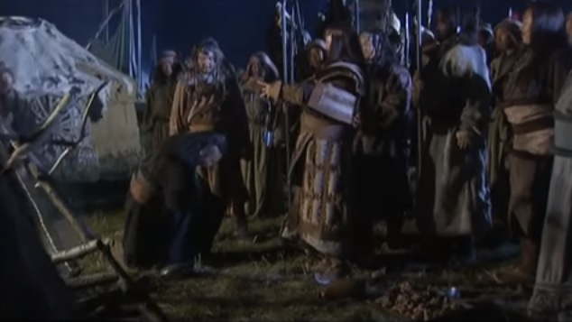

# Sepasang Iblis Cakar Tengkorak Putih

  
  

    
<em>
    Sepasang Iblis dengan ilmu Cakar Tengkorak Putih yang didapat dari Jiu Yin Baigu Zhao (九陰白骨爪),
    tinggal di puncak itu.
    </em>

  

"Baiklah, ayo kita perang lagi!" kata Wanyan Hongxi dengan lantang.

Di luar dugaan, pengintai depan kembali dengan laporan lain. "Ong Khan datang untuk
menyambut kedua Pangeran Jin!" 

Temujin, Jamuka, dan Senggum segera berpacu ke depan untuk menyambutnya.

Dari kepulan debu muncul pasukan. Dengan dikawal ratusan pengawal pribadi, Ong Khan 
memacu kudanya naik, turun dari punggung kudanya dengan ringan, kemudian bersama 
dengan kedua putra angkatnya Temujin dan Jamuka, mendekat dan berlutut di hadapan 
kedua pangeran. Ia seorang pria yang agak gemuk dengan rambut perak berkilauan. 
Ia mengenakan jubah yang terbuat dari bulu macan tutul hitam terbaik yang diikat 
dengan sabuk emas di pinggangnya. Caranya membawa diri sangat bermartabat dan penuh
percaya diri. Wanyan Honglie buru-buru turun dari kudanya dan membalas sikap itu, 
tetapi Wanyan Hongxi tetap di atas kudanya dan hanya menjawab dengan merangkapkan 
tangannya.

"Hambamu yang hina ini baru saja mendengar berita tentang kekasaran Naiman 
dan kuatir Yang Mulia mungkin terganggu. Hambamu membawa pasukan ke sini secepat 
mungkin. Tapi untungnya karena kehadiran Yang Mulia yang menakjubkan, ketiga 
anak-anak saya mampu mengalahkan mereka." Ong Khan berbicara.

Selanjutnya, ia maju dan dengan sopan mengantarkan Wanyan bersaudara kembali ke 
_ger_-nya sendiri. Bagian dalam ger-nya ditutupi dengan bulu macan tutul dan rubah
serta dilengkapi dengan perabotan dan barang-barang terbaik. Bahkan pengawal 
pribadinya pun mengenakan pakaian yang lebih mewah dari pengawal Temujin, apalagi 
Temujin dan putranya. Bunyi terompet terus terdengar sejauh beberapa kilometer 
di sekeliling ger. Manusia dan kuda berkeliaran di segala tempat, menimbulkan kesan bahwa 
sesuatu yang istimewa berlangsung. Belum pernah Wanyan bersaudara melihat sesuatu 
yang mendekati kemegahan seperti itu sejak mereka berada di luar Tembok Besar.

Setelah upacara penganugerahan gelar selesai, semua orang duduk tenang. Malam itu, 
Ong Khan mengadakan perjamuan besar-besaran di sebuah _ger_ besar untuk merayakan 
kedatangan Wanyan bersaudara. Puluhan budak wanita menari untuk hiburan saat 
perjamuan berlangsung hingga larut malam. Suasana menjadi sangat hidup, dan jauh 
berbeda dibandingkan dengan sambutan sederhana yang agak redup, yang mereka 
terima dari suku Temujin. Wanyan Hongxi sangat menikmatinya. Dua budak wanita 
menarik perhatiannya, dan imajinasi tertentu mulai timbul di kepalanya. Tidak 
pernah terpikir olehnya untuk berbicara dengan Ong Khan.

Setelah mengkonsumsi sekitar setengah dari _koumiss_, Wanyan Honglie menoleh kepada
Ong Khan. "Tindakan heroikmu dikenal luas, bahkan kami yang tinggal di dalam Tembok
Besar sudah lama mengagumi kehebatanmu. Tapi aku sangat ingin bertemu dengan beberapa 
pahlawan dari generasi muda Mongolia." katanya.

"Yah, kedua putra angkatku kebetulan adalah dua pahlawan terhebat di Mongolia." 
Ong Khan menanggapi dengan senyuman. Senggum, putranya sendiri yang duduk di satu 
sisi, tidak bereaksi dengan baik saat mendengar ini dan mulai menenggak beberapa cangkir 
_koumiss_ berturut-turut.

"Anakmu sendiri kan juga seorang pahlawan, mengapa tidak menyebut dia?" tanya 
Wanyan Honglie, memperhatikan ketidaksenangan Senggum.

"Setelah aku mati, dia secara alami akan mengambil alih sukuku." Ong Khan tersenyum 
dan menjawab. "Tapi apa dia bisa dibandingkan dengan kedua saudara angkatnya? Jamuka 
pintar dan cerdas. Temujin bahkan lebih berani dan ulet. Dia mulai dari nol dan 
membuat dirinya sendiri menjadi seperti sekarang ini, dengan tangannya sendiri. 
Prajurit Mongol mana yang tidak ingin mempertaruhkan nyawanya di tangan mereka,
dan melayani mereka?"

"Apa itu berarti para jendral di bawah Ong Khan tidak bisa dibandingkan dengan 
para jendral Temujin Khan?" tanya Wanyan Honglie. Menyadari nada adu domba dalam 
kata-katanya, Temujin menatap ke arah Wanyan Honglie dan secara mental mempersiapkan 
diri untuk apa yang akan terjadi selanjutnya. Ong Khan perlahan membelai janggutnya 
dan tidak menjawab. Sebaliknya, ia meneguk _koumiss_ lagi dari cangkirnya.

"Terakhir kali orang-orang Naiman datang dan mencuri beberapa ribu ternak saya, 
hanya berkat Temujin dan 'Empat Kartu As'-nya kami bisa mendapatkan kembali ternak-ternak itu. 
Meskipun dia tidak memiliki banyak anak buah, masing-masing dari mereka terampil 
dan berani. Yang Mulia pasti telah menyaksikannya secara langsung hari ini." Wajah 
Senggum nampak semakin marah ketika ia membanting cangkir emas di tangannya ke atas
meja, menimbulkan suara sangat keras.

"Apa sih hebatnya saya ini sebenarnya? Apa yang saya miliki hari ini hanya karena 
perhatian dan kasih sayang yang diberikan ayah angkat saya kepada saya." Temujin 
buru-buru menambahkan.

"'Empat Kartus As'? Siapa mereka? Aku ingin ketemu mereka." Wanyan Honglie juga 
mengubah topik pembicaraan.

"Coba panggil mereka." kata Ong Khan kepada Temujin. Temujin dengan ringan bertepuk
tangan dan empat orang pria masuk ke ger.

Yang pertama tampak lembut dan terpelajar dengan wajah putih bersih. Ia adalah ahli 
strategi, Muqali. Laki-laki kedua memiliki perawakan yang kuat dan kokoh, dan 
matanya tajam seperti elang, ia tidak lain adalah teman baik Temujin, Bogurchi. 
Pria ketiga pendek tapi gesit dan langkahnya ringan dan cepat. Ia adalah Boroqul 
mentor Tolui. Wajah dan tangan yang terakhir dipenuhi bekas luka pertempuran dan 
wajahnya merah darah. Inilah orang yang telah menyelamatkan hidup Temujin bertahun-tahun 
yang lalu, Tchila'un. Mereka berempat adalah jendral pelopor kebangkitan Mongolia,
dan disebut 'Empat Kartu As' oleh Temujin.

Setelah melihat mereka, Wanyan Honglie memuji mereka masing-masing sekedarnya, dan 
kemudian menghadiahkan _toast_ dengan secangkir besar _koumiss_ bagi mereka semua.

"Di medan pertempuran hari ini, ada seorang jendral berjubah hitam yang memimpin 
serangan menerobos formasi musuh, tidak ada yang bisa menghentikannya. Tahukah 
kalian siapa dia?" Wanyan Honglie bertanya setelah 'Empat Kartus As' menghabiskan 
minuman mereka.

"Itu Pemimpin Pasukan yang baru saja saya rekrut," jawab Temujin. "Semua orang 
memanggilnya Jebe."

"Lalu mengapa kita tidak mengundangnya untuk minum juga?" Wanyan Honglie menyarankan.
Temujin berbalik dan mengeluarkan perintah.

Jebe memasuki ger dan berterima kasih dengan sikap selayaknya atas hadiah minuman. 
Ia baru saja akan minum ketika ia diinterupsi.

"Beraninya kau, Pemimpin Regu yang sangat kecil, minum dari cangkir emasku?" teriak
Senggum. Jebe sangat terkejut dan geram, tapi menghentikan cangkirnya saat sudah 
naik ke bibir. Ia memandang ke arah Temujin seolah bertanya bagaimana seharusnya
menanggapi dengan baik. Dalam budaya Mongolia, melarang seseorang minum adalah 
penghinaan besar. Apalagi hal ini dilakukan di depan semua orang, mana ada orang 
yang mau menanggung penghinaan seperti itu?

"Demi ayah angkatku, aku akan membiarkan penghinaan dari Senggum ini." Temujin 
memutuskan sambil menoleh kepada Jebe.

"Bawa ke sini. Aku haus, biar aku yang minum!" Dia mengambil cangkir dari tangan 
Jebe dan meminum semua isinya dalam sekali teguk. Jebe melontarkan pandangan 
marah ke arah Senggum, berbalik, dan mulai berjalan keluar ger.

"Kembali kesini!" Senggum memerintah dengan galak, tapi Jebe mengabaikannya dan 
berjalan keluar dari ger dengan kepala terangkat tinggi.

"Meskipun Saudara Temujin punya 'Empat Kartu As', aku punya sesuatu yang bisa 
mengalahkan mereka berempat segera setelah aku melepaskannya." Tidak senang karena
keadaan tidak sesuai dengan keinginannya, Senggum mengubah topik pembicaraan. Ia 
terkekeh ketika mengatakan itu. Meskipun ia memanggil Temujin 'Saudara', ia bukanlah
seorang _Anda_ dari Temujin. Ia melakukannya hanya karena ayahnya adalah ayah 
angkat Temujin.

"Benarkah? Apa itu? Apa yang begitu kuat?" Rasa ingin tahu Wanyan Hongxi terpancing
oleh pernyataan itu.

"Yah, kita keluar dulu, biar kutunjukkan." kata Senggum.

"Kita lagi enak minum, kamu mau bikin ulah macam apa lagi?" kata Ong Khan keberatan.

"Hanya duduk di sini dan minum sangat membosankan, ayo kita lihat sesuatu yang 
berbeda." Wanyan Hongxi sangat ingin melihat keributan, sedemikian rupa sehingga 
ia sudah berdiri setelah menyelesaikan kalimatnya dan keluar dari situ. Yang lain 
tidak punya pilihan selain mengikutinya.

Pasukan Mongolia menyalakan ratusan api unggun dan merayakan kemenangan di 
sekelilingnya. Ketika para Khan keluar dari ger, terdengar gemuruh besar saat 
sebagian besar pasukan di barat segera berdiri. Mereka berbaris dalam formasi 
sempurna, tidak satu pun dari mereka yang bergerak. Mereka tidak lain adalah 
pasukan Temujin. Di timur, pasukan Ong Khan, perlahan dan tidak terorganisir, 
bangkit dari tanah. Bahkan samar-samar terdengar suara lelucon di dalam barisan 
mereka.

"Meskipun pasukan Ong Khan jauh lebih banyak, mereka tidak bisa dibandingkan 
dengan pasukan Temujin!" Wanyan Honglie menyimpulkan setelah melihat pemandangan ini.

"Arak!" seru Temujin. Dia memperhatikan dalam cahaya api, bahwa wajah Jebe 
masih menunjukkan kemarahan. Jadi dia memerintahkan agar sebotol besar arak dibawa
kepadanya.

"Kemenangan luar biasa hari ini atas Naiman adalah hasil dari kerja keras dan 
dedikasi semua orang!" Ia dengan lantang mengatakan hal itu kepada semua orang.

"Itu karena kita dipimpin oleh Ong Khan, Temujin Khan, dan Jamuka!" jawab semua 
tentara serempak.

"Hari ini, aku melihat ada orang yang sangat berani, menyerbu bagian belakang 
musuh tidak kurang dari tiga kali. Dia menembak jatuh puluhan musuh, siapa dia?" 
tanya Temujin.

"Pemimpin Pasukan Jebe!" para tentara itu menjawab lagi.

"Bukan, bukan Pemimpin Regu, tapi Komandan Kompi Jebe!" Temujin mengoreksi. Semua 
orang sejenak terkejut sebelum menyadari apa yang dia maksud dan mulai bersorak.

  
  

    

      <em>Temujin memberikan penghargaan yang sangat tinggi kepada Jebe, yang sebelumnya
      menerima penghinaan besar dari Senggum di depan banyak orang.</em>
    

  

"Jebe adalah pejuang yang hebat! Dia memang pantas menjadi Komandan Kompi!" Mereka
semua berteriak sepakat.

"Bawa helmku ke sini!" Temujin menginstruksikan Jelme. Segera Jelme kembali dengan 
helm dan memberikannya kepadanya.

"Ini adalah helm yang kupakai ke medan perang! Ini adalah helm yang kupakai saat 
aku membunuh musuhku!" Temujin mengangkat helmnya tinggi-tinggi di atas kepalanya 
agar semua orang bisa melihatnya. "Sekarang ini akan menjadi cangkir untuk minum
bagi seorang pejuang hebat!"

Ia membuka kendi berisi _koumiss_ dan menuangkan semua isinya ke dalam helm. 
Membawanya ke bibirnya, ia minum seteguk besar dari helm itu, lalu menawarkannya 
kepada Jebe.

Dipenuhi dengan rasa terima kasih dan dengan kepala tertunduk, Jebe berlutut 
dengan satu kaki untuk menerima helm dan menghabiskan sisa _koumiss_.

"Bahkan cangkir emas bertatahkan berlian paling berharga di dunia tidak dapat 
dibandingkan dengan helm Khan saya." Dia berkata dengan suara rendah. Temujin 
tersenyum sambil mengambil kembali helmnya dan memasangnya kembali di kepalanya.

Pasukan Mongol sudah tahu bagaimana Jebe telah dipermalukan oleh Senggum dan 
merasa kasihan kepadanya. Bahkan pasukan di bawah bendera Ong Khan berpikir bahwa 
Senggum salah kalau melakukan hal seperti itu. Sekarang melihat bagaimana Temujin 
memperlakukan dia, mereka semua bersorak gembira.

"Betapa hebatnya Temujin ini! Saat ini Jebe akan dengan senang hati mati seribu 
kali untuk dia!" Wanyan Honglie berpikir sendiri. "Dulu di Pengadilan Kekaisaran, 
semua pejabat bersikeras bahwa belahan bumi Utara dihuni oleh orang-orang barbar 
yang tidak berotak. Jelas bahwa mereka terlalu meremehkan orang-orang ini." Tapi
Wanyan Hongxi hanya ingin tahu apa yang diklaim Senggum bisa mengalahkan keempat 
'As'.

"Jadi kamu punya apa yang begitu kuat sehingga bisa mengalahkan keempat 'As'?" 
katanya, sambil dengan santai duduk kembali di kursi berlapis bulu harimau yang 
telah dibawa keluar oleh pelayan pribadinya.

"Saya mengundang Yang Mulia untuk bersiap-siap untuk melihat sesuatu yang sangat 
istimewa. 'Empat As' apanya? Mereka mungkin bahkan tidak akan sebanding dengan
dua bajingan saya itu." Senggum diam-diam berkata sambil tersenyum sebelum berbalik
kepada pasukan dan bertanya dengan lantang. "Di mana 'Empat As' Kakakku Temujin?"

Keempat pria itu datang berjalan dan memberi hormat kepada atasan mereka. Senggum
berbalik dan membisikkan sesuatu kepada pelayan terpercaya di sisinya, yang mengangguk 
sebelum kabur. Segera setelah itu, suara auman binatang buas terdengar ketika sepasang 
macan tutul emas besar keluar dengan anggun dari belakang ger. Saat mereka perlahan 
mendekat dalam kegelapan, mata macan tutul itu bersinar seperti sepasang lentera 
giok. Ini membuat Wanyan Hongxi ketakutan, ia mencengkeram gagang pedangnya dengan
erat. Ketika macan tutul itu berjalan mendekati salah satu api unggun, ia melihat 
bahwa sebenarnya ada tali dan kalung di leher mereka dan masing-masing macan tutul
itu dikawal oleh seorang pria besar yang memegang ujung tali yang lainnya. Keduanya 
memiliki tongkat panjang di tangan mereka yang lain, dan, ternyata, mereka secara 
khusus ditugaskan untuk membesarkan dan merawat macan tutul. Orang Mongolia suka 
memelihara macan tutul untuk tujuan berburu. Macan tutul tidak hanya berlari lebih
cepat daripada anjing pemburu, mereka juga sangat agresif, tertangkap oleh macan 
tutul berarti mati seketika. Satu-satunya kelemahan adalah macan tutul mengkonsumsi 
banyak makanan, jadi hanya bangsawan atau pejabat tinggi yang mampu memelihara 
macan tutul. Meskipun macan tutul itu dikawal, mereka masih menggeram dan mencakar
sambil memelototi semua orang dengan kejam. Otot-otot di tubuh mereka tampak seolah-olah 
mengandung energi tak terbatas di dalamnya, siap meledak kapan saja. Wanyan Hongxi
merasa hatinya sedikit berdebar dan ia sangat tidak nyaman. Dari kekuatan dan 
keperkasaan yang ditunjukkan oleh kedua macan tutul ini, sepertinya mereka bisa 
dengan mudah melepaskan diri dari cengkeraman pengawal mereka, jika mereka mau.

"Saudaraku, jika 'Empat As' milikmu itu benar-benar pejuang yang hebat dan dapat
menaklukkan kedua macan tutulku ini dengan tangan kosong, maka aku akan benar-benar
yakin." Kata Senggum sambil menoleh ke arah Temujin.

'Four Aces' sangat marah, pikiran yang sama melintas di benak mereka. "Kau 
mempermalukan Jebe, sekarang kau mau mempermalukan kami? Apa kami ini hanya binatang
buruan? Apakah kami serigala liar? Kenapa kami harus melawan macan tutulmu?"

Temujin jauh dari senang dengan semua gagasan itu. "Aku mencintai semua orangku 
seperti hidupku sendiri, bagaimana aku bisa menyuruh mereka melawan macan tutul?"

"Begitukah?" Senggum tertawa terbahak-bahak. "Lalu kenapa mengaku sebagai 'Empat As' 
atau apa pun panggilan mereka? Mereka bahkan tidak cukup berani untuk melawan 
macan tutulku!"

Dari 'Empat As', kesabaran Tchila'un adalah yang paling sedikit, dan ia tidak 
tahan lagi dengan penghinaan seperti itu. Ia mengambil langkah besar ke depan. 
"Khanku yang agung, tidak masalah jika mereka menertawakan kami, tetapi kami 
tidak dapat membiarkanmu dipermalukan." Ia berkata kepada Temujin. "Aku akan 
melawan macan tutul itu!"

Wanyan Hongxi sangat gembira mendengar ini. Sedemikian rupa sehingga ia melepaskan
cincin bertatahkan ruby merah cerah dari jarinya dan melemparkannya ke tanah, 
lalu berkata, "Jika kau bisa mengalahkan macan tutul, maka itu milikmu."

Tchila'un bahkan tidak melihat cincin itu sebelum menerjang ke depan, tapi ia 
ditahan oleh Muqali. "Nama kita dikenal di seluruh padang rumput karena kita
mengalahkan begitu banyak musuh. Apa macan tutul bisa memimpin pasukan? Apa 
macan tutul bisa menyergap atau mengepung musuh?" Muqali beralasan keras.

"Kakak Senggum, kau menang." Temujin berkata sambil membungkuk, mengambil cincin 
itu, dan meletakkannya di tangan Senggum. Senggum segera memasang cincin di salah 
satu jarinya dan tertawa penuh kemenangan sambil mengangkat tangannya untuk 
memamerkan cincin yang baru dimenangkannya. Pasukan Ong Khan mulai bersorak 
sebagai tanggapan. Jamuka tetap diam sampai saat itu, tapi mengerutkan kening 
dengan serius. Temujin menjaga ekspresi tenang di wajahnya. 'Empat As' dengan 
getir mundur kembali ke barisan mereka. Kecewa dan sangat tidak senang karena 
tidak melihat pertarungan manusia versus macan tutul, Wanyan Hongxi meminta dua 
budak wanita kepada Ong Khan dan mengundurkan diri ke ger miliknya sendiri.

Keesokan paginya, Tolui dan Guo Jing lari untuk bermain-main. Bergandengan tangan,
mereka berjalan jauh dari kamp utama. Tiba-tiba seekor kelinci putih berlari tepat
di depan mereka. Tolui mengangkat busur dan anak panah kecilnya, membidik, menembak, 
dan mengenai kelinci tepat di perutnya. Karena ia masih sangat muda, anak panah 
itu tidak kurang kuat, jadi meskipun kena, tapi tidak berakibat fatal, dan kelinci 
itu lari melengking dengan anak panah menancap di perutnya. Kedua anak kecil itu, 
berteriak sekuat tenaga, mengejar kelinci itu.

Setelah berlari cukup lama, kelinci itu akhirnya roboh. Kedua anak itu bersorak 
serentak dan baru saja akan mengambil kelinci itu ketika tujuh atau delapan anak 
tiba-tiba keluar dari hutan dari salah satu sisi. Salah seorang anak yang berusia 
sekitar 12 tahun, dengan cepat mengenali situasi dan menangkap kelinci itu. Ia 
menarik anak panah dari perut kelinci, melemparkannya ke tanah, menatap tajam ke 
arah Tolui dan Guo Jing, sebelum membawa kelinci itu pergi.

"Hei, aku yang menembak kelinci itu, kenapa kamu mengambilnya?" teriak Tolui. Anak
itu berbalik dan kembali ke tempatnya.

"Siapa bilang kau yang menembaknya?" Ia tertawa.

"Yah, ini panahku, kan?"

Alis anak yang lebih tua tiba-tiba terangkat dan matanya melotot. "Kelinci ini 
peliharaanku, kau beruntung aku tidak memintamu untuk membayarnya!" Ia balas 
berteriak.

"Kau bohong, ini jelas kelinci liar." Tolui membalas.

Bocah makin marah, ia maju dan mendorong Tolui. "Lihat dulu sebelum main tuduh! 
Kakekku Ong Khan, ayahku Senggum, kau tahu itu? Kalaupun kau yang menembak kelinci
ini, aku tetap akan mengambilnya. Terus kau mau apa?"

"Ayahku Temujin!" jawab Tolui dengan bangga.

"Buih! Jadi kenapa kalau dia Temujin? Ayahmu pengecut! Dia takut sama kakekku dan 
takut sama ayahku!" Nama anak itu adalah Dukhsh dan ia adalah satu-satunya putra 
Senggum. Setelah memiliki anak perempuan, Senggum harus menunggu beberapa tahun 
sebelum akhirnya memiliki anak laki-laki. Setelah Dukhsh, ia tidak punya keturunan 
lain. Ia selalu memanjakan putranya, membiarkannya berbuat sesuka hati. Temujin, 
Ong Khan, dan Senggum sudah lama tidak bertemu, meskipun putra mereka pernah 
bertemu sebelumnya, ini, untuk semua tujuan praktis, pertama kalinya mereka saling
mengenal dalam arti yang sebenarnya.

Mendengar seseorang mengolok-olok ayahnya, Tolui dipenuhi amarah dan dengan bangga
balas berteriak, "Kata siapa? Ayahku tidak takut kepada siapa pun!"

"Waktu ibumu diculik, kakekku dan ayahku yang pergi dan mengambilnya kembali untuk
ayahmu. Kau pikir aku tidak tahu itu? Jadi apa masalahnya jika aku mengambil kelinci
kecilmu yang sangat kecil ini?" Bahkan di masa lalu, Senggum iri dengan ketenaran 
Temujin. Ketika mereka membantu Temujin, Senggum memastikan untuk memberitahu 
semua orang tentang hal itu, bahkan putranya sudah mendengarnya berkali-kali.

Temujin selalu memandang peristiwa itu sebagai hal yang sangat memalukan bagi 
dirinya sendiri, ia tentu saja tidak pernah memberi tahu Tolui tentang hal itu.
Mendengar ini saat ini, Tolui sangat marah hingga wajahnya berubah ungu. "Kau 
bohong! Aku akan memberi tahu ayahku!" Ia dengan marah mengancam sebelum berbalik
dan berjalan pergi.

"Ayahmu takut sama ayahku, terus kenapa kalau kau kasih tahu dia?" Dukhsh menertawakan
Tolui. "Tadi malam, waktu ayahku mengeluarkan dua macan tutulnya, 'Empat Keledai' 
ayahmu sangat ketakutan, mereka bahkan tidak bisa bergerak!"

Dari 'Empat As', Boroqul adalah guru Tolui. Ketika mendengar hal ini, Tolui semakin 
marah. Ia hampir tidak bisa berbicara. "Guruku bahkan tidak takut harimau, mengapa
takut pada macan tutul? Dia hanya tidak ingin melawan binatang buas." Ia akhirnya 
tergagap.

Dukhsh maju selangkah dan tiba-tiba menampar Tolui tepat di wajahnya. "Beraninya 
kau membalasku? Apa kau tidak takut padaku?" Ia berteriak. Tolui terkejut saat 
pipinya langsung berubah menjadi merah darah. Ia ingin menangis, tapi ia menahan
diri.

Guo Jing yang berdiri si sampingnya sudah lama mendidih, tapi sekarang ia tidak 
bisa menahan diri lagi. Ia tiba-tiba menerjang maju dan membenturkan kepalanya 
tepat ke perut Dukhsh. Hal ini mengejutkan Dukhsh dan membuatnya jatuh telentang.

"Ha!" Tolui bertepuk tangan kegirangan sesaat sebelum meraih tangan Guo Jing dan
mencoba melarikan diri.

"Bunuh kedua bocah itu!" teriak Dukhsh, masih di tanah. Teman-teman Dukhsh lari 
ke arah kedua bocah laki-laki itu dan perkelahian sengit segera terjadi. Dukhsh 
bangkit dari tanah dan dengan marah menyerbu ke dalam keributan. Geng Dukhsh 
lebih tua dari kedua bocah itu, dan juga jumlah mereka jauh lebih banyak, mereka 
dengan cepat menjatuhkan Guo Jing dan Tolui.

"Menyerah? Menyerah?" teriak Dukhsh sambil terus menghujani punggung Guo Jing dengan
pukulan. Guo Jing mencoba sekuat tenaga untuk bangkit kembali, tetapi tertindih 
oleh berat badan musuhnya. Di sisinya, Tolui juga dikeroyok oleh dua bocah.

Pada saat genting inilah suara kliningan aksesori kuda terdengar dari atas gundukan 
pasir ketika sekelompok kecil pengendara muncul. Penunggang terdepan adalah seorang 
pria pendek gemuk yang menunggang kuda kuning. Melihat anak-anak berkelahi di 
kejauhan, ia tertawa kecil.

"Hah, tawuran!" Ketika ia mendekat untuk melihat lebih baik, ia menyadari bahwa 
perkelahian itu adalah antara tujuh orang anak yang menindas dua orang anak yang jauh lebih kecil. Mereka 
menjepit mereka di tanah dan memukuli mereka. Wajah kedua anak kecil itu sudah 
penuh memar.

"Tidak malu ya, ayo lepaskan mereka!" serunya.

"Menyebalkan!" bals Dukhsh, berteriak. “Apa kau tahu siapa aku? Aku mau memukuli 
siapa pun yang aku mau, dan kau tidak dapat berbuat apa-apa!" Ayahnya adalah 
salah satu orang paling berkuasa di Utara, jadi dia terbiasa menindas semua orang, 
dan tidak ada yang berani menentangnya.

"Berani amat kau bersikap seperti itu? Lepaskan mereka!" Penunggang kuda kuning 
balas berteriak. Pada saat ini, sisa kelompoknya telah bergabung dengannya.

"San Ge, jangan campuri urusan yang bukan urusan kita, ayo pergi." Ada seorang 
wanita dalam kelompok itu.

"Lihat mereka, pertarungan macam apa ini?" Penunggang kuda kuning menjawab.

Para penunggang kuda ini adalah Tujuh Orang Aneh dari Jiangnan. Mereka membuntuti
Duan Tiande jauh ke Utara menuju padang rumput sebelum akhirnya kehilangan jejak. 
Enam tahun terakhir ini, mereka telah menjelajahi padang rumput Mongolia naik turun 
untuk mencari Duan Tiande dan Li Ping. Ketujuh orang dari mereka telah benar-benar 
belajar bahasa Mongolia saat ini, tetapi mereka masih tidak dapat menemukan petunjuk 
tentang keberadaan Li Ping. Ketujuh Orang Aneh semuanya adalah karakter yang keras
kepala, dan juga sangat kompetitif, jadi meskipun menghadapi cobaan berat sepuluh 
kali lipat lebih sulit dan lebih berbahaya dari ini, mereka tidak akan menyerah
begitu saja kepada Qiu Chuji. Tanpa pernah berunding, mereka bertujuh memiliki 
rencana yang sama, bahkan jika mereka tidak pernah menemukan Li Ping, mereka akan
tetap mencari sampai delapan belas tahun berlalu. Baru saat itulah mereka akan pergi 
ke Paviliun Dewa Mabuk di Jiaxing dan mengaku kalah di hadapan Qiu Chuji. 
Selain itu, Qiu Chuji mungkin juga tidak menemukan janda Yang Tiexin. Jika tidak
ada pihak yang dapat menemukan janda mereka, maka hasilnya akan _seri_ dan mungkin
mereka akan mengadakan pertandingan lain.

"Dua lawan satu, ini memang tidak bisa dibiarkan." Han Xiaoying melompat dari 
kudanya dan menarik kedua anak yang sedang duduk di punggung Tolui itu. Tiba-tiba 
menyadari bahwa semua beban sudah lepas dari punggungnya, Tolui berjuang untuk 
bangun. Dukhsh berhenti sejenak dan Guo Jing memanfaatkannya, dia membalikkan 
tubuhnya dengan keras dan merangkak keluar dari antara kedua kaki Dukhsh. 
Setelah akhirnya mereka berdua bebas, dengan segera mereka mencoba melarikan diri.

"Kejar!" seru Dushkh sambil memimpin gengnya untuk mengejar kedua bocah itu dengan penasaran.

Melihat anak-anak kecil Mongolia ini berkelahi mengingatkan Tujuh Orang Aneh 
tentang semua kesialan yang mereka alami bersama ketika mereka masih kecil, 
menyebabkan mereka tersenyum penuh kasih mengenang semua itu.

"Saatnya pergi. Ayo pergi ke pasar dulu sebelum bubar, atau kita akan kehilangan 
kesempatan untuk menanyai orang-orang di sana!" saran Ke Zhen'E. Saat ini geng 
kecil Dukhsh sedang mengejar Tolui dan Guo Jing sekali lagi dan mengepung mereka.

"Kau menyerah?" desak Dukhsh. Tolui yang masih sangat marah, tidak menjawab 
ia menggelengkan kepalanya dengan keras.

"Yah, kau yang minta ya!" Anak-anak itu berkelahi lagi.

Tiba-tiba ada kilatan dingin saat belati kecil tiba-tiba muncul di tangan Guo Jing.
"Kau mau ini?"

Li Ping, karena cinta pada anaknya, memberinya belati peninggalan suaminya untuk 
dibawa-bawa. Ia merasa bahwa benda ini bagus untuk mengatasi kejahatan dan 
bermaksud agar belati ini melindungi putranya dari roh jahat. Karena intimidasi 
yang diterima Guo Jing, ia secara naluriah menghunus belati itu.

Setelah melihat bahwa Guo Jing memegang senjata, tidak ada seorang pun dari geng
Dushkh yang berani menantangnya lagi.

Si Sastrawan Tangan Ajaib, Zhu Cong, sebetulnya sudah beranjak pergi, ketika mendadak
kilauan belati itu menerpa kedua matanya. Kilauan belati itu di bawah sinar matahari
rupanya sangat menggugah hatinya.

"Bayangan ini sangat kuat, aku jadi kepingin lihat sebetulnya mainan kecil ini barang apa."

Sepanjang hidupnya Zhu Cong sudah mencuri barang-barang mewah dari perbendaharaan 
pemerintah dan gudang para bangsawan kaya, ia cukup ahli membedakan benda-benda 
berharga. Ia segera menarik kudanya dan melihat bahwa salah seorang anak itu 
memiliki belati di tangannya. Belati itu memantulkan cahaya biru yang berkelap-kelip 
tanpa henti, jelas merupakan senjata yang sangat langka. Tapi bagaimana itu bisa
berada di tangan seorang bocah cilik? Melihat anak-anak itu lagi, ia memperhatikan
bahwa selain Guo Jing, semua anak lainnya mengenakan kemeja mahal yang terbuat 
dari kulit macan tutul. Tapi Guo Jing mengimbanginya dengan sebuah cincin emas 
yang tampak seperti mahkota di atas kepalanya. Jelas bahwa anak-anak itu semuanya 
adalah anggota keluarga Mongol yang kaya dan berpengaruh.

"Anak itu mungkin mencuri pisau favorit ayahnya untuk mainan. Mencuri dari raja 
dan bangsawan tidak akan terlalu merugikan." Begitu menarik kesimpulan itu, ia 
melompat dari kudanya dan tersenyum manis sambil mendekati anak-anak itu.

"Ayo semuanya, berhenti berkelahi. Main baik-baik saja." Sambil berbicara, ia 
tiba-tiba melintas ke lingkaran anak-anak itu dan mengambil pisau dari Guo Jing. 
Setelah sering latihan menangkap senjata dengan tangan kosong, hanya seorang _master_ 
kungfu terbaik yang sanggup mencegah Zhu Cong merebut senjata mereka, apalagi 
anak kecil seperti Guo Jing.

Begitu belati pindah ke tangannya, Zhu Cong segera keluar dari lingkaran dan 
melompat kembali ke atas kudanya. Dengan sekali sentakan ia berpacu sambil tertawa
dan mengejar anggota kelompoknya yang lain.

"Yah, hari ini tidak terlalu rugi, aku akhirnya dapat permata kecil ini." Ia 
tertawa terbahak-bahak merayakan kesuksesannya.

"Er Ge, kau tidak akan pernah bisa menghilangkan kebiasaan mencuri ya?" Si Buddha 
Tersenyum, Zhang Ahsheng ikut tertawa.

"Permata kecil apa? Coba kulihat." Si Pahlawan Tersembunyi dari Kota Besar, 
Quan Jinfa, sebagai seorang _trader_, ia sangat penasaran. Dengan kibasan 
lengannya, Zhu Cong melemparkan belati ke atas. Garis biru melesat melintasi 
langit di bawah sinar matahari, cahaya dari belati menyebar di angkasa, tampak 
seperti pelangi kecil baru saja terwujud, membuat semua orang berteriak memuji.

"Bagus sekali!" Quan Jinfa tanpa sadar berteriak ketika belati itu terbang ke arah 
wajahnya, membuat tulang punggungnya menggigil. Ia mengulurkan tangan dan menangkap 
belati itu di gagangnya. Ia bersuara "Ck ck ck..." tanpa henti dalam kekaguman 
saat memeriksa belati itu. Ketika perhatiannya pindah ke gagangnya, ia melihat 
tulisan 'Yang Kang' terukir di atasnya. "Ini nama Han! Bagaimana belati ini bisa 
ada di Mongolia ini?" Sebuah pertanyaan melintas di benaknya. "Yang Kang, Yang Kang? 
Aku belum pernah mendengar ada pendekar bernama Yang Kang. Jika dia bukan pendekar
kungfu, mengapa dia punya senjata yang luar biasa begini?"

"Da Ge, kau kenal Yang Kang?" serunya.

"Yang Kang?" Ke Zhen'E menelusuri ingatannya sejenak, dan menggelengkan kepalanya. 
"Aku belum pernah dengar sebelumnya."

'Yang Kang' adalah nama yang diberikan Qiu Chuji kepada bayi yang masih berada di 
dalam kandungan Bao Xiruo. Kedua ayah bayi itu saling tukar belati, dan begitulah 
Li Ping berakhir dengan belati yang diukir 'Yang Kang' di atasnya. Tentu saja 
Ketujuh Orang Aneh tidak tahu soal ini. Dari ketujuh orang tersebut, Ke Zhen'E 
adalah yang tertua dan juga yang paling berpengetahuan. Jika ia tidak tahu, maka
tidak mungkin enam orang lainnya tahu.

"Qiu Chuji mencari-cari janda Yang Tiexin, mungkinkah Yang Kang ini ada hubungannya
dengan Yang Tiexin?" Perhatian Quan Jinfa terhadap detail membuatnya bertanya.

"Yah, jika kita menemukan janda Yang Tiexin, setidaknya kita masih unggul sedikit
dari Si Hidung Banteng itu." Zhu Cong bercanda. Tetapi setelah mencari tanpa henti
dan tanpa hasil selama enam tahun terakhir, petunjuk yang tampaknya jauh dan sama
sekali tidak berhubungan ini adalah sesuatu yang tidak ingin dilewatkan oleh 
siapa pun dari mereka.

"Ayo kita tanyai bocah itu." kata Han Xiaoying.

Kuda Han Baoju adalah yang tercepat, ia berpacu kembali ke tempat pertama kalinya
mereka melihat anak-anak itu, dan menemukan bahwa anak-anak itu sedang berkelahi 
lagi. Tolui dan Guo Jing, sekali lagi dijatuhkan ke atas tanah. Han Baoju 
memerintahkan anak-anak itu untuk bubar, tapi tak satu pun dari mereka mengindahkan 
kata-katanya. Menjadi tidak sabar, ia meraih beberapa anak dan melemparkan mereka 
ke samping.

"Kalian berdua datang lagi besok," ancam Dushkh sambil menatap Tolui. "Datang lagi
besok, kita lanjutkan lagi!" Ia takut untuk melanjutkan saat itu juga.

"Oke, besok!" balas Tolui berteriak saat Dukhsh membawa gengnya pergi. Ia sudah 
punya rencana tentang apa yang harus dilakukan. Ia akan pergi dan meminta bantuan 
kakak ketiganya Ogedai segera setelah mereka pulang. Dari semua kakaknya, Ogedai 
adalah yang paling baik kepadanya, dan juga kuat. Ia pasti akan membantu jika 
diminta.

"Kembalikan!" Meski wajahnya berlumuran darah dari hidungnya, Guo Jing mengulurkan
tangannya ke arah Zhu Cong.

"Boleh, tidak masalah," Zhu Cong melambai-lambaikan belati di depan wajah Guo Jing. 
"Tapi kamu harus kasih tahu dulu dari mana kamu dapat belati ini."

"Ibuku yang kasih." jawab Guo Jing, sambil mengusap darah dari hidungnya dengan lengan baju.

"Siapa nama ayahmu?" Guo Jing tidak pernah memiliki ayah dan terdiam mendengar pertanyaan itu. Yang bisa dia lakukan hanyalah menggelengkan kepalanya.

"Apa margamu Yang?" tanya Quan Jinfa. Sekali lagi, Guo Jing menggelengkan kepalanya.
Melihat anak ini agak lamban, Tujuh Orang Aneh cukup kecewa.

"Siapa itu Yang Kang?" Zhu Cong menyelidiki lebih lanjut. Guo Jing masih hanya 
menggelengkan kepalanya. Tujuh Orang Aneh selalu menghargai integritas mereka di 
atas segalanya, jadi mereka selalu menepati janji, bahkan kepada seorang anak kecil
sekalipun. Zhu Cong mengembalikan belati itu ke Guo Jing.

"Kamu bisa pulang sekarang." Han Xiaoying mengeluarkan sapu tangan dan membersihkan
darah dari wajah Guo Jing saat dia dengan lembut berkata. "Jangan berkelahi lagi. 
Kamu masih kecil, kamu belum bisa mengalahkan mereka."

Setelah itu, mereka bertujuh naik kembali ke atas kuda mereka dan mulai pergi.
Guo Jing hanya berdiri di sana, mengawasi mereka pergi ke arah Timur.

"Guo Jing, ayo kita pulang." ajak Tolui.

Tujuh Orang Aneh sudah cukup jauh, tapi pendengaran Ke Zhen'E sangat sensitif. 
Ketika mendengar nama 'Guo Jing', seluruh tubuhnya bergetar hebat. Ia segera 
menyentak kudanya dan kembali ke hadapan kedua bocah itu.

"Nak, nama keluargamu 'Guo' ya? Kamu orang Han, bukan orang Mongol ya?" ia melontarkan
pertanyaan berturut-turut, harap-harap cemas.

Guo Jing bergumam mengiyakan, melambungkan pikiran Ke Zhen'E ke awan dengan penuh
kegirangan. Ia buru-buru bertanya lagi, "Siapa ibumu?"

"Ibu ya ibu." jawab Guo Jing, membuat Ke Zhen'E menggaruk kepala sedikit. "Bisa antar
aku ketemu ibumu?"

"Ibu tidak di sini."

"Qi Mei, coba kau tanya dia." Ke Zhen'E mulai menyadari bahwa nada curiga dalam 
tanggapan Guo Jing. Han Xiaoying melompat turun dari kudanya dan berjalan ke arah 
Guo Jing.

"Ayahmu mana?" tanya Han Xiaoying dengan hangat.

"Ayahku dibunuh orang jahat. Kalau aku sudah besar, aku pasti akan membunuh mereka
untuk membalas dendam ayahku."

"Siapa nama ayahmu?" tanya Han Xiaoying lagi. Ia begitu bersemangat, sampai-sampai suaranya
gemetar. Tapi Guo Jing menggelengkan kepalanya.

"Siapa yang membunuh ayahmu?" tanya Ke Zhen'E.

"Dia... namanya Duan Tiande." Guo Jing hampir tidak bisa menahan amarahnya ketika
menyebutkan nama itu.

Karena Li Ping tahu bahwa di tempat terpencil dan jauh seperti padang rumput Mongolia ini,
setiap detik mengandung banyak bahaya. Ia juga tahu bahwa peluangnya untuk kembali 
ke dataran tengah hampir tidak ada. Jika sesuatu tiba-tiba terjadi pada dirinya, 
putranya tidak akan pernah tahu nama musuh bebuyutannya, dan itu dipandangnya 
tidak baik. Ia sudah lama memberi tahu putranya berulang kali nama dan penampilan 
Duan Tiande. Ia adalah seorang anak perempuan keluarga petani yang buta huruf dan 
selalu memanggil suaminya dengan panggilan kesayangannya, 'Xiao-Ge'. Ia telah 
mendengar orang lain memanggilnya 'Kakak Guo' (Guo Da Ge) tetapi ia tidak pernah 
peduli siapa nama lengkap suaminya. Inilah sebabnya Guo Jing hanya mengenal ayahnya
sebagai 'ayahnya' dan tidak tahu bahwa ayahnya memiliki sebuah nama.

'Duan Tiande'. Nama itu tidak terlalu keras keluar dari mulut Guo Jing, tetapi 
ketika Tujuh Orang Aneh mendengarnya, keterkejutan membuat mereka terdiam sejenak. 
Bahkan jika tiga sambaran petir tiba-tiba menyambar di samping mereka pada hari 
yang terang dan cerah ini, hal itu tidak akan terasa begitu mengejutkan bagi mereka. 
Dalam sekejap mata, rasanya bumi di bawah mereka berguncang, seolah angin dan 
udara di sekitar mereka menjadi berwarna-warni. Baru setelah keheningan yang 
sangat lama, Han Xiaoying tiba-tiba bersorak gembira. Pada saat yang sama, Zhang Ahsheng 
memukuli dadanya seperti orang gila. Quan Jinfa telah melingkarkan lengannya 
erat-erat di leher Nan Xiren dan Han Baoju melakukan salto di atas pelana kudanya.
Ke Zhen'E mengangkat kepalanya ke belakang dan tertawa terbahak-bahak, sementara 
Zhu Cong berputar-putar menari seperti gasing. Melihat mereka bertingkah seperti 
ini, Tolui dan Guo Jing tidak bisa menyimpulkan apakah mereka ini lucu atau sekadar 
orang gila. Setelah agak lama, barulah Tujuh Orang Aneh itu akhirnya, secara berangsur-angsur, 
tenang, tetapi wajah mereka masih diliputi kegembiraan tak terkira.

"Bodhisattva Maha Pengasih, terima kasih, terima kasih!" Zhang Ahsheng berlutut dan berdoa.

"Adik laki-laki, ayo duduk sini, kita ngobrol." Han Xiaoying berkata kepada Guo Jing.
Karena ingin segera pulang untuk minta bantuan kakaknya Ogedai serta punya firasat
buruk tentang ketujuh orang asing ini, yang punya aksen aneh, dan berperilaku yang 
bahkan lebih aneh, Tolui tidak ingin tinggal lebih lama lagi. Meskipun orang-orang asing
ini baru saja membantu mereka dalam perkelahian, Tolui tak henti-hentinya mendesak
Guo Jing untuk pulang.

"Saya harus pergi sekarang." Guo Jing akhirnya mengalah dan mulai berjalan beriringan 
dengan Tolui.

"Hei... hei! Jangan pergi! Biar temanmu itu pulang sendiri." Han Baoju nyaris panik 
dan berteriak sekuat tenaga.

Kedua bocah itu takut melihat pria jelek yang kelihatan sangar itu, dan mulai 
lari begitu dia berteriak. Han Baoju mengejar mereka dan baru saja akan mencengkeram 
bagian belakang leher Guo Jing dengan tangannya yang gemuk, ketika Zhu Cong memotongnya.

"San Di, jangan kasar begitu." Zhu Cong dengan ringan menangkis tangan Han Baoju 
dan menghentikannya di tengah jalan. Hal ini sangat mengejutkan Han Baoju. Menggunakan
Qing Gong-nya, Zhu Cong dengan cepat sudah berada di depan kedua bocah itu.

"Aku mau main sulap, kalian nonton saja, oke?" Ia tersenyum pada kedua bocah itu,
seraya mengambil tiga butir batu. Rasa ingin tahu Guo Jing dan Tolui mulai timbul,
dan keduanya berhenti, lalu mengawasinya. Zhu Cong mengulurkan tangan kanannya 
untuk dilihat semua orang dan meletakkan batu-batu itu di tengah tangannya.

"Hilang!" Ia berteriak sambil mengepalkan tangannya. Ketika ia membuka tangannya 
lagi, batu-batu itu hilang. Anak-anak kecil itu terkejut.

"Ayo, masuk sana!" Zhu Cong menunjuk ke topi tua yang ada di atas kepalanya, lalu
melepasnya. Batu-batu itu duduk tepat di tengah topi. Guo Jing dan Tolui bersorak 
keras dan bertepuk tangan dengan gembira.

Tepat di saat itu, sekawanan angsa liar terbang ke arah mereka dalam formasi tombak.
Sebuah ide melintas di kepala Zhu Cong.

"Nah, sekarang giliran kakakku yang unjuk kebolehan." kata Zho Cong sambil mengeluarkan
selembar saputangan dari sakunya, dan memberikannya kepada Tolui. Ia menunjuk ke arah
Ke Zhen'E. "Coba kamu tutup matanya."

"Apa kita mau main tangkap-tangkapan?" tanya Tolui dengan lantang, penuh harap, sambil
memasang saputangan untuk menutup kedua mata Ke Zhen'E.

"Bukan, dia akan menembak seekor angsa liar dari langit dengan mata tertutup." jawab 
Zhu Cong sambil mengeluarkan busur dan anak panah.

"Gimana caranya? Aku tidak percaya!" tukas Tolui.

Saat percakapan itu sedang berlangsung, kawanan angsa liar itu terbang lurus 
di atas kepala mereka. Zhu Cong menjentikkan jarinyanya, dan melemparkan tiga batu
di tangannya ke arah kawanan angsa. Karena tangannya yang kuat, batu-batu itu 
melesat ke atas seperti anak panah, dan mengejutkan angsa, membuat angsa yang  
memimpin di depan menjerit beberapa kali, sambil bersiap untuk memimpin barisan itu
ke arah yang lain. Tapi Ke Zhen'E sudah tahu lokasinya, ia menarik busurnya dengan 
sepenuh tenaga, lalu melepaskan tembakannya. Anak panah itu mengenai angsa tepat 
di bagian perut, dan angsa itu berikut anak panah yang masih tertancap di perutnya 
jatuh ke tanah.

Tolui dan Guo Jing kembali meledak bersorak kegirangan. Mereka lari untuk menyambut 
angsa itu dan membawanya kepada Ke Zhen'E, darah muda mereka bergolak, dan hati
mereka dipenuhi kekaguman.

"Ingat bagaimana delapan anak mengeroyok kalian berdua sebelumnya? Nah, kalau
kalian bisa ilmu bela diri, maka kalian tidak perlu takut dikeroyok oleh mereka."
Zhu Cong memberi tahu anak-anak itu.

"Kita bakalan bertarung lagi besok, aku mau minta kakakku." kata Tolui.

"Minta bantuan kakak? Hmph, cuma anak-anak tidak berguna yang akan melakukan hal 
seperti itu! Sini, aku ajari beberapa gerakan, aku jamin besok kalian pasti menang." 
jawab Zhu Cong.

"Maksudmu kami berdua mengalahkan mereka berdelapan?" tanya Tolui, harap-harap cemas.

"Ya!"

"Wuahhh! Ayo, cepat ajari kami!" sorak Tolui. Ia begitu bersemangat ketika mendengar
ada harapan untuk mengalahkan Dushkh.

"Kamu gimana? Apa kamu tidak ingin belajar juga?" tanya Zhu Cong kepada Guo Jing. 
Ia memperhatikan bahwa Guo Jing hanya berdiri di samping, tampaknya tidak tertarik.

"Ibu bilang, aku tidak boleh berkelahi. Kalau aku belajar cara berkelahi, nanti 
ibuku jadi tidak senang."

"Pengecut cilik!" omel Han Baoju, agak main-main. Dalam hati ia sebetulnya agak geli.

"Kalau memang begitu, lalu kenapa kamu tadi berkelahi?" tanya Zhu Cong lagi.

"Karena mereka yang mulai."

"Terus bagaimana kalau kamu ketemu musuhmu, Duan Tiande?" tanya Ke Zhen'E dengan
suara berat.

"Aku akan membunuhnya untuk membalaskan dendam ayahku!" Hanya mendengar nama itu 
saja sudah menimbulkan kilatan api dari mata muda Guo Jing.

"Ayahmu saja, yang jagoan seni bela diri, masih dibunuh sama dia. Bagaimana kamu 
bisa bunuh dia kalau kamu tidak tahu seni bela diri? Bagaimana kamu bisa balas 
dendam?" kata Ke Zhen'E, membuat Guo Jing terdiam mendengar pertanyaan bertubi-tubi
itu.

"Nah, kan! Artinya kamu harus belajar bela diri." kata Han Xiaoying, menyimpulkan
semuanya untuk bocah itu.

"Lihat puncak di sana itu?" kata Zhu Cong sambil menuding ke puncak gunung yang 
sepi di sebelah kirinya. "Kalau kamu ingin belajar seni bela diri, dan membalas 
dendam, coba datang ke puncak gunung itu malam ini, di tengah malam. Tapi kamu 
harus datang sendiri. Selain teman kecilmu ini, kamu tidak boleh membiarkan orang
lain tahu. Berani? Apa takut hantu?"

Guo Jing masih berdiri kaku dengan tampang bodoh, tapi Tolui mulai tidak sabar.

"Ayo cepat, tolong ajari aku." desaknya.

Zhu Cong tiba-tiba meraih pergelangan tangannya, mengaitkan kaki kirinya ke 
belakang, dan dengan lembut menjatuhkan Tolui ke tanah.

"Kenapa kau menjegal aku?" tanya Tolui marah sambil bangkit dari tanah.

"Nah, itu namanya seni bela diri, sudah belajar apa belum?" jawab Zhu Cong sambil
tersenyum. Ternyata Tolui cukup pintar, dan langsung mengerti. Ia menirukan gerakan
Zhu Cong, dan coba-coba melawan musuh bayangan.

"Coba ajari aku yang lainnya." kata Tolui bersemangat. Zhu Cong melepaskan pukulan
tipuan ke wajah Tolui. Tolui mengelak ke kiri, tapi tinju kanan Zhu Cong sudah 
menunggunya di sana. Pukulan ini tidak didukung tenaga, dan berhenti saat menyentuh 
hidung Tolui.

"Haha! Ajari aku yang lain lagi!" kata Tolui kegirangan. Zhu Cong tiba-tiba menguatkan
dirinya dan dengan lembut membenturkan bahunya tepat ke perut anak kecil itu, 
membuatnya terbang. Quan Jinfa melompat, menangkapnya di udara, dan dengan lembut 
mengembalikannya ke tanah.

"Pak, ajari lainnya lagi!" Tolui makin bersemangat.

"Kalau kamu menguasai ketiga jurus itu, kebanyakan orang dewasa juga tidak akan 
bisa mengalahkan kamu, cukup dulu untuk kali ini." kata Zhu Cong tersenyum, dan 
berbalik ke arah Guo Jing. "Kamu juga bisa?"

Guo Jing masih tercengang dan tidak benar-benar memikirkan apa pun, saat ia tanpa
sadar menggelengkan kepalanya. Jika dibandingkan dengan Tolui yang pintar dan 
cerdas, Guo Jing tampak sangat bodoh dan lamban bagi Tujuh Orang Aneh, yang sangat
kecewa dengan ujung akhir peristiwa ini. Han Xiaoying menghela nafas panjang dan 
matanya memerah.

"Menurutku sebaiknya kita berhenti membuang-buang energi, dan membawa ibu dan anak
itu kembali ke Selatan, dan menyerahkannya kepada Qiu Chuji. Untuk kompetisi, mari
kita langsung mengaku kalah saja." kata Quan Jinfa, mengamati keadaan.

"Potongan anak ini terlalu tidak bisa diharapkan, dia tidak cocok untuk belajar
kungfu." kata Zhu Cong menyepakati kesimpulan Quan Jinfa.

"Dia tidak punya semangat juang sedikit pun. Aku juga tidak melihat bagaimana 
kita bisa sukses." Han Baoju juga setuju dan Tujuh Orang Aneh mulai mendiskusikan 
masalah itu di antara mereka sendiri dalam dialek Selatan mereka.

"Kalian berdua boleh pulang sekarang." Han Xiaoying melambaikan tangannya kepada 
kedua anak kecil itu. Tolui meraih tangan Guo Jing dan mereka dengan senang hati 
pergi dari situ.

Setelah pencarian selama enam tahun yang panjang dan sulit di seluruh pelosok
padang rumput Utara yang tak bertepi, Tujuh Orang Aneh sangat gembira ketika 
mereka akhirnya menemukan Guo Jing. Tapi ternyata kegembiraan itu hanya sementara,
ketika mereka menemukan bahwa anak itu sangat bodoh sehingga akan sangat sulit 
baginya untuk menjadi seorang seniman bela diri. Mereka tidak bisa menahan perasaan 
kecewa karena kalah. Kemunduran ini hanya bisa diimbangi dengan apa yang akan 
mereka alami seandainya mereka tidak pernah menemukan Guo Jing. Han Baoju, dengan 
cambuk di tangan, tanpa henti melecut tanah, mencoba melampiaskan rasa frustrasinya 
dan tidak ada yang bisa menghentikannya. Sejauh ini hanya Penebang Kayu dari Pegunungan 
Selatan, Nan Xiren, yang tetap diam.

"Nah, bagaimana pendapatmu, Si Di?" tanya Ke Zhen'E.

"Bagus sekali." kata Nan Xiren.

"Bagus apanya?" tanya Zhu Cong.

"Bocah itu sangat bagus." kata Nan Xiren dengan tenang.

"Si Ge kalau bertindak selalu seolah-olah ngomong itu harus bayar." kata Han Xiaoying,
membiarkan rasa frustasi menguasai dirinya. "Dia cuma bicara seperlunya."

"Waktu masih kecil aku sendiri juga goblok." kata Nan Xiren sambil tersenyum kalem.
Ia sejak dulu selalu sangat pendiam, dan setiap patah kata yang diucapkannya pasti sudah
dipikirkan masak-mask. Artinya dia jarang sekali salah. Mendengar dia bicara, seketika
itu keenam Orang Aneh lainnya menemukan secercah harapan, dan rasa percaya diri mereka
langsung bangkit.

"Betul...! Itu tepat sekali! Sejak kapan aku jadi orang pintar." kata Zhang Ahsheng
sepakat, melihat ke arah tatapan Han Xiaoying.

"Kita tunggu dan lihat sendiri malam ini, apa nyalinya cukup besar untuk datang."
kata Zhu Cong.

"Kemungkinan besar tidak." kata Quan Jinfa. "Aku akan pergi mencari di mana dia 
tinggal." Ia melompat dari kudanya dan membuntuti jauh di belakang Tolui dan Guo Jing 
sampai ia melihat mereka berjalan ke ger mereka masing-masing.

Malam itu Tujuh Orang Aneh menunggu di puncak gunung yang sepi. Saat itu pukul 
sepuluh kurang lima belas menit, tetapi Guo Jing sama sekali tidak kelihatan.

Han Baoju menghela nafas, "Tujuh Orang Aneh dari Jiangnan belum pernah kalah dari siapa pun
selama ini, tapi ternyata akhirnya ternyata kita kalah dari Pendeta Tao itu."

Zhu Cong berkata, "Aliran Quanzhen memerangi Jurchen di utara dan membantu orang 
Han yang miskin di sana. Semua yang dilakukan aliran itu layak dan mengagumkan. 
Tujuh Pendekar Quanzhen adalah pakar seni bela diri yang hebat dan orang terhormat, 
Qiu Chuji bahkan dikatakan sebagai salah satu yang paling luar biasa dari Tujuh 
Pendekar. Kalah dari dia tidak akan merusak nama baik kita. Lenih jauh lagi,
kita berusaha menyelamatkan hidup orang-orang yang ditinggal mati oleh seorang 
pria terhormat, yang adalah sebuah perbuatan baik. Ketika orang-orang di Wulin 
tahu tentang hal ini, mereka hanya akan bisa memuji kita dan berkata, 'Bagus 
sekali!'" Enam orang aneh lainnya setuju, dan merasa jauh lebih baik.

Melihat ke arah barat, awan gelap sedang bergerak saling menyatu di cakrawala. 
Tapi di atas kepala mereka tidak ada awan yang terlihat di langit biru yang gelap.
Angin berputar-putar di sekitar mereka dari arah barat laut. Terkadang hembusan 
angin sangat terasa, tapi di saat lain udara tak bergerak, diam dan sepi. Di 
tengah langit tergantung bulan yang cerah, tapi lingkaran kuning samar bisa dilihat 
di sekelilingnya.

"Kelihatannya akan ada badai malam ini." kata Han Xiaoying. "Anak itu tidak 
bakalan muncul."

"Kalau begitu _kita_ yang datang ke rumahnya besok pagi." jawab Zhang Ahsheng.

"Kalau cuma agak lamban bukan masalah besar," kata Ke Zhen'E. "Tapi kalau dia sampai
takut kegelapan... Aih!" Ia menggelengkan kepala dan menghela nafas.

Mereka bertujuh berkeliaran di situ tanpa tujuan, ketika tiba-tiba Han Baoju melihat
sesuatu di semak-semak. "Hei, apa itu?" Ia menunjuk ke arah tiga benda putih yang terlihat
sangat aneh di bawah cahaya bulan.

Quan Jinfa berjalan untuk menyelidiki, dan menemukan bahwa itu adalah tengkorak 
manusia yang ditempatkan dengan rapi menjadi tiga tumpukan.

"Pasti anak-anak itu yang menumpuk tengkorak-tengkorak ini." Ia tertawa sebelum 
tiba-tiba menyadari sesuatu yang lain. "Apa... Er Ge, cepatlah sini!"

Perubahan mendadak dalam nada suaranya sangat terasa dan meresahkan semua orang. 
Selain Ke Zhen'E, orang-orang aneh lainnya bergegas menghampirinya.

"Lihat ini!" Quan Jinfa mengambil satu tengkorak dan menyerahkannya kepada Zhu Cong. 
Ketika Zhu Cong memeriksa tengkorak itu dengan cermat, ia memperhatikan bahwa di 
bagian atas tengkorak itu ada lima lubang yang letaknya seolah-olah dibuat dengan 
jari. Ia mencoba dengan tangannya sendiri, dan lima lubang sangat pas untuk 
jari-jarinya. Lubang untuk ibu jarinya sedikit lebih besar dari yang lain, 
sedangkan lubang untuk kelingkingnya sedikit lebih kecil. Sepertinya seseorang 
telah dengan hati-hati mengorek lubang di bagian atas tengkorak itu agar sesuai 
dengan tangan tertentu. Jelas itu bukan mainan anak-anak yang ditinggalkan 
anak-anak kecil itu di sini. Ekspresi Zhu Cong berubah secara dramatis. Ia 
membungkuk dan mengambil dua tengkorak lagi dan menemukan bahwa mereka juga 
memiliki lubang di bagian atasnya.

"Mungkinkah seseorang membuat lubang ini dengan jari mereka?" Ia bertanya-tanya. 
Tapi belum ada orang di dunia ini yang memiliki ilmu bela diri yang begitu kuat,
sehingga mampu melubangi tulang tengkorak manusia hanya dengan menggunakan jari. 
Setelah menyadari hal ini ia terdiam dan terpesona.

"Apa mungkin ada orang yang dimakan binatang buas atau monster di sekitar sini?"
kata Han Xiaoying, hampir berteriak.

"Betul, itu pasti monster!" kata Han Baoju menyetujui.

"Tapi kalau memang binatang buas, lalu kenapa... atau, apa dia bisa, menyusun tengkorak
itu jadi tiga tumpukan yang begitu rapi?" kata Quan Jinfa, sambil berpikir dalam-dalam.

"Bagaimana cara penempatannya?" tanya Ke Zhen'E, setelah ia sampai di dekat mereka.

"Seperti piramid," jawab Quan Jinfa. "Setiap tumpukan terdiri dari sembilan tengkorak.

"Apa semuanya ditumpuk menjadi tiga lapis, yang paling bawah lima tengkorak, yang tengah
tiga, dan yang paling atas satu?"

"Ya!" kata Quan Jinfa heran. "Da Ge, bagaimana kau bisa tahu soal ini?"

"Coba jalan seratus langkah ke arah Timur Laut, dan ke Barat Laut, dan kasih tahu
aku apa yang kalian lihat!" kata Ke Zhen'E, tanpa menjawab pertanyaan Quan Jinfa, dan 
bahkan dengan cemas memberi pengarahan.

Sikapnya sangat cemas, nyaris di ambang kepanikan. Ini sangat berbeda dari sikap
normalnya yang manta dan tenang, sehingga Orang Aneh lainnya tidak berani menyia-nyiakan 
waktu sedetik pun, dan mereka bergegas memeriksa ke dua arah, masing-masing bertiga. 
Dengan segera Han Xiaoying, yang pergi ke arah Timur Laut, dan Quan Jinfa yang 
pergi ke arah Barat Laut, berteriak pada saat yang sama.

"Di sini juga ada tumpukan tengkorak!"

"Ini masalah hidup-mati!" kata Ke Zhen'E. Ia seakan benar-benar terbang menuju ke
arah tumpukan tengkorak di Barat Laut. Lalu dengan mendesak, tetapi dengan suara
pelan, memerintahkan. "Apa pun yang terjadi, jangan bersuara keras!"

Ketiga Orang Aneh itu cukup terkejut dengan kata-katanya dan tidak yakin harus 
berbuat apa. Ke Zhen'E dengan cepat menuju kelompok Han Xiaoying di timur laut 
dan mengatakan hal yang sama kepada mereka.

"Ini monster atau musuh?" Zhang Ahsheng bertanya, dengan suara pelan.

"Mereka musuh bebuyutanku. Mereka jagoan yang tangguh, dan mereka membunuh saudaraku." 
Pada saat ini, Orang-Orang Aneh di kelompok lain juga sudah tiba di situ. Mendengar 
kata-katanya, semuanya cukup terkejut.

Mereka berenam tahu bahwa saudara laki-laki Ke Zhen'E, Ke Pixie memiliki ilmu 
yang lebih tinggi daripada Ke Zhen'E, dan juga orang yang sangat cerdas dan 
berhati-hati. Pembunuhnya pastilah musuh bebuyutan yang mematikan. Tujuh Orang 
Aneh berbicara tentang segala hal satu sama lain, dan sekitar dua tahun lalu 
mereka mengetahui tentang kematian Ke Pixie. Tapi Ke Zhen'E tidak pernah 
mengungkapkan bagaimana saudaranya meninggal atau siapa yang bertanggung jawab.

Ke Zhen'E mengambil sebuah tengkorak dan mengusapnya untuk memeriksanya. Setelah 
menemukan lubang-lubang itu, ia mengambil tangan kanannya dan mencoba letak lubang-lubang
itu dengan jari-jarinya. "Mereka berhasil. Mereka berhasil. Mereka benar-benar 
menguasainya." Ia bergumam pada diri sendiri, lalu beralih ke Orang-orang Aneh
lainnya. "Ada tiga tumpukan di sini juga?"

"Ya!" jawab Han Xiaoying.

"Ada delapan tengkorak di setiap tumpukan?" tanya Ke Zhen'E.

"Ada satu tumpukan yang punya sembilan tengkorak." jawab Han Xiaoying lagi. "Yang dua
lainnya punya delapan."

"Pergi dan hitung kelompok lain juga."

Han Xiaoying dengan cepat berlari ke kelompok lain dan kemudian kembali dengan 
cepat. "Ada tumpukan tujuh di sana, semuanya adalah kepala yang dipenggal dan 
dagingnya belum membusuk."

"Kalau begitu berarti mereka akan segera tiba di sini." Ke Zhen'E menyimpulkan 
dengan tenang dan menyerahkan tengkorak itu kepada Quan Jinfa. "Hati-hati,
kembalikan ini ke tempatnya semula, dan jangan tinggalkan jejak."

Quan Jinfa dengan cepat mengembalikan semuanya ke posisi semula dan kembali ke 
tempat Ke Zhen'E. Semua mata mereka tertuju kepada Ke Zhen'E, mereka diam sambil 
menunggu penjelasannya.

"Ini kerjaan Mayat Tembaga (Tong Shi, 铜尸) dan Mayat Besi (Tie Shi, 铁尸)!" Ke Zhen'E tampak seperti sedang memandang
ke langit dan wajahnya berkedut terus menerus.

"Tapi bukankah mereka sudah mati? Apa mungkin masih hidup?" Berita ini sangat 
mengejutkan Zhu Cong.

“Kupikir mereka juga sudah mati. Tapi ternyata mereka bersembunyi di sini melatih 
Jiu Yin Baigu Zhao (九陰白骨爪, Cakar Tengkorak Putih Sembilan Bulan) mereka," kata 
Ke Zhen'E. "Saudara-saudariku, cepat naik kudamu dan berkuda ke selatan secepat 
mungkin dan jangan kembali! Tunggu aku setelah kamu pergi lima ribu li. Tunggu 
selama sepuluh hari. Jika aku tidak muncul pada hari kesepuluh, maka kamu tidak 
perlu menunggu lebih lama lagi."

"Kau ini ngomong apa, Da Ge?" kata Han Xiaoying dengan nada cemas. "Kita semua suda saling
mencicipi darah kita masing-masing waktu upacara pengangkatan saudara dulu. Masa sekarang
kau suruh kami pergi?"

"Pergi! Tinggalkan tempat ini!" kata Ke Zhen'E sambil melambaikan tangannya berkali-kali.
"Jangan buang-buang waktu lagi!"

"Kau anggap kami ini apa? Kumpulan bangsat yang tidak mengenal perasaan?" tegur
Han Baoju dengan marah.

"Kalau kita bertujuh kalah, ya kita akan mengakhiri hidup kita bersama. Itulah 
yang selalu kita katakan." Kata Zhang Ahsheng, menyuarakan keberatannya. "Sejak 
kapan kita pernah kabur?"

"Mereka berdua punya kungfu yang luar biasa. Sekarang mereka sudah menguasai 
Jiu Yin Baigu Zhao, kita bertujuh jelas bukan tandingan mereka. Mengapa 
tinggal di sini dan menyia-nyiakan hidupmu tanpa alasan?" protes Ke Zhen'E.

Orang-orang Aneh lainnya tahu betapa tingginya gengsi Ke Zhen'E dan bahwa ia 
tidak akan pernah mengaku kalah. Bahkan ketika menghadapi _master_ seperti Qiu 
Chuji, ia masih akan omong besar dan bertarung dengan nekad. Mendengar ia 
berbicara tentang kedua orang ini seperti sekarang, dapat disimpulkan bahwa kekuatan 
kedua musuh itu adalah di luar apa yang dapat mereka bayangkan.

"Kalau begitu, ayo kita sama-sama pergi!" usul Quan Jinfa.

"Mereka membuatku hidup menderita, itu masih bisa aku terima." jawab Ke Zhen'E dengan
nada dingin. "Tapi aku harus membalas dendam saudaraku."

"Berbagi suka dan duka." kata Nan Xiren. Ia tidak pernah banyak bicara, dan ia juga
tidak perlu mengatakan apa-apa lagi.

Ke Zhen'E sudah memikirkannya masak-masak. Ia tahu bahwa saudara-saudara angkatnya 
adalah orang-orang yang menghargai kehormatan dan tidak akan pernah berpikir 
untuk menyelamatkan hidup mereka sendiri. Kata-kata yang baru saja ia ucapkan 
didasarkan pada kekuatirannya akan hidup mereka, dan ia sekarang menyadari bahwa 
ia menyinggung perasaan mereka. Dengan pemikiran ini, ia menghela nafas. "Baiklah, 
jika itu masalahnya, maka harap kalian semua berhati-hati," katanya. "'Mayat Tembaga' 
adalah seorang laki-laki, 'Mayat Besi' adalah seorang wanita, dan mereka adalah 
suami istri. Mereka disebut 'Pembunuh Kembar Angin Kegelapan'. Sekitar dua tahun 
yang lalu, mereka berdua baru mulai berlatih Jiu Yin Baigu Zhao. Mereka membunuh
banyak orang yang tidak bersalah. Saudaraku diundang untuk bergabung dalam 
ekspedisi melawan mereka, jadi dia mengirim seseorang untuk memberi tahu dan 
mengundangku untuk bergabung dalam ekspedisi tersebut. Namun, saat itu kita bertujuh 
berada di Shandong dan provinsi Hebei mencari Li Ping. Kita baru saja menemukan 
beberapa petunjuk tentang keberadaannya. Tampaknya beberapa tahun yang lalu 
seseorang melihat seorang komandan militer dan seorang wanita hamil berpakaian 
pria berteriak dan menjerit di jalan. Wanita itu tampaknya gila dan berteriak 
bahwa dia ingin membunuh komandan itu karena membunuh suaminya. Mereka sedang 
dalam perjalanan ke utara, jadi itu pasti Li Ping dan Duan Tiande. Aku tidak 
bisa pergi begitu saja dan bergabung dengan ekspedisi, terutama karena kita akhirnya 
menemukan beberapa petunjuk tentang ke mana Li Ping pergi. Ketika kita berada di 
utara, kita kehilangan jejak Li Ping dan Duan Tiande. Bertahun-tahun kemudian 
kita baru tahu bahwa Li Ping berada di Mongolia dan telah melahirkan Guo Jing. 
Tahun lalu di musim semi, seorang utusan datang untuk memberitahu aku bahwa 
saudaraku telah tewas terbunuh dalam ekspedisi melawan 'Pembunuh Kembar Angin Kegelapan'. 
Itu juga pembawa pesan yang menginformasikan siapa 'Pembunuh Kembar' itu dan dari
mana mereka berasal dan gaya seni bela diri apa yang mereka latih. Aku tahu bahwa
aku tidak akan bisa membalaskan dendam kakakku saat itu dan memutuskan untuk 
tidak memberitahu kalian. Lalu kita melanjutkan pencarian kita, untuk menemukan 
Guo Jing."

Ke Zhen'E terlihat sangat serius sekarang dan berkata, "Yang perlu kalian 
waspadai adalah cakar mereka. Liu Di, pergi seratus langkah ke selatan dan 
lihat apakah ada peti mati di sana."

Quan Jinfa, berusaha secepat mungkin, menghitung langkahnya. Ketika mencapai 
angka seratus ia tidak melihat peti mati. Tetapi setelah diperiksa lebih dekat, 
ia tiba-tiba menyadari ada sudut lempengan batu yang menonjol keluar dari tanah. 
Ia menariknya, tetapi lempengan batu itu tidak bergerak. Jadi ia berbalik dan 
melambaikan tangannya. Orang-orang Aneh lainnya segera bergabung dengannya. 
Zhang Ahsheng dan Han Baoju sama-sama turun, dan bersama-sama, nyaris tidak sanggup 
mengangkat lempengan batu itu. Di bawah sinar bulan mereka dapat melihat ada 
kuburan yang tersembunyi di bawah lempengan batu. Di kuburan terbaring dua 
jenazah, keduanya mengenakan pakaian Mongolia.

"Kedua monster itu akan segera datang dan menggunakan mayat-mayat ini untuk 
latihan." Ke Zhen'E melompat ke kuburan. "Aku akan bersembunyi di sini dan 
menyergap mereka. Kalian sembunyi di sekitar sini dan pastikan mereka tidak 
menemukan kalian. Begitu kalian dengar bahwa aku mulai bertarung dengan mereka, 
serang segera dan coba buat mereka lengah. Tolong jangan lengah. Cara menjebak begini 
mungkin tidak benar, tapi musuh kita terlalu kuat kali ini. Jebakan adalah 
satu-satunya cara, jika tidak, tidak bakalan ada di antara kita yang bisa keluar 
hidup-hidup." Keenam Orang Aneh lainnya mendengarkan dengan seksama setiap kata-katanya.

"Mereka juga sangat teliti dan cerdas. Mereka akan melihat gangguan sangat kecil 
sekalipun dari jarak jauh." Ke Zhen'E melanjutkan. "Kembalikan lempengan batu itu
dan tinggalkan celah kecil untukku."

Keenam Orang Aneh itu mengangguk dan dengan hati-hati meletakkan lempengan itu 
kembali ke tempatnya semula. Setelah itu mereka mengambil senjata, dan bersembunyi 
di dalam semak-semak dan di balik pepohonan di sekitar kuburan.

Han Xiaoying sebelumnya tidak pernah melihat Ke Zhen'E secemas itu, dan ketika melihatnya,
ia pun ikut cemas, selain juga jadi penasaran. Waktu mencari tempat untuk bersembunyi,
ia mencari tempat sedekat mungkin dengan posisi Zhu Cong.

"Siapa itu Tong Shi dan Tie Shi?" Ia bertanya kepada Zhu Cong dengan suara sepelan
mungkin.

Zhu Cong menjawab, "Dua tahun yang lalu, Ke Pixie Daxia mengirim utusan untuk 
menghubungi Da Ge. Da Ge takut berita itu akan bocor, dan menyuruh aku pergi 
bersamanya untuk berbicara dengan utusan itu. Dia juga ingin dengar pendapatku 
tentang apakah utusan itu benar atau coba-coba menipunya. Menurut utusan itu, 
Tong Shi dan Tie Shi adalah murid juragan Pulau Bunga Persik di Laut Timur..."

Han Xiaoying dengan lembut menyela, "Murid Pulau Persik (Tao Hua Dao, 桃花岛)? Itu artinya mereka orang
dari provinsi Zhejiang, sama seperti kita."

Zhu Cong mengangguk dan berkata, "Ya, menurut cerita, mereka tidak diakui oleh 
Penguasa Pulau Bunga Persik. Mereka berilmu tinggi dan sangat ganas, mereka juga 
sangat tertutup dan berhati-hati. Setelah mereka membunuh Ke Pixie dan beberapa 
lainnya dari ekspedisi, mereka tiba-tiba menghilang. Semua orang berpikir bahwa 
mereka kejahatan mereka sudah dibalas, dan mereka dibunuh entah bagaimana caranya.
Kita cuma tahu sedikit bahwa mereka bersembunyi di sini, di Mongolia."

"Siapa nama asli mereka?" tanya Han Xiaoying lagi.

"Tong Shi seorang laki-laki, namanya Chen Xuanfeng. Kulitnya kuning terbakar 
seperti tembaga, dan tidak pernah menunjukkan sedikit pun emosi di wajahnya, 
seperti mayat. Itu sebabnya semua orang menyebutnya Tong Shi — _Mayat Tembaga_."

"Kalau begitu, apakah wanita itu, Tie Shi — _Mayat Besi_, berkulit gelap?"

"Ya, marganya Mei. Lengkapnya Mei Chaofeng"

"Da Ge bilang mereka sedang latihan sesuatu yang disebut Jiu Yin Baigu Zhao — 
Cakar Tengkorak Putih Sembilan Bulan. Kungfu macam apa itu?"

"Aku juga belum pernah dengar soal itu"

Han Xiaoying melihat ke arah tumpukan tengkorak di dekatnya dan melihat bahwa 
tengkorak bagian atas diposisikan sedemikian rupa sehingga lubang mata mereka
menghadap langsung ke arahnya, seolah-olah sedang menatapnya. Ia tanpa sadar
bergidik dan berbalik, tidak berani melihat lagi.

"Kenapa Da Ge tidak pernah cerita soal ini?" tanya Han Xiaoying lagi. "Apa mungkin..."

Ia belum selesai ketika Zhu Cong tiba-tiba menutup mulutnya dengan tangan kiri,
dan menunjuk ke bawah bukit dengan tangan kanan. Han Xiaoying mengikuti jarinya 
dan melihat keluar dari balik semak. Di bawah sinar bulan dekat cakrawala, 
bayangan hitam samar terlihat dengan cepat mendekat dengan kecepatan luar biasa.

"Aku seharusnya malu!" Han Xiaoying menegur dirinya sendiri. "Aku terlalu sibuk 
bicara dan tidak memperhatikan musuh."

Dalam sekejap mata, bayangan hitam itu berhasil mencapai kaki bukit. Sekarang 
mereka bisa melihat lebih jelas bahwa bayangan itu sebenarnya adalah dua sosok 
manusia, itulah sebabnya terlihat begitu lebar dari kejauhan.

"Si Pembunuh Kembar Angin Hitam ini (Hei Feng Shuang Sha, 黑风双杀) benar-benar 
punya kungfu yang aneh." Para Orang Aneh berpikir sendiri. "Berlari dengan 
kecepatan setinggi itu, tapi mereka masih bisa tetap begitu dekat. Benar-benar 
seolah-olah mereka tak terpisahkan!"

Mereka berenam menahan nafas dan meringkuk lebih rendah lagi di tempat persembunyian
masing-masing, diam menunggu kedua musuh itu naik ke atas bukit. Zhu Cong mencengkeram
erat-erat jalan darah di tangannya yang menyentuh kipas. Han Xiaoying diam-diam mengubur
ujung pedangnya untuk menghindari kilauannya terkena cahaya bulan memantul ke wajahnya,
tetapi tangan kanannya mencengkeram gagang pedang itu erat-erat.

Terdengar suara dari pasir dan bebatuan yang tertendang oleh kaki-kaki manusia yang
melintas mendaki bukit itu. Jantung mereka masing-masing berdegup seiring dengan 
setiap langkah itu, dan setiap detik terasa seolah-olah akan berlangsung selamanya.
Saat itu tiupan angin dari arah Barat Laut juga mengikuti ketegangan itu. Awan gelap
di ujung Barat tampak seperti puncak gunung tersendiri, yang bergulir tanpa henti
mendekati arah mereka.

Beberapa saat kemudian, suara langkah kaki berhenti. Di alam terbuka, di puncak 
bukit itu, terlihat dua siluet. Yang pertama, tidak bergerak, dengan topi kulit 
di kepalanya, tampak seperti seorang Mongolia. Yang kedua, dengan rambut panjang 
yang melayang-layang tertiup angin, jelas seorang wanita.

"Inilah Tong Shi dan Tie Shi." pikir Han Xiaoying. "Ayo kita lihat bagaimana cara 
mereka latihan." Mereka melihat wanita itu bergerak perlahan di sekeliling si pria,
persendiannya berbunyi pelan. Kemudian ia berakselerasi dan suara dari persendian
itu berubah menjadi seperti suara drum, semakin keras dan semakin rapat.

"Apa mungkin tenaga dalamnya benar-benar sekuat itu?" Han Xiaoying bertanya-tanya
dalam hati. "Tak heran kalau Da Ge begitu berhati-hati." Wanita itu menggerakkan kedua
tangannya maju-mundur, dan setiap kali, persendian di lengannya berbunyi. Efek kecepatan
itu membuat rambut panjangnya seolah mengalir lurus secara horizontal, membuat kehadirannya
terlihat sangat mengerikan.

Han Xiaoying merasakan hawa dingin di dalam hatinya, dan semua bulu di sekujur tubuhnya
berdiri. Mendadak wanita itu mengangkat tangan kanannya, lalu memukul dada si pria
dengan telapak tangan kirinya.

"Aneh", pikir keenamnya, "mungkinkah tubuh suaminya mampu menahan pukulan telapak
tangannya?" Pria itu jatuh ke belakang, tetapi ia sudah melaju di belakangnya 
dan memukul punggungnya. Bolak-balik dengan kecepatan tinggi, ia memukulnya 
dengan delapan pukulan telapak tangan, setiap kali lebih cepat, dan setiap kali 
lebih kuat. Pria itu tidak mengeluarkan suara. Setelah pukulan kesembilan, ia 
tiba-tiba melompat sangat tinggi, lalu turun seperti anak panah, mengangkat topi 
kulit pria itu dan menancapkan lima jari tangan kanannya ke kepalanya!

Han Xiaoying mati-matian berusaha melawan keinginannya untuk menjerit keras-keras.
Wanita itu mendarat di atas kedua kakinya, lalu meledak dalam tawa. Si Pria, yang roboh
ke tanah, tidak bergerak. Ia mengulurkan tangannya, berlumuran darah dan isi otak
manusia, dan mengamatinya di bawah sinar bulan sambil tetap tertawa. Ia memalingkan
kepalanya, dan Han Xiaoying melihat bahwa wajahnya, meskipun berkulit agak gelap,
cukup cantik, dan ia kelihatannya berusia sekitar empat puluh tahun.

Sekarang mereka berenam baru memahami kalau pria tersebut bukan suaminya, dan hanya
seseorang yang ditangkap untuk dijadikan sasaran hidup demi kepentingan latihan
kungfunya. Wanita ini mustinya adalah Tie Shi, Mei Chaofeng.

Ia berhenti tertawa, mengulurkan tangannya dan merobek pakaian orang mati itu. 
Di utara, di mana cuaca sangat dingin, semua orang mengenakan mantel kulit tebal.
Namun ia merobek pakaian yang sangat kuat ini seolah-olah merobek kertas tipis, 
tanpa usaha apa pun. Kemudian ia membenamkan tangannya ke dada orang malang itu 
dan menarik organ dalamnya satu per satu, ia mengamatinya dengan cermat di bawah 
sinar bulan. Setelah itu ia melemparkannya ke tanah. Bahkan dari kejauhan Keenam
Orang Aneh dapat melihat bahwa semua organ, jantung, paru-paru, hati, limpa, 
telah hancur total. Mereka sekarang mengerti maksud dari latihan ini: ia telah 
memukul tubuh pria ini dengan sembilan pukulan telapak tangan dan berhasil 
menghancurkan organ dalam tanpa mematahkan tulang kerangka. Dengan memeriksa 
organ dalam yang rusak, ia bisa melihat perkembangan tenaga dalamnya.

Han Xiaoying sangat marah, ia ingin segera menyerang, tapi Zhu Cong menahannya
tanpa bersuara.

"Untuk saat ini," pikir Si Sastrawan Tangan Ajaib. "Tie Shi sendirian. Meskipun 
ia tampak berbahaya, kita bertujuh seharusnya bisa menghabisinya. Jika kita 
menyingkirkannya terlebih dahulu, akan lebih mudah untuk mengurus Tong Shi nanti.
Kita sama sekali tidak akan mampu menghadapi keduanya pada saat yang sama... 
Tapi Tong Shi mungkin bersembunyi, siap untuk menimpa kita secara tak terduga. 
Da Ge kenal betul kebiasaan kedua monster ini, lebih baik ikuti instruksinya dan 
tunggu dia meluncurkan serangan awal..."

Setelah memeriksa semua organ dalam korbannya, Mei Chaofeng tampak puas. Dengan 
senyuman di bibirnya, ia duduk bersila menghadap ke bulan, dan mulai melatih 
pernapasannya. Dengan punggung menghadap ke arah Han Xiaoying dan Zhu Cong, 
mereka bisa melihat bahunya naik dan turun saat ia menarik dan menghembuskan 
napas.

"Jika aku menggunakan pukulan 'Petir Menyinari Langit Luas'," Han Xiaoying 
mempertimbangkan, "Aku yakin akan bisa menusuknya. Tetapi kalau pukulanku luput,
maka seluruh rencana kita akan rusak!" Ia tidak dapat memutuskan apa yang harus 
dilakukan dan tubuhnya gemetar.

Zhu Cong juga tidak berani bergerak. Ia merasakan sensasi menetes di punggungnya,
karena ia berkeringat dingin. Mengangkat matanya, ia melihat bahwa awan hitam 
yang datang dari arah barat telah menutupi separuh langit, seperti tinta yang
tumpah mengotori selembar kertas yang terbuat dari jerami. Kilat menyambar di balik
awan gelap, menambah kesedihan dan ketakutan di hati Enam Orang Aneh itu. Guntur 
bergemuruh dengan suara teredam, seolah-olah ditekan oleh tebalnya awan.

Setelah berlatih pernapasan selama beberapa waktu, Mei Chaofeng bangkit, lalu ia
menyeret mayat itu di belakangnya menuju kuburan tempat Ke Zhen'E bersembunyi. 
Ia membungkuk untuk mengangkat lempengan batu. Keenam Orang Aneh mengencangkan 
cengkeraman mereka pada senjata masing-masing, siap menyerangnya segera setelah 
lempengan itu dibuka.

Mei Chaofeng mendengar gemerisik dedaunan yang sepertinya bukan disebabkan oleh 
angin, ia tiba-tiba menoleh dan melihat sosok manusia di atas pohon. Melepaskan 
jeritan panjang, ia melompat ke arah itu.

Orang yang bersembunyi di atas pohon itu adalah Han Baoju. Memanfaatkan ukuran tubuhnya
yang kecil, ia menyembuntikan diri dengan sempurna di antara dedaunan, namun demikian,
ketika siap melompat, ia membuat sebuah gerakan kecil yang membuat Mei Chaofeng terjaga.
Lompatan Mei Chaofeng ke arahnya diiringi sebuah kekuatan yang tak tertahankan! Han
Baoju mengirimkan sebuah pukulan 'Naga Hitam Menghirup Air', menebas pergelangan tangan
Mei Chaofeng dengan cambuknya. Wanita itu, kebalikan dari segala kemungkinan yang
ditunggu-tunggu, tidak berusaha menghindari lecutan, sebaliknya malah menangkap
ujung cambuk. Han Baoju, yang sangat kuat, menarik Mei Chaofeng ke arahnya. Ini 
sangat menguntungkan bagi Mei Chaofeng, karena membawanya lebih dekat, dan ia bisa 
melakukan serangan balik dengan pukulan telapak tangan yang secepat kilat.
Han Baoju merasakan tenaga pukulan itu mendatanginya, dan karena menyadari bahwa ia tidak
mampu menahannya, melakukan salto turun dari atas pohon. Tie Shi tidak membiarkannya
lolos dan mengikuti tepat di belakangnya, mengincar punggung si pria kecil dengan
cakarnya.

Ia seakan merasakan hawa sedingin es meniup tengkuknya, dan berjuang secara luar biasa
untuk bergerak lebih cepat. Pada saat yang sama, Nan Xiren dan Quan Jinfa, yang 
bersembunyi di bawah pohon, melontarkan senjata rahasia mereka yang hampir tak 
terlihat mata ke arah si pengejar. Sebuah penusuk datang dari yang pertama dan 
fei biao — _dart_ — tersembunyi di lengan baju, dari yang kedua. Mei Chaofeng menyapu semuanya
dengan jentikan tangan kirinya, sementara tangan kanannya merobek sepotong kain baju
dari punggung Han Baoju. Pria kecil itu menyentuh tanah dengan kaki kirinya dan 
memantul jauh dengan segera. Tapi Mei Chaofeng, selincah angin, sudah ada di depannya.

"Siapa kau?" Ia berteriak. "Apa tujuanmu datang ke sini?" Pada saat yang sama, ia
membenamkan sepuluh jarinya di pundak Han Baoju. Han Baoju merasakan kilatan rasa 
sakit, seolah-olah sepuluh batang jarum besi tiba-tiba menusuk dagingnya. Ia 
mengirim tendangan ke arah perut Tie Shi yang dihindari sambil memberikan pukulan
dengan tangan kanan, hampir mematahkan pergelangan kakinya. Nyaris tidak bisa 
lolos, ia menjatuhkan dirinya ke tanah dan berguling untuk menyingkir.

Ketika Mei Chaofeng bermaksud menginjak-injak dia, tongkat hitam yang berat
menghantam kakinya. Itu Nan Xiren Si Penebang Kayu.

Meninggalkan Han Baoju, Mei Chaofeng dengan cepat mundur untuk menghindari 
tongkat itu. Dalam sekejap, ia menemukan dirinya dikelilingi oleh musuh. Seorang 
pria bertampang sastrawan, memegang kipas besi, mencoba menyerang titik vital di 
garis meridiannya. Sementara seorang gadis muda memegang pedang menyerang dari kanan.

Seorang pria gendut besar yang kuat bersenjatakan pisau besar dan seorang pria 
kurus kecil dengan senjata aneh datang dari arah kirinya. Di hadapannya adalah 
bertampang petani yang tampak kuat dan berotot sedang menggerakkan tongkat 
besinya. Suara langkah kaki di belakangnya datang dari si cebol dengan cambuk. 
Semua orang ini sama sekali tidak dikenalnya, namun mereka tampaknya adalah ahli
silat yang terkemuka.

"Jumlah mereka terlalu banyak," pikir Mei Chaofeng, "Aku harus menggunakan cara
yang kuat, dan melenyapkan beberapa orang dari mereka tanpa penundaan. Tidak 
peduli siapa nama mereka atau asal mereka... Selain guruku tercinta dan suamiku 
yang bajingan, aku bisa membunuh siapa pun di dunia rendahan ini!" Ia melompat, 
semua jari seperti cakar terulur, ke arah Han Xiaoying. Melihat kekuatan serangan
ini, Zhu Cong, yang kuatir akan keselamatannya, melompat ke depan sambil mengarahkan 
kipas besinya ke titik vital 'Kolam Berliku' yang terletak di cekungan sikunya.
Tapi sepertinya itu tidak mengganggu Mei Chaofeng. Ia mengulurkan tangan kanannya
sementara Han Xiaoying membela diri dengan pukulan 'Kabut Putih di Sungai', dengan 
maksud mengenai lengannya. Tapi Tie Shi memutar pergelangan tangannya, mencoba 
menangkap pedang itu dengan tangan kosong, seolah-olah ia tidak takut pada pedang
itu. Han Xiaoying takut akan hal ini dan mundur. Pada saat ini, kipas Si Sastrawan
secara akurat memukul titik darah 'Kolam Berliku' miliknya. Ini adalah titik 
vital yang sangat penting pada tubuh manusia dan seharusnya lengan Mei langsung 
lumpuh. Zhu Cong senang karena berhasil dengan pukulannya sampai ia melihat 
lengan Mei Chaofeng tiba-tiba bergerak ke bawah dan kukunya yang berbahaya praktis ada di 
kepalanya! Ia bergerak mundur pada saat kritis, dan lolos dari maut yang hanya
sedekat sehelai rambut!

"Masa dia tidak punya titik vital?" ia bertanya-tanya, terkejut dan takut. Han 
Baoju telah mengumpulkan cambuknya sekarang, dan Keenam Orang Aneh menggerakkan 
senjata mereka mengepung Mei Chaofeng. Namun ia sama sekali tidak terkesan. Tangan 
kosongnya yang digunakan untuk merebut senjata mereka tampak se-efisien cakar 
yang terbuat dari baja. Orang-orang Aneh sangat kuatir, tampaknya nama panggilan 
musuh mereka tidak dibesar-besarkan. Tie Shi tampaknya memiliki tubuh yang terbuat
dari besi! Ia baru saja menerima dua pukulan di punggung, yang datang dari timbangan
Quan Jinfa, tapi tampaknya tidak menyebabkan cedera apa pun. Mereka tahu bahwa ia
telah berhasil melatih ketahanan tubuhnya ke tingkat ekstrim. Terlepas dari ujung 
pisau besar Zhang Ahsheng yang tajam dan pedang Han Xiaoying, ia tampaknya tidak 
takut pada senjata lainnya. Ia bahkan tidak berusaha menghindarinya! Satu-satunya
keinginannya adalah menyerang.

Ia meningkatkan kecepatan dan meraih lengan Quan Jinfa, yang terlambat mencoba 
melarikan diri. Lima orang lainnya bergerak cepat, tetapi terlambat, Mei Chaofeng, 
dengan pukulan keras, menarik sepotong daging dari lengannya.

"Semua orang yang latihan ilmu kebal," pikir Zhu Cong. "mustinya punya sebuah titik 
lemah, yang tidak bisa mereka lindungi menggunakan teknik ini. Titik ini sangat rentan
bagi mereka, satu sentuhan kecil saja sudah cukup untuk melukai, atau bahkan membunuh
mereka... Di mana tepatnya titik lemah ini?" Ia mencoba melompat ke kanan, ke kiri,
sambil menggerakkan kipasnya untuk menyentuh beberapa titik yang diduganya sebagai
titik kelemahan Mei Chaofeng. Berturut-turut ia mencoba di ubun-ubun, di tenggorokan,
lekukan pusar, di bagian tengah punggungnya. Ia sudah mencoba sepuluh titik dengan
pikiran bahwa jika Mei Chaofeng terlihat ektra hati-hati melindungi salah satu
titik yang sedang ditujunya, maka boleh disimpulkan bahwa di situlah letak titik
kelemahannya.

Tapi tujuannya ternyata tidak luput dari pengamatan Mei Chaofeng. "Sastrawan jorok!"
omel Mei Chaofeng. "Ilmuku sempurna, tidak ada titik lemahnya."

Ia memukul dan merenggut pergelangan tangan Zhu Cong. Meski terkejut, tapi untungnya
Zhu Cong punya otak yang cepat, dan sudah jelas tangan yang lincah. Sebelum Mei Chaofeng
sempat menancapkan kuku di pergelangan tangannya, ia sudah berhasil menarik pulang
tangannya, dan menyelipkan kipasnya ke tangan Mei Chaofeng sambil berbisik, "Hati-hati,
ada racun di kipasnya."

Mendadak merasa tangannya memegang sebuah benda keras, Mei Chaofeng terdiam, dan
takut kena racun, ia membuang kipas itu ke tanah.

Zho Cong memanfaatkan kesempatan ini untuk meloloskan diri, dan mundur beberapa langkah.
Ia memeriksa tangannya, dan melihat lima goresan dalam yang berdarah di punggung
tangannya. Ia berkeringat dingin. Pertempuran itu hanya berlangsung singkat, dan bukan
hanya Orang-orang Aneh gagal menghabisi dia, malah tiga orang dari mereka sudah terluka.
Kalau saat ini Tong Shi muncul, maka nyawa mereka semua akan melayang. Zhang Ahshen, 
Han Baoju, dan Quan Jinfa sudah cukup lelah dan basah kuyup oleh keringat. Hanya 
Nan Xiren yang punya Nei Gong (tenaga dalam) lebih tinggi, dan Han Xiaoying yang
punya Qing Gong (ilmu meringankan tubuh) istimewa, tidak terlihat lelah, sedangkan
Mei Chaofeng malah semakin ganas. Zhu Cong tiba-tiba melihat. dalam cahaya bulan 
yang redup, tiga tumpukan tengkorak di sebelah kiri. Ia menggigil, dan kemudian 
mendapat ide. Ia bergegas menuju lubang dimana Ke Zhen'E bersembunyi, sambil 
berteriak. "Cepat lari, selamatkan nyawamu!" Yang lainnya mengerti dan mundur 
sambil tetap bertarung.

"Anak-anak Haram dari Negeri Dongeng," cibir Mei Chaofeng, "kalian menjebak aku,
tapi sudah terlambat untuk melarikan diri!" Ia bergegas mengejar mereka. Nan Xiren, 
Quan Jinfa, dan Han Xiaoying berusaha melawan dengan sebaik-baiknya, sementara 
tiga orang lainnya menyatukan kekuatan mereka untuk mengangkat lempengan batu. 
Tepat pada waktunya, karena Mei Chaofeng telah merebut tongkat besi Nan Xiren dan
menggerakkan cakarnya ke arah matanya.

"Cepat bantu." seru Zhu Cong. Ia mengarahkan jarinya ke atas dan memberi isyarat 
dengan tangannya yang lain, seolah meminta bantuan seseorang yang tersembunyi di 
ketinggian. Terkejut, Mei Chaofeng tidak bisa menahan diri untuk mengangkat matanya, 
tetapi yang dilihatnya hanya awan yang menutupi setengah bulan... Tidak ada seorang 
pun di atas sana!

"Tujuh langkah ke kanan!" teriak Zhu Cong. Mendengar kata-kata ini, Ke Zhen'E 
melontarkan enam senjata beracun tujuh langkah ke kanannya, dua setinggi kepala, 
dua di tengah dan dua di bawah, sambil melompat keluar dari lubang. Orang-orang
Aneh lainnya menyerang dari semua sisi pada saat bersamaan. Mei Chaofeng menjerit
kesakitan, dua senjata itu telah mencapai matanya! Untungnya baginya, kelincahannya 
memungkinkan dia untuk segera menggerakkan kepalanya ke belakang, sehingga senjata
rahasia itu tidak menembus otaknya, tapi ia telah buta!

Merasa kesakitan dan marah, ia memukul ke arah bawah dengan kedua telapak tangannya, 
tapi Ke Zhen'E telah melarikan diri ke sisi lain. Mereka mendengar dua bunyi gedebuk, 
karena telapak tangannya membentur batu. Menjadi lebih marah, ia mengirimkan tendangan 
yang mengenai lempengan itu dan membuatnya terbang. Tujuh Orang Aneh itu takut 
melihat kekuatan serangannya, dengan hati-hati tetap menjaga jarak dalam diam.

Karena tidak bisa melihat mereka lagi, ia mengamuk dengan menggunakan nalurinya, 
memukul, mencakar, dan menendang. Ia tampak seperti harimau yang marah, atau 
iblis, menghancurkan semua yang merintangi jalannya, menimbulkan kepulan kabut debu,
mematahkan dahan pohon, semuanya sia-sia tanpa berhasil melukai seorang pun musuhnya, 
yang berdiri cukup jauh sambil menahan nafas. Selanjutnya, penglihatannya menjadi 
gelap sama sekali, dan ia tahu bahwa racun itu mulai bekerja. "Siapa yang melakukan 
ini?" katanya dengan suara yang mengerikan. "Cepat katakan, supaya kalau aku mati,
aku tahu siapa yang membunuhku..."

Zhu Cong memberi isyarat ke arah Ke Zhen'E untuk memintanya diam dan membiarkan 
Mei Chaofeng mati dalam ketidaktahuan. Lalu ia baru ingat bahwa kakaknya buta, 
bagaimana dia bisa melihat isyaratnya?

"Mei Chaofeng," kata Ke Zhen'E dengan nada sedingin es. "Masih ingat Fei Tian Shen Long 
(飞天神龙, kurang lebih berarti 'Naga Terbang') Ke Pixie dan Fei Tian Bian Fu 
(飞天蝙蝠, 'Kelelawar Terbang') Ke Zhen'E?"

Mei Chaofeng menanggapi dengan suara tawa yang mengerikan dan sekeras halilintar, 
"Tua bangka keparat! Jadi Kau masih hidup! Rupanya kau yang memakai senjata beracun ya?
Kau datang untuk membalas dendam Fei Tian Shen Long?"

"Tepat sekali! Karena kau belum mati, maka... itu sungguh cocok!"

Mei Chaofeng menghela nafas dan diam.

Tujuh Orang Aneh tetap waspada. Pada saat itu bulan hampir tertutup oleh awan 
gelap, dan semua orang merasakan hawa dingin yang menyeramkan dan menusuk tulang.
Mei Chaofeng berdiri tak bergerak seperti patung batu, tangannya di samping tubuhnya,
dan cahaya bulan memantulkan bayangan kukunya yang tajam. Angin kencang yang 
bertiup dari belakangnya mengangkat rambutnya yang panjang. Han Xiaoying, yang 
berada di depannya, melihat darah mengalir dari matanya. Tiba-tiba, Zhu Cong dan 
Quan Jinfa berteriak serempak, "Da Ge, dia menyerang!"

Saat gema suara mereka terdengar, Ke Zhen'E merasakan serangan lawan menghampiri 
dadanya. Ia melompat ke udara dengan sebuah hentakan keras ke tanah dengan 
tongkatnya, lalu mendarat di atas pohon yang ada di belakangnya. Pukulan yang 
dilakukan oleh Tie Shi meleset dari sasarannya. Sebagai gantinya, sepuluh jarinya 
tertancap di batang pohon. Wajah Keenam Orang Aneh pucat karena ketakutan. Jika 
Ke Zhen'E terlambat sedetik saja, kuku-kuku Mei Chaofeng akan menembus tubuhnya. 
Bagaimana dia lolos dalam keadaan hidup?

Setelah musuhnya lolos, tiba-tiba Mei Chaofeng menyerukan sebuah lolongan yang panjang
dan aneh, sangat menusuk perasaan, tapi diiringi tenaga yang membawa suara itu 
ke tempat jauh.

"Celaka," pikir Zhu Cong. "Dia memanggil suaminya, Tong Shi!." Ia segera berseru, "Saatnya untuk
menghabisi dia!"

Ia mengerahkan seluruh tenaga ke lengannya dan memukul punggung Mei Chaofeng 
dengan sekeras-kerasnya, sementara Zhang Ahsheng mengangkat sebuah batu besar 
yang dihempaskannya ke kepala Mei Chaofeng.

Tie Shi yang baru saja kehilangan penglihatannya, belum tahu bagaimana melindungi
dirinya sendiri dengan menggunakan pendengarannya seperti Ke Zhen'E. Batu besar 
itu mengeluarkan suara yang bisa didengarnya ketika mendekat, dan ia segera 
menghindarinya. Tapi ia tidak bisa menghindari serangan Zhu Cong. Meskipun ia 
telah melatih tubuhnya untuk bertahan secara ekstrim terhadap totokan, 
Si Sastrawan tidak hanya memiliki tangan yang cepat tetapi juga kuat, ia merasakan 
sakit yang sangat menyengat di punggungnya.

Zhu Cong bermaksud mengambil keuntungan dengan posisinya, dan meneruskan serangannya,
tetapi Mei Chaofeng membalas dengan sambaran cakarnya, maka ia mundur.

Saat Orang-orang Aneh lainnya siap menerjang masuk, mereka mendengar lolongan panjang
dari kejauhan. Suaranya sangat mirip dengan apa yang keluar dari mulut Mei Chaofeng
beberapa saat yang lalu, dan itu membuat mereka merinding. Tidak lama kemudian lolongan
kedua terdengar, kali ini suaranya jauh lebih dekat.

"Orang itu bergerak cepat sekali," pikir Ketujuh Orang Aneh, waspada.

"Hati-hati, itu Tong Shi!" seru Ke Zhen'E.

Han Xiaoying berlari dan melihat ke bawah bukit. Ia melihat sebuah bayangan datang
mendekat dengan langkah cepat sambil melolong. Mei Chaofeng telah mengambil sikap 
defensif, tidak lagi menyerang. Ia memusatkan tenaga dalamnya untuk menahan 
penyebaran racun di tubuhnya, sambil menunggu kedatangan suaminya membantu 
menghancurkan musuh.

Zhu Cong memberi tanda pada Quan Jinfa dan kedua pria itu bersembunyi di semak-semak. 
Tie Shi sendiri berbahaya, tetapi dari kecepatan Tong Shi, Zhu Cong punya firasat bahwa
dia bahkan lebih kuat lagi dari istrinya. Jelas tidak mungkin mengalahkan gabungan
dari keduanya sekaligus. Di sisi lain, ada peluang jika mereka melawan keduanya 
dengan tipu muslihat.

Tiba-tiba, Han Xiaoying menjerit kaget. Ia melihat, di depan bayangan yang berlari, 
ada siluet lain yang lebih kecil, yang juga sedang mendaki bukit. Siluet ini bergerak 
lebih lambat, dan karena ukurannya kecil tidak ada yang memperhatikannya sebelum ini. 
Ia memperhatikan dengan lebih seksama dan melihat bahwa itu adalah seorang anak kecil,
Guo Jing tentu saja. Terkejut dan senang, ia bergegas menemuinya.

Ia tidak terlalu jauh dari bocah itu, dan lereng ke bawah mudah untuk didaki, 
tetapi Tong Shi seorang ahli Qing Gong yang luar biasa, dengan cepat ia sudah 
semakin mendekati posisi Guo Jing. Han Xiaoying ragu-ragu, "Aku tidak cukup kuat 
untuk menghadapi Tong Shi... Tapi anak itu akan jatuh ke tangannya, mana mungkin
aku diam saja?" Dia berakselerasi dan berteriak, "Cepat, Nak, lari lebih cepat!"

Melihat dia, Guo Jing berteriak kegirangan, tidak sadar akan bahaya yang mengancam 
keselamatannya.

Selama bertahun-tahun, Zhang Ahsheng diam-diam sudah jatuh cinta kepada Han Xiaoying,
tetapi tidak pernah berani mengungkapkan perasaannya. Melihatnya berlari ke dalam
bahaya yang mengerikan, ia sangat terkejut. Kuatir akan keselamatannya, ia lalu
melompat ke depan untuk mengejar dan melindunginya.

Di atas bukit, Orang-orang Aneh lainnya telah berhenti menyerang Mei Chaofeng dan
mengamati lereng bukit sambil menyembunyikan senjata rahasia mereka, siap untuk 
campur tangan.

Dalam sekejap mata, Han Xiaoying mencapai posisi Guo Jing. Ia memegang tangan kecilnya dan 
berbalik, lalu berlari untuk membawanya kembali. Mereka baru saja mulai, ketika 
ia merasakan tangan Guo Jing terlepas dari genggamannya. Anak itu berteriak keras.
Chen Xuanfeng telah menangkapnya dari belakang. Han Xiaoying berbalik dengan 
gerakan indah dan lincah, menggunakan serangan pedang Feng Huang Dian Tou (凤凰点头,
Phoenix Menganggukkan Kepala), melancarkan serangan tipuan ke arah ketiak kiri 
musuh, kemudian bergerak ke samping, mengangkat ujung pedang untuk tusukan yang 
cepat dan tepat ke arah matanya. Itu adalah inti sari teknik canggih Yue Nu Jian Fa
(越女剑法, Ilmu Pedang Nona Yue).

Chen Xuanfeng mengangkat bocah itu, dan menjepitnya di bawah lengan kiri, 
menangkis serangan Han Xiaoying dengan tangan kanan, membelokkan mata pedangnya. 
Ia meneruskan dengan pukulan telapak tangan 'Mendorong Perahu Sambil Mengikuti Arus'. 
Gadis itu menarik kembali senjatanya dan menjauh. Tetapi lengan Chen Xuanfeng 
mendadak memanjang seperti karet sepanjang setengah kaki. Han Xiaoying yang awalnya
mengira bahwa ia sudah berada di luar jangkauan, terjangkau dan bahunya terpukul, 
ia jatuh ke tanah.

Pertarungan sengit ini terjadi dalam sekejap. Tanpa ampun Tong Shi melanjutkan serangan
dengan cakarnya tepat di atas kepala Han Xiaoying. Jiu Yin Baigu Zhao adalah teknik 
berbahaya dan kejam, yang menghancurkan daging dan mematahkan tulang. Serangan tersebut
tidak akan gagal menembus tengkorak seorang gadis muda. Zhang Ahsheng berada beberapa 
langkah dari situ, dan memahami bahayanya. Tanpa memikirkan keselamatannya sendiri
ia menjatuhkan diri di atas Han Xiaoying, melindungi gadis itu dengan tubuhnya. 
Cakar mendarat, dan kelima jari Tong Shi menembus punggung Si Buddha Tersenyum.
Zhang Ahsheng menjerit kesakitan dan mencoba meraih dada musuhnya dengan pisau 
besarnya. Chen Xuanfeng menahan serangan itu, menyebabkan senjatanya jatuh. 
Si Mayat Tembaga kembali menyerang dengan telapak tangan lain ke arah Zhang Ahsheng 
saat ia masih tergeletak di tanah. Ketakutan, Orang-orang Aneh lainnya berteriak 
dan bergegas menyelamatkan mereka.

"Zei Po Niang," teriak Chen Xuanfeng. "ada apa ini?" Ia bertanya kepada istrinya.
Istilah tersebut adalah panggilan kesayangan untuk istrinya. Keduanya sedikit banyak 
mewarisi keanehan watak guru mereka, istilah ini sebenarnya sangat kasar, dan maknanya
kurang lebih adalah 'Maling Perempuan'. Kekasaran tersebut seimbang dengan panggilan
kesayangan Mei Chaofeng untuk memanggil dirinya. Dan juga, mereka berdua pada dasarnya
_memang_ mencuri Kitab Jiu Yin Baigu Zhao dari guru mereka, karena itu penggunaan
istilah tersebut tidak terlalu salah.

"Mereka menghancurkan mataku!" jawab Mei Chaofeng marah sambil bersandar di pohon.
"Kalau sampai salah satu dari mereka lolos, awas kau, Zei Han Zi!"

"Jangan kuatir, Zei Po Niang!" seru Chen Xuanfeng. "Tidak bakalan ada yang bisa
lolos. Kau... kau terluka? Jangan bergerak!"

Tong Shi kembali menghempaskan tangannya ke arah kepala Han Xiaoying. Han Xiaoying
meloloskan diri dengan cara berguling dan salto.

"Kau pikir bisa lolos ya?" ejek Si Mayat Tembaga sambil mengangkat tangan kirinya.

Zhang Ahsheng yang terluka parah dan bingung, melihat bahwa orang yang dicintainya
terancam maut. Dengan mengerahkan setiap kekuatan terakhirnya, ia mengirim tendangan 
ke arah tangan musuh. Chen Xuanfeng meletakkan jarinya di kaki Zhang Ahsheng. 
Zhang Ahsheng yang terpancing oleh rasa sakit, berdiri tegak dan memeluk tubuh lawannya
erat-erat. Chen Xuanfeng menangkap lehernya, ingin membuangnya jauh-jauh, tetapi
Si Buddha Tersenyum, masih takut ia akan menyakiti Han Xiaoying, dan dengan keras
kepala menolak untuk melepaskannya. Tong Shi memberinya sebuah pukulan keras di 
batok kepala yang membuatnya seolah terpana. Si Tukang Jagal itu pun pingsan, 
cengkeramannya mengendur.

Campur tangan Zhang Ahsheng memberi Han Xiaoying cukup waktu untuk bangkit berdiri 
dan melakukan perlawanan lagi. Ia tidak berani mendekatinya dari jarak dekat dan 
harus puas berputar-putar mengelilingi musuh menggunakan teknik meringankan 
tubuhnya yang tinggi.

“Fifth brother,” she shouted, “how do you feel?” She had made two whirls round Chen,
when the others arrived and joined in. Zhu Cong and Quan Jinfa immediately threw
their invisible projectiles.

"Wu Ge (Kakak Kelima)," teriaknya ke arah Zhang Ahsheng, "bagaimana keadaanmu?" 
Ia sudah membuat dua kali putaran mengelilingi Chen Xuanfeng ketika yang lain 
tiba dan bergabung untuk mendukungnya. Zhu Cong dan Quan Jinfa segera melontarkan
senjata rahasia mereka.

Tong Shi terkejut melihat begitu banyaknya lawan tangguh. "Kita sedang berada di 
tengah padang rumput yang sepi," pikirnya, "dari mana datangnya pendekar-pendekar ini?" 
Ia berteriak kepada istrinya, "Zei Po Niang, pendekar-pendekar ini, siapa mereka?"

"Ini komplotannya Si Kelelawar Terbang, pemimpin mereka adalah adiknya Naga Terbang!"

"Baguslah, kawanan bangsat yang belum pernah kita temui! Tidak apa-apa, akan tetap
kita bunuh juga!"

Karena kuatir akan luka istrinya, ia pun berseru lagi, "Dan kau sendiri bagaimana,
Zei Po Niang, lukamu parah tidak? Setidaknya kau bisa bilang kalau tidak sampai mengancam
nyawa."

"Pokoknya cepat habisi mereka!" teriak Mei Chaofeng marah. "Aku belum mati!"

Melihat istrinya bersandar di pohon dan tidak datang untuk membantunya, Chen Xuanfeng
kemudian mengerti bahwa terlepas dari sifat keras kepalanya yang biasa, ia terluka 
parah. Ia sangat kuatir, dan berharap untuk melenyapkan musuh secepat mungkin, lalu
merawatnya. Pada saat ini lima Orang Aneh mengelilinginya, hanya Ke Zhen'E yang 
tetap diam di tempatnya, siap untuk campur tangan setiap saat.

Chen Xuanfeng melemparkan Guo Jing ke tanah dan mengirim pukulan ke arah Quan Jinfa. 
Karena mengkhawatirkan anak itu, Quan Jinfa merunduk untuk menghindari pukulan itu 
dan menggunakan kesempatan ini untuk merebut Guo Jing. Sebuah salto membawa mereka 
keluar dari jangkauan musuh. Gerakan yang diberi nama 'Kucing Nakal Menangkap Tikus'
ini digunakan untuk menghindar dan sekaligus menyelamatkan. Gerakan itu dieksekusi dengan 
kelincahan dan presisi. Bahkan Chen Xuanfeng kagum melihat aksinya.

Tong Shi pada dasarnya kejam. Semakin kuat lawannya, semakin ia ingin membuat 
mereka mati dalam penderitaan yang mengerikan. Karena mereka telah melukai istri 
tercintanya, ia semakin ingin menyaksikan hal itu. Pembunuh Kembar Angin Hitam
sudah lama melatih dua teknik berbahaya, Jiu Yin Baigu Zhao dan Telapak Patah Hati. 
Ia sekarang telah menguasai delapan atau sembilan puluh persen dari keduanya. Dengan 
lolongan yang menakutkan, ia menyerang musuhnya tanpa mengkhawatirkan keselamatannya 
sendiri, menyerang dengan pukulan-pukulan maut.

Kelima Orang Aneh itu tahu bahwa detik itu juga hidup mereka sedang dipertaruhkan,
dan tidak menganggap enteng serangannya. Mereka mengerahkan seluruh kekuatannya 
untuk mempertahankan diri. Tapi mereka tidak bisa mendekati musuh terlalu dekat 
karena dia sangat berbahaya.

Han Baoju memutuskan untuk menyerang menggunakan teknik 'Cambuk di Tanah Datar', 
berguling-guling di tanah dan melecut cambuk dari semua sisi ke arah kaki Chen Xuanfeng. 
Chen Xuanfeng yang terganggu oleh serangan tak terduga ini, terkena pukulan telak di 
punggung dari tongkat Nan Xiren yang membuatnya menjerit kesakitan. Ia berbalik 
dan merentangkan cakarnya ke arah Si Penebang Kayu.

Nan Xiren tidak punya waktu untuk menarik kembali tongkatnya untuk mempertahankan diri
karena ia merasakan cakar Tong Shi datang ke arahnya. Ia menjatuhkan diri ke 
belakang untuk meloloskan diri. Kemudian ia mendengar semacam letupan dari persendian 
Tong Shi, yang lengannya tiba-tiba mulur beberapa inci lagi. Tangannya menempel 
di dahi Penebang Kayu itu. Dalam pertarungan antara para ahli, pukulan mematikan 
sering dihindari satu atau dua inci. Nan Xiren mengira bahwa perpanjangan lengan 
musuhnya telah mencapai titik ekstrem, namun lengan itu malah mulur lebih jauh! 
Mana mungkin Si Penebang Kayu lolos dari pukulan ini? Ia segera merasakan ujung 
kuku Chen Xuanfeng menyentuh di dahinya...

Dalam kepanikan, ia mengangkat lengan kirinya dan mencengkeram pergelangan tangan
musuh dengan teknik Tangkap dan Kendalikan, mencoba menangkisnya. Pada saat itu, 
Zhu Cong melompat ke belakang Si Mayat Tembaga, dan memasukkan lengannya ke 
tenggorokan musuh untuk mencekiknya. Dengan melakukan itu, ia sepenuhnya membuka 
dadanya sendiri, tetapi untuk menyelamatkan nyawa saudara angkatnya, ia tidak 
kuatir melanggar aturan dasar pertahanan dalam kungfu.

Pada detik mencekam ini, ketika nyawa semua pihak sedang berada di ujung tanduk, 
guntur menggelegar, dan awan tebal menutupi bulan sepenuhnya, menghasilkan kegelapan 
total. Orang bahkan tidak bisa melihat jari tangannya sendiri dan hujan lebat 
mulai turun.

Mereka mendengar suara "kreekk" yang garing dan "duukk" yang empuk. Chen Xuanfeng
baru saja mematahkan lengan kiri Nan Xiren dan pada saat yang sama, menyikut dada 
Zhu Cong. Zhu Cong merasakan sakit yang luar biasa, yang memaksanya menghentikan 
tekanan di leher musuhnya dan jatuh terjengkang. Tong Shi, hampir mati tercekik, 
berdiri agak jauh sambil mengatur napas.

"Mundur semuanya," teriak Han Baoju di tengah kegelapan. "Qi Mei, bagaimana keadaanmu?"

"Diam!" jawab Han Xiaoying sambil bergerak beberapa langkah.

Terkejut mendengar suara gerakan yang dilakukan oleh teman-temannya, Ke Zhen'E 
bertanya, "Er Di, apa yang terjadi?"

"Gelap total," kata Zhu Cong. "Tidak ada yang bisa melihat apapun!"

"Jadi Surga datang menolong kita," pikir Ke Zhen'E dengan gembira.

Dari Tujuh Orang Aneh, tiga di antaranya terluka parah, berpikir bahwa mereka baru 
saja kalah pada ronde pertama, tetapi sekarang awan gelap telah menutupi langit 
dan hujan turun dengan deras. Masing-masing menahan napas, mereka diam dan tidak 
ada yang berani bergerak. Pendengaran Ke Zhen'E yang sangat baik memungkinkannya 
untuk mengenali bahwa pria yang terengah-engah, yang berdiri tujuh atau delapan 
langkah darinya, di sebelah kiri, bukanlah salah satu dari saudara-saudaranya. Ia
segera melemparkan enam senjata beracun ke arah itu.

Chen Xuanfeng merasakan datangnya senjata rahasia dan melompat ke udara. Ia memang 
sangat kuat, dan karenanya ia berhasil menghindari semuanya sekaligus, sambil 
meneliti arah sumbernya. Tanpa bersuara, ia tiba-tiba melompat, semua cakarnya 
terulur ke arah Ke Zhen'E. Ke Zhen'E mendengarnya, dan dengan cepat bergerak ke 
samping, menyerang dengan satu pukulan tongkatnya. Baginya, tidak ada perbedaan 
antara siang dan malam. Karena Chen Xuanfeng tidak bisa melihat apa-apa, kemampuannya 
sangat merosot. Kedua orang itu sekarang jadi seimbang. Setelah sekitar sepuluh 
jurus, Si Mayat Tembaga mendapat kesan bahwa musuhnya menyerang dari segala arah,
tanpa mengetahui dengan pasti apakah pukulannya sendiri diarahkan ke arah yang 
benar. Rasanya seperti hidup dalam mimpi buruk.

Meraba-raba perlahan dalam gelap, Han Baoju, Han Xiaoying, dan Quan Jinfa berusaha 
membantu saudara-saudara mereka yang terluka. Nasib Ke Zhen'E juga mengganggu pikiran
mereka, tetapi mereka tidak dapat membantunya dalam kegelapan ini. Di tengah 
suara hujan, mereka mendengar desisan yang dihasilkan oleh tangan Chen Xuanfeng 
dan tongkat Ke Zhen'E. Kedua pendekar itu belum bertarung lebih dari tiga puluh
jurus, tetapi bagi Orang-orang Aneh lainnya seolah-olah sudah berlangsung selamanya.
Tiba-tiba mereka mendengar dua bunyi pukulan, dan Tong Shi mulai berteriak kesakitan. 
Dia telah terpukul oleh tongkat. Orang-orang Aneh sangat senang ketika kilat menyambar
di langit, menerangi puncak bukit.

"Awas, Da Ge!" teriak Quan Jinfa.

Chen Xuanfeng mendapat keuntungan dari sambaran kilat ini untuk mengarahkan dirinya
sendiri. Ia maju, memusatkan tenaganya di bahu kiri dan menerima pukulan tongkat
tanpa gentar. Ia lalu meraih tongkat itu dengan tangan kiri, dan tangan kanannya 
meraih dada orang buta itu. Ke Zhen'E terkejut, melepaskan tongkatnya dan melompat 
mundur. Si Mayat Tembaga tidak akan membiarkan kesempatan sebesar itu berlalu, 
cakarnya yang barusan merobek pakaian lawannya, tiba-tiba berubah menjadi kepalan
tangan. Tanpa satu gerakan pun dari tubuhnya, lengan Chen Xuanfeng terulur dan 
memberikan pukulan yang dipenuhi aliran tenaga dalam, ke dada orang buta itu dan 
mendorongnya mundur dengan keras. Pada saat yang sama, ia melempar tongkat orang 
buta itu seperti lembing. Semua gerakan ini dilakukan dengan kontinuitas yang halus.
Si Mayat Tembaga sangat bangga akan hal itu dan melolong panjang penuh kegembiraan, 
disertai dengan geraman yang menggelegar.

Sepanjang kilatan petir berikutnya yang menyinari area itu, Han Baoju melihat 
tongkat itu terbang menuju ke arah kakaknya. Sadar akan bahayanya, ia melecut 
Cambuk Naga Emas-nya, melilit senjata itu dan menjatuhkannya.

"Sekarang," seru Chen Xuanfeng, berlari ke arahnya, "Aku akan mengambil nyawa anjingmu!" 

  <h4>Catatan</h4>
  

    Kalimat terakhir dari Chen Xuanfeng di atas mengandung istilah yang teramat sangat
    kasar, yang maknanya adalah <em>menyamakan nyawa lawan dengan nyawa seekor anjing</em>,
    dan bukan bermakna bahwa ia ingin membunuh anjing milik orang tersebut.
  

  

    Dalam bahasa aslinya kalimat tersebut adalah 'Wo Yao Na Ni De Gou Ming'
    (我要拿你的狗命).
  

Terdorong oleh semangatnya sendiri, ia tersandung sesuatu yang terasa seperti 
tubuh manusia, ia membungkuk dan meraihnya. Itu ternyata seorang bocah kecil, 
Guo Jing.

"Lepaskan aku!" Si bocah berteriak.

Kemudian kilatan petir lagi-lagi menyinari daerah itu. Guo Jing melihat wajah 
pria yang menahannya di udara, wajah pucat dengan tatapan mengancam. Ia sangat 
ketakutan, sehingga secara naluriah ia menarik belatinya, dan menusukkannya ke 
tubuh pria itu, tepat di tengah pusar, sampai ia tidak bisa mendorongnya lebih 
dalam lagi.

Chen Xuanfeng menjerit ngeri dan jatuh terjengkang. Dalam melatih ilmu kebal ia
memilih sebuah titik yang terletak tepat di pusarnya sebagai sebuah lokasi yang
tidak terlindung oleh teknik tersebut. Hal ini memang tak dapat dihindari, dan ia
memilih titik tersebut dengan berbagai pertimbangan. Jangankan belati Guo Jing yang
memiliki mata yang sangat tajam, bahkan pisau paling sederhana sekalipun, jika 
mengenai tempat ini, akibatnya akan sangat fatal baginya. Inilah alasan mengapa
selama pertarungan ia mengambil setiap tindakan pencegahan untuk melindungi bagian 
tubuhnya ini. Ketika ia menangkap anak itu, ia tidak merasa bahwa dia berbahaya. 
Setelah menangkapnya di sisi bukit beberapa saat yang lalu, ia tahu jelas bahwa 
bocah itu pasti tidak mengerti kungfu sama sekali. Namun, seperti kata pepatah, 
'Perenang yang baiklah yang tenggelam, dan di tanah datar gerobak membalikkan 
dirinya sendiri'. Siapa yang akan meramalkan bahwa pendekar yang mengerikan ini 
akan kehilangan nyawanya di tangan seorang anak laki-laki kecil, lemah dan bodoh!

Setelah melukai Tong Shi secara fatal, Guo Jing kaku seperti patung, berdiri diam 
tanpa tahu harus berbuat apa. Ia seperti ingin menangis, tetapi tidak berani 
melepaskan tangisnya.

Mendengar jeritan panjang suaminya, Mei Chaofeng bergegas, tersandung, jatuh 
dan merangkak untuk meraihnya. "Shi Xiong (师兄, kakak seperguruan)," teriaknya. 
"kau tidak apa-apa, kan?" Kekuatiran membuatnya kembali memanggil Chen Xuanfeng 
seperti sebelum segala kekacauan hidup mengubah mereka berdua.

"Sudah selesai, Shi... Shi Mei", gumamnya suaminya, "cepat, lari... sebelum kau..."

"Aku akan membalaskan dendammu." kata Mei Chaofeng dengan suara serak.

"Aku akan merindukanmu, Shi Mei. Aku... aku tidak bisa menjagamu lagi..." jawab Chen Xuanfeng,
dan dengan kata-kata terakhir itu ia meninggal.

"Hao Gege (好哥哥, kakak yang baik), aku juga akan merindukanmu! Jangan tinggalkan 
aku!" Mei Chaofeng menangis, ia terayun-ayun oleh duka yang mendalam. Tapi detik
berikutnya ia segera terjaga.

Han Baoju, Han Xiaoying dan Quan Jinfa, memanfaatkan cahaya pertama dini hari, 
bergegas menyerang.

Mei Chaofeng tidak hanya kehilangan penglihatannya, tetapi ia juga merasakan 
kepalanya pusing karena efek racun. Saat berlatih Cakar Tengkorak Putih Sembilan Bulan, 
pasangan itu selama sekitar sepuluh tahun menyerap asam arsenik dalam dosis kecil 
secara teratur. Mereka menetralkan efek racun dengan tenaga dalam mereka. 
Menggunakan metode berbahaya ini adalah satu-satunya cara yang ditemukan Chen Xuanfeng 
untuk meningkatkan tenaga dalam dan tenaga luar mereka. Seiring berjalannya waktu, 
Mei Chaofeng sudah agak kebal terhadap racun, jika tidak, senjata rahasia Ke Zhen'E 
yang beracun sudah membunuhnya sejak lama.

Dia mempertahankan diri dengan sangat ganas, sehingga para Orang Aneh bahkan tidak 
berhasil mendekatinya, dan berulang kali terancam bahaya. Han Baoju mulai marah. 
Ia berpikir dalam hati, "Jika kita tidak bisa mengalahkannya dalam tiga lawan 
satu, dan lebih buruk lagi, dia sudah terluka dan buta, sungguh pukulan bagi 
reputasi Tujuh Orang Aneh dari Jiangnan!" Ia kemudian menyerang lebih ganas 
dengan cambuknya, fokus untuk mencoba memukul punggung Mei Chaofeng. Han Xiaoying
dan Quan Jinfa, melihat musuh mereka terhuyung-huyung, juga meningkatkan kekuatan
serangan mereka. Ketika mereka merasa akan menang, badai muncul dan awan gelap 
menutupi langit lagi. Tiba-tiba, hembusan angin dan hujan yang bercampur aduk 
membutakan mereka lagi. Ketiga Orang Aneh itu menjatuhkan diri ke tanah untuk melindungi 
diri. Beberapa saat kemudian, badai mereda dan bulan kembali muncul dari balik 
awan. Han Baoju melompat berdiri dan menjerit frustrasi. Mei Chaofeng dan mayat
Chen Xuanfeng telah menghilang. Yang menyambutnya adalah pemandangan teman-temannya 
yang terluka parah tergeletak di tanah. Kepala kecil Guo Jing perlahan muncul 
dari balik bebatuan. Semua orang basah kuyup sampai ke tulang.

Tiga korban selamat yang tidak terluka bangkit untuk merawat yang terluka. Nan Xiren 
mengalami patah lengan, tapi untungnya tidak ada luka dalam. Ke Zhen'E dan Zhu Cong,
yang tenaga dalamnya sangat kuat, juga tidak terlalu terpengaruh, meskipun mereka 
telah terkena beberapa pukulan dari Tong Shi. Namun, Zhang Ahsheng terkena cakaran
Jiu Yin Baigu Zhao sampai dua kali, dan juga menerima pukulan mematikan di batok 
kepalanya. Dia sadar, tetapi nyawanya di ujung tanduk.

Melihatnya dalam sakratul maut, mereka berenam tenggelam dalam kesedihan, terutama 
sekali Han Xiaoying, yang tahu betul bahwa kakak kelimanya sudah lama mencintai dirinya.
Tapi sayangnya dia agak tomboi, menikmati kungfu di atas segalanya, dan tidak punya
perhatian dengan segala urusan hati. Di pihak lain, Zhang Ahsheng menertawakannya
sepanjang waktu. Mereka tidak pernah mengakui perasaan apa pun. Terbayang di matanya bagaimana 
dia terjun bebas ke bawah ancaman Cakar Tengkorak musuh untuk melindunginya,
Han Xiaoying memeluk Zhang Ahsheng sambil terisak.

Wajah montok Zhang Ahsheng biasanya ceria dan tersenyum. Bahkan sekarang dia juga 
sedikit tersenyum, dan tangannya yang besar dengan lembut membelai rambut Xiaoying. 
"Jangan menangis," katanya, berusaha menghibur. "Jangan menangis. Aku baik-baik saja."

"Wu Ge," katanya sambil menahan isak tangisnya. "maukah kau menikah denganku?"

Zhang tertawa konyol, menyebabkan rasa sakit dari luka-lukanya membuatnya sangat 
menderita, dan dia mulai kehilangan kesadaran.

"Wu Ge," lanjut Han Xiaoying. "Aku sudah menganggap diriku sebagai istrimu... Aku
selamanya tidak akan pernah menikah dengan orang lain. Setelah aku mati, kita 
akan tetap bersama selamanya."

"Qi Mei," gumam Zhang Ahsheng. "Aku tidak menjagamu dengan baik... Aku... aku 
tidak layak untukmu..."

"Kamu selalu merawatku dengan sangat baik," isaknya. "Aku selalu tahu itu ..."

Dengan mata penuh air mata, Zhu Cong bertanya kepada Guo Jing, "Waktu kamu datang
ke sini, apakah itu untuk belajar kungfu dari kami?"

"Ya." kata si bocah.

"Kalau begitu mulai sekarang kamu harus mematuhi kami."

Guo Jing mengangguk.

"Kami tujuh saudara semuanya akan menjadi gurumu," lanjut Zhu Cong sambil menyeka 
air matanya. "Tapi sekarang, roh Shifu kelimamu akan meninggalkan kita, bersujud 
dan memberi hormat padanya."

Guo Jing tidak tahu persis apa yang dimaksud dengan 'roh akan meninggalkan kita', 
tetapi ia segera menurut, bersujud dan menyentuh tanah dengan dahinya.

Zhang Ahsheng yang wajahnya menjadi seputih linen, memaksakan diri untuk tersenyum. 
"Cukup... Anak pemberani, aku tidak akan bisa mengajarimu pengetahuanku... Ah, 
tapi jika aku melakukannya dan bahkan jika kamu sudah mempelajari apa yang aku 
ketahui, itu tidak akan membantumu. Aku tidak cerdas secara alami, dan agak malas
berlatih... Aku mengandalkan sedikit kekuatan yang kumiliki... seandainya aku bekerja 
lebih keras, mungkin aku tidak akan menemui akhir yang menyedihkan hari ini..." 
Ia hampir pingsan dan lebih pucat.

"Kamu juga tidak," katanya sambil terengah-engah. "berbakat alami, sangat penting
bagimu berusaha lebih keras dari orang lain. Kalau kamu tergoda untuk menjadi malas, 
pikirkan Shifu Kelimamu ini, dan keadaan di mana kamu melihatnya..." Ia ingin 
melanjutkan, tetapi tidak tidak punya kekuatan lagi.

Han Xiaoying mendekatkan telinganya ke mulut Zhang Ahsheng, dan berusaha mendengar
bisikannya yang nyaris tak terdengar, "Ajari dia dengan baik... Jangan sampai kita
kalah dari Si Pendeta Tao Hidung Sapi itu..."

"Yakinlah!" kata Han Xiaoying. "Tujuh Orang Aneh dari Jiangnan tidak bakal kalah!"

Zhang Ahsheng tertawa konyol, menutup matanya, meninggalkan dunia ini, dan 
mengembalikan jiwanya.

Keenam Orang Aneh itu menangis tersedu-sedu. Mereka telah menjadi saudara angkat,
ikatan yang sangat kuat mempersatukan mereka. Selama beberapa tahun terakhir 
mencari Li Ping dan putranya, mereka hidup siang dan malam bersama. Dan sekarang,
pada saat ini, salah satu dari mereka meninggal secara tragis di negeri asing ini.
Bagaimana mungkin mereka tidak diliputi kesedihan? Setelah menangis, mereka 
menggali kuburan dan menguburkan Zhang Ahsheng. Setelah selesai, mereka mendirikan 
sebuah batu besar untuk sebagai batu nisannya. Saat itu matahari sudah terbit.

Quan Jinfa dan Han Baoju pergi untuk mencari petunjuk yang bisa membawa mereka 
kepada Mei Chaofeng. Setelah badai reda, pasir tidak menunjukkan jejak langkahnya
dan tidak mungkin untuk mengetahui kemana ia pergi. Mereka memperluas pencarian 
mereka selama beberapa li di sekitar gunung, tetapi tidak menemukan apa-apa.

"Di padang rumput," kata Zhu Cong, "Aku membayangkan orang buta ini ... wanita ini 
tidak bisa pergi terlalu jauh. Senjata beracun seharusnya sudah bekerja sekarang 
dan dia mungkin akan mati di suatu tempat. Ayo kita antar anak ini pulang dulu,
dan merawat luka kita sendiri. Setelah itu, San Di dan Liu Di, dan Qi Mei bisa 
melanjutkan pencarian."

Semua setuju dan meneteskan air mata lagi sambil mengucapkan selamat tinggal di makam almarhum saudara mereka.

  
  

    

      <em>
      Kemudian kilatan petir lagi-lagi menyinari daerah itu. Guo Jing melihat wajah 
      pria yang menahannya di udara, wajah pucat dengan tatapan mengancam. Ia sangat 
      ketakutan, sehingga secara naluriah ia menarik belatinya, dan menusukkannya ke 
      tubuh pria itu, tepat di tengah pusar, sampai ia tidak bisa mendorongnya lebih 
      dalam lagi.
      </em>
    

  

  <h4>Daftar Istilah</h4>
  

    Kata Maling (贼, Zei) dan Cabul (淫, Yin), dipakai untuk menyusun sebuah istilah 
    Yin Zei (淫贼), yang sering digunakan untuk seorang <em>penjahat cabul</em>,
    di dalam cerita silat seperti ini.
    Oleh Google Translate istilah tersebut ternyata hanya diterjemahkan menjadi 'Maling'.
    Istilah Nenek (Po 婆) dan Ibu (Niang 娘), digabungkan dengan Zei di atas,
    sepertinya ini yang dipakai dalam serial The Legend of The Condor Heroes versi
    2001, yang diucapkan oleh Chen Xuanfeng untuk memanggil Mei Chaofeng.
    Panggilan tersebut: Zei Po Niang (贼婆娘, bisa diterjemahkan menjadi 'Maling'),
    kecuali kalau saya salah dengar, memang agak cocok. Mengingat mereka berdua pada dasarnya
    adalah pencuri kitab Jiu Yin Baigu Zhao.
  

  

    Saya belum menemukan panggilan kesayangan yang dipakai oleh Mei Chaofeng untuk
    memanggil suaminya, tapi dari cuplikan adegan di atas, kedengarannya seperti Zei Han Zi (贼汉子).
    Han Zi (汉子, maknanya kira-kira: Pria Jantan). Istilah dengan tiga karakter
    tersebut bisa dipahami dengan arti yang sama, 'Maling' atau Pencuri, tetapi
    digunakan untuk seorang pria.
  

