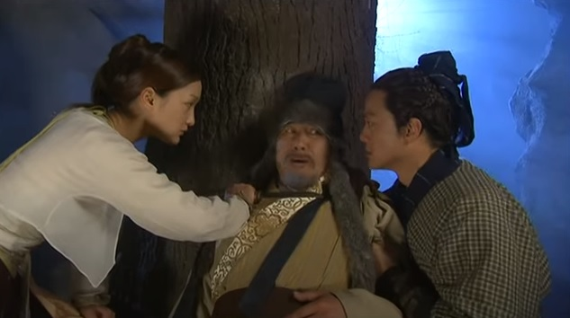
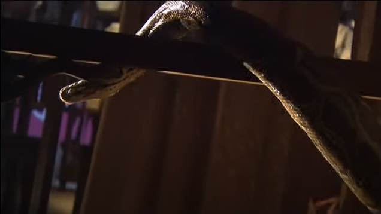
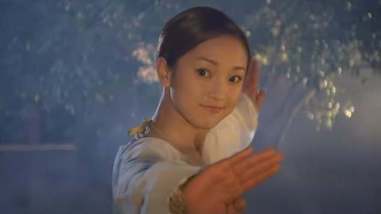
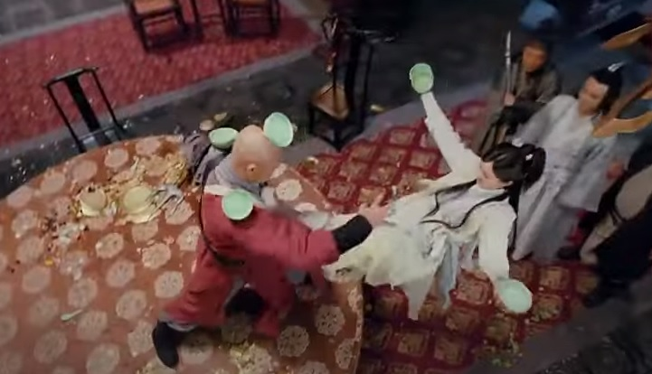
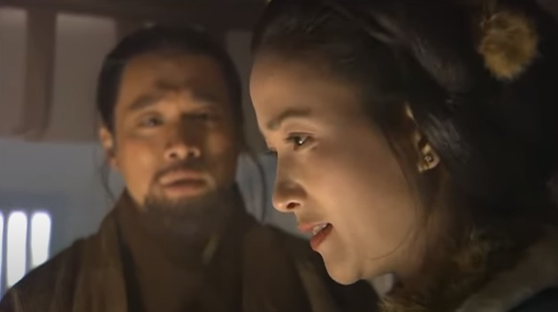

# Tombak Berkarat dan Bajak Rusak

Guo Jing dan Huang Rong kembali ke kediaman Pangeran Zhao dan melompati tembok tinggi untuk memasuki
halaman. Huang Rong berbisik ke telinga Guo Jing, "Qing Gong-mu bagus sekali!" Guo Jing mengendap-endap
di bawah pagar tembok itu untuk mengawasi segala gerakan yang mungkin ada di halaman. Ia senang mendengar
pujian itu. 

Sesaat kemudian, mereka mendengar suara langkah kaki mendekat. Dua orang pria sedang tertawa
dan berbicara sambil berjalan ke arah mereka. Salah satu dari keduanya berkata, "Kau pikir Pangeran Muda
kita mau apa dengan gadis itu?"

Yang satunya tertawa dan berkata, "Sudah jelas, kan? Biarpun dia cantik, tapi setelah melahirkan,
siapa yang akan melirik dia lagi?"

Orang pertama menyahut, "Hati-hati dengan pikiran kotormu, Pangeran Muda bisa memenggal kepalamu!
Biarpun gadis ini cantik, tapi tidak bisa dibandingkan dengan Wang Fei!"

Orang kedua berseru, "Dia anak petani! Masa cerita soal dia kau campur aduk dengan cerita soal Wang Fei?"

Orang pertama menjawab, "Wang Fei, kau bilang dia..." Mendadak ia berhenti bicara, batuk-batuk dua kali dan
mengubah pembicaraan dan berkata, "Pangeran Muda sungguh-sungguh kalah dari Si Sobat Besar itu hari ini,
sebaiknya kau hati-hati, jangan beri dia alasan untuk tersinggung, atau kau akan dipukul!"

Orang kedua menjawab lagi, "Kalau Pangeran Muda mau memukulku, aku menghindar — dan balas menendang..."

Yang pertama tertawa, "Cukuplah omong kosongmu."

Guo Jing berkata pada diri sendiri, "Jadi Wanyan Kang sudah punya pasangan, tidak heran
dia tidak bisa menikahi Nona Mu. Tapi kalau ini benar, seharusnya dia tidak usah ikut menantang
di dalam lomba itu, apalagi mengambil sepatunya. Mengapa dia harus peduli dengan urusan orang lain?
Mungkinkah seseorang yang tidak mau menyetujui suatu urusan, menggunakan kekerasan untuk menyelesaikan
urusan itu?"

Pada detik itu kedua orang itu berjalan sangat dekat dengan Guo Jing dan Huang Rong. Yang
seorang memegang lampu dan yang lain memegang sebuah keranjang berisi makanan. Mereka adalah
pelayan yang mengenakan baju dan topi hijau. Orang yang memegang keranjang tertawa dan berkata,
"Bicara soal orang lain, aku kuatir ada orang yang sudah kelaparan, sebaiknya kita cepat-cepat
mengantarkan sayuran ini!"

Orang lainnya menjawab, "Bagaimana dia bisa memenangkan hati wanita muda kalau dia gagal
mendapat simpati?" Keduanya tertawa sambil berjalan pergi.

Huang Rong merasa sangat penasaran. Ia berbisik kepada Guo Jing, "Ayo kita lihat dulu seperti apa
gadis cantik yang mereka bicarakan tadi."

Guo Jing bertanya, "Bagaimana kalau mengambil obat saja, kan itu lebih penting?"

"Aku ingin lihat gadis ini dulu!" kata Huang Rong dengan keras kepala, dan mulai membuntuti
kedua pelayan itu.

Guo Jing berpikir, "Apa sih menariknya melihat seorang gadis? Itu sungguh aneh."
Yang gagal dipahaminya adalah, kalau seorang wanita mendengar tentang wanita cantik lainnya,
ia tidak akan pernah puas sebelum melihat wanita lain itu dengan kedua matanya sendiri. Kalau
wanita yang mendengar tentang wanita lain itu ternyata juga cantik, maka keinginan untuk melihat
wanita lain itu menjadi semakin besar, supaya ia bisa membandingkan dirinya dengan wanita tersebut.
Namun demikian, Guo Jing tidak punya cukup pengetahuan tentang perempuan, jadi ia tidak tahu
bahwa mereka kadang-kadang bisa sangat menyulitkan. Karena itu ia tidak punya pilihan lain kecuali
menuruti Huang Rong.

Kediaman keluarga Zhao sangat besar, pada dasarnya adalah sebuah istana. Guo Jing dan Huang Rong
membuntuti kedua pelayan itu selama beberapa saat sebelum tiba di depan sebuah bangunan besar. 
Di pintu masuknya, beberapa orang pengawal berdiri dengan senjata di tangan. Guo Jing dan Huang Rong
bersembunyi di belakang salah satu sudut dan mendengar kedua pelayan itu membisikkan sesuatu
kepada para pengawal, lalu para pengawal itu membukakan pintu dan mempersilakan mereka masuk.
Huang Rong mengambil sebuah batu dan melemparkannya ke obor untuk mematikan apinya, sebelum
menarik tangan Guo Jing untuk mengikuti kedua pelayan itu masuk. Huang Rong sangat cepat, sehingga
keduanya berhasil melampaui kedua pelayan itu dalam sekejap. Para pelayan dan pengawal itu
tidak sadar bahwa mereka berdua sudah menyelinap masuk, dan memaki sambil bercanda dan menyalakan
obor kembali. Kedua pelayan itu memasuki sebuah ruangan besar, membuka sebuah pintu kecil di sudut
ruangan, dan berjalan masuk. Guo Jing dan Huang Rong diam-diam mengikuti mereka dan melihat
deretan jeruji besi yang membentuk sel penjara yang besar. Di belakang jeruji itu duduk seorang
pria dan seorang wanita.

Salah seorang pelayan menyalakan sebuah lilin dan meletakkannya di atas meja penjara. Di bawah
cahaya lilin, Guo Jing melihat muka marah dan cemas dari pria itu, yang adalah Mu Yi. Wanita
muda yang duduk di sebelahnya adalah putrinya, Mu Nianci. Guo Jing merasa curiga dan berpikir,
"Bagaimana mereka bisa berakhir di sini? Ah, Wanyan Kang menangkap mereka. Dia mau apa dengan mereka?
Dia suka nona ini atau tidak?" Kedua pelayan itu mengeluarkan arak dan makanan dari dalam keranjang
mereka, dan mendorongnya ke dalam sel.

Mu Yi mengambil sepiring makanan ringan dan melemparkannya keluar sebelum berteriak, "Aku sudah
jatuh ke dalam jebakanmu, jadi bunuh saja aku kalau kau mau. Buat apa pura-pura baik?"

Terlepas dari keributan itu, para pengawal di luar tiba-tiba berkata, "Salam, Xiao Wangye!"

Guo Jing dan Huang Rong saling berpandangan dan buru-buru menyembuntikan diri di belakang
pintu. Mereka melihat Wanyan Kang melangkah masuk dan mengomel, "Siapa yang membuat Mu Daxia
marah? Coba lihat, apa aku tidak akan mematahkan kakimu begitu aku keluar!"

Kedua pelayan itu menjatuhkan diri di atas kedua lutut mereka, "Kami tidak berani."

Wanyan Kang menyahut, "Cepat pergi dari sini!"

Kedua pelayan itu menjawab serempak, "Ya, ya." lalu berbalik untuk meninggalkan tempat itu. Tetapi
ketika mencapai pintu, mereka saling menjulurkan lidah dan melucu sambil melangkah pergi.

Wanyan Kang menunggu sampai mereka menutup pintu sebelum berkata dengan lembut, "Aku mengundang
Mu Daxia dan Nona ke sini untuk beberapa alasan. Tolong jangan tersinggung."

Mu Yi sangat marah, "Kau mengurung kami di sini seperti tawanan, dan masih berani memakai
kata 'mengundang'?"

Wanyan Kang berkata, "Maafkan aku, tolong sabar dulu untuk sementara. Aku sungguh-sungguh
minta maaf."

Mu Yi menyahut dengan marah, "Kau bisa memakai kata-kata ini untuk menipu anak berumur tiga tahun,
tapi aku sudah melihat terlalu banyak pejabat licik untuk ditipu!"

Wanyan Kang beberapa kali mencoba bicara, tapi mulutnya dibungkam oleh kemarahan Mu Yi. Namun
demikian, ia masih tetap bersikap baik dan tertawa dengan santai tanpa marah sedikitpun. 
Mu Nianci mendengarkan perdebatan itu dan berbisik kepada ayahnya, "Ayah, kita dengarkan
dulu dia mau bilang apa." Mu Yi mendengus, sebelum akhirnya tenang.

Wanyan Kang berkata, "Putrimu punya bakat dan kecantikan yang sangat langka. Aku tidak buta,
jadi mana mungkin aku tidak menyukai dia?" Mu Nianci tersipu dan menundukkan kepalanya. Wanyan Kang
melanjutkan, "Tetapi, aku ini ahli waris Pangeran Zhao, dan aturan keluargaku sangat ketat. Kalau
orang tahu bahwa aku menikahi seorang rakyat jelata, ayahku akan murka, dan aku langsung dalam 
kesulitan besar."

Wanyan Kang meneruskan, "Kupikir sebaiknya Mu Daxia dan Nona tinggal di sini dulu beberapa hari
sampai pulih dari cedera, sebelum pulang ke rumah. Setelah satu setengah tahun, kalau keadaannya
membaik, aku akan mengunjungi kalian dan melamar putrimu untuk menikah, atau Mu Daxia yang 
mengirimkan Nona kepadaku untuk melaksanakan pernikahan. Bukankah ini jalan keluar terbaik?"

Mu Yi tetap diam, seakan-akan sedang memikirkan hal lain. Wanyan Kang melanjutkan, "Ayahku
sudah mendapat masalah gara-gara aku. Kaisar bahkan memperingatkan dia tiga bulan yang lalu.
Kalau ayahku sampai tahu semua ini sekarang, dia tidak akan pernah setuju mengenai pernikahan.
Kuharap Mu Daxia mau merahasiakan hal ini untuk sementara."

Mu Yi jadi sewot, "Kalau aku mengikuti ucapanmu, maka putriku akan menderita karena segalanya
harus dibungkus rapat-rapat."

Wanyan Kang menjawab, "Aku sudah merencanakan semuanya. Aku akan mengutus seorang pejabat besar
untuk melamarnya. Ini akan menjadi urusan yang sangat besar dan membahagiakan."

Muka Mu Yi mendadak pucat, ia berkata, "Tolong minta ibumu menemui aku, supaya aku bisa merundingkan
masalah ini dengannya."

Wanyan Kang tersenyum dan berkata, "Mana mungkin ibuku menemuimu?"

Mu Yi berteriak, "Kalau aku tidak ketemu ibumu, aku tidak bakalan menyerah apa pun juga yang
sudah kau rencanakan." Sambil berkata begitu, ia mengambil sebotol arak dan melemparkannya.

Setelah Mu Nianci bertarung melawan Wanyan Kang, ia sudah jatuh cinta kepada pemuda itu,
dan merasa sangat gembira ketika mendengar rencananya. Tetapi ayahnya tiba-tiba meledak,
da itu mengubah segala-galanya. Ia tidak tahu apakah ia sedang terkejut ataukah kecewa.
Wanyan Kang buru-buru menyingkir dan menangkap botol arak itu, dan meletakkannya kembali
di atas meja. Ia tertawa dan berkata, "Aku pergi." Lalu ia berpaling dan meninggalkan
tempat itu.

Setelah mendengar ucapan Wanyan Kang, Guo Jing merasa bahwa Panggeran itu sangat masuk akal
dan rencananya sangat bagus. Tetapi siapa sangka Mu Yi mendadak marah. Ia berpikir, "Aku akan
berusaha meyakinkan dia." Ia baru saja bermaksud mendekati mereka ketika Huang Rong menarik
lengan bajunya dan membawanya keluar dari bangunan itu.

Mereka mendengar Wanyan Kang bertanya kepada pelayan, "Kau sudah bawa?" Si pelayan mengangguk
dan mengangkat tangannya untuk menunjukkan seekor kelinci. Wanyan Kang mengambil kelinci itu,
dan mematahkan kaki belakangnya, sebelum menyelipkannya di dalam saku dan buru-buru berjalan
pergi. Guo Jing dan Huang Rong sangat penasaran dan membuntuti dia. Setelah beberapa saat,
mereka melihat sebuah gubuk kecil yang memiliki tiga ruangan. Itu sebuah gubuk biasa seperti 
milik rakyat, tetapi kehadirannya di tengah-tengah kediaman Pangeran Zhao terlihat sangat 
tidak sesuai dengan keadaan sekelilingnya. Sekarang mereka menjadi lebih penasaran. Wanyan Kang
membuka pintu dan memasuki gubuk itu. Guo Jing dan Huang Rong diam-diam pindah ke belakang gubuk
itu dan mengintip melalui jendela. Mereka yakin ada rahasia mengenai gubuk itu, yang dirahasiakan 
oleh Wanyan Kang. Lalu mereka mendengar sesuatu yang di luar dugaan, ketika ia memanggil seseorang,
"Ibu!"

Suara seorang wanita menjawabnya dan Wanyan Kang masuk ke ruangan. Huang Rong dan Guo Jing
melihat seorang wanita setengah baya sedang duduk di sisi sebuah meja, memandang dengan
tatapan kosong ke langit. Wanita itu terlihat tidak lebih dari empat puluh tahun, dengan
penampilan yang sangat menarik, dengan bedak tipis di wajahnya, dan mengenakan busana
rakyat biasa. Huang Rong berpikir, "Si Putri ini jelas lebih cantik ketimbang Nona Mu, 
tetapi mengapa dia berpakaian sejelek itu dan tinggal di sebuah gubuk seperti ini? Apa
mungkin Pangeran Zhao sudah kehilangan minat dengan dia?"

Guo Jing mula-mula juga berpikir sama, tetapi kemudian ia menganggapnya tidak penting.
Ia menebak, "Dia pasti seperti Rong'Er. Dia sengaja memakai baju petani untuk bersenang-senang."

Wanyan Kang berjalan ke sisinya dan memegang tangannya sambil berkata, "Ibu, kau sakit lagi?"
Wanita itu menghela nafas, "Aku menguatirkan dirimu."

Wanyan Kang menyandarkan diri kepadanya dan cekikikan. "Tapi anakmu selalu sehat di depanmu."

Wanita itu menjawab, "Dengan mata lebam dan hidung patah? Kau bilang itu sehat? Kau makin
lama makin tidak taat. Tidak apa-apa kalau ketahuan ayahmu, tapi kalau sampai ketahuan
gurumu, kau akan dicelupkan ke dalam sup panas."

Wanyan Kang lagi-lagi cekikikan, "Ibu tahu siapa pendeta Tao yang datang ke sini hari ini?"

"Siapa?" tanya wanita itu.

Wanyan Kang menjawab, "Dia adik seperguruan guruku. Aku sengaja pura-pura tidak tahu,
dan memanggilnya Dao Zhang Ini, Dao Zhang Anu. Dia mengomel dan marah-marah, tapi 
tidak bisa berbuat apa-apa." Sambil menceritakan hal itu ia mulai tertawa.

Wanita itu tersadar dan berkata, "Wah, jangan! Aku pernah melihat gurumu mengamuk sebelumnya,
dan dia bisa membunuh orang. Itu betul-betul mengerikan."

Wanyan Kang merasa penasaran dan bertanya, "Ibu melihat guruku membunuh? Kapan? Kenapa dia
sampai membunuh orang?"

Wanita itu mengangkat kepalanya dan memandang lampu, seakan-akan ia sedang berada di suatu
tempat yang jauh. Ia berkata dengan lembut, "Itu sudah lama sekali. Ah, aku sudah tidak ingat lagi!"

Wanyan Kang tidak bertanya lebih lanjut, sebaliknya ia diam-diam mengeluh dan berkata, "Pendeta
Wang itu datang untuk menanyakan bagaimana aku akan mengurus soal perkawinan, dan aku bilang
bahwa jika dia membawa Nona Mu ke sini, aku akan menuruti apa pun yang dia katakan."

Wanita itu bertanya, "Kau sudah tanya ayahmu? Apa dia setuju?"

Wanyan Kang tersenyum, "Ibu terlalu jujur. Aku menyuruh orang untuk menjebak mereka supaya
datang kemari dan mengurung mereka di penjara belakang sebelumnya. Bagaimana caranya Pendeta Wang 
bisa menemukan mereka sekarang?" Wanyan Kang menceritakan peristiwa itu dengan penuh semangat,
sementara Guo Jing di dalam hati sangat marah.

Guo Jing berpikir, "Kupikir dia punya niat baik! Untungnya Pendekar Mu cukup bijaksana, jadi 
tidak masuk jebakannya."

Wanita itu menjawab dengan nada penuh teguran, "Kenapa kau mempermainkan orang ini dan putrinya?
Ayo cepat, bebaskan mereka! Jangan lupa minta maaf dan beri mereka uang."

Guo Jing menganggukkan kepalanya, "Nah, mustinya memang begitu."

Wanyan Kang berkata, "Ibu, kau tidak mengerti! Orang-orang ini tidak peduli soal uang. Kalau
aku membebaskan mereka, lalu mereka menceritakan masalah ini ke orang lain, ayah akan mendengar
semuanya."

Wanita itu jadi cemas, "Kau bermaksud menahan mereka selamanya?"

Wanyan Kang tersenyum, "Aku berusaha untuk bicara manis, supaya mereka mau pulang ke desa
mereka dan dengan bodoh menungguku selamanya di sana." Sambil berkata begitu, ia tertawa
keras-keras.

Guo Jing gemetar saking marahnya. Ia mengangkat telapak tangannya ke arah jendela dan
sudah siap untuk berteriak, ketika ia merasa sebuah tangan yang halus dan lembut menutup
mulutnya dan mencekal pergelangan tangan kirinya. Suara yang lembut berbisik di telinganya,
"Tenang." Kemarahan Guo Jing mereda, dan ia berpaling kepada Huang Rong dengan senyum samar,
sebelum melongok ke dalam ruangan itu lagi.

Wanyan Kang melanjutkan, "Si Sobat bermarga Mu itu betul-betul licik, dia tidak menggigit umpan. Kita
lihat saja berapa lama dia bisa bertahan kalau kutahan dia beberapa hari lagi."

Ibunya menjawab, "Aku sudah melihat Nona Mu dan kukira dia sangat cantik dan berbakat. Dia
cukup mudah disukai. Biar aku bicara dengan ayahmu dan minta restunya supaya kau bisa
menikah dengan gadis itu, dan semua masalah akan selesai."

Wanyan Kang tertawa, "_Niang_ (Ibu), untuk terakhir kalinya, kita ini keluarga bangsawan. 
Bagaimana aku bisa menikahi seorang rakyat biasa seperti dia? Ayah selalu bilang bahwa ia 
akan mengatur perjodohan yang pantas dan terhormat untuk aku. Tapi sayangnya kita ini keluarga
Wanyan."

Wanita itu bertanya, "Kenapa?"

Wanyan Kang menjawab, "Kalau tidak, aku bisa menikahi Sang Putri, dan menjadi Putra Mahkota."

Wanita itu menghela nafas dan berkata dengan suara rendah, "Kenapa kau menghina rakyat miskin... kau kira..."

Wanyan Kang tertawa, "Ibu, aku punya lelucon untuk ibu. Si Mu itu bilang bahwa dia baru percaya
ucapanku kalau dia bertemu dan merundingkan masalah ini dengan ibu."

Wanita itu menyahut, "Aku tidak akan membantumu berbohong dan melakukan hal-hal yang keterlaluan!"

Wanyan Kang cekikikan dan berjalan mengitari ruangan. Ia berkata, "Meskipun ibu mau berbuat begitu,
aku juga tidak akan membiarkan. Ibu tidak bisa berbohong, dan pasti langsung ketahuan."

Huang Rong dan Guo Jing mengamati ruangan itu, yang dilengkapi dengan perabot dari kayu,
dan alat-alat pertanian yang biasa. Di dindingnya tergantung sebatang tombak tua yang 
sudah berkarat. Sebuah bajak yang rusak dan kereta kayu tua terletak di sudut ruangan.
Keduanya berpikir, "Wanita ini seorang Putri. Kenapa rumahnya hanya berisi perabotan 
sederhana begini?"

Wanyan Kang menekan dadanya, dan kelinci di dalam sakunya menjerit. Wanita itu bertanya,
"Apa itu?"

Wanyan Kang menjawab, "Ah, aku hampir lupa. Aku barusan melihat seekor kelinci yang cedera,
dan membawanya ke sini. Ibu, tolong rawat dia." Ia mengeluarkan kelinci putih kecil itu,
dan meletakkannya di atas meja. Kaki belakang kelinci itu patah, dan tidak bisa bergerak.

Wanita itu berkata, "Anak baik!" Ia buru-buru mengambil obat-obatan dan peralatan lain, lalu
mulai merawat kaki kelinci itu.

Guo Jing mulai naik darah lagi dan berpikir, "Orang ini sengaja melukai kelinci karena tahu bahwa
ibunya baik hati dan pasti akan merawat luka kelinci itu. Lalu ibunya akan melupakan segala hal
buruk yang dilakukannya. Kenapa dia bisa sejahat itu, memperalat kebaikan hati ibunya untuk menipunya?"

Huang Rong sedang bersandar di sisinya dan merasa bahwa seluruh tubuh Guo Jing gemetar.
Ia tahu bahwa Guo Jing sedang sangat marah, dan ia kuatir pemuda itu tidak dapat menahan diri,
lalu menyerang Wanyan Kang. Ia menarik tangan Guo Jing dan berkata, "Kita abaikan dulu mereka.
Ayo sekarang kita cari obat."

Guo Jing bertanya, "Kau tahu di mana mereka menyembunyikan obat-obatan itu?"

Huang Rong menggelengkan kepalanya, "Tidak. Jadi kita masih harus mencari-cari."

    
    

        
<em>
        Pria itu terkesiap dan sebelum ia bisa mengatakan sepatah kata pun, Huang Rong membalikkan
        telapak tangannya, dan menodongkan sebuah benda yang berkilau ke arah tenggorokannya.
        Ia bertanya, "Kau siapa?"
        </em>

    

Guo Jing berpikir tentang betapa besarnya kediaman keluarga Zhao ini dan bertanya-tanya
di mana mereka harus mulai _mencari_, "Akan sangat kacau kalau sampai ketahuan Sha Tongtian
dan lainnya..." Ia baru ingin mendiskusikan hal ini dengan Huang Rong ketika melihat
sinar lampu di depan mereka. Seorang pria yang memegang lampion kecil sedang berjalan sambil
bersenandung, dan makin lama makin dekat dengan tempat mereka bersembunyi. Guo Jing baru saja
bermaksud menyelinap di antara pepohonan, ketika Huang Rong berlari keluar, ke arah orang
itu. Pria itu terkesiap dan sebelum ia bisa mengatakan sepatah kata pun, Huang Rong membalikkan
telapak tangannya, dan menodongkan sebuah benda yang berkilau ke arah tenggorokannya.
Ia bertanya, "Kau siapa?"

Pria itu, yang baru mengalami kejutan terbesar sepanjang hidupnya, baru bisa menjawab setelah
beberapa saat, "Aku — aku pengurus rumah. Apa — kau mau apa?"

Huang Rong menjawab, "Aku mau apa? Aku mau membunuhmu! Kau pengurus rumah ya? Baguslah!
Kau simpan di mana semua obat-obatan yang baru dibeli oleh Xiao Wangye itu?"

Si Pengurus Rumah menjawab, "Aku — aku tidak tahu. Xiao Wangye yang menyimpannya sendiri."

Huang Rong menggunakan tangan kirinya untuk memelintir pergelangan tangan pengurus rumah itu,
dan tangan kanannya untuk mendorong ke depan sedikit, menyebabkan benda logam itu tertancap 
lebih dalam di tenggorokan Si Pengurus Rumah. Orang itu merasa kesakitan akibat tusukan 
benda tajam melalui pergelangan tangannya, tetapi ia tidak berani berteriak. Huang Rong berkata
dengan nada rendah, "Mau bilang atau tidak?"

Si Pengurus Rumah menyahut, "Aku sungguh tidak tahu."

Huang Rong menggunakan tangan kanannya untuk menanggalkan topi orang itu dan menjejalkan 
topi itu ke mulutnya. Berikutnya, tangan kirinya menarik dan memelintir lengannya. Suara
'kreekk' terdengar, ia mematahkan bahu kanan Si Pengurus Rumah. Orang itu berusaha berteriak
sebelum jatuh pingsan, tetapi topi di mulutnya meredam suara teriakan itu. Guo Jing terperanjat.
Ia sedikit pun tidak menduga bahwa gadis mungil yang lucu ini sanggup bertindak begitu kejam.
Huang Rong mengguncang-guncangkan tubuh Si Pengurus Rumah, dan ia segera sadar. Ia kemudian
mengambil topi dari mulut orang itu dan mengembalikannya ke kepalanya. Ia berkata, "Kau juga
ingin bahu kirimu patah?"

Si Pengurus Rumah berkata, "Aku sungguh tidak tahu. Biarpun nona membunuhku, aku tetap tidak tahu."

Sekarang Huang Rong percaya keterangannya. Ia merendahkan suaranya dan berkata,
"Cepat cari Xiao Wangye dan bilang kau baru saja jatuh dan bahumu patah. Juga bilang
kau terluka dalam parah dan tabib mengatakan bahwa kau harus minum obat yang dia
beli sebelum ini. Kau harus _memohon_ supaya dia memberikan obat itu." Si Pengurus
Rumah mendengarkan dengan seksama semua instruksi Huang Rong dan tidak berani menanyakan
apa-apa.

Huang Rong melanjutkan, "Cepat, Xiao Wangye sedang menemui Wang Fei. Aku akan mengikutimu,
kalau sampai kulihat kau bertingkah macam-macam, aku akan mematahkan lehermu dan mengorek
matamu." Bersamaan dengan itu, ia menjulurkan jari-jarinya dan membuat gerakan seperti mencakar
mata orang itu. Si Pengurus Rumah gemetar dan bangkit berdiri. Ia menggertakkan giginya, mengabaikan
rasa sakit yang teramat sangat, dan buru-buru pergi menuju ke gubuk Sang Putri.

Wanyan Kang masih mengobrol dengan ibunya ketika Si Pengurus Rumah tiba-tiba muncul di situ,
berkeringat dan menangis. Ia mengulangi semua yang diinstruksikan oleh Huang Rong. Sang Putri
melihat bahwa mukanya sepucat kertas dan tahu bahwa ia sedangan sangat kesakitan. Ia tidak
menunggu sampai Wanyan Kang menjawab, dan buru-buru menyuruhnya untuk memberikan obat-obatan itu.
Wanyan Kang cemberut dan berkata, "Obat-obatan itu disimpan oleh Ketua Liang, kau cari saja dia."

Si Pengurus Rumah meringis dan berkata, "Xiao Wangye, tolong tulis selembar surat untuk ini."
Sang Putri segera mengeluarkan selembar kertas, tinta dan sebuah kuas. Wanyan Kang menulis
surat keterangan itu. Si Pengurus Rumah membungkuk dan berterima kasih kepada mereka berdua,
sementara Sang Putri berkata dengan lembut, "Cepat, ambil obat untuk mengobati cederamu."

Si Pengurus Rumah keluar dari gubuk itu dan berjalan beberapa langkah ketika ia merasa
ada benda dingin yang tajam menempel di lehernya. Ia mendengar Huang Rong berkata,
"Sekarang cepat pergi ke Ketua Liang." Ia berjalan sedikit, tetapi ia tidak bisa menahan
rasa sakit lagi dan terjatuh. 

Huang Rong berkata, "Kalau kau tidak segera mengambil obat, lehermu akan patah." Ia memegang
kepala orang itu dan memaksanya memalingkan muka. Si Pengurus Rumah terkejut dan mendadak ia
merasa tekadnya membulat. Dengan keringat bercucuran ia melanjutkan langkahnya. Mereka berpapasan
dengan tujuh atau delapan orang pelayan, tetapi tak seorang pun menanyakan apa-apa ketika melihat
Huang Rong dan Guo Jing.

Ketika tiba di ruangan Liang Ziwong, ternyata pintunya dikunci. Seorang pelayan mengatakan
bahwa ia sudah pergi ke Ruang Tamu Salju Harum. Guo Jing melihat bahwa Si Pengurus Rumah
agak kesulitan berjalan dan membantunya. Tepat pada saat mereka tiba di ruang tamu itu,
dua orang pengawal yang memegang lampion dan golok berteriak memanggil, "Hei, berhenti!
Siapa di sana?"

Si Pengurus Rumah mengeluarkan surat keterangan yang ditulis oleh Wanyan Kang dan menunjukkannya
kepada pengawal. Mereka melihat sekilas dan membiarkan ia lewat sebelum menanyai Guo Jing dan 
Huang Rong. Kata Si Pengurus Rumah, "Mereka orang sendiri."

Salah seorang pengawal berkata, "Pangeran sedang mengadakan menjamu tamu penting, semua
orang dilarang mengganggu mereka. Kalau ada yang ingin dibicarakan, sebaiknya kalian
datang besok..." ia tidak dapat menyelesaikan kalimatnya karena mendadak keduanya merasa
tenaga mereka hilang. Mereka tidak bisa bergerak karena Huang Rong menotok jalan darah
mereka. Ia menyembunyikan mereka ke semak-semak, lalu menarik tangan Guo Jing dan mereka
berdua memasuki gedung itu. Ia mendorong Si Pengurus Rumah perlahan. Ia dan Guo Jing
melompat untuk menangkap pinggiran jendela kayu, lalu mengintip ke dalam ruangan itu.

Ruangan itu sangat terang, dengan sebuah meja perjamuan yang besar di tengah-tengahnya.
Guo Jing mengamati orang-orang yang duduk mengelilingi meja itu dan jantungnya berdebar
kencang karena gusar. Ia melihat orang-orang yang sama di ruangan yang sama seperti
sebelumnya. Di situ hadir Ketua Muda dari Gunung Onta Putih, Ouyang Ke, Raja Naga dari
Kelompok Iblis, Sha Tongtian, dan adik seperguruannya Si Naga Berkepala Tiga, Hou Tonghai,
juga Dewa Ginseng, Liang Ziwong dan Si Jagal Bertangan Seribu, Peng Lianhu. Yang duduk di
ujung meja itu adalah Pangeran Keenam Jin, Wanyan Honglie. Di salah satu sudut meja tampak
sebuah kursi besar, yang ditempati oleh Si Kebajikan Tertinggi, Ling Zhi, yang mukanya
keemasan dan kelihatannya sedang terluka parah. Guo Jing tertawa dalam hati, "Kau menjebak
Wang Dao Zhang, dan akhirnya jadi bumerang."

Si Pengurus Rumah memasuki ruangan dan membungkuk ke arah Liang Ziwong, lalu menunjukkan
surat keterangan dari Wanyan Kang. Liang Ziwong membaca surat itu, memandang Si Pengurus
Rumah sekilas, dan menyerahkan surat itu kepada Wanyan Honglie. "Yang Mulia, apakah ini
tulisan Pangeran Muda?"

Wanyan Honglie membaca surat itu dan berkata, "Ya, tolong lakukan seperti yang tertulis,
Ketua Liang."

Liang Ziwong berpaling dan memberi perintah kepada seorang cebol yang memakai setelan hijau,
"Ambil masing-masing 5 gram obat yang dibeli oleh Xiao Wangye hari ini. Berikan kepada
pengurus rumah ini." Si Cebol mengangguk dan mengikuti Si Pengurus Rumah keluar.

Guo Jing berbisik kepada Huang Rong, "Ayo kita pergi, orang-orang ini terlalu tangguh."

Huang Rong tersenyum dan menggelengkan kepalanya. Sehelai rambut Huang Rong yang lembut
menyapu muka Guo Jing dan ia merasa tergelitik oleh sensasi tidak hanya di mukanya, tapi
juga di hatinya. Ia tidak membantah, tapi pegangannya terlepas dan ia hampir terjatuh. 
Huang Rong buru-buru memegang pergelangan tangannya, melayangkan tubuhnya ke depan, 
mengunci kedua kakinya melingkari sebatang tiang kayu, lalu menurunkan Guo Jing dengan ringan. 

Guo Jing merasa lega, "Hampir saja! Kalau aku sampai melompat turun, itu akan mengejutkan
semua ahli silat di dalam itu." Guo Jing bukan seorang petualang yang berpengalaman di Jianghu,
dan ia seringkali ceroboh.

Si Pengurus Rumah dan Si Cebol keluar dan Guo Jing membuntuti mereka. Ia berjalan 
sepuluh langkah sebelum berpaling dan melihat Huang Rong berjungkir balik dan mengintip
ke dalam ruangan dengan kedua kakinya terkait pada ujung atap, kepalanya tergantung
di bawah. Saat itu angin bertiup pelan, membuat jubah putihnya melayang lembut. Pemandangan
itu seperti bunga lili bermekaran di kegelapan. Huang Rong memandang sekilas ke dalam ruangan
dan melihat bahwa tak seotang pun menyadari kehadirannya. Ia memalingkan kepalanya dan
mengawasi sampai bayangan Guo Jing menghilang dalam kegelapan, lalu mengalihkan perhatiannya
kembali kepada apa yang sedang terjadi di dalam ruangan itu.

Peng Lianhu tiba-tiba berpaling, dan dengan mata secepat kilat ia memeriksa keluar jendela.
Huang Rong tidak berani mengintip lebih lama lagi, dan meringkuk di dekat jendela sambil
mendengarkan apa yang sedang terjadi. Ia mendengar suara nyaring bicara, "Kalian pikir
Wang Chuyi muncul secara kebetulan atau dengan salah satu alasan?"

Suara bernada tinggi menanggapi, "Tidak peduli dia punya niat buruk atau tidak, setelah
dilukai oleh Kebajikan Tertinggi Ling Zhi, ia pasti mati, atau setidaknya cacat."

Huang Rong mengintip sekilas ke dalam ruangan dan melihat bahwa yang sedang bicara adalah
Peng Lianhu, yang bertubuh kecil dengan mata tajam seperti kilat. Ia mendengar suara tertawa
yang jernih, "Kita bahkan sudah mendengar nama Tujuh Pendekar dari Quanzhen di Tibet. Mereka
sungguh-sungguh pantas mendapat julukan itu. Kalau bukan karena Zhi Shang De Ling Zhi menyerang,
kita semua pasti sudah dikalahkan oleh Pendeta itu."

Sebuah suara yang kasar dan dalam menjawab, "Ketua Ouyang, kau tidak usah memujiku. Aku dan
Pendeta Tao itu sama-sama terluka. Di sini tidak ada yang menang."

Ouyang Ke berkata, "Ya, tapi kau hanya perlu memulihkan diri sebentar, sementara itu
meskipun tidak mati, tapi dia bisa jadi cacat!"

Setelah komentar itu tidak ada yang bersuara. Terdengar suara tuan rumah memberikan _toast_
kepada masing-masing tamu yang berkumpul di situ. Ia berkata kepada mereka, "Daxia
sudah jauh-jauh datang untuk mengunjungi aku, aku merasa sangat tersanjung! Ini juga mencerminkan 
betapa Kekaisaran Jin mendapat kehormatan besar dengan kunjungan Daxia!" Huang Rong berpikir bahwa
orang yang sedang bicara itu pastilah Pangeran Zhao, Wanyan Honglie. Para tamu kemudian membalas
dengan nada rendah hati, sesuai dengan sopan-santun yang sudah umum saat itu.

Kemudian Wanyan Honglie melanjutkan, "Ling Zhi adalah biksu utama di Tibet, Liang adalah seorang
ahli yang berpengetahuan luas dan penuh integritas, Ketua Ouyang adalah pemimpin dengan 
kemampuan militer yang tinggi, prestasi Ketua Peng sangat disegani semua orang di dataran pusat,
dan Pendekar Sha menguasai Sungai Kuning! Kalau salah satu dari kelima pendekar datang membantu,
maka segala tantangan bagi Negeri Jin akan bisa diatasi, tapi bayangkan apa yang akan bisa
diwujudkan kalau kalian berlima bergabung! Haha...! Rasanya seperti seekor singa menggunakan
seluruh kekuatannya untuk menangkap kelinci!" Pidato ini membuat dia terdengar betul-betul arogan.

Liang Ziwong tersenyum dan berkata, "Kalau Yang Mulia punya sebuah tugas untuk diselesaikan,
maka Yang Mulia hanya perlu mengatakannya, dan kami akan melaksanakannya dengan segala senang hati.
Sayangnya kungfu orang tua ini sangat kasar dan lemah. Aku kuatir seandainya Yang Mulia mempercayakan
suatu tugas kepadaku, aku akan gagal dan tidak berani lagi menunjukkan mukaku yang tidak
berharga ini, haha...!" Peng Lianhu juga menambahkan beberapa komentar rendah hati dengan nada
yang sama. Orang-orang ini selalu menjadi pusat perhatian di daerah mereka masing-masing.
Baik kelakuan maupun ucapan yang mereka tunjukkan _sebenarnya_ tidak memperlihatkan bahwa mereka lebih
rendah dibandingkan dengan Wanyan Honglie.

Sekali lagi Wanyan Honglie memberikan _toast_ bagi para tamunya dengan secawan arak.
"Pangeran yang hina ini sungguh terharu dengan kehadiran kalian semua malam ini.
Aku akan ingin membicarakan sebuah masalah penting. Masalah ini tidak boleh sampai
bocor ke orang lain di luar ruangan ini. Kalau sampai tersebar keluar, akan menyebabkan
kesulitan besar bagi Negeri Jin kita. Pangeran yang hina ini punya keyakinan kuat
mengenai kemampuan kalian semua dalam menjaga rahasia."

Kalimat tersebut, meskipun diucapkan dengan nada rendah hati, tetapi mengandung sesuatu
yang sangat penting, yang menyebabkan semua orang yang hadir memperhatikan bahwa ini adalah
sebuah urusan sangat serius dan bersifat sangat rahasia. Mereka semua menjawab, "Yang Mulia
tidak usah kuatir, tidak akan ada sepatah kata pun yang akan bocor dari pembicaraan malam ini!"
Kelima tamu itu menyadari betapa pentingnya urusan tersebut, sehingga Wanyan Honglie tidak
ragu-ragu mengirimkan hadiah-hadiah berupa emas, perak dan barang-barang berharga lainnya,
meskipun hingga saat itu ia masih tetap belum menyinggung tugas apa yang akan diberikan kepada
mereka. Sekarang kelihatannya ia siap membeberkan sesuatu yang sangat dirahasiakan, jadi semua
orang yang hadir di situ merasa sangat tertarik dan bersemangat.

Wanyan Honglie melanjutkan, "Dalam masa pemerintahan Kaisar Taizong dari Jin, di tahun
ketiga era Tianhui (tahun ketujuh dari Kaisar Hui Zong dari Song, era Xuanhe), para
prajurit Jin kita, dipimpin oleh jendral Youzhanmeihe dan Wolibu, berhasil menangkap
kedua Kaisar Song, Hui Zong dan Qin Zong. Sejak jaman kuno, belum pernah ada kemenangan
yang sebesar itu dalam sejarah." Para tamu menyoraki pidatonya.

Huang Rong berpikir sendiri dengan marah, "Sungguh tidak tahu malu! Semuanya, kecuali si
biksu Tibet itu, adalah orang Song! Si Pangeran Jin itu sedang membanggakan kehebatan
negerinya waktu menyerbu negeri kita dan menyandera kedua kaisar itu, dan kalian semua
_sungguh-sungguh_ menyoraki dia!"

Ia mendengar Wanyan Honglie bicara lagi, "Pada saat itu, pasukan Negeri Jin kita sangat
tangguh dan jumlah mereka sangat besar, tapi sekarang, setelah hampir seratus tahun, para
pejabat Zhao melayani kaisar kita dari Huangzhou. Para Tamu Yang Terhormat, bisakah dibayangkan
_mengapa_ mereka melayani dari sana?"

Liang Ziwong berkata, "Mohon Yang Mulai memberikan pencerahan."

Wanyan Honglie menghela nafas, "Pada tahun ketika Yue Fei mengalahkan kita dan kita ad di 
dalam genggamannya, tidak ada orang yang tidak tahu, tapi siapa yang berani membicarakannya 
keras-keras? Para jendral Jin kita tahu bagaimana memimpin tentara, tapi ketika mebghadapi
Yue Fei, mereka selalu kalah. Bahkan setelah Qin Hui memerintahkan supaya Yue Fei dieksekusi,
moral pasukan kita masih tetap rendah akibat kekalahan telak mereka sebelumnya, jadi mereka
mereka kurang percaya diri untuk menindak lanjuti penyerbuan ke wilayah Song Selatan. Meskipun
Pangeran yang hina ini punya ambisi untuk bertindak, tetapi tidak mampu meneruskan. Kalau
sahabat sekalian, dengan kemampuan kalian yang setingkat para dewa, bersedia membantu, maka tidak
mungkin kita gagal untuk meraih prestasi besar."

Para tamu itu saling berpandangan tanpa memahami apa arti ucapannya. Masing-masing berpikir,
"Menyerang musuh dan berperang, menaklukkan kota dan merebut wilayah... itu semua bukan keahlianku.
Apa mungkin dia mau menyuruh kita membunuh salah satu jendral Song?"

Wajah Wanyan Honglie memperlihatkan secara tersamar rasa puas akan kemampuannya sendiri.
Suaranya agak gemetar saat berkata, "Beberapa bulan yang lalu, pangeran yang hina ini 
memeriksa berkas-berkas lama di istana, dan kebetulan menemukan sepucuk surat  yang ditinggalkan
oleh mantan kaisar. Sebetulnya surat itu mengandung beberapa baris tulisan Yue Fei, yang
kutipannya sangat bermakna. Aku berusaha menebak-nebak semua itu selama beberapa bulan,
sampai akhirnya berhasil menyimpulkan sebuah makna tersembunyi. Ternyata selama Yue Fei
meringkuk di penjara, ia sudah kehilangan harapan untuk bisa dibebaskan hidup-hidup. Kesetiaannya
kepada negara teramat sangat besar, sehingga ia menuliskan semua taktik perang yang dipelajarinya
seumur hidup dan juga rahasia strategi militer di dalam surat, dengan harapan bahwa semua itu bisa
diturunkan kepada para negarawan setia lainnya, yang akan bisa digunakan untuk mempertahankan
Negeri Song melawan bangsa Jin. Untungnya, Qin Hui sangat pintar dan kuatir Yue Fei akan
mencoba menghubungi seseorang di luar penjara, jadi dia sangat berhati-hati melakukan berbagai
pencegahan terhadap hal ini. Semua pengawal yang terpilih untuk menjaga Yue Fei dipilih sendiri
oleh Qin Hui, dan sudah terbukti dapat dipercaya dan setia kepada Qin Hui. Kalau pasukan yang
sebelumnya di bawah komando Yue Fei sampai bisa berhubungan dengan dia, lalu membangkitkan
pemberontakan melawan pemerintah, siapa yang bisa melawan? Pada saat itu, satu-satunya alasan
mengapa tidak sampai ada pemberontakan adalah karena Yue Fei sendiri tidak bersedia memberontak
melawan kaisarnya. Seandainya ia berubah pikiran dan akhirnya memberontak, maka ia akan sukses.
Tapi yang tidak diketahui Qin Hui adalah, sebetulnya Yue Fei juga tidak berminat
untuk menyelamatkan nyawanya sendiri, yang ingin diselamatkannya adalah _Jiang Shan_ (secara literal
berarti 'Sungai dan Gunung', artinya adalah sebuah negara) — dari Negeri Song. Untungnya surat itu
tidak pernah meninggalkan istana bahkan setelah dieksekusinya Yue Fei." Semua orang menyimak baik-baik
cerita itu, begitu seriusnya sampai mereka lupa minum araknya. Huang Rong, yang bergelantungan
di luar jendela, juga mendengarkan dengan penuh minat.

Wanyan Honglie melanjutkan, "Yue Fei tidak punya pilihan lain, kecuali menuliskan
semua rahasia pengetahuan militernya di pakaiannya. Lalu ia menulis empat puisi yang
berjudul Pu Sa Man, Chou Nu Er, He Sheng Zhao, dan Qi Tian Yue. Masing-masing bagian
dari tulisan itu kelihatannya seperti omong kosong. Gaya tulisannya tidak mengikuti
aturan yang benar dan urutan nadanya semuanya salah. Semua kalimatnya aneh dan sama
sekali tidak saling berkaitan. Qin Hui yang dikatakan memiliki kebijaksanaan dan bakat
sedalam lautan, tidak mampu menangkap arti tersembunyi di balik potongan-potongan puisi
itu, jadi ia mengirim utusan membawa surat ini ke Jin. Beberapa tahun kemudian, keempat
potongan tulisan yang berisi _omong kosong_ tersebut menjadi bagian dari tumpukan berkas-berkas
rahasia di istana Kekaisaran Jin. Tidak ada orang yang mampu menyingkapkan makna dari
isi surat tersebut. Semua orang berpikir bahwa Yue Fei, yang sudah menjelang saat eksekusi
ketika menulis surat itu, dikuasai oleh amarahnya sendiri dan frustasi, sehingga menulis
puisi yang sangat kacau dan tak bermakna seperti itu. Tidak ada yang menduga bahwa sebenarnya
di balik semua _omong kosong_ itu tersembunyi sebuah rahasia yang teramat sangat besar!"

    

    Keempat judul puisi di atas diterjemahkan ke dalam bahasa Inggris menjadi istilah berikut:
    <ol>
        <li>Pu Sa Man (菩萨蛮) = Buddhist Barbarian</li>
        <li>Chou Nu Er = Shameful Slave</li>
        <li>He Sheng Zhao = Congratulating The Imperial Court Sage</li>
        <li>Qi Tian Yue = Level Heaven Music</li>
    </ol>
    

    

        Saya tidak tahu bagaimana tim penerjemah bahasa Inggris sampai pada kesimpulan tersebut,
        dan saya gagal menangkap makna tertentu dari istilah bahasa Mandarinnya, kecuali yang kedua,
        yaitu 'Chou Nu Er' (臭女儿), yang dibenak saya maknanya adalah 'Anak Perempuan Busuk'. Ini adalah semacam
        makian yang ditujukan kepada anak perempuan sendiri (Nu Er 女儿 = anak perempuan, Chou 臭 = busuk atau bau).
    

    

       Judul yang pertama, yaitu Pu Sa Man saya temukan melalui Google Translate ditambah sedikit
       logika, karena Buddha akan diucapkan sesuai kata itu sendiri (Pu Sa). Sedangkan Man (蛮) memiliki
       makna yang cukup bervariasi, dan kelihatannya bisa tidak berhubungan dari satu ke lain makna.
       Salah satunya yang berupa <em>noun</em>, memang adalah 'Barbarian'. Tetapi ketiga karakter itu kalau 
       disusun dengan urutan di atas seperti tidak bermakna.
    

    

        Dari judul-judul di atas kita bisa menangkap bahwa isi dari tulisan yang mengikutinya
        memang sekacau judulnya, dan jauh dari apa yang diharapkan orang tentang sebuah sajak, puisi, atau syair.
    

"Pangeran yang hina ini," lanjut Wanyan Honglie, hampir-hampir tak dapat menyembunyikan
kebanggaan dirinya lagi. "terus berusaha memahami arti semua tulisan _kacau_ itu, sampai
akhirnya aku menemukan rahasianya. Ternyata, kalau kita mengambil setiap kata ketiga dari
setiap potongan kalimat dan menyatukan semuanya, lalu membalikkan urutannya, sebuah pesan
terungkap. Dalam empat surat itu, Yue Fei memberikan perintah kepada para pewarisnya 
dalam sebuah seni strategi perang dan terus menerus menyerang di sekitar wilayah Sungai Kuning,
dan menyingkirkan pasukan Jin. Terlepas dari semua kerja kerasnya bagi kaisarnya, akhirnya
semua itu menjadi sia-sia. Haha...!" Para tamu terkesima, lalu mereka mulai memuji kecerdasan
Wanyan Honglie karena berhasil memecahkan teka-teki sesulit itu.

Wanyan Honglie berkata, "Kemampuan militer Yue Fei sungguh-sungguh tiada duanya. Ketika
ia menyerang, tidak ada lagi yang lebih dahsyat dan sukses dari dia. Bayangkan kalau
kita bisa mendapatkan buku berisi strategi militernya, maka keseluruhan wilayah Kekaisaran
akan jatuh ke tangan kita!"

Ia meneruskan kesimpulannya, "Pangeran yang hina ini berpikir bahwa buku yang hebat ini
pastilah tersimpan rapi bersama Yue Fei, di dalam makamnya." Sampai di sini ia berhenti.
Semua orang tiba-tiba menyadari apa yang diminta: 'Pangeran Zhao mengundang kita ke sini
untuk merampok makam!'.

"Saudara-saudaraku Yang Terhormat," lanjut Wanyan Honglie, sambil mengamati wajah para pendengarnya
baik-baik. "Kalian semua adalah pahlawan besar, dan saat ini kalian mungkin bertanya-tanya 
bagaimana mungkin aku meminta kalian merampok kuburan orang. Meskipun Yue Fei adalah seorang 
musuh bebuyutan bangsa Jin, tetapi semangat dan kesetiaannya adalah sesuatu yang sudah 
dikenal oleh dunia ini. Kita tidak bisa mengganggu tempat peristirahatannya. Pangeran yang 
hina ini menelusuri laporan sejarah dari para mata-mata dari Song Selatan untuk mendapatkan 
bukti lebih lanjut. Ternyata ketika Yue Fei meninggal, ia dimakamkan di sisi Jembatan Zhongan. 
Di kemudian hari, Kaisar Xiao Zong memindahkan jenazahnya ke Danau Barat Lin'an (Xi Hu), 
ke sebuah kuil yang dibangun kaisar untuk dia. Semua pakaian dan barang-barang pribadi 
lainnya disimpan di tempat lain dan tempat ini pastilah tempat di mana kita bisa 
menemukan buku itu. Tempat lain ini juga berada di Lin'an." Ketika mengucapkan kalimat 
terakhir itu ia mengamati semua tamunya dengan teliti. Mereka semua menunggunya mengungkapkan 
di mana tepatnya lokasi itu.

Tetapi Wanyan Honglie mendadak mengganti topik pembicaraan. "Pangeran yang hina ini punya
beberapa pemikiran. Karena seseorang sudah memindahkan jenazah Yue Fei, aku kuatir buku itu 
pasti sudah diambil juga oleh orang ini. Melalui penelitian yang sangat mendalam, aku sekarang
tahu bahwa hal ini tidak mungkin terjadi. Rakyat Song begitu menghormati Yue Fei, sehingga mereka
tidak mungkin berani mengganggu barang-barang pribadi peninggalannya. Kita pasti akan menemukan
buku itu di tempat ini. Tetapi, di Selatan ada banyak sekali ahli kungfu yang berilmu tinggi.
Kalau mau sukses, kita tidak boleh membocorkan sedikit pun cerita ini, atau akan ada orang
dari mereka yang berusaha untuk mencari sendiri buku itu. Itu akan menciptakan kesulitan
yang tak berujung bagi Kekaisaran Jin! Tugas ini menyangkut nasib kedua negara dan ini bukan
urusan yang bisa dianggap remeh, kecuali kalau aku bisa mendapat bantuan dari para pendekar
besar di dunia persilatan." Semua orang menganggukkan kepala.

Wanyan Honglie kemudian berkata, "Letak buku ini sendiri sama sekali _bukan_ urusan kecil,
dan _memang_ sulit untuk dikatakan, tetapi di hadapan orang-orang yang berilmu tinggi
jauh lebih mudah mengatakannya. Tepatnya tempat ini adalah..." Tepat pada saat itu pintu
mendadak didorong hingga terbuka dan seorang pria buru-buru masuk, mukanya bengkak dan pucat.
Ia menghampiri Liang Ziwong dan memanggil, "Guru..." semua orang mengenalinya sebagai Si Cebol
yang mengenakan setelan hijau, yang disuruh Liang Ziwong mengambil obat.

***

    
    

        
<em>
        Ketika ia berbalik untuk meninggalkan ruangan itu, sikunya tanpa sengaja menyenggol 
        sebuah keranjang bambu berukuran besar yang jatuh ke samping. Setelah tutupnya terbuka, 
        mendadak seekor ular raksasa berwarna merah darah melompat keluar dari keranjang itu 
        tepat ke arah mukanya.</em>

    

Ketika Guo Jing pergi bersama Si Pengurus Rumah dan Si Cebol untuk mengambil obat, ia
menggunakan tangan kirinya untuk membantu Si Pengurus Rumah berjalan, tetapi juga memastikan
bahwa orang itu tidak akan berusaha memperingatkan Si Cebol mengenai dirinya. Ketiganya
berjalan di sepanjang lorong dan melewati beberapa ruangan sebelum tiba di ruangan penyimpanan
obat Lian Ziwong. Si Cebol menyalakan lilin, membuka pintu dan masuk.

Guo Jing berdiri di dekat ruangan itu, di mana ia mencium bau aneka macam obat-obatan herbal.
Ia juga melihat bahwa sebuah meja, bangku panjang, lantai dan semua tempat lain dipenuhi oleh
dedaunan kering. Di situ ada botol-botol, besar dan kecil, toples, cawan, mangkuk, dan seterusnya.
Kelihatannya meskipun Lian Ziwong adalah seorang tamu di situ, tetapi ia masih tidak dapat menahan
diri untuk bermain-main dengan aneka macam bahan-bahan herbal, berusaha meracik beberapa macam
obat. Si Cebol tampaknya sangat mengenal semua bahan-bahan itu dan ia segera memilih beberapa
porsi dari empat macam bahan herbal, lalu membungkusnya dengan kertas putih, masing-masing menurut
jenisnya sendiri, lalu memberikannya kepada Si Pengurus Rumah.

Guo Jing mengulurkan tangannya dan mengambil semua bungkusan itu, lalu berbalik dan
meninggalkan ruangan. Setelah ia berhasil mendapatkan semua obat-obatan itu di tangannya,
ia tidak lagi memperhatikan Si Pengurus Rumah. Sayangnya, Si Pengurus Rumah itu cukup licin.
Ketika Guo Jing dan Si Cebol meninggalkan ruangan, ia sengaja diam di belakang mereka, dan
menunggu sampai mereka melewati pintu. Kemudian ia mendadak membanting pintunya, dan memasang
palang pintu untuk menutupnya dari dalam, sambil berteriak, "Rampok, maling!" Saking terkejutnya,
Guo Jing segera berbalik dan berusaha mendorong pintu, dan mendapati kenyataan bahwa pintu
itu tidak bisa dibuka. Si Cebol yang meskipun kecil, bukan berarti lambat berpikir. Ia segera
mengenali situasi dan mengambil kesempatan selama Guo Jing belum sepenuhnya sadar mengenai apa
yang terjadi. Ia segera merebut keempat bungkus obat dari tangan Guo Jing dan melemparkannya 
ke dalam kolam di sebelah ruangan itu. Guo Jing berusaha memukul Si Cebol dengan tinjunya, 
tetapi Si Cebol terlalu cepat dan berhasil melarikan diri.

Guo Jing makin gugup dan marah, ia mendorong kedua telapak tangannya ke arah pintu dan
mengerahkan tenaga dalam untuk mendobrak pintu itu. Terdengar suara keras ketika palang
pintu itu patah dan pintunya berhasil dibuka. Guo Jing menerjang masuk dan membungkam
Si Pengurus Rumah dengan sebuah _swing_ ke arah dagunya. Untung bagi Guo Jing, Liang Ziwong 
tidak mau diganggu, jadi ia memilih lokasi yang agak jauh dari kompleks kediaman utama
di istana itu. Karena jauh dari bangunan lain, suara teriakan Si Pengurus Rumah tidak
membangunkan siapa pun. Ia buru-buru keluar ruangan dan melihat Si Cebol sudah jauh.
Guo Jing mengejarnya dan dalam sekejap berhasil mencekal lehernya. Ketika Si Cebol melihat
Guo Jing di belakangnya, berusaha menggunakan kakinya untuk menyapu Guo Jing. Ia tidak
asing dengan perkelahian karena harus mengikuti Liang Ziwong yang seringkali menempuh
bahaya, karena itu ia tidak lemah. Guo Jing tahu bahwa ia terjebak dalam bahaya, bukan
hanya gagal mendapatkan obat untuk Wang Chuyi, tetapi juga setelah tanda bahaya disebarkan,
maka Huang Rong akan terancam maut kalau sampai tertangkap. Karena tidak bisa membuang-buang
waktu lagi, maka ia menggunakan jurus yang paling kejam seperti 'Mencabut Otot dan Memisahkan
Tulang' yang diajarkan Tujuh Orang Aneh dari Jiangnan.

Guo Jing dengan segera membuat Si Cebol itu pingsan, lalu buru-buru menyembunyikannya
di tengah semak-semak di pinggir jalan setapak. Kemudian ia buru-buru kembali ke ruang
penyimpanan obat dan menyalakan lilin. Cahaya temaram menerangi Si Pengurus Rumah, yang masih
tergeletak pingsan di lantai.

Guo Jing mengutuk diri sendiri karena kurang hati-hati. "Si Cebol itu tadi mengambil
obat dari toples yang mana? Aku tadi tidak memperhatikan dan sekarang aku tidak tahu
obat mana yang dia pilih." Semua toples itu ditandai dengan simbol-simbol aneh tapi
tanpa tulisan. Ia berpikir keras, "Aku ingat tadi dia berdiri di sini, jadi sebaiknya
aku ambil saja semuanya sedikit-sedikit, biar Wang Chuyi bisa memilih sendiri yang
diperlukan." Ia buru-buru mengambil setumpuk kertas dan mulai mengambil segenggam
penuh daun-daunan obat dari masing-masing toples, lalu membungkusnya dengan kertas,
sambil berdebar-debar karena kuatir ada orang yang mendengar teriakan Si Pengurus Rumah
itu sebelumnya.

Setelah semua bahan terbungkus rapi, ia merasa sangat lega. Ketika ia berbalik untuk 
meninggalkan ruangan itu, sikunya tanpa sengaja menyenggol sebuah keranjang bambu
berukuran besar yang jatuh ke samping. Setelah tutupnya terbuka, mendadak seekor ular
raksasa berwarna merah darah melompat keluar dari keranjang itu tepat ke arah mukanya.

Guo Jing terperanjat dan melompat ke mundur. Ia melihat ular itu masih setengah terperangkap
di dalam keranjang, jadi ia tidak tahu pasti sepanjang apa ukurannya. Kepalanya meliuk-liuk
maju mundur sambil menjulurkan lidahnya yang bercabang ke arahnya. Mongolia memiliki tanah
yang dingin, dan semua ular yang pernah dilihatnya di situ kecil-kecil. Ular merah darah itu
jelaslah bukan seperti semua ular yang pernah dilihatnya. Ia merasa ketakutan sehingga ia 
melangkah mundur perlahan-lahan sampai menabrak meja dan menjatuhkan lilin. Lilin itu langsung
padam dan ruangan itu seketika gelap gulita.

Dengan obat di tangannya, ia segera berlari ke arah pintu. Tepat pada saat ia mencapai
pintu, ia merasa ada sesuatu melilit kakinya, seolah-olah ada orang yang mengikatkan
seutas tambang tebal erat-erat ke situ. Karena tak ada waktu untuk berpikir lagi, ia
berusaha melompat. Sayangnya, _benda_ itu tidak mau melepaskannya, dan kemudian ia
merasakan sensasi dingin di lengan kanannya, dan menyadari bahwa ia tidak lagi bisa 
menggerakkannya.

Guo Jing tahu bahwa ular itu sudah membelitnya, jadi ia menggunakan lengan kirinya untuk
meraba pinggangnya, mencari belati pemberian Temujin. Mendadak bau khas obat-obatan herbal
mengganggu hidungnya, dan ia merasakan sesuatu yang dingin di mukanya. Itu lidah si ular
yang sedang menjelajahi pipinya. Saat itu tidak ada waktu lagi untuk mencari belatinya,
jadi ia mencekik leher ular itu kuat-kuat. Ular itu punya tenaga yang menakjubkan, dan
mulai melilitnya lebih erat, dan kepalanya semakin mendekati wajah Guo Jing.

Guo Jing berusaha menahan ular itu, tetapi tangannya semakin mati rasa dan ia mulai
merasa sangat sulit bernafas ketika ular itu mempererat belitannya di sekitar dada.
Pada waktu ia mencoba mengerahkan tenaga dalamnya untuk mengendorkan belitan itu, rasanya
memang lebih lega, sebelum ular itu kembali meneruskan belitannya yang meremukkan. Tangan
kanan Guo Jing mulai kehilangan kekuatan. Bau amis nafas ular itu sungguh tak tertahankan
dan membuatnya mual. Ia tahu bahwa ia tidak akan mampu menahan ular itu lebih lama lagi.
Akhirnya ia akan pingsan, cekikannya kendor, lalu ular itu akan menghabisinya.

***

    
    

        

            <em>Cuplikan ini tidak sungguh-sungguh tepat menggambarkan peristiwa yang sama, terutama
            sekali karena cara editing dan cepatnya rangkaian peristiwa ini berlangsung. Di dalam novel,
            orang pertama yang mencegat Huang Rong adalah Liang Ziwong, lalu kemudian Peng Lianhu yang
            pertama menguji kungfunya. Tetapi di serial ini Liang Ziwong langsung berlari ke ruang penyimpanan
            obatnya. Posisi kedua orang itu digantikan oleh Ouyang Ke.
            Tetapi cuplikan ini masih cukup menarik disimak, karena menampilkan dengan tepat keluguan 
            Huang Rong kecil ketika ketahuan mengintip di kediaman Pangeran Zhao.
            Dalam serial ini Huang Rong diperankan dengan nyaris sempurna oleh aktris cantik yang awet muda,
            Zhou Xun.
            </em>
        

    

Ketika Si Cebol yang dibuat pingsan oleh Guo Jing tersadar, hal pertama yang melintas
di benaknya adalah, "Mana orang itu?" Ia melongok ke dalam ruang penyimpanan obat gurunya,
tetapi ruangan itu gelap dan sepi. Ia beranggapan bahwa Guo Jing sudah melarikan diri.
Ia berlari ke ruang perjamuan untuk melaporkan peristiwa itu kepada Liang Ziwong.

Huang Rong sangat terkejut mendengar laporan Si Cebol. Ia melakukan gerakan 'Angsa Mendarat
Di Atas Pasir' untuk mendarat dengan ringan di tanah. Ketika semua orang di situ mendengarkan
cerita Wanyan Honglie, tidak ada yang memperhatikan apa yang terjadi di luar. Tetapi segera
setelah mereka terganggu oleh laporan Si Cebol, keadaannya menjadi sangat lain. Di dalam
ruangan yang dipenuhi oleh orang-orang berilmu tinggi, yang perhatiannya tidak lagi teralihkan,
mana mungkin tak satu pun dari mereka menyadari gerakan Huang Rong yang sebetulnya nyaris
tak terdengar itu? Liang Ziwong adalah orang pertama yang bergerak. Secepat kilat ia sudah
berdiri di depan Huang Rong, menghalangi jalannya. "Siapa kau?" desaknya.

Huang Rong bisa melihat dari gerakan Liang Ziwong bahwa kungfu orang itu melampaui kungfunya.
Mengingat banyaknya ahli silat yang hadir di ruangan itu, ini pastilah bukan saat yang tepat
untuk berkelahi, jadi ia tersenyum dan berkata dengan manis, "Pohon plum ini bunganya sedang 
mekar dengan indahnya, bisakah kau ambilkan beberapa tangkai untukku?"

Liang Ziwong tidak menduga akan melihat seorang gadis kecil yang secantik itu berdiri
di luar, dengan dandanan yang begitu mempesona. Ketika ia mendengar gadis cilik itu tertawa,
ia hanya bisa merasa terkejut. Ia mengira gadis itu pasti salah seorang penghuni istana,
kemungkinan adalah Putri Qian Jin, jadi ia buru-buru memetik setangkai bunga plum dan memberikannya
kepada gadis cilik itu.

Huang Rong tersenyum dan menerima bunga itu sambil berkata, "Terima kasih, Xiansheng."

Saat itu semua tamu yang lain sudah berdiri di dekat pintu sambil mengawasi jalannya
peristiwa. Peng Lianhu berpaling kepada Wanyan Honglie dan bertanya, "Yang Mulia, apakah
wanita ini penghuni istana?" Wanyan Honglie menggelengkan kepalanya, "Bukan."

Peng Lianhu bergerak mendekat dan berdiri di depan Huang Rong untuk menghalangi jalannya,
sambil berkata, "Tolong tunggu sebentar, Nona. Biar aku juga memetik setangkai bunga untukmu."
Tangan kanannya bergerak untuk mengunci, mencekal pergelangan tangan gadis cilik itu,
menjulurkan kelima jarinya ke arah sisi tubuh gadis itu, lalu tiba-tiba membalikkan telapak
tangannya menjadi sebuah cakar dan menyerang leher Huang Rong.

Semula Huang Rong bermaksud berpura-pura menjadi seorang anak perempuan sederhana yang tidak
mengerti ilmu silat dan juga tidak terlalu cerdas, untuk mengulur waktu dan menemukan jalan
untuk melarikan diri. Ia sama sekali tidak mengira bahwa Peng Lianhu bukan hanya memiliki
kungfu yang tinggi, tetapi juga sangat cerdik dan sudah mengenali tipuannya. Serangannya
begitu kuat sampai-sampai Huang Rong tidak punya cara selain menghindar, mengangkat
tangan kanannya dengan gerakan menyapu, ibu jari menyentuh telunjuk, dan semua jari lainnya
terbuka, seperti anggrek yang sedang mekar. Caranya melakukan gerakan ini bukan hanya
dengan keterampilan tinggi, tetapi juga sangat indah.

Peng Lianhu tahu bahwa jika Huang Rong berhasil mendaratkan serangannya di jalan darah vital,
lengannya akan mati rasa dan tidak dapat digerakkan, jadi ia mendadak mengubah serangannya
untuk menghindari serangan balik itu. Ia terperanjat karena nona cilik itu tidak hanya punya
kungfu yang istimewa dan cepat, tetapi ia juga punya pengetahuan mengenai ilmu totokan.
Meskipun ia sudah banyak melihat aneka macam gaya ilmu bela diri dalam hidupnya, tapi ia
belum pernah melihat totokan maut dengan gaya 'Sentuhan Anggrek' itu sebelumnya.

Jurus 'Anggrek' itu mengandalkan kecepatan, akurasi, kejutan dan kemurnian. Dari semuanya
itu, kemurnian adalah yang paling penting. Ini membutuhkan cara eksekusi yang anggun dan
tenang, tanpa ketegangan, untuk berfungsi dengan baik, seolah-olah orang yang menjalankannya
tidak punya kepedulian di dunia ini. Kalau dieksekusi dengan cara yang terlalu serius atau
licik, maka jurus itu akan kehilangan segala kelebihannya dalam sebuah pertarungan.

Ketika Huang Rong mengeksekusi jurus itu, semua orang terkesima. Peng Lianhu tertawa, "Nona cilik,
siapa namamu? Siapa nama gurumu yang terhormat?"

Huang Rong tersenyum dan berkata, "Bunga-bunga plum ini lumayan cantik, kan? Aku harus pergi
dan menaruhnya di dalam vas bunga!" Ia sama sekali tidak menjawab pertanyaan Peng Lianhu.
Semua orang lain memandangnya dengan curiga, bertanya-tanya tentang asal-usulnya.

Hou Tonghai berkata dengan nada tajam, "Peng Qianbei tanya siapa namamu. Ada apa, kau tidak
dengar ya?"

Huang Rong balas bertanya tanpa rasa bersalah, "Dia tanya sesuatu ya?"

Peng Lianhu sebetulnya pernah melihat Huang Rong sebelumnya, dalam penyamaran, dan ketika sedang
mempermainkan Hou Tonghai. Melihatnya saat ini, bersikap seenaknya, tiba-tiba ia berpikir, "Si bocah
pengemis nakal itu rupanya kau yang menyamar!" Menahan tawa ia berkata, "Hou Lao Xiong, kau tidak mengenali
nona cilik ini ya?"

Hou Tonghai terkejut. Ia memandangi Huang Rong berkali-kali sementara Peng Lianhu
berkata, "Kau mengejar seseorang berputar-putar sepanjang hari tadi, masa kau sudah lupa?"

Hou Tonghai menatap Huang Rong dengan pandangan kosong sampai akhirnya ia tersadar, "Ah, ya!
Anak bandel itu!" Ketika mengejar Huang Rong, Hou Tonghai tak henti-hentinya memaki dan
memanggilnya 'Chou Xiao Zi' (臭小子) yang sebenarnya secara literal kurang lebih berarti 'Bocah Tengik',
tetapi biasanya ditujukan kepada anak laki-laki. Meskipun sekarang si Chou Xiao Zi itu 
ternyata berubah menjadi perempuan, ia masih tetap memaki dengan istilah yang sama. Ia 
mengangkat kedua tinjunya dan menyerang si Chou Xiao Zi, tapi sayangnya hanya memukul
angin, karena Huang Rong dengan gesit mengelak ke samping.

Tubuh Sha Tongtian berubah menjadi bayangan _blur_ saat ia menerjang maju dan mencengkeram
pergelangan tangan kanan Huang Rong sambil berseru, "Mau lari ke mana kau?"

Tangan kiri Huang Rong menyambar dan memukul ke arah matanya dengan dua jari di depan,
tetapi Sha Tongtian terlalu cepat, dan mencekal pergelangan tangan kirinya juga. Huang Rong
meronta untuk melepaskan diri, tetapi ternyata tidak bisa. Akhirnya ia berteriak, "Tidak tahu malu!"

Sha Tongtian menyahut, "Tidak tahu malu bagaimana?"

"Laki-laki dewasa menggertak anak perempuan dan mencoba menarik keuntungan dari dia!" jawab
Huang Rong marah.

Sha Tongtian terkejut mendengar komentar ini. Bagaimanapun juga, ia _memang_ seorang laki-laki
dewasa, dan juga seorang ahli kungfu senior yang terkenal, dengan begitu kejadian ini _memang_
terlihat seperti yang kuat mengintimidasi yang lemah. Ia melonggarkan cengkeramannya dan berkata,
"Masuklah ke ruangan itu, dan kita bicara." Huang Rong melihat bahwa ia memang tidak punya 
pilihan selain masuk.

"Sebelum bicara, ijinkan aku mencincang anjing ini dulu!" teriak Hou Tonghai, mendesak
dengan marah sambil mengangkat tinjunya untuk memukul.

Peng Lianhu menghentikannya, "Pertama-tama kita harus tahu siapa gurunya dan dari perguruan
mana ia berasal." Ia bicara dengan nada memperingatkan. Ia tahu dari penampilan dan gaya kungfu
gadis itu, bahwa ia pastilah datang dari perguruan silat yang cukup besar. Sebaiknya selidiki
baik-baik siapa dia, sebelum bertindak sembrono. Hou Tonghai tidak mempedulikan peringatannya,
dan menyerang Huang Rong.

Huang Rong melangkah ke samping. "Jadi kau mau berkelahi ya?" sahutnya.

"Kau tidak akan lolos," balas Hou Tonghai. Ia takut kalau anak itu berhasil meloloskan diri, ia
tidak akan pernah bisa mengangkapnya lagi.

"Kalau kau mau bertanding kecil-kecilan denganku, boleh saja." kata Huang Rong, seraya mengambil
secawan arak yang penuh dari atas meja dan menaruhnya di atas kepala. Ia kemudian mengambil
secawan lagi di setiap tangan dan melanjutkan, "Kau berani menjawab tantangan ini?"

Hou Tonghai curiga, "Apa-apaan ini?"

Huang Rong memandang sekelilingnya, ke arah semua tamu dan tersenyum sambil berkata, "Paman
Bertanduk Tiga ini dan aku tidak punya dendam. Kalau aku bisa mengalahkan dia, lalu bagaimana?"

Hou Tonghai melangkah maju dengan marah dan berteriak, "Kau mengalahkan aku? _Chou Xiao Zi_,
ini _benjolan_, bukan 'tanduk'. Lihat baik-baik, jangan omong kosong!"

Huang Rong tidak mempedulikan dia sama sekali, dan terus bicara dengan semua tamu lain.
"Ijinkan dia dan aku bertanding dengan masing-masing memegang tiga cawan penuh arak. Siapa
yang pertama menumpahkan setetes pun arak akan dianggap kalah, itu cukup adil kan?" Ia sudah
melihat Liang Ziwong, Peng Lianhu dan Sha Tongtian beraksi dan tahu bahwa ia bukan tandingan
salah satu dari mereka kalau harus berkelahi. Namun demikian, kalau Naga Bertanduk Tiga ini
bisa dipanas-panasi untuk bertanding menggunakan ilmu meringankan tubuh dan kecerdasan, maka
ia akan unggul. Kalau harus sungguh-sungguh berkelahi, ia belum tentu bisa menandingi dia,
tetapi ia berpikir, "Saat ini satu-satunya peluangku adalah berlagak pilon dan berharap mereka 
tidak menganggap aku ancaman berbahaya bagi mereka, dan akan membebaskan aku."

Hou Tonghai berteriak, "Siapa yang mau main akal-akalan monyet denganmu!" Ia kembali melancarkan
serangan maut.

Huang Rong lagi-lagi menghindar sambil tetap memegang semua cawan berisi arak dan tertawa,
"Baiklah, aku memegang tiga cawan penuh arak, kau boleh menyerang tanpa cawan. Ayo kita
mulai!"

Usia Hou Tonghai lebih dari dua kali lipatnya. Meskipun namanya tidak sepopuler kakak
seperguruannya Sha Tongtian, dia tetaplah seorang pendekar yang cukup dihormati di 
dunia persilatan. Menerima ejekan seperti itu di hadapan rekan-rekannya sudah cukup
membuatnya lebih marah lagi. Tanpa berpikir lebih lanjut ia mengambil tiga cawan arak,
menempatkan satu di atas kepalanya dan memegang sisanya dengan kedua tangannya. Ia menekuk
kaki kirinya dan mengirim sebuah tendangan maut ke arah Huang Rong dengan kaki kanannya.

Huang Rong tertawa, "Bagus! Ini baru menunjukkan bakat seorang pendekar sejati." Ia lalu
mulai memamerkan ilmu meringankan tubuhnya dengan bergerak mengelilingi ruangan itu.
Hou Tonghai mengirimkan serangkaian tendangan ke arahnya, tetapi dia mampu menghindari
semuanya. Semua orang mulai tertawa terbahak-bahak melihat pertarungan menggelikan itu.

    
    

        
<em>
        Huang Rong bertarung melawan Hou Tonghai dalam taruhan mempertahankan tiga cawan arak.
        (The Legend of The Condor Heroes 2017). Adegan ini tidak ada dalam versi 2003, yang
        kita banyak pakai sebagai ilustrasi.
        </em>

    

Huang Rong menjaga supaya tubuh bagian atasnya tetap stabil sementara ia meluncur 
mengelilingi ruangan. Hou Tonghai bergerak lambat, dengan langkah-langkah lebar, mengejar
di belakangnya. Huang Rong mulai berputar-putar, pakaiannya membentuk lingkaran ketika 
ia bergantian menyerang dan menghindar. Ia berusaha menyikut salah satu cawan Hou Tonghai,
tapi Hou Tonghai selalu bisa menghindari serangannya.

Liang Ziwong berpikir, "Kungfu anak ini memang patut dipertimbangkan, tapi ia tetap
bukan tandingan Hou Tonghai. Siapa yang menang atau kalah bukan urusanku." Perhatian utamanya
adalah pada obat-obatan herbal berharga di dalam ruang penyimpanan obatnya, jadi ia berpaling
dan keluar dari ruangan itu untuk mencari pencurinya.

Ia berpikir, "Keempat obat yang tertera di resep, 'Darah Naga', 'Ginseng Semu', 'Empedu Beruang',
dan mur adalah sama dengan yang dibeli atas perintah Pangeran. Semua obat itu tidak ada
keistimewaannya dan juga tidak mahal, jadi kalau pun hilang tidak jadi masalah. Tapi
yang sangat menggangguku adalah apa lagi yang diambilnya pada saat ada di situ?"

***

Guo Jing mulai kehilangan kesadarannya ketika ular itu meremas tubuhnya lebih erat dan
lebih erat lagi. Dari bau dan hembusan nafas yang menerpa mukanya ia tahu bahwa kepala
ular itu pasti semakin dekat. Kalau sampai tergigit, ia pasti akan tewas. Tubuh ular itu
mulai merayap ke mulutnya. Tubuhnya tidak bisa digerakkan, terbungkus erat oleh belitan
maut si ular. Tangan kirinya yang dengan putus asa berusaha menahan si ular terasa makin 
lemah. Satu-satunya yang bisa digerakkan adalah kepala dan mulutnya, maka ia membuka 
mulutnya dan menggigit leher ular itu dengan segenap kekuatannya.

Ular itu menggeliat dan meremas lebih erat karena merasa kesakitan akibat gigitan Guo Jing.
Guo Jing merasakan semburan darah ular mengalir ke dalam mulutnya. Rasanya teramat sangat
pahit dan sungguh tak tertahankan. Ia tidak tahu apakah darah itu beracun ataukah tidak,
tapi ia terlalu takut untuk melepaskan gigitannya dan memuntahkan darah itu. Ia takut 
kalau-kalau tidak ada kesempatan menggigitnya lagi, jadi ia tidak punya pilihan kecuali 
menelannya. Ia juga berpikir bahwa semakin banyak darah yang keluar, maka si ular akan 
semakin lemah, dan akhirnya akan melepaskan belitannya. Ia berusaha menyedot lebih banyak
lagi darah ular itu dan terus menelannya. Setelah berlanjut beberapa saat ia merasa perutnya
penuh dan ular itu memang berangsur-angsur mengendorkan belitannya. Akhirnya, setelah beberapa
kali kejang-kejang, belitannya terlepas sama sekali dan ular itu tidak bergerak lagi.

Guo Jing saat itu merasa sangat lelah dan harus menyandarkan diri ke sebuah meja untuk
duduk tegak. Hal pertama yang melintas di benaknya adalah melarikan diri. Tetapi kedua
kakinya masih mati rasa karena darah terlambat mengalir ke situ, jadi ia terpaksa menunggu
sampai sirkulasi darahnya lancar kembali. Setelah beberapa menit ia merasa tubuhnya panas
seperti terbakar. Ia sangat kuatir, tetapi selang beberapa saat ia merasa bisa bergerak lagi.
Namun demikian rasa panas yang hebat masih menjalar di sekujur tubuhnya. Ketika ia memegang
pipinya dengan punggung tangannya, ternyata memang sangat panas.

Semua bungkusan obat itu masih aman tersimpan di jubahnya. "Karena sekarang aku sudah dapat
obatnya, aku bisa menolong Wang Chuyi. Mu Yi dan putrinya, meskipun tidak bersalah, ditawan
oleh Wanyan Kang dan kemungkinan besar akan dibunuh. Aku harus menolong mereka melarikan diri
sebelum aku pergi." Dengan pikiran itu ia meninggalkan ruang penyimpanan obat, dan setelah
mencari-cari arah ia menuju ke penjara di mana Mu Yi dan putrinya ditawan.

Ketika ia tiba di penjara itu, ia melihat sekelompok pengawal sedang berpatroli dan ia
mengawasi mereka dengan ketat. Guo Jing menunggu saat yang tepat, tetapi tidak menemukan 
cara untuk masuk seperti ketika mereka berdua pertama kalinya menyelinap ke situ. Ia 
berputar ke belakang bangunan itu dan menunggu sampai seorang pengawal melewatinya.
Lalu ia melompat dengan ringan ke atap, kemudian melompat turun ke halaman di dalamnya.
Sambil bersandar ke dinding ia mendengarkan dengan cermat. Setelah yakin tidak ada orang,
ia berbisik pelan, "Mu Qianbei, aku datang untuk menolong kalian keluar dari sini."

Mu Yi terkejut, "_Hao Xiongdi_, kau siapa?" tanyanya.

Guo Jing menjawab, "_Wanbei_ Guo Jing."

Mu Yi samar-samar mendengar nama Guo Jing, tetapi setelah peristiwa hari ini, dan karena kondisinya
yang lemah setelah cedera, seolah-olah nama itu tidak terdaftar di dalam ingatannya. Lalu kedua
kata itu 'Guo Jing' menyambar otaknya seperti halilintar. Dengan suara gemetar ia bertanya, "Apa?
Guo Jing? Kau — namamu — margamu Guo?"

Guo Jing menjawab, "Ya, _wanbei_ orang yang berkelahi dengan pangeran itu tadi siang."

Mu Yi bertanya, "Siapa nama ayahmu?"

"Nama almarhum ayahku Xiaotian." jawab Guo Jing lagi. Waktu masih kecil ia tidak tahu siapa nama
ayahnya. Hanya setelah bertemu dengan Zhu Cong yang mengajarinya membaca dan menulis barulah
ia bisa membaca nama ayahnya.

Mu Yi berlinang air mata. Ia mengangkat kepalanya dan berkata dengan lembut, "Surga, oh Surga!"
Ia mengulurkan tangannya melalui jeruji besi dan menggenggam tangan Guo Jing erat-erat.

Guo Jing bisa merasakan tangan Mu Yi gemetar dan padasaat yang sama air mata menetes 
ke tangannya. Ia berkata kepada diri sendiri, "Mu _Qianbei_ sangat berterima kasih karena aku
datang menyelamatkan mereka."

Ia berbisik pelan, "Aku punya pisau tajam, biar kupotong kunci ini, supaya kalian berdua
bisa keluar. Aku sudah dengar pangeran itu bicara. Aku tahu dia ingin menipu kalian, jadi
kalian jangan percaya!"

Tetapi Mu Yi bertanya, "Ibumu — marganya Li? Dia sudah meninggal atau masih hidup?"

"Oh!" Guo Jing terkejut. "Dari mana _Qianbe_ tahu nama ibuku? Ibuku di Mongolia."

Mu Yi makin penuh semangat ketika mendengar hal itu. Ia terus memegang tangan Guo Jing.

Guo Jing berkata, "_Qianbei_ — eh, tolong lepaskan tanganku supaya aku bisa memotong kuncinya."

Mu Yi menggenggam tangan Guo Jing seolah-olah tangan itu adalah harta paling berharga
di dunia ini. Ia takut kalau melepaskannya ia juga akan kehilangan Guo Jing, jadi ia
terus menggenggamnya erat-erat dan menghela nafas, "Kau... kau sudah tumbuh jadi seorang
laki-laki yang besar. Aih! Aku cuma perlu memejamkan mata dan aku bisa melihat ayahmu,
yang sudah lama meninggalkan dunia ini."

"Qianbei kenal ayahku?"

"Ayahmu dan aku adalah saudara angkat. Kami bersumpah untuk menolong saudara-saudara sesama
rakyat." Sampai di situ tenggorokannya seperti tersedak dengan emosi, dan ia tidak mampu
melanjutkan. Ketika mendengar ini, Guo Jing merasa air matanya ikut mengalir.

Mu Yi sebenarnya adalah Yang Tiexin. Dalam pertempuran melawan prajurit pemerintah, ia 
menderita luka akibat tusukan tombak yang dalam di punggungnya. Ia bertahan dengan merangkul
kudanya erat-erat dan terbawa sampai beberapa li sebelum pingsan dan jatuh ke dalam semak-semak.
Keesokan paginya, ia terbangun dan merangkak ke gubuk petani terdekat, di mana ia menumpang
selama lebih dari sebulan untuk memulihkan diri. Saat itu ia bisa berusaha untuk bangun dari
tempat tidur dan berjalan dengan bantuan tongkat. Desa itu bernama Desa Telaga Teratai, dan 
hanya sekitar sepuluh sampai enam belas li (sekitar 7-8 km) jauhnya dari desanya sendiri, Desa Niu.
Untungnya keluarga petani itu sangat baik dan mau merawatnya sampai sembuh. Tetapi ia sangat
kuatir akan keselamatan istrinya dan ingin pulang ke Desa Niu untuk mencarinya. Karena ia takut
tentara masih tetap mencarinya, maka ia menunggu sampai tengah malam sebelum pulang ke rumahnya
yang dulu, dan mencari-cari di sekitarnya.

Ketika tiba di sana ia melihat pintunya terbuka sedikit, yang membuatnya takut bahwa hal
terburuk mungkin sudah terjadi. Ia mendorong pintu dan masuk. Ia memandang ke sekeliling 
dan melihat bahwa semuanya masih hampir sama seperti ketika mereka tinggalkan untuk melarikan
diri malam itu. Masih ada baju yang baru setengah jadi, yang dibuat oleh istrinya, Bao Xiruo,
tergeletak di atas tempat tidur. Di dinding, di mana sepasang tombak keluarganya biasa tergantung,
salah satunya hilang, mungkin diambil oleh tentara malam itu. Yang tertinggal itu, terlihat seolah-olah,
seperti juga dirinya sendiri, kehilangan pasangannya. Kecuali itu, barang-barang lain tidak disentuh,
dan semuanya diselimuti debu tebal...

Ketika ia memasuki rumah kakak angkatnya, rumah itu juga masih sama seperti ketika
mereka tinggalkan malam itu. Ia berpikir tentang si penjual arak, Qu San, dengan ilmunya
yang luar biasa, dan bertanya-tanya apakah ia bisa membantunya untuk menemukan keluarga
kakak angkatnya dan istrinya. Tapi waktu ia pergi ke kedai Qu San, ternyata pintunya
terkunci dan tidak ada orang di situ. Yang Tiexin (sekarang menyamar menjadi Mu Yi),
bertanya kepada semua kenalannya di Desa Niu, tetapi mereka semuanya berkata bahwa setelah para 
prajurit itu pergi tidak ada kabar mengenai keluarga Guo maupun Yang.

Ia pergi ke Desa Plum Merah untuk menanyakan tentang istrinya di rumah ayah mertuanya,
hanya untuk menemukan bahwa ayah mertuanya meninggal akibat _shock_ tak lama setelah mendengar
kabara mengenai serangan para prajurit itu. Yang Tiexin ingin menangis, tetapi tidak 
ada air mata yang keluar. Merasa kecewa, ia lalu kembali ke Desa Telaga Teratai dan
keluarga petani yang merawatnya.

Tetapi seperti kata pepatah 'Kesulitan tidak pernah datang sendirian'. Sebuah wabah
menjangkiti desa itu dan satu persatu keluarga itu pun tertular. Setelah beberapa hari,
enam orang dari mereka meninggal, dan yang tersisa hanya seorang anak perempuan yang
saat itu baru dilahirkan. Yang Tiexin merawa berkewajiban untuk merawatnya, dan akhirnya
mengangkatnya menjadi anak, dan membawanya serta dalam petualangannya berusaha menemukan
Li Ping dan Bao Xiruo. Karena yang seorang sudah setengah jalan ke arah padang rumput
di Utara, sedangkan lainnya bahkan sudah berada di Utara, mana dia punya peluang untuk
menemukan mereka?

Yang Tiexin tidak berani memakai nama aslinya karena ia seorang buronan pemerintah.
Jadi ia _membagi_ karakter yang membentuk marganya menjadi dua. Bagian kiri dari karakter
'Yang' (杨) menjadi marganya yang baru, yaitu 'Mu', dan setengah bagian sebelah kanan menjadi
nama barunya, yaitu 'Yi' (易). Marga 'Mu' yang adalah salah satu bagian dari karakter kembar
Lin (林), artinya adalah 'Kayu'. Sedangkan 'Yi' bisa berarti 'mudah', 'sederhana', atau
bahkan 'perubahan' atau 'pertukaran', tergantung konteksnya.

Setelah sepuluh tahun berkeliling Jianghu (secara literal berarti 'Sungai dan Danau',
atau biasa dipakai untuk melambangkan dunia persilatan) tanpa hasil, anak angkatnya,
Mu Nianci, tumbuh seperti sekuntum bunga menjadi seorang wanita cantik. Yang Tiexin 
berpikir bahwa kemungkinan besar istrinya sudah tewas di tangan para prajurit yang 
menyerang keluarga mereka malam itu. Tapi ia masih menyimpan setitik harapan bahwa Surga
tidak buta, dan berbelas kasihan kepada orang yang menderita, dan bahwa istri Guo Xiaotian
masih hidup dan juga melahirkan seorang anak laki-laki, yang pasti akan diberi nama
Guo Jing. Segera setelah Mu Nianci mencapai usia yang pantas untuk menikah, ia menancapkan
tombaknya di tanah, dan memasang pengumuman tentang sebuah kompetisi untuk mencari jodoh
bagi putrinya, dan menunggu dengan harapan bahwa suatu hari kelak Guo Jing akan memenangkan
kompetisi itu untuk menikahi Mu Nianci, dengan begitu harapannya menjadi ayah mertua bagi
putra tunggal kakak angkatnya akan menjadi kenyataan.

Meskipun banyak orang yang datang mencoba, tetapi tidak ada yang bernama Guo Jing, setelah
beberapa tahun yang penuh harapan, akhirnya harapannya untuk menemukan Guo Jing mulai pudar.
Sekarang ia harus puas untuk mendapatkan seorang pria yang baik dan punya kungfu yang cukup
untuk menikahi anak angkatnya. Kemudian, tiba-tiba mereka dipermalukan oleh Wanyan Kang,
dan ditolong oleh seorang asing yang gagah berani, dan ketika malam tiba ternyata orang
asing yang gagah berani itu _ternyata_ adalah Guo Jing. Bagaimana mungkin ia tidak terhanyut
oleh emosi?

Sementara itu, Mu Nianci mulai tidak sabar mendengar mereka bercerita tentang masa lalu.
Ia ingin supaya Guo Jing cepat-cepat menolong mereka keluar, dan kemudian setelah mereka
aman, bisa bercerita panjang lebar mengenai masa lalu dengan santai dan nyaman. Ia tiba-tiba
berpikir, "Kalau aku sekarang pergi, aku tidak akan bisa ketemu _dia_ lagi.!" Segera setelah
pikiran itu datang, ia menepisnya. Guo Jing juga berpikir bahwa mengeluarkan mereka dari situ
adalah hal paling penting, maka ia segera mengangkat pisau emasnya dan siap merusak gembok
yang mengunci pintu penjara itu.

Tiba-tiba kilauan cahaya muncul di bawah pintu dan terdengar suara langkah kaki mendekat.
Guo Jing buru-buru menyelinap di belakang pintu tepat pada saat pintu penjara itu dibuka
dari luar, dan masuklah beberapa orang. Melalui retakan pintu, Guo Jing bisa melihat
orang yang berjalan di depan adalah pengawal yang membawa lampion. Di belakangnya adalah
Wang Fei, ibu dari Wanyan Kang.

Ia bertanya kepada pengawal itu, "Inikah kedua orang yang ditawan Xiao Wangye?"

"Ya." jawab si pengawal.

Ia lalu memerintahkan kepada penjaga yang sedang bertugas, "Bebaskan mereka!"

Si penjaga ragu-ragu, tidak mau menuruti perintah tersebut, maka ia berkata, "Kalau Xiao Wangye
tanya mengapa kau membebaskan mereka, katakan bahwa _aku_ yang menyuruhmu. Sekarang cepat buka
gemboknya dan bebaskan mereka!"

Si penjaga tidak berani menolak perintah itu lagi, dan membuka pintunya untuk melepaskan mereka.
Sang Selir kemudian mengambil dua batang perak dari dalam jubahnya dan memberikannya kepada
Yang Tiexin sambil berkata dengan lembut, "Silakan pergi dengan aman!"

Yang Tiexin tidak mengambil uang perak itu, tetapi hanya memandanginya tanpa berkedip. Sang
Selir menarik kesimpulan dari pandangannya bahwa ia marah, dan ia merasa bersalah bahwa mereka
sudah begitu menderita. Dengan suara lembut ia meminta maaf, "Tolong maafkan kami, anakku,
dengan kelakuannya yang memalukan, dia sudah melakukan kesalahan yang sangat parah kepada 
kalian berdua hari ini."

Yang Tiexin memandanginya beberapa saat lagi sebelum pelan-pelan mengambil perak itu dan 
menyimpannya di dalam saku bajunya tanpa mengatakan apa-apa. Ia kemudian menarik tangan anaknya
dan berjalan keluar dari penjara.

Si pengawal berseru memanggilnya, "Hei, kau sampah busuk! Kau tidak tahu aturan ya? Kalau
sudah tahu _Wang Fei_ kami menyelamatkan nyawamu, seharusnya kau berlutut dan _kowtow_
untuk menunjukkan rasa terima kasihmu!" Tapi Yang Tiexin terus berjalan seolah-olah ia 
tidak mendengar. 

Guo jing menunggu sampai mereka menutup pintu. Setelah yakin Sang Selir sudah cukup jauh,
barulah dia keluar dari tempat persembunyiannya dan celingukan. Saat itu tidak ada 
tanda-tanda Yang Tiexin dan putrinya. Ia berpikir mereka pasti sudah meninggalkan istana
itu, jadi sekarang sebaiknya ia kembali ke ruang perjamuan dan menarik Huang Rong jauh-jauh
dari tempatnya mengintip, supaya mereka bisa segera membawa kembali obat-obatan untuk Wang Chuyi.
Ketika berlari mengikuti jalan setapak, ia melihat dua sosok orang membawa lampion merah
datang ke arahnya dan kelihatannya mereka sangat terburu-buru. Guo Jing berusaha menyembunyikan
diri di balik dekorasi bebatuan, tetapi terlambat, ia sudah disorot.

"Siapa di sana!" seru seorang pria sambil menerjang ke depan dengan tangan terangkat
membentuk cakar.

Guo Jing hanya bisa mengangkat tangannya untuk menangkis serangan itu. Di bawah sinar
dari kedua lampion itu ia bisa melihat jelas siapa yang menyerangnya, dan ternyata 
tidak lain dari Wanyan Kang!

Ternyata setelah membebaskan kedua tawanan itu, si penjaga buru-buru melaporkan tindakan
Sang Selir kepada pangeran muda itu. Wanyan Kang sangat terkejut ketika mendengar hal itu.

Ia berkata kepada diri sendiri, "Hati ibu selalu saja terlalu lunak dan dia tidak tahu
apa akibatnya kalau orang tua itu dan anaknya sampai melarikan diri! Guruku pasti akan
mendengar masalah ini, dan pasti akan membawa mereka menemui aku, lalu bagaimana aku
bisa membantah apa yang terjadi? Aku pasti akan kena masalah besar!" Ia buru-buru
mencari mereka, kalau-kalau masih sempat mencegat mereka tepat waktu sebelum mereka
sempat meninggalkan istana. Berpapasan dengan Guo Jing adalah hal terakhir yang dia
harapkan.

Mereka sudah berkelahi secara habis-habisan sepanjang hari itu dan sekarang mereka
bertemu lagi di tengah malam buta. Yang seorang sedang terburu-buru ingin membawa
pulang obat-obatan, yang lainnya juga buru-buru ingin membunuh orang untuk membungkam
mulut mereka. Sekarang mereka bertarung lebih mati-matian lagi dibanding sebelumnya.
Guo Jing berusaha untuk lari beberapa kali, tetapi dihalangi oleh Wanyan Kang. Ketika
Guo Jing melihat si penjaga maju sambil menghunus pedangnya, siap membantu tuannya,
ia berpikir segalanya berkembang menjadi betul-betul buruk sekarang.

***

Liang Ziwong berpikir bahwa Huang Rong pasti akan kalah, dan ia berpaling untuk meninggalkan
tempat itu. Tetapi di luar dugaan ia mendengar suara para penonton yang menunjukkan bahwa
situasinya berubah. Huang Rong tiba-tiba mengangkat kedua tangannya dan melentingkan kepalanya,
mengirimkan ketiga cawan arak itu ke udara dalam satu garis lurus. Ia lalu mengayunkan
kedua kepalannya ke arah Hou Tonghai dan memukul menggunakan gaya 'Delapan Langkah 
Untuk Mengejar Rembulan'. Karena Hou Tonghai sedang memegang cawan, ia tidak dapat menangkis
serangan itu dan sebaliknya malah segera menghindar ke kiri. Huang Rong meneruskan dengan
kibasan tangan kanannya, membuat Hou Tonghai tidak punya pilihan selain menangkis dengan 
menggunakan tangannya. Ia tidak hanya gagal mencegah arak di cawannya tumpah, malah cawan di
atas kepalanya juga terbalik dan jatuh ke lantai.

Huang Rong dengan cepat melangkah mundur dan menangkap kedua cawan di tengah udara, 
sementara yang satu lagi mendarat dengan rapi di tengah-tengah rambutnya, semuanya
tanpa menumpahkan setetes pun arak di dalamnya. Semua yang hadir tidak dapat menahan
diri untuk bergumam 'Bagus sekali' setelah menyaksikan atraksi luar biasa itu. Tetapi
Ouyang Ke bukan hanya bergumam, malahan mengatakannya keras-keras. Sha Tongtian 
memandangnya dengan tatapan tajam, tapi Ouyang Ke tidak memperhatikan dan berseru sekali lagi,
"Sungguh luar biasa!"

Pipi Hou Tonghai memerah, "Coba lagi!"

Huang Rong tertawa dan menyentuh pipinya dengan jari sambil berkata, "Nah, nah, apa
kau tidak malu?"

Sha Tongtian yang melihat adik seperguruannya kehilangan muka, mendengus, "Nona cilik,
kau betul-betul penuh dengan tipuan licik. Coba bilang, siapa gurumu?"

Huang Rong tersenyum manis sambil berkata, "Besok aku kasih tahu. Sekarang aku harus pergi."

Tanpa terlihat menekuk lutut atau melangkahkan kaki, Sha Tongtian mendadak sudah berada
di depan pintu menghalangi jalan keluar Huang Rong. Hanya beberapa menit yang lalu Huang Rong
sudah melihat betapa kuatnya kungfu Sha Tongtian ketika dia mengunci pergelangan tangannya.
Sekarang gerakan 'Berubah Bentuk Bertukar Tempat' yang diperagakannya memperjelas hal itu.
Meskipun ia tiba-tiba merasa agak kuatir, tapi muka Huang Rong tidak mengkhianati perasaannya.
Sebaliknya, ia kelihatan agak cemberut dan bertanya dengan nada agak kesal, "Kenapa kau
menghalangi jalanku?"

Sha Tongtian menjawab, "Aku ingin kau mengatakan dari perguruan mana kau datang, dan
mengapa kau masuk ke istana tanpa ijin."

Huang Rong mengangkat alisnya yang bagus dan bertanya, "Dan kalau aku tidak mau memberi tahu?"

Sha Tongtian membentak, "Waktu Raja Naga dari Kelompok Iblis bertanya, tidak ada pilihan
lain kecuali menjawab!"

Huang Rong melihat bahwa ia terkepung dan tidak punya banyak kesempatan untuk lari.
Ia melihat Liang Ziwong bermaksud pergi dan memanggilnya untuk memohon dengan manis,
"Paman! Orang jahat ini menghalangi jalanku dan tidak membiarkan aku pulang."

Liang Ziwong tertawa ketika mendengar ia memohon dengan cara yang selucu itu. "Raja Naga
cuma bertanya, kenapa kau tidak jadi anak baik dan menjawab saja? Aku yakin dia pasti akan
membiarkan kau pergi."

Huang Rong tertawa dengan caranya yang paling menawan dan menjawab, "Tapi rasanya aku tidak
mau menjawab." Dan ke Sha Tongtian ia berkata, "Baik – kalau kau tidak memberi jalan, ya
aku akan menerobos lewat."

Sha Tongtian tertawa dingin, "Kalau kau memang mampu berbuat begitu."

Huang Rong mendesak, "Kau tidak boleh menyentuh aku."

Sha Tongtian menyahut, "Masa aku – Raja Naga – _perlu_ menyentuh untuk menghentikan bocah kecil
macam kau!"

Huang Rong berseru, "Bagus, kalau begitu setuju. Pria sejati tidak boleh ingkar janji ya.
Raja Naga Sha, kau lihat itu?" Ia menunjuk dengan tangan kirinya ke arah salah satu sisi ruangan.
Sha Tongtian menengok ke arah yang ditunjuk dan tepat pada saat itu Huang Rong menerobos melewati
dia.

Ia bergerak dengan kecepatan yang menyilaukan, tetapi Sha Tongtian lebih cepat lagi. Ia
mengarahkan dua jari tangan kanannya ke atas dan mengincar mata Huang Rong begitu ia 
bergerak maju. Kalau tidak berhenti, maka ia akan buta. Untungnya ia cukup gesit dan bisa
berhenti tepat waktu, lalu melompat ke mundur menjauhi bahaya. Ia bemcoba terus dari 
berbagai sudut, tetapi setiap kali langkahnya selalu terhalang betapa pun cepatnya ia
bergerak. Terakhir, ketika hidungnya hampir menabrak kepala botak Sha Tongtian yang 
mengkilap – yang mengancam untuk melumurinya dengan darah dari hidungnya yang patah –
ia menyerah sambil menjerit kecil karena frustasi.

Liang Ziwong tertawa terbahak-bahak, "Raja Naga Sha memang ahli dalam hal ini, tidak ada
gunanya diteruskan. Kenapa tidak mengaku kalah?" Kemudian ia berpaling dan pergi dengan kecepatan
tinggi ke arah ruang penyimpanan obatnya.

Segera setelah ia melangkah masuk ke ruangan itu, hidungnya mencium bau amis darah dan tahu
bahwa pasti telah terjadi sesuatu yang buruk. Ia memandang ke bawah dan melihat di bawah penerangan
obornya, tubuh kisut dari ular merahnya yang berharga itu. Semua darahnya telah terkuras habis,
dan tempat penyimpanan obat-obatannya porak-poranda. Darah Liang Ziwong tiba-tiba dingin. Kerja
keras selama dua puluh tahun hancur lebur dalam waktu semalam! Ia mencengkeram bangkai ularnya
dan tidak dapat menahan air matanya.

Si Dewa Ginseng itu awalnya adalah seorang pemburu ginseng dari Pegunungan Changbai. Di
kemudian hari ia membunuh seorang pakar senior yang sedang terluka parah. Dan dari 
dalam karungnya ia menemukan sebuah buku rahasia ilmu silat, berikut sepuluh lebih resep
untuk membuat aneka macam obat-obatan dan ramuan lain. Dengan mempelajari buku itu dan
menggunakan obat-obatan itu akan membuat orang memiliki ilmu silat dengan kekuatan yang
luar biasa. Sebagai bagian dari proses pembuatan obat-obatan itu, ia perlu merawat ular
beracun istimewa jenis tertentu. Ia pergi ke hutan-hutan dan mengelilingi banyak 
pegunungan untuk mencari ular jenis ini dan memberinya makan obat-obatan herbal yang
paling berharga, dan sejumlah obat lainnya. Tubuh ular itu tadinya berwarna hitam, tetapi
setelah bertahun-tahun diberi makan _cinnabar_, secara berangsur-angsur berubah menjadi
merah terang. Setelah dua puluh tahun merawat ular itu, ia hanya perlu menunggu beberapa 
hari lagi sampai semua proses transformasi itu sempurna. Lalu ia dipanggil ke Yanjing
untuk menemui Pangeran. Pada saat ular itu sudah siap, ia hanya tinggal minum darahnya
dan bermeditasi untuk mendapatkan semua keuntungan dari kekuatan ilmu silat. Itu akan
membuat kungfunya jauh lebih kuat dari sebelumnya. Melihat hasil kerja seumur hidup
itu bukan hanya lenyap dari dirinya, malah kemungkinan besar ada orang lain yang 
mendapat untung, sungguh-sungguh melampaui apa yang sanggup ia terima.

Setelah beberapa saat akhirnya ia berhasil menguasai diri dan melihat bahwa sisa darah
di tubuh ularnya belum membeku, Ia menyadari bahwa ularnya pasti belum terlalu lama
mati, jadi _bajingan_ itu pasti masih ada di sekitar tempat ini. Ia segera melompat
ke atas pohon tinggi dan memandang ke sekeliling untuk mencari tanda-tanda yang mungkin
ditinggalkan si pengacau itu. Dari situ ia melihat pertarungan sengit antara Guo Jing 
dan Wanyan Kang yang terjadi di kebun. Terbakar oleh amarahnya, ia melompat turun dan 
menerjang ke dalam pertarungan itu. Segera setelah tiba di situ ia sudah dapat mencium
bau amis darah ular datang dari Guo Jing.

Guo Jing masih belum dapat menandingi Wanyan Kang kalau harus berkelahi, karenanya sejak
awal ia sudah dalam posisi terpojok. Lebih buruk lagi, ia merasa perutnya terbakar oleh
rasa panas yang tak tertahankan, seolah-olah diisi penuh dengan air mendidih. Ia merasa
sangat haus dan sekujur tubuhnya terasa gatal. "Kali ini aku pasti mati," pikirnya.
"Bisa ular itu mulai bereaksi."

Di tengah kekalutan pikiran ini ia terus menerus terpukul oleh tinju Wanyan Kang, yang
terasa lebih menyakitkan lagi karena efek racun itu.

"Bangsat!" teriak Lian Ziwong. "Siapa yang menyuruhmu mencuri ularku yang berharga?" Ia tidak
bisa membayangkan seorang anak bodoh bisa tahu mengenai rahasia ular itu. Dia pikir pasti ada
orang lain yang menyuruhnya. Sebetulnya ia hampir yakin bahwa Wang Chuyi-lah yang menyuruh
Guo Jing.

Guo Jing sangat marah ketika mendengar ini, "Ularmu yang berharga itu menyerang dan meracuni aku!
Aku measih belum membuat perhitungan denganmu!" Ia melompat ke arah Liang Ziwong dengan tinju
terangkat, siap menyerang.

Tetapi Liang Ziwong mencium bau amis darah ular bercampur dengan bau obat-obatan,
dan punya niat jahat. "Dia minum darah ularku. Kalau aku membunuhnya sekarang, dan
minum darahnya, mungkin masih ada manfaatnya. Siapa tahu khasiat obat malah jadi
meningkat..." Segera setelah ia berpikir begitu, kemarahannya sirna, ia melompat
ke arah Guo Jing dan menyambut serangannya. Dengan kungfunya yang tangguh, ia mampu
mengunci lengan Guo Jing dan menangkapnya. Lalu ia bersiap untuk menggigit leher
Guo Jing untuk menyedot obatnya yang berharga itu...

***

Sementara itu, ketika Huang Rong gagal melewati Sha Tongtian secepat apa pun ia 
mencoba bergerak, ia mulai kuatir tentang apa yang bakal terjadi seandainya ia tertangkap.
Ia memutuskan untuk mengubah taktik. "Kalau aku bisa melewati pintu, kau berjanji untuk
melepaskan aku, kan?"

"Kalau kau bisa melewati pintu, aku akan mengaku kalah," kata Sha Tongtian.

"Aiyo! Sayangnya ayahku hanya mengajarkan ilmu untuk masuk, bukan ilmu untuk keluar," kata
Huang Rong sambil menghela nafas.

"Apa itu ilmu 'masuk' dan 'keluar'?" tanya Sha Tongtian, setengah ragu, setengah penasaran.

"Ilmumu 'Ganti Gaya Tukar Tempat' itu – meskipun tidak jelek – masih kalah jauh dengan ilmu ayahku.
Sebetulnya malah _jauh_ di bawah." kata Huang Rong membanggakan diri.

"Jangan omong kosong kau, bocah tolol!" sahut Sha Tongtian marah. "Omong-omong, siapa ayahmu?"

"Kalau kuberitahu nama ayahku, rasanya kau akan ketakutan, jadi sebaiknya tidak usah bilang,"
jawab Huang Rong nakal. "Waktu dia mengajarkan cara masuk, dia bersembunyi di ambang pintu,
dan aku mencoba masuk dari luar. Aku coba berkali-kali, tapi selalu gagal melewati dia. Tapi,
meskipun aku tidak bisa keluar melawanmu dengan cara mainanmu yang konyol itu, kau tidak bakalan
bisa menghentikanku kalau aku mau masuk lagi. Aku bahkan tidak perlu mengeluarkan setetes keringat pun."

Sha Tongtian tertawa dingin, "Dari luar masuk ke dalam atau dari dalam keluar, apa bedanya?
Baiklah, kau ke sini, coba tunjukkan!" Sambil berkata begitu, ia menyingkir untuk membiarkan Huang Rong
memperagakan kungfu 'masuk' yang dibanggakannya itu.

Huang Rong segera meluncur keluar dan tertawa. "Haha! Kau terjebak. satu menit yang lalu kau bilang 
kalau aku bisa melewati pintu kau akan mengaku kalah dan akan melepaskan aku. Nah, sekarang aku di luar, kan?
Apa aku tidak melewati pintu? Kau tidak bisa melanggar janjimu sendiri, kan?"

Meskipun Sha Tongtian tahu behwa Huang Rong menjebaknya, tapi anak itu benar, ia terikat
oleh kata-katanya sendiri dan tidak bisa mengingkari apa yang sudah dijanjikannya. Ia
menggaruk kepalanya yang botak dan mukanya merah padam, tapi ia tidak tahu harus berbuat apa.

Di lain pihak, Peng Lianhu tidak mau membiarkan Huang Rong lolos. Ia mendadak melontarkan
beberapa _fei biao_ (飞镖, senjata rahasia berbentuk anak panah kecil) ke arahnya. 
Senjata-senjata itu sangat cepat tetapi semuanya mengincar belakang kepala gadis itu, dan
bukan secara langsung ke arahnya. Namun demikian, ketika menghantam pilar di depan pintu masuk,
semuanya memantul ke arah gadis itu. Semua _fei biao_ itu terlalu cepat untuk ditangkap oleh
Huang Rong, sehingga ia tidak punya pilihan selain melompat ke depan untuk menghindarinya.
_Fei biao_ yang dilontarkan Peng Lianhu ternyata masih terus melaju seperti arus air dan 
masing-masing memaksanya bergerak ke depan beberapa inci. Sebelum ia sadar, ternyata ia 
sudah kembali ke dalam ruangan itu lagi.

Tujuan Peng Lianhu sejak awal adalah memaksanya kembali ke dalam ruangan, dan semua orang
yang melihat aksi itu bersorak memuji keterampilannya. Ia hanya tertawa dan berkata,
"Apa ini? Kau _masuk_ lagi?"

Huang Rong mengomel dengan wajah muram, "Hm! Pakai senjata rahasia untuk menganiaya
anak kecil, apanya yang hebat!"

"Siapa yang menganiaya kamu?" tanyanya heran. "Aku bahkan sama sekali tidak menyentuhmu
atau melukaimu!"

"Kalau begitu biarkan aku pergi," sahut Huang Rong marah.

"Katakan dulu siapa yang mengajarimu kungfu," desaknya.

Huang Rong tersenyum dan berkata, "Aku belajar sendiri sejak di dalam kandungan ibuku!"

Peng Lianhu berkata, "Kalau tidak mau bilang, aku akan cari jalan lain!" Ia mengulurkan 
tangannya lurus ke arah bahu gadis kecil itu. Huang Rong tidak bergerak atau berusaha
menangkis serangan itu. Ia tahu Peng Lianhu tidak akan berani bertindak secara tidak 
tahu malu dengan memukul anak perempuan kecil yang tidak melawan.

Ketika Peng Lianhu melihatnya tidak melawan, ia segera menarik balik pukulannya. "Ayo!
Tunjukkan kemampuanmu. Bocah tolol! Aku yakin aku mampu mengenali siapa gurumu dalam
sepuluh jurus." Ia sudah melihat banyak gaya ilmu silat sepanjang hidupnya, dan meskipun
ia tahu bahwa Huang Rong punya banyak akal bulus, ia merasa yakin bahwa gadis itu tidak 
akan bisa menyembunyikan kungfunya yang sejati dalam pertarungan yang sebenarnya. Dan
ia yakin ia tidak membutuhkan lebih dari sepuluh jurus untuk menebaknya.

Huang Rong bertanya, "Dan kalau kau gagak menebak dalam sepuluh jurus?"

"Maka aku akan membiarkan kau pergi." kata Peng Lianhu. Tanpa banyak cincong ia langsung
menyerang menggunakan 'Penetrasi Tiga Jurus' — disebut begitu karena serangan tersebut
adalah rangkaian tiga jurus dalam satu serangan.

Huang Rong memutar tubuhnya dan menghindar sambil membentuk lingkaran dengan menggunakan
ibu jari dan kelingkingnya, meluruskan ketiga jari lainnya membentuk trisula, ia melakukan
serangan balik dengan jurus Trisula Malam Menggeledah Lautan. Melihat ini Hou Tonghai 
berteriak terkejut, "**Ye Sancha Ji Xun Hai**! Da Ge, bocah tengik ini pasti dari — perguruan
kita!" 

"Omong kosong!" bentak Sha Tongtian. Ia tahu Huang Rong sudah menggoda dan mempermainkan
Hou Tonghai agak lama sebelumnya. Kelihatannya gadis itu _mencuri_ gerakan tersebut dari
gebrakan dengan Hou Tonghai sendiri sebelum ini.

Peng Lianhu tidak bisa menahan tawa ketika ia berputar untuk menyerang lagi. Huang Rong
memiringkan tubuhnya ke kiri, dan tanpa menekuk lutut maupun melangkah tiba-tiba
ia sudah 'bergeser' ke samping.

Hou Tonghai lagi-lagi berseru, "**Ganti Gaya Tukar Tempat**! Da Ge, kau mengajari dia ya?"

Sha Tongtian juga lagi-lagi membentaknya, "Kau bisa diam tidak? Kau selalu bicara seperti
orang tolol!" Namun demikian, dalam hati ia diam-diam mengagumi kecerdasan dan keterampilan
Huang Rong, mampu belajar dasar-dasar gerakan seperti itu hanya dengan melihat sekilas, Meskipun
cara melakukan gerakan tersebut tidak sepenuhnya tepat, ia sudah bisa menghindari serangan
maut Peng Lianhu. Ini prestasi yang luar biasa!

Sementara pertarungan itu berlanjut, Huang Rong menyerang menggunakan jurus 
'Arwah Menghempas Pisau', diikuti dengan 'Arwah Menyambar Cambuk'. Ketika Hou Tonghai
melihat serangan tersebut dan mendengar anak itu bersuara 'Yi Yi Yi' mengiringi setiap
pukulan, ia tak dapat menahan diri dan berteriak lagi, "Da Ge, bocah tengik ini _pasti_
dari perguruan kita..." Kalau tidak melihat muka Sha Tongtian yang semakin murka, berikutnya
ia pasti akan menyebutkan nama-nama gerakan itu.

Peng Lianhu juga semakin marah. Ia berpikir, "Sejauh ini aku sudah berbaik hati dan menyerang
dengan hati-hati, tapi anak ini lebih licik dari _Yaonu_ (妖女, 'Tukang Sihir'). Kalau tidak
menggunakan cara kejam aku tidak akan bisa menebak asal-usul kungfunya."

Setelah mempelajari dasar-dasar ilmu silat, biasanya orang akan memilih gaya dari beberapa
perguruan lain yang berbeda. Dengan berjalannya waktu ia bisa jadi cukup akrab dengan 
gerakan-gerakan tersebut. Tetapi dalam pertarungan hidup-mati, mereka akan selalu kembali 
pada _akar_ dari ilmu yang mereka pelajari sendiri, dan biasanya akan memakai gaya yang 
paling dikuasainya, atau yang pertama kalinya ia pelajari.

Empat serangan awal Peng Lianhu cukup lunak, dan tidak mengandung maksud untuk melukai
lawan. Tetapi mulai dari serangan kelima, gerakannya berubah menjadi seperti angin puyuh.
Ketika para penonton menyaksikan hal itu, mereka jadi agak kuatir. Tak seorang pun tahu
latar belakang anak itu, dan meskipun ia keras kepala, tak seorang pun punya permusuhan
pribadi atau ingin melihat seorang anak perempuan yang begitu cantik dan lucu terluka
parah.

Tak seorang pun — kecuali Hou Tonghai, yang sedang berpikir, "Makin cepat bocah tengik
ini mati, tentu lebih baik!"

Huang Rong masih terus menyembunyikan ilmunya sendiri dan sekarang menggunakan teknik
yang ditiru dari Perguruan Wanyan Kang, yaitu Quanzhen, dan juga meminjam 'Tinju Pegunungan Selatan'
dari Guo Jing. Ia kebetulan melihat kedua gaya itu ketika Guo Jing dan Wanyan Kang bertarung
sengit di arena 'Mencari Jodoh'. Selanjutnya ia bahkan meminjam teknik Peng Lianhu
sendiri, yaitu 'Penetrasi Tiga Jurus', yang baru dilihatnya enam jurus yang lalu! Tapi
sekarang situasinya berkembang menjadi lebih berbahaya lagi. Bahkan di dalam pertarungan
serius yang menggunakan seluruh kemampuannya sendiri sekali pun, Huang Rong tidak akan
mampu bertahan, mana mungkin dia terus-terusan memakai akal-akalan meminjam teknik orang
lain yang hanya dilihat sekilas? Ia bertaruh dengan keyakinan bahwa meskipun Peng Lianhu
menggunakan jurus-jurus maut, tetapi ia tetap tidak akan sampai hati membunuhnya.

Saat itu Ouyang Ke berpikir, "Nona cilik ini sungguh cerdik. Dia mampu bertahan melawan
jurus-jurus maut Si Peng itu." Ia berkata keras-keras, "Aiyo! Hati-hati, hati-hati...!
Kenapa kau tidak mengelak ke kiri?"

Teknik Peng Lianhu memakai campuran yang brilian antara gerakan tipuan dan yang sebenarnya,
ia bisa memakainya saling bergantian seenaknya. Pada jurus ke delapan ia melancarkan serangan
tipuan dengan tangan kiri dan serangan asli dengan tangan kanan. Huang Rong menduga bahwa ia akan
melakukan kebalikannya dalam gerakan selanjutnya, yaitu serangan tipuan tangan kanan, sambil
menyerang dengan tangan kirinya. Ini berarti ia harus menghindar ke kanan, tetapi setelah
mendengar ocehan Ouyang Ke, ia segera mengubah niatnya dan melompat ke kiri dengan elegan.
Perubahan mendadak itu sangat indah, dan ternyata tidak ada orang yang mengenalinya.

Ketika Peng Lianhu mendengar Ouyang Ke berkomentar di saat kritis, ia jadi sangat marah. Ia
berpikir, "Kau kira aku tidak akan membunuhmu kalau memang perlu ya, anak bodoh!" Julukannya
Jagal Bertangan Seribu itu tentulah bukan julukan kosong. Perangainya memang sangat kejam 
kalau sudah marah. Waktu pertama kalinya melihat Huang Rong, ia berpikir bahwa membunuh anak
yang masih sekecil itu, apalagi dia perempuan, agak memalukan. Tapi sekarang, dalam taruhan
yang hanya tersisa dua jurus lagi ia belum juga bisa menebak asal-usul anak itu, ia sangat
marah dan tidak lagi peduli. Ia menerjang dengan 'Mendobrak Pintu dan Memandang Rembulan',
menggunakan seluruh tenaganya, tangan kiri menggunakan 'Yin', tangan kanan menggunakan 'Yang',
satu lembut, lainnya keras, secara serentak.

Huang Rong tahu bahwa situasinya sangat genting. Ia melangkah mundur ketika melihat kedua
tinju datang menerjang ke mukanya. Yang bisa dilakukannya hanya menundukkan kepalanya, 
menekuk kedua lengannya, mengarahkan kedua sikunya ke depan dan menyerang dada lawan.

Peng Lianhu mengharapkan lawannya akan berusaha menangkis serangan itu dan bermaksud
meneruskan dengan jurus ke sepuluh. Tetapi ia terperanjat melihat gadis itu sanggup melakukan
serangan balik melawan serangan ganas itu. Ia sudah setengah jalan dalam serangannya yang
terakhir, tetapi harus segera menghimpun tenaga dalam untuk menghentikannya, ini seperti
menarik tali kekang kuda kuat-kuat ketika kuda itu sedang berlari kencang untuk mencegahnya
masuk jurang. "Kau murid dari Sepasang Iblis!" teriaknya dengan suara gemetar.

Huang Rong mundur beberapa langkah. Ketika Peng Lianhu menyerukan kalimat itu, sebuah
gelombang kengerian melanda ruangan itu. Semua orang, kecuali Pangeran Zhao, tahu betapa
mengerikannya Sepasang Iblis. Sekarang bahkan Si Jagal Bertangan Seribu, Peng Lianhu,
takut untuk menyentuhnya. 

Sebelum Huang Rong bisa mengatakan apa-apa, terdengar suara jeritan memecahkan keheningan
malam. Itu suara Guo Jing, dan kedengarannya ia sedang dalam bahaya besar. Huang Rong tiba-tiba
merasa kuatir akan keselamatannya dan mukanya berubah pucat.

***

Tangan dan kaki Guo Jing ditangkap oleh Liang Ziwong. Ia sama sekali tidak bisa bergerak,
tetapi ketika ia melihat muka Liang Ziwong semakin dekat untuk menggigit lehernya, ia mendadak
merasakan dorongan tenaga yang sangat kuat, yang timbul akibat rasa putus asa dan panik.
Ia membuat gerakan 'Ikan Mas Meliuk Ke Belakang' untuk membebaskan diri dan melompat bangkit.
Liang Ziwong kembali menyerang. Guo Jing mencoba melompat menjauh, tetapi kecepatan Liang Ziwong
seperti angin dan ia tidak bisa meloloskan diri.

Punggungnya terkena pukulan telak dan itu sama sekali bukan seperti terkena pukulan Wanyan Kang. Pukulan
itu rasanya seperti menembus sampai ke tulang. Guo Jing merasa sangat ketakutan dan ia tidak menunggu
sampai datang pukulan berikutnya. Ia terus berlari lurus ke depan. Ilmu meringankan tubuhnya sangat 
bagus dan ia menggunakannya habis-habisan untuk berlari melewati pepohonan dan bebatuan di kebun
itu. Liang Ziwong tidak bisa mengimbangi kecepatannya.

Awalnya Guo Jing memang berlari sangat kencang, tetapi setelah beberapa saat ia mulai melambat
dan ia mulai terengah-engah. Baju di bagian punggungnya berlubang besar dan ia merasa punggungnya
sangat sakit akibat pukulan telak Liang Ziwong. Ia berpikir bahwa pukulan terakhir dari Liang Ziwong
itu pastilah sebuah cakaran dan sepertinya sebagian dagingnya terbawa bersama dengan robekan bajunya
itu. Sekarang ia sangat kuatir dan celingukan mencari-cari tempat persembunyian. Di hadapannya adalah
jalan menuju gubuk milik Selir Pangeran itu. Ia buru-buru ke sana dengan harapan tidak ada orang
yang akan mencarinya di situ, dan setelah keadaan agak tenang ia akan bisa melarikan diri. Ia 
menyandarkan diri ke dinding di bagian belakang gubuk itu dan tidak berani bergerak sedikit pun. 
Tak lama kemudian ia mendengar suara Liang Ziwong dan Wanyan Kang bersahut-sahutan, semakin mendekat.
Liang Ziwong sangat marah dan tidak dapat mengendalikan emosinya, sehingga berteriak memanggil.

Guo Jing berpikir dengan cemas, "Kalau aku terus di sini, tinggal tunggu waktu sampai mereka
menemukan aku. Selir itu kelihatannya baik hati, mungkin dia mau menyelamatkan aku." Karena
situasinya sangat mendesak, ia tidak punya waktu untuk terlalu banyak berpikir dan ia buru-buru
menyelinap ke dalam rumah. Di dalam, ia menemukan sebatang lilin menyala di atas meja, di
tengah-tengah ruangan. Ia memandang sekelilingnya dan melihat sebuah lemari kayu di sudut timur,
yang langsung dibukanya, lalu masuk bersembunyi di situ. Pintu lemari itu dibiarkannya sedikit
terbuka untuk membiarkan udara masuk dan supaya ia bisa meliha keluar. Lalu ia mengambil belatinya
dan mencoba untuk bersikap tenang.

Ia mendengar suara langkah kaki dan melihat Wang Fei itu berjalan perlahan memasuki ruangan. Ia
duduk di belakang meja sambil memandangi lilin, sepertinya sedang melamun. Tak lama kemudian,
Wanyan Kang masuk dan bertanya, "_Niang_, apa ada penjahat masuk dan membuatmu takut?"

Wang Fei menggelengkan kepalanya, jadi Wanyan Kang keluar lagi dan meneruskan pencariannya
ke tempat lain bersama dengan Liang Ziwong.

Sambil berdebar-debar, Guo Jing merasa lega. Ibu Wanyan Kang menutup pintu dan sepertinya ia
akan beristirahat. Guo Jing berpikir, "Begitu ia meniup lilin, aku akan menyelinap keluar dari
jendela dan lari. Ah, tidak – rasanya leih baik aku tunggu sebentar di sini, jangan-jangan
aku kepergok Wanyan Kang dan Si Ubanan itu lagi. Orang gila itu ingin menggigit leherku.
Itu betul-betul kungfu aneh! Guru-guruku tidak pernah mengajarkan yang seperti itu. Aku harus
tanya mereka nanti kalau ketemu. Masa berkeliaran sambil mnggigit leher orang! Apa itu?"
Lalu pikiran lain hinggap di benaknya, "Setelah lama berkelahi dan pergi agak jauh, mustinya
Huang Rong sekarang sudah pergi. Sebaiknya aku juga langsung pergi, nanti dia jadi bertanya-tanya
kenapa aku lama sekali."

Tiba-tiba jendela berderit dan terbuka, dan seseorang melompat masuk. Wang Fei dan juga
Guo Jing sangat terkejut. Ia menjerit tertahan, tetapi Guo Jing mengenali bahwa orang yang
baru datang itu ternyata Mu Yi, atau saat itu adalah Yang Tiexin. Setelah menyadari hal ini,
Guo Jing terkesiap. Ia beranggapan bahwa Yang Tiexin dan anaknya sudah melarikan diri dari 
situ lama sebelumnya.

Ketika Wang Fei itu mengenalinya, ia segera berkata, "Cepat, pergi dari sini, sebelum ada yang
melihatmu."

Yang Tiexin menjawab, "Terima kasih banyak atas segala perhatian _Wang Fei_. Kalau _Zai Xia_ (载下, saya)
tidak datang sendiri untuk mengucapkan terima kasih, _Zai Xia_ akan menyesal seumur hidup." Kalimat
yang diucapkannya mengandung semacam sindiran tajam, karena penuh dengan kepahitan.

Si Wang Fei menghela nafas dan berkata, "Sudahlah. Anakku yang bersalah kepada kalian berdua,
ayah dan anak." Yang Tiexin memandang ke sekeliling dan melihat bahwa kecuali meja, lampu,
tempat tidur dan lemari, tidak banyak barang-barang lain yang ada di situ. Semuanya terlihat
sudah tua, bekas pakai dan sangat _familiar_. Ia tiba-tiba merasakan sebuah gelombang kesedihan
dan ia tak dapat menahan air mata turun menetes di pipinya. Ia mengusap mata dengan lengan bajunya
dan berjalan menuju ke dinding, di mana tergantung sebatang tombak. Ia menurunkan tombak itu dan melihat
bahwa tombak itu sudah dipenuhi karat. Ia masih bisa membaca empat karakter 'Tiexin Keluar Yang'
yang tertera di atas mata tombak itu.

Ia mengetuk gagang tombak itu dengan lembut sambil menghela nafas, "Tombak besi ini sudah berkarat.
Ini sudah lama tidak dipakai."

Wang Fei berkata dengan lembut, "Tolong jangan sentuh tombak itu."

"Mengapa?" tanya Yang Tiexin.

"Karena tombak itu barang paling berharga yang aku miliki." gumamnya.

Yang Tiexin tiba-tiba marah. "Betulkah?" Ia bertanya dengan nada pahit. Ia berhenti sejenak
sebelum melanjutkan, "Tombak ini dulunya punya pasangan, tapi hari ini hanya satu yang tersisa."

"Apa?" tanya WangFei terkejut. Tetapi Yang Tiexin tidak menjawab. Ia menggantungkan kembali
tombak itu ke dinding dan menatap mata bajak yang rusak sambil berkata dengan pikiran menerawang,
"Mata bajaknya sudah aus. Besok kau panggil si Zhang Mu'Er di desa sebelah Timur untuk
mengambil beberapa kati besi, mungkin dia bisa memperbaikinya."

Ketika Wang Fei mendengar ini, ia merasa seolah-olah tersambar petir. Untuk sesaat ia tidak bisa
bersuara, sementara ia mengamati Yang Tiexin lekat-lekat. Akhirnya ia tergagap, "Kau... kau siapa?"

Yang Tiexin menjawab perlahan tetapi jelas, "Aku bilang mata bajaknya sudah aus. Besok kau panggil 
si Zhang Mu'Er di desa sebelah Timur untuk mengambil beberapa kati besi, mungkin dia bisa 
memperbaikinya."

Wanita itu merasa kakinya lemas. Ia lagi-lagi tergagap, "Kau... kau siapa? Bagaimana... bagaimana
kau bisa tahu apa yang dikatakan... dikatakan suamiku pada malam ia meninggal?"

Wang Fei — Selir Pangeran Zhao — adalah Bao Xiruo, istri Yang Tiexin. Ketika Wanyan Honglie
terluka oleh panah yang dilontarkan Qiu Chuji pada hari itu, di Desa Niu, Bao Xiruo menyelamatkan
nyawanya. Ketika ia melihat seorang wanita yang begitu cantik telah menyelamatkan nyawanya,
ia tak bisa berhenti memikirkan Bao Xiruo setelah berhasil melarikan diri malam itu. Ia lalu 
menyogok Duan Tiande untuk menyuruh prajuritnya menggerebek Desa Niu, supaya ia bisa mengatur
sebuah aksi 'penyelamatan' bagi Bao Xiruo, dan muncul sebagai pahlawan. Begitu suami dan teman-temannya
tewas, wanita itu pasti akan mencari 'penyelamatnya' untuk mencari perlindungan. Kalau ia bisa membawanya
ke Utara, dan cukup sabar menunggu, cepat atau lambat wanita itu pasti akan melupakan harapannya untuk
pulang, dan setuju untuk menikahinya, dan memulai hidup baru bersamanya.

Selama delapan belas tahun di istana, wajahnya hampir tidak berubah. Sebaliknya, wajah 
Yang Tiexin yang menjalani kehidupan sangat keras, yang ditemuinya di sepanjang petualangannya
di jalanan untuk mencari istrinya dan juga Li Ping, berubah dengan sangat drastis. Sekarang,
ketika mereka berdua kembali bertemu, mula-mula ia tidak dapat mengenali mantan suaminya.
Setelah sekian lama merindukannya dan begitu berharap untuk bisa bertemu lagi, malam itu,
yang sebetulnya dalam situasi berbahaya, ia merasa seperti sedang bermimpi.

Yang Tiexin tidak menjawab, ia hanya berjalan mendekati meja dan membuka laci. Di dalamnya,
ia melihat beberapa perangkat jubah pria berwarna biru, tepat sama seperti yang dulu biasa
dipakainya. Ia mengambil salah satu sambil berkata, "Bajuku sudah cukup banyak. Kau lelah
dan harus istirahat sekarang, apalagi kau sedang hamil. Tidak usah membuat baju lagi untuk
aku." Kata-kata ini sama seperti yang diucapkannya sendiri delapan belas tahun yang lalu,
saat istrinya sedang hamil.

Bao Xiruo bergegas ke sisinya dan memegang lengan jubahnya. Ketika ia menariknya ke atas,
ia melihat sebuah bekas luka. Rasa terkejut dan bahagia tiba-tiba meliputinya. Selama 
delapan belas tahun ia mengira suaminya sudah tewas, dan sekarang melihatnya sedang berdiri
di hadapannya adalah seperti melihat hantu. Ia segera memeluknya erat-erat dan menangis,
"Cepat! Cepat bawa aku bersamamu. Kita pergi dari sini sekarang juga. Akan kutunjukkan
jalan rahasia supaya kita bisa lari tanpa ketahuan. Aku tidak takut hantu. Aku lebih baik
jadi hantu tapi bersamamu daripada berpisah denganmu lagi."

Yang Tiexin memegang tangan istrinya sementara air mata hangat turun membasahi pipinya.
Setelah beberapa saat ia bertanya dengan lembut, "Kau kira aku hantu?"

"Aku tidak peduli kau manusia atau hantu, pokoknya aku tidak mau melepaskanmu lagi." Ia terisak.
"Bagaimana mungkin kau masih hidup? Setelah sekian tahun aku tidak percaya kalau kau masih hidup.
Di mana... apa..."

Yang Tiexin baru saja membuka mulut untuk menjawab, ketika suara Wanyan Kang tiba-tiba terdengar
memanggil ibunya dari luar jendela, "_Niang_, kenapa menangis? Kau sedang bicara dengan siapa?"

Bao Xiruo ketakutan. "Tidak apa-apa," sahutnya. "Aku hanya bermimpi."

Wanyan Kang jelas sekali mendengar bahwa ada suara seorang pria sedang berbicara di dalam
gubuk itu. Ia dengan segera menjadi curiga dan berjalan mengitari gubuk ke arah pintu,
mengetuk perlahan dan berkata, "_Niang_, aku mau bicara sebentar."

"Besok," kata ibunya. "Kita bicara besok. Sekarang aku sangat lelah, aku ingin tidur."

Ketika Wanyan Kang mendengar ibunya tidak mau membuka pintu, kecurigaannya semakin besar.
"Aku hanya mau bicara sebentar, lalu aku pergi."

Yang Tiexin tahu bahwa Wanyan Kang sudah bertekad untuk masuk, maka ia berjalan ke arah 
jendela dengan maksud untuk cepat-cepat lari. Ia berusaha membukanya, tapi ia terkejut
karena ternyata tidak bisa bergerak. Seseorang telah menutupnya dari luar! Bao Xiruo
panik. Ia berpikir untuk mengulur waktu sambil terus bicara, sementara Yang Tiexin 
mencari tempat untuk bersembunyi. Ia buru-buru menunjuk ke arah lemari pakaian dan
memberi isyarat supaya suaminya segera bersembunyi di situ. Alangkah kagetnya mereka
ketika membuka pintu lemari dan menemukan Guo Jing di dalamnya! Bao Xiruo tidak dapat
menahan keterkejutannya dan menjerit pelan.

Ketika mendengarnya, Wanyan Kang menjadi sangat cemas. Ia mengira ada orang sedang 
berusaha mencelakai ibunya. Jadi ia mulai berusaha mendobrak pintu dengan bahunya.
Tak ada waktu lagi, Guo Jing memegang tangan Yang Tiexin dan menariknya ke dalam
lemari dan menutup pintunya tepat pada saat palang pintu depan rumah patah dengan
suara keras. Wanyan Kang bergegas masuk. Ia melihat wajah ibunya pucat dan ketakutan,
dan pipinya basah oleh air mata. Tetapi kecuali ibunya ternyata tidak ada orang lain
di dalam ruangan itu.

"_Niang_, ada apa? Apa yang sudah terjadi?" tanyanya dengan nada cemas.

Bao Xiruo berusaha menenangkan diri sebelum berkata, "Tidak ada apa-apa. Aku cuma
merasa kurang sehat."

Wanyan Kang bergegas mendekatinya dan berkata, "Niang, aku janji, aku tidak akan
berbuat bodoh lagi. Tolong jangan kuatir. Aku sudah sering membuat Niang kuatir."

"Baiklah," kata ibunya dengan nada menghibur. "Aku lelah sekali. Tolong biarkan aku 
beristirahat. Aku sangat lelah dan ingin tidur."

Tapi Wanyan Kang mendengar suaranya bergetar dan berkata, "_Niang_, betulkah tidak ada orang
ke sini belakangan ini?"

"Siapa?" tanya ibunya.

"Belakangan ini, beberapa orang bandit masuk ke istana."

"Betulkan?" kata ibunya. "Kau juga seharusnya tidur sekarang. Jangan terlalu memikirkan persoalan
semacam ini."

Wanyan Kang berkata, "Yah, aku yakin para pengawal, meskipun mereka tidak berguna, pasti bisa
menangani bandit-bandit itu. _Niang_ tidak usah kuatir. Istirahat saja."

Ia sudah hampir meninggalkan ruangan ketika matanya melihat ada ujung jubah pria terselip
di pintu lemari yang tidak tertutup rapat, meninggalkan celah sangat kecil. Sekarang ia tahu
bahwa sesuatu yang aneh sungguh terjadi di situ. Ia langsung membatalkan niatnya untuk pergi,
dan duduk di meja, lalu menuang sedikit teh untuk dirinya sendiri dan meminumnya pelan-pelan
sambil memikirkan apa yang sebaiknya dilakukan. "Ada seorang pria bersembunyi di lemari, tapi 
aku tidak tahu apakah ibu sudah tahu tentang hal ini." Ia menyeruput tehnya beberapa kali,
lalu bangkit berdiri dan pelan-pelan berjalan ke arah dinding di mana tombak Yang Tiexin
digantungkan. "_Niang_, menurut _Niang_ ilmu tombak Hai'Er tadi siang bagaimana?"

"Aku sudah bilang, aku tidak suka melihatmu menggunakan kungfu untuk menganiaya orang lain,"
kata Bao Xiruo dengan nada tidak setuju. 

Wanyan Kang menjawab dengan nada tersinggung, "Menganiaya orang? Aku hanya bertanding satu
lawan satu dalam pertandingan yang adil dengan anak bodoh itu." Ia kemudian mengambil tombak
itu dari dinding dan memain-mainkan beberapa jurus. Rumbai-rumbai di ujung tombak itu menari-nari
ketika ia menusuk lurus mengincar tepat ke arah lemari. Kalau tusukan itu sampai menembus pintu,
Yang Tiexin dan Guo Jing, yang tidak bisa melihat apa yang terjadi, tidak punya harapan untuk
mengatasinya. Mereka pasti akan tewas. Melihat itu Bao Xiruo pingsan seketika!

Wanyan Kang menghentikan serangannya. Melihat reaksi ibunya ia segera tahu bahwa ibunya
sudah tahu mengenai orang yang bersembunyi di dalam lemari. Sambil menopang tombak di
sisi tubuhnya, ia mengangkat ibunya, tapi matanya masih mengawasi lemari untuk mengantisipasi
adanya suatu gerakan yang mencurigakan.

Pelan-pelan Bao Xiruo sadar dari pingsannya dan ketika ia melihat lemari itu masih tertutup,
tanpa tanda-tanda berlubang akibat tusukan tombak, ia segera merasakan kelegaan tak terkira.
Setelah mengalami naik-turunnya emosi selama beberapa jam, ia merasa sekujur tubuhnya sangat
lemah.

Wanyan Kang sangat marah, "_Niang_, aku ini anakmu atau bukan?" desaknya.

"Tentu saja kau anakku. Kenapa bertanya begitu?"

"Yah, lalu kenapa _Niang_ menyimpan begitu banyak rahasia?"

Bao Xiruo berpikir, "Aku harus memberi tahu dia tentang peristiwa hari ini, supaya dia bisa
bersatu dengan ayah kandungnya. Setelah itu aku akan bunuh diri, karena aku sudah sangat bersalah
keppada suamiku. Dalam kehidupan ini aku tidak akan bisa bersatu lagi dengan suamiku
Tiexin..." Berpikir sampai di sini, ia lagi-lagi mencucurkan air mata, yang sekarang tidak ditahan lagi.

Ketika Wanyan Kang melihat ibunya bertingkah sangat aneh hari ini, ia bahkan tidak tahu
apa yang harus dipikirkannya. Akhirnya Bao Xiruo berkata, "Coba kau duduk dulu dan dengarkan aku bicara
baik-baik." Wanyan Kang duduk sesuai perintah ibunya, tetapi ia tetap ada di dekat tombak dan terus
mengawasi lemari.

Bao Xiruo bertanya, "Kau lihat empat karakter yang tertulis di tombak itu?"

"Waktu masih kecil, aku tanya tentang artinya, tapi _Niang_ tidak mau menjawab apa artinya
'Yang Tiexin'."

"Nah, sekarang juga akan kukatakan apa artinya."

Yang Tiexin yang bersembunyi di dalam lemari bisa mendengar dengan sangat jelas percakapan
ibu dan anak itu. Karena secara alamiah ia impulsif, maka ia berpikir, "Dia sekarang adalah
seorang Wang Fei — Selir dari seorang Pangeran. Bagaimana mungkin dia masih mau tinggal bersama
aku di gubuk kumuh sebagai istri orang kampung? Dia mau menceritakan siapa aku, apa mungkin
dia bermaksud menyuruh anaknya membunuh aku?"

Ia mendengar Bao Xiruo melanjutkan, "Tombak ini asalnya dari sebuah tempat yang bernama Desa Niu,
di Jiangnan, di dekat kota Negeri Song, Lin'an. Aku menyuruh orang untuk menempuh perjalanan
jauh sampai ke situ untuk mengambilnya. Bajak itu, meja ini, lampu, tempat tidur, lemari, semuanya
yang ada di sini berasal dari Desa Niu."

Wanyan Kang menyela, "Aku sungguh tidak mengerti mengapa _Niang_ bersikeras untuk tinggal
di gubuk yang tua dan kumuh seperti ini. Aku bisa memberikan barang-barang yang paling indah
untuk _Niang_, tapi _Niang_ selalu menolak!"

"Kau bilang tempat ini kumuh. Tapi bagiku ini lebih bagus daripada istana yang dihias paling
lengkap sekalipun! _Hai'Er_ (Anakku Sayang), kau tidak beruntung — kau belum pernah tinggal bersama
ayah dan ibumu yang sejati di dalam tempat kumuh seperti itu."

Ketika Yang Tiexin mendengar kalimat itu, ia tiba-tiba merasakan gejolak emosi dan tidak kuasa
menahan air matanya lagi.

Wanyan Kang tertawa, "_Niang_, semakin bicara, _Niang_ jadi semakin aneh. Mana mungkin ayah bisa
tinggal di tempat seperti ini?"

Bao Xiruo menghela nafas, "Ayahmu yang malang bertualang ke segala penjuru negeri selama delapan
belas tahun, tinggal di tengah-tengah _Jianghu_. Dia tidak pernah punya kesempatan untuk hidup
damai di rumah bahkan untuk sehari."

Ketika Wanyan Kang mendengar ini, matanya terbelalak lebar dan bertanya dengan suara gemetar,
"_Niang_, sebetulnya _Niang_ mau bilang apa?"

Bao Xiruo bertanya dengan suara tajam, "Kau pikir _siapa_ ayahmu yang sebenarnya?"

Wanyan Kang bingung. Ia berkata, "Ayahku adalah Pangeran Zhao dari Kekaisaran Jin. _Niang_... mengapa
_Niang_ menanyakan semua ini?"

Bao Xiruo bangkit berdiri dan mengambil tombak itu, menimangnya di tangan, dan dengan berurai
air mata ia berkata lagi, "Hai'Er, kau tidak tahu, jadi aku tidak bisa menyalahkanmu. Ini...
ini adalah tombak dari ayahmu yang sejati, yang dia gunakan bertahun-tahun yang lalu..." Sambil
menunjuk empat karakter yang tertera di tombak itu ia melanjutkan, "Ini adalah nama ayahmu yang 
sebenarnya!"

Wanyan Kang merasa sekujur tubuhnya gemetar. "_Niang_!" teriaknya. "_Niang_ bicara omong kosong!
_Niang_ pasti sudah gila. Aku mau panggil tabib."

"Apa aku sungguh omong kosong? Kau bilang kau seorang Jin? Kau seorang Song! Namamu sebenarnya
bukan Wanyan Kang, sebenarnya Yang — Yang Kang!"

Wanyan Kang _shock_ dan sangat marah. Ia berpaling hendak meninggalkan gubuk itu. "Aku mau tanya
ayah."

Bao Xiruo memanggil, "Ayahmu ada di sana!" Dengan gagah berani ia melangkah menuju ke arah lemari,
lalu membuka pintunya dan memegang tangan Yang Tiexin untuk membawanya keluar ke dalam ruangan itu.

